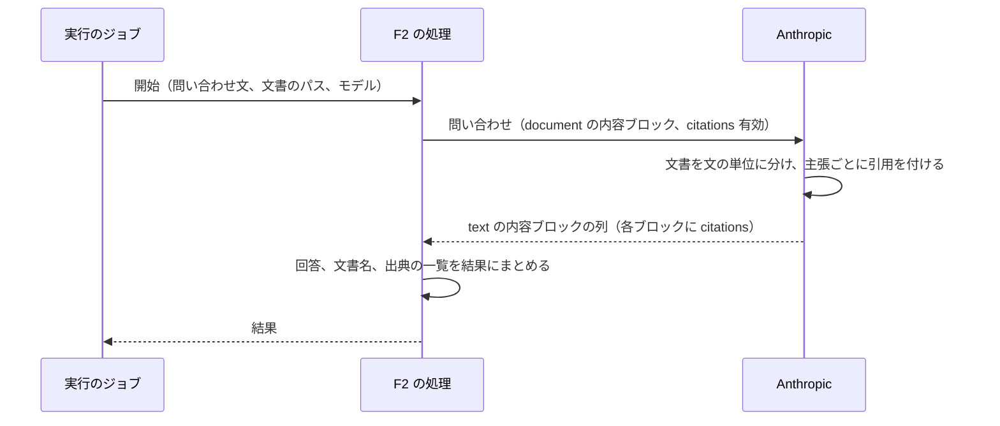

# ChangeSpec: F2 Citations の代表シナリオを追加する

## 変更の目的

要件 F2 の代表シナリオ「返品ポリシーに基づいて回答する」をデモ基盤に載せ、Anthropic の文書引用（Citations）で、回答のどの部分が返品ポリシー文書のどの箇所とページに基づくかを確かめられるようにする。あわせて、C2〜C5 が求める説明文、出典、コード断片、既定の入力での実行をそろえる。対応する要件は、要件定義書の F2、C2〜C5、C7 である。

要件からの逸脱を 3 つ許容する。返品ポリシー文書はアプリと一緒に置く固定の PDF で、入力欄から変えられない（C6 は問い合わせ文にだけ当てはまる。理由は「採用した実装パターン」の 1）。Sentry の会話の記録には問い合わせ文と回答の本文が載り、添付した文書と出典は載らない（C7 の「プロンプトと応答の本文」は満たす。理由は「採用した実装パターン」の 5）。説明文の本文に、使い方に関わる制約（スキャンだけの PDF と画像は引用できない、`with_schema` と併用できない）を含める。C2 は機能の制約を書かないとするが、F6a と F7a の説明文と同じ読み方（使い方を左右する制約は書く）を続ける。

## 現状

デモ定義 `config/demos.yml` の `citations`（名前は Citations）は、要約と出典 1 件（Citations（RubyLLM））を持ち、説明文の本文を持たない。代表シナリオ `cite_return_policy`（返品ポリシーに基づいて回答する）は処理（`handler`）を持たず、「準備中」と表示される。

代表シナリオ定義 `Demos::Scenario` は、入力（`inputs`。名前、ラベル、既定値、必須）とモデル（`models`）を持ち、処理のクラスに入力とモデルを 1 つのキーワード引数の列にまとめて渡して `perform` を呼ぶ（名前が重なると後の値が勝つ）。入力はすべて文字列で、デモの画面はそれをテキスト入力欄として描画する。実行の指示は入力の名前だけを Strong Parameters で許可し、実行は入力だけを記録する。実行の画面の「入力」の節は、実行に記録した入力の文字列を表示する。ファイルを添付する仕組みはない。`Demos::Scenario` は `Data.define` で作られ、全項目を渡して組み立てる箇所は `app/models/demos/catalog.rb`、`test/models/demos/scenario_test.rb`、`test/models/demos/run_test.rb`、`test/jobs/demos/run_job_test.rb` の 4 か所である。

F1 の `ResponsesApi::AnswerInquiry` は、指示文つきの会話を 1 つ組み立てて 1 回問い合わせ、回答と応答したモデルを返す。F7a の `ProviderTools::AnswerWithWebSearch` は、Web 検索の出典を `citations` から結果の一覧（URL、題名、回答の該当する範囲と位置）にし、結果の表示部品 `web_search_answer` が出典を 1 件ずつ、題名を `RunsHelper#model_url_link` でリンクにして表示する。`model_url_link` は `http` と `https` の URL だけをリンクにするので、アプリ内の相対 URL には使えない。どちらの処理も `RubyLLM.chat` の会話で、Rails の記録（`Chat`、`Message`）は作らない。実行のジョブは、返り値を結果として成功を記録し、例外は失敗として記録し、プロバイダーの呼び出しに由来しない例外だけを `Rails.error` に報告する。実行の画面は、成功した実行で `result_kind` と同じ名前の結果の表示部品を描画し、代表シナリオの定義が消えた実行では `raw`（結果の JSON の整形表示）を描画する。

購読者 `Observability::RubyLLMSpanSubscriber` は、`chat.ruby_llm` のスパンに入力と応答のメッセージを `Observability::MessageFormatter` で載せる。本文の部分は `message.content`（RubyLLM 2.0.0 では文字列か `nil`）から作り、`attachments` は読まない。出典（`citations`）は部分にしない（F7a で決定）。指示文は `gen_ai.system_instructions` に分けて載る。コストは RubyLLM が算出した値を送る。

`public/` には、エラーページ、アイコン、`robots.txt` しかない。開発環境では `public/` の静的ファイルがそのまま配信される（`public_file_server.enabled` の既定値が真）。テストの補助 `ScreenHelpers` には OpenAI の設定値を固定する `with_openai_key` があり、`test_helper.rb` は OpenAI の偽の設定値だけを常に入れる。`dotenv-rails` はテスト環境でも `.env` を読むので、手元では Anthropic の設定値に実際のキーが入ったままテストが動き、`.env` のない CI では入らない。既存のテストは、Citations のデモを「準備中」と「説明文のないデモ」の題材に使っている（`test/controllers/demos_controller_test.rb` の一覧の検証、「shows a scenario being prepared without code or input」、「says the explanation comes with the scenario when a demo has none yet」）。

RubyLLM 2.0.0 の文書引用の仕様は次のとおりである（gem のソースと公式ガイドで確認した）。

- `Chat#with_citations` は会話に印を付けるだけで、リクエストの組み立てで使われる。Anthropic のプロトコルは、添付を種類で分けて内容ブロックにする。PDF は印の有無によらず `document` のブロック（ローカルのファイルは base64、URL は `url` の source）で、印があるときだけ `title`（添付のファイル名。ファイル名があるときだけ）と `citations: { enabled: true }` が付く。テキストの添付は、印があるときだけ `document` になる。画像は常に `image` のブロックで、それ以外の種類は `UnsupportedAttachmentError` になる。利用者のメッセージでは、問い合わせ文のブロックが先、添付が後に並ぶ。24 MB を超える添付は、埋め込まずに Files API に自動で送る（`auto_upload_large_files` の既定値が真。送れる上限は 500 MB）。添付は `ask(message, with:)` で渡し、パスの文字列、`Pathname`、URL、IO、Active Storage を受け付ける。ファイル名はパスの末尾から取る
- リクエストの組み立てで、モデルの登録簿にそのモデルの `citations` の能力がなければ警告をログに出す。送信は止めない。Anthropic の登録簿で `citations` を持つのは `claude-sonnet-5`、`claude-sonnet-4-6`、`claude-haiku-4-5-20251001` などで、別名 `claude-haiku-4-5` の項目は持たない（`bin/check_keys` はプロバイダーを指定して解決するので `claude-haiku-4-5-20251001` の項目を使う）。Rails では登録簿を `ruby_llm_models` テーブルから先に読み、テーブルが空なら gem に同梱の登録簿を使う。開発 DB の行と同梱の登録簿で、これらのモデルの能力は一致する（2026-09-23 に確認）
- 応答の解釈は、`text` の内容ブロックをつないで本文にし、ブロックごとの `citations` を `RubyLLM::Citation` にする。`title` は文書の題名（`document_title`）、`cited_text` は文書からの引用、`text` はその引用が付いた内容ブロックの本文、`start_index` と `end_index` はそのブロックが本文全体で占める範囲（Ruby の文字数）、`source_index` は文書の番号（0 始まり）、`start_page` はページの先頭（1 始まり）、`end_page` は Anthropic の `end_page_number`（末尾を含まない）から 1 を引いた値（末尾を含む）である。文書の引用では `url` は `nil` になる。テキストの文書の引用にある文字の位置（`start_char_index`）は読まない
- `RubyLLM::Message.new(role:, content:, model:, citations:)` はプロバイダーを呼ばずに組み立てられ、`citations` には Hash を渡せる。テストの偽の応答に使える
- 公式ガイドが文書引用の対応先として挙げるのは Anthropic、Cohere、Bedrock（Converse）上の Claude である。Anthropic は文書引用と `with_schema` を併用できない。What's New in 2.0 の Citations の節は、文書引用、Web 検索、グラウンディングが同じ `Citation` になることと、PDF の引用にページが載ることを示す

Anthropic の文書引用と PDF の仕様は次のとおりである（2026-09-23 時点の公式の文書）。

- 引用できる文書は PDF、テキスト、カスタムの内容の 3 種類で、1 回のリクエストの文書は、すべてで引用を有効にするか、すべてで無効にする。PDF は本文を取り出して文の単位に分け、その単位で引用する。画像は引用できず、本文を取り出せないスキャンの PDF は引用できない
- 応答は複数の `text` の内容ブロックになりうる。各ブロックは 1 つの主張と、それを支える引用の一覧を持ちうる。主張の単位は文とは限らず、公式の例では文の一部（「the grass is green」）で分かれ、引用のないブロック（「 and 」）もある。PDF の引用は `page_location` で、ページは 1 始まり、末尾のページは含まない。`document_title` はリクエストで付けた `title` で、`title` と `context` は引用の対象にならない
- `cited_text` は出力トークンに数えられない。引用を有効にすると、システムプロンプトの追加と文書の分割で入力トークンが少し増える
- 構造化出力（`output_config.format`）とは併用できず、併用すると 400 が返る
- リクエスト全体で 32 MB まで（PDF を含む本文全体の上限で、プラットフォームで異なる）。ページ数は、コンテキストウィンドウが 1M トークン以上のモデルで 600 ページ、未満のモデルで 100 ページまで。各ページは本文（1 ページ 1,500〜3,000 トークン）と画像の両方として処理され、両方のトークンが課金される。現行のモデルはすべて PDF と引用に対応する

### 関連ファイル

| ファイル | 役割 |
|---------|------|
| `config/demos.yml` | 10 機能のデモ定義と代表シナリオ定義。変更対象 |
| `app/models/demos/catalog.rb`、`app/models/demos/scenario.rb` | デモ定義の読み込み、処理の呼び出し。文書の定義を加える。変更対象 |
| `app/models/demos/run.rb`、`app/jobs/demos/run_job.rb`、`app/controllers/demos/runs_controller.rb` | 実行の記録、ジョブ、実行の指示。変更しない |
| `app/actions/application_action.rb` | 代表シナリオの処理の基底 |
| `app/actions/responses_api/answer_inquiry.rb`、`app/actions/provider_tools/answer_with_web_search.rb` | 会話を 1 つ組み立てる書き方と、出典を結果にする書き方の前例 |
| `app/views/demos/_scenario.html.erb` | デモの画面の代表シナリオの部分。文書のリンクを加える。変更対象 |
| `app/views/runs/show.html.erb` | 実行の画面。「入力」の節に文書のリンクを加える。変更対象 |
| `app/views/runs/_details.html.erb` | 結果の表示部品を選んで描画する。変更しない |
| `app/views/runs/results/_web_search_answer.html.erb` | 出典を一覧にする結果の表示部品。前例 |
| `app/helpers/runs_helper.rb` | 実行の画面のヘルパー。回答に印を入れる補助を加える。変更対象 |
| `app/subscribers/observability/message_formatter.rb`、`app/subscribers/observability/ruby_llm_span_subscriber.rb` | メッセージの形と購読者。変更しない |
| `test/actions/provider_tools/answer_with_web_search_test.rb`、`test/support/chat_helpers.rb` | 処理の単体テストと `RubyLLM.chat` の差し替えの前例 |
| `test/test_helper.rb`、`test/support/screen_helpers.rb` | テストの補助。Anthropic の偽の設定値と、設定値を固定する補助を加える。変更対象 |
| `test/models/demos/catalog_test.rb`、`test/models/demos/scenario_test.rb`、`test/models/demos/run_test.rb`、`test/jobs/demos/run_job_test.rb`、`test/controllers/demos_controller_test.rb`、`test/controllers/demos/runs_controller_test.rb`、`test/controllers/runs_controller_test.rb` | デモ定義、代表シナリオ定義、ジョブ、画面の検証。変更対象 |

## 変更内容

処理の流れは次のとおりである。引用の対応づけはプロバイダーの側で行われ、アプリは文書を添えて 1 回問い合わせるだけである。

- **追加**: F2 の代表シナリオの処理。問い合わせ文、文書のパス、使うモデルを受け取る。モデルで会話を組み立て、指示文（架空の EC サイトのサポートデスクの担当者として、添付した返品ポリシーだけを根拠に、根拠の箇所を引用して、丁寧な日本語で簡潔に回答する。ポリシーに書かれていないことは書かれていないと伝える）を付け、`with_citations` で文書引用を有効にして、問い合わせ文を文書つき（`with:`）で 1 回問い合わせる
  - 結果は、回答の本文、応答したモデル、文書のファイル名（パスの末尾。引用の `title` はこれと同じになる）、出典の一覧からなる。出典の一覧は `citations` から作り、1 件ごとに文書の題名、文書からの引用（`cited_text`）、回答の該当する範囲の本文（`text`）と位置（`start_index`、`end_index`）、ページ（`start_page`、`end_page`。末尾を含む）、文書の番号（`source_index`）を持つ。それぞれ `nil` になりうる。出典がなければ空の配列にする
  - 問い合わせの失敗は例外のまま投げる。ジョブが失敗として記録する
  - ジョブが再び動いたときは最初からやり直してよい（`retryable` は真）。問い合わせがもう一度行われ、費用ももう一度かかる（F1 と同じ扱い）
  - テストは `test/actions/` に置く。`RubyLLM.chat` を台本どおり答える偽物（`with_instructions` と `with_citations` を受け付けて控え、`ask` に問い合わせ文と `with:` を控えて `RubyLLM::Message` を返す）に、`test/support/chat_helpers.rb` の `with_chat` で差し替える
- **追加**: F2 の結果の表示部品（`result_kind` は `cited_answer`）。回答の本文、出典の一覧、応答したモデルを表示する。回答の本文には、出典ごとの番号の印（`[1]` のような上付きの印。一覧の同じ番号の項目へのページ内リンク）を、その出典の回答の該当する範囲の末尾（`end_index` の位置）に入れる。一覧は番号順で、1 件ごとにページ、文書からの引用、文書の題名を表示する。文書の題名は、対応する文書が代表シナリオ定義にあれば、その PDF のそのページを新しいタブで開くリンク（URL の末尾に `#page=` とページの先頭を付ける。ブラウザの PDF ビューアーが対応していればそのページが開く）にする。対応する文書は、代表シナリオ定義の文書のうち、パスの末尾のファイル名が出典の題名と同じものである（RubyLLM が `title` にファイル名を入れるため）。出典の表示の条件と結果は次の表のとおり

| 条件 | 表示 |
|------|------|
| `end_index` が 0 以上の整数で、回答の文字数以下 | その位置に番号の印を入れる |
| `end_index` が `nil`、負、整数でない、または回答の文字数より大きい | 印を入れない。一覧のその項目に、回答の該当する範囲の本文を「回答の該当箇所」として表示する（本文もなければ表示しない） |
| 同じ `end_index` の出典が複数 | 印が番号順に並ぶ |
| `start_page` と `end_page` が同じ | 「N ページ」 |
| `start_page` より `end_page` が大きい | 「N〜M ページ」 |
| `start_page` があり、`end_page` が `nil` か `start_page` より小さい | 「N ページ」（先頭だけを使う） |
| `start_page` が `nil` | ページを表示しない |
| `cited_text` が `nil` か空 | 引用の行を表示しない |
| 出典の題名が `nil` か空 | 結果に記録した文書のファイル名を題名の代わりに使う（対応づけも同じ） |
| 題名に対応する文書が代表シナリオ定義にない（`documents` にない、ファイル名が変わった、定義に文書がない） | 題名を文字列として表示し、リンクにしない |
| 出典が 0 件 | 「出典なし」と、回答の本文 |

  - 印の位置は文字数で数える（`start_index` と `end_index` は RubyLLM が Ruby の文字列の長さで求めた値で、記録した回答の本文と同じ文字列に対する位置である）。印を入れる補助は `app/helpers/runs_helper.rb` に置く。回答の本文を `end_index` で分割し、各部分をエスケープしてから印とつなぐ（本文全体を先にエスケープすると `<` が `&lt;` になって位置がずれる）。文書へのリンクは `link_to` で作る（`model_url_link` は相対 URL をリンクにしない）
- **変更**: 代表シナリオ定義に「文書」を加える。デモ定義の代表シナリオに `documents` の一覧（`name`、`label`、`path`。`path` は `public/` からの相対パス）を書けるようにし、`Demos::Catalog` が読み、`Demos::Scenario` が持つ。ブラウザで開く URL はルートからのパス（`/` に `path` を続けたもの）で、リンクにするときはエスケープする。`Demos::Catalog` は、1 つの代表シナリオの入力、モデル、文書の名前が重なる定義を読み込みの時点で拒む（`perform` のキーワードが重なると後の値が勝ち、利用者の入力の文字列がパスとして渡りうるため）。`perform` は、入力とモデルに加えて、文書ごとに `name` をキーワード、絶対パス（`Pathname`）を値にして、定義の順に処理に渡す。処理は受け取ったパスを `with:` に渡すだけで、ファイルの場所を知らない。実行の指示の Strong Parameters は入力の名前だけを許可したままにし、文書の名前で送られた値は捨てられる。デモの画面の代表シナリオの部分は、入力欄の前に文書のラベルを新しいタブで開くリンクとして表示する。実行の画面の「入力」の節は、記録した入力の後に、代表シナリオ定義の文書を同じリンクで表示する。`documents` のない定義は今までどおり（空の一覧）である
- **追加**: 返品ポリシー文書。3 ページの PDF と、その元になる HTML を `public/` の文書の置き場所に置く。内容は架空の EC サイトの返品ポリシーで、F9a の既定の指示文の返品ポリシーの規則（期間、未開封、開封済み、返品できない商品、返金）を含み、手続き、交換、問い合わせ先を加える。ページ 1 は返品できる期間（到着から 30 日以内）、未開封の商品（理由を問わず返品でき、返送の送料は顧客の負担）、開封済みの商品（初期不良と配送中の破損に限り返品でき、返送の送料は当社の負担）。ページ 2 は返品できない商品（食品、消耗品、セール品）と返品の手続き（サポートデスクへの連絡、返品受付番号、7 日以内の返送）。ページ 3 は返金（返品の到着の確認から 7 営業日以内に、支払いに使った方法で）、交換（初期不良は交換も選べる）、問い合わせ先（架空）。各ページの脚に「N / 3」のページ番号を入れる。PDF は、本文を取り出せる形（フォントを埋め込んだ文字。画像にしない）で、実装時に HTML から 1 度作ってコミットする。作り方は HTML の先頭のコメントに残す。実行時には作らない。PDF を作り直すと、それより前の実行の出典（ページと引用）がリンク先の PDF と合わなくなる。自習用のデモなので、作り直したら前の実行の出典は参考にならないことを許容する
- **変更**: デモ定義 `config/demos.yml` の `citations`
  - 役立つケースの本文。規約、契約、マニュアルのように、回答の根拠を読み手が確かめる必要がある場合に役立つこと。`with_citations` を付けて文書を `with:` で添付すると、応答の `citations` に、回答のどの範囲（`text`、`start_index`、`end_index`）が文書のどの引用（`cited_text`）に基づくかが載り、PDF ならページ（`start_page`、`end_page`。1 始まりで両端を含む）も載ること。対応するのは Anthropic、Cohere、Bedrock 上の Claude であること。Anthropic は文書を文の単位に分けてその単位で引用し、PDF は本文を取り出して引用するので、スキャンだけの PDF と画像は引用できないこと。引用は API が文書から取り出すので、指し先は必ず文書の中にあるが、その引用が主張を支えているかは読み手が判断すること。`cited_text` は出力トークンに数えられないこと。`with_schema` とは併用できないこと。Rails の記録では `citations` の列に残ること。このアプリでは、Sentry に問い合わせ文と回答の本文が載り、添付した文書と出典は載らないこと。コストには文書のトークン（PDF は 1 ページ 1,500〜3,000 トークンの本文と、ページの画像）が含まれること
  - 使わない場合に困ることの本文。プロンプトで「根拠を引用して」と頼む方法では、引用が文書に実在するかを照合する仕組みを自分で作ること。モデルが引用を書き換えたり作ったりしても、それを検出する仕組みがないこと。引用の文字数の分だけ出力トークンがかかること。ページや位置を知るには、文書を自分で分割して番号を付けて渡し、番号を返させる形式を決めて解析すること。回答のどの文がどの引用に基づくかの対応づけも、出力の形式を決めて解析すること
  - 出典。Citations（RubyLLM。Citing Your Documents、The Citation Object、ActiveRecord Integration の節）、What's New in 2.0（RubyLLM。Citations の節）、Citations（Anthropic。文書の種類、ページ番号、トークン）、PDF support（Anthropic。上限と処理）の 4 件。Anthropic の 2 件は、引用の形と上限がプロバイダーの仕様に基づくため加える
  - 代表シナリオ `cite_return_policy` に、処理、プロバイダー（Anthropic）、モデル（`model: claude-sonnet-5`。登録簿で `citations` と PDF の入力を持つ。この ID が拒まれた場合は `claude-haiku-4-5-20251001` に替える）、入力（`inquiry`: 顧客からの問い合わせ文。必須。既定値は、未開封の商品を返品したい顧客が、返品の可否、返送の送料の負担、返金の時期と方法、同梱の消耗品を一緒に返品できるかを尋ねる文。回答の根拠が 3 ページすべてにまたがるように選ぶ。合格の基準は AC-1 の 2 ページ以上）、文書（`policy`: 返品ポリシー文書。ラベルは「返品ポリシー文書（PDF、3 ページ）」）、結果の種類（`cited_answer`）、やり直しの可否（真）を加える

### 新規に追加する責務の配置

| # | 責務 | コンテキスト | 配置先 | 所有するルール・閾値・派生値 |
|---|------|------------|--------|--------------------------|
| 1 | F2 の代表シナリオの処理（会話の組み立て、文書つきの問い合わせ、出典の一覧の組み立て） | デモ（Citations） | 代表シナリオの処理（機能ごとの名前空間） | 指示文。出典の一覧の項目 |
| 2 | F2 の結果の表示 | 実行の表示 | 結果の表示部品（実行の画面） | 出典の表示の条件（上の表）。出典と文書の対応づけ（ファイル名） |
| 3 | 回答に出典の印を入れる | 実行の表示 | 画面のヘルパー（実行の画面） | 印の位置の決め方（`end_index`、文字数、分割してからエスケープ） |
| 4 | 代表シナリオの文書の定義（名前、ラベル、パス、URL、処理への渡し方） | デモ定義 | 代表シナリオ定義（既存） | パスは `public/` からの相対。URL はルートからのパス。処理へは絶対パスを定義の順に。入力、モデル、文書の名前の重複の拒否 |
| 5 | 返品ポリシー文書 | デモ定義 | 静的ファイル（設定ファイルと同じく版管理する資料） | 返品ポリシーの規則（F9a の既定の指示文の規則を含む） |
| 6 | F2 のデモ定義（説明文、出典、既定の入力） | デモ定義 | デモ定義（設定ファイル） | 既定の入力 |

使い勝手の点検は省略する（自習用のデモで、操作者は利用者本人である）。ログ変更はない（扱うのはダミーの文書と架空の問い合わせで、個人情報、金銭、権限、状態の変更を含まない）。

## 採用した実装パターン

このリポジトリでは ADR を起票しない（利用者の決定）。採用案と理由だけを記す。

| # | 判断ポイント | 採用案 | 関連 ADR |
|---|------------|--------|---------|
| 1 | 文書の形式と出どころ（固定の PDF、入力欄の本文から実行時に PDF を作る、ページごとのテキストファイル） | 固定の PDF。ページは Anthropic が PDF の引用に付ける値で、RubyLLM がそのまま `start_page` と `end_page` にするので、F2 の「ページ」を機能そのもので示せる。PDF 生成の gem と日本語フォントを持ち込まず、コード断片も RubyLLM のコードだけになる。要件定義書の 3.1 も、ダミーデータはセットアップ時に用意するとしている | なし |
| 2 | 文書の場所の伝え方（処理の定数、代表シナリオ定義の文書を処理にキーワードで渡す） | 定義の文書をキーワードで渡す。文書の場所を定義の 1 か所に置け、デモの画面と実行の画面のリンクも同じ定義から作れる。処理は `with:` にパスを渡すだけの RubyLLM のコードのままになる | なし |
| 3 | 回答と出典の対応の見せ方（出典ごとに回答の該当する範囲の本文を並べる、回答の本文に番号の印を入れる） | 番号の印。Anthropic は主張ごとに内容ブロックを分けるので、`text` は主張の単位（文の一部のこともある）になり、出典ごとに並べると回答の本文がもう一度並ぶ。印なら、回答を読みながらどの部分がどの出典に基づくかが分かる。印が文の途中に入ることがあるので、実装後に実際の応答で読みやすさを確かめる。位置が分からない出典だけ本文を並べる | なし |
| 4 | モデル（`claude-sonnet-5`、`claude-haiku-4-5-20251001`） | `claude-sonnet-5`。登録簿で `citations` と PDF の入力を持ち、公式ガイドの例と同じである。費用の上限は設けない方針のため、日本語の文書に対する引用の質を優先する | なし |
| 5 | 添付した文書と出典を Sentry に載せるか | 載せない。メッセージの形に添付と出典の種類がなく（F7a の決定と同じ）、PDF の中身を載せると 1 スパンが数十 KB になる。文書は実行の画面から開ける | なし |
| 6 | テスト環境の Anthropic の設定値（`.env` の実際のキーのまま、偽の値で上書き） | 偽の値で上書き（`test_helper.rb`。OpenAI と同じ理由）。差し替えの漏れた呼び出しが Anthropic に届いても認証で失敗し、課金されない。画面のテストは補助で設定値を固定する。F5 の ChangeSpec も同じ決定である | なし |

## 結合への影響

代表シナリオ定義への文書の追加は、既存の結合点の形を変えずに項目を足す。対比は次のとおりで、不均衡は増えない。

| # | 結合点 | 変更前 強さ/距離 | 変更後 強さ/距離 | 備考 |
|---|--------|----------------|----------------|------|
| 1 | `Demos::Catalog` とテスト → `Demos::Scenario` の組み立て（`Data.define` の全項目） | Model(2)/同コンテキスト(1) OK | Model(2)/同コンテキスト(1) OK | 項目が 1 つ増え、組み立てる 4 か所を直す |
| 2 | デモの画面と実行の画面 → `Demos::Scenario` の入力と文書の定義 | Model(2)/異コンテキスト(3) 境界 | Model(2)/異コンテキスト(3) 境界 | 画面は既に入力の定義（名前、ラベル、既定値）を読んでいる。文書の定義（ラベル、URL）も形が安定しているので許容する |
| 3 | `Demos::Scenario#perform` → 処理のキーワード（入力、モデル、文書の名前） | Model(2)/異コンテキスト(3) 境界 | Model(2)/異コンテキスト(3) 境界 | 名前の空間を共有する項目が 1 種類増える。重なりは読み込み時に拒む |

## 影響範囲

- `config/demos.yml`: `citations` の定義。一覧とデモの画面の表示が「準備中」から、Anthropic の設定値の有無に応じて「実行できる」または「設定値が足りない（Anthropic）」に変わる。Anthropic の設定値を使う最初の代表シナリオになる
- `app/models/demos/catalog.rb`、`app/models/demos/scenario.rb`: 文書の定義と名前の重複の拒否。`Demos::Scenario` の項目が増えるので、`test/models/demos/scenario_test.rb`、`test/models/demos/run_test.rb`、`test/jobs/demos/run_job_test.rb` の組み立ての補助に `documents` を足す。`documents` のない既存の定義の読み込みと `perform` の引数は変わらない
- `app/views/demos/_scenario.html.erb`、`app/views/runs/show.html.erb`: 文書のリンク。文書のない代表シナリオでは表示が変わらない
- `app/helpers/runs_helper.rb`: 回答に印を入れる補助
- 新規: 代表シナリオの処理のファイル、結果の表示部品、`public/` の文書の置き場所の PDF と HTML
- `test/test_helper.rb`、`test/support/screen_helpers.rb`: Anthropic の偽の設定値と、設定値を固定する補助（`with_openai_key` と同じ形）
- `test/controllers/demos_controller_test.rb`: Citations を題材にした既存の 3 件（一覧の「準備中」、「shows a scenario being prepared without code or input」、「says the explanation comes with the scenario when a demo has none yet」）の題材を替える。準備中の題材は `tokenize_text`（F9b）に替える。説明文のないデモの題材は、実装時点で説明文のないデモに替え、すべてのデモが説明文を持った時点でそのテストは消す
- `app/models/demos/run.rb`、`app/jobs/demos/run_job.rb`、`app/controllers/demos/runs_controller.rb`、`app/views/runs/_details.html.erb`、`app/subscribers/observability/`、`lib/failure_kinds.rb`、`db/schema.rb`、`docs/api-keys.md`: 変更なし。`docs/api-keys.md` は Anthropic の取得手順と、Citations が Anthropic を使うことを既に書いている。状態の取得（`Runs::StatusesController`）は `_details` を描画するので、新しい表示部品はその経路でも既存の仕組みで描画される
- Sentry でのトレースの形: ジョブの `invoke_agent` の下に `gen_ai.chat` のスパンが 1 つあり、その下に試行と `http.client`（`POST v1/messages`）がある。入力のメッセージには問い合わせ文の本文だけが載り、添付した PDF は載らない（本文の部分は `content` の文字列から作り、`attachments` を読まないため）。出典も載らない。コストは登録簿の単価で求めた値で、PDF の本文と画像のトークンを含む。実装後に画面で、トレースの形と、入力トークン数が問い合わせ文だけの場合より大きいことを確かめる
- 実際の API で確かめること: `claude-sonnet-5` の ID が受け付けられること、日本語の PDF から取り出した `cited_text` が読める形（文字の間に空白や改行が入らない）であること、ページ番号が PDF のページと一致すること、既定の問い合わせで出典が 2 ページ以上（狙いは 3 ページ）にまたがること、印が文の途中に入る頻度と読みやすさ。`cited_text` が読めない形なら、PDF の作り方（フォントの埋め込み、文字の間隔）を変える
- 他の ChangeSpec との関係。`docs/change-specs/` には、同じ日に作った F4（`add-f4-batches.md`）、F5（`add-f5-model-fallbacks.md`）、F6b（`add-f6b-video-generation.md`）、F7b（`add-f7b-code-execution.md`）、F8（`add-f8-deep-research.md`）がある。重なりは次のとおり。`app/models/demos/scenario.rb` は F4（`resume` の引数の拡張）と F6b（`collect` の追加）も変える。`test/test_helper.rb` と `test/support/screen_helpers.rb` の Anthropic の補助は F5 も加える。`test/controllers/demos_controller_test.rb` の「準備中」の題材は F4、F6b、F7b、F8 も置き換える。`config/demos.yml`、`test/models/demos/catalog_test.rb`、`test/controllers/runs_controller_test.rb` は全件が加筆する。`app/views/runs/_details.html.erb` と `app/actions/application_action.rb` は F4、F6b、F8 が変え、F2 は変えない。並行して実装する場合、重なった分は先にマージされた側へ寄せ、実装順は development-start の実装台帳で決める
- テスト
  - 処理: 会話の組み立て（指示文、`with_citations`、問い合わせ文と文書のパスで 1 回の `ask`）、結果の組み立て（ページのある出典、項目が `nil` の出典、出典なし、文書のファイル名）、問い合わせの失敗が例外のまま伝わることの検証を、`RubyLLM.chat` の差し替えで加える。プロバイダーを呼ぶ実行は、実際の画面と Sentry で確かめる
  - 代表シナリオ定義: `documents` の読み込み（`name`、`label`、`path`、URL）、名前の重複と項目の欠落の拒否、`perform` が文書を絶対パスのキーワードで定義の順に渡すこと、`documents` のない定義が今までどおりであることの検証を加える。読み込みの拒否は、`Demos::Catalog` の組み立てを YAML のファイルではなく属性から呼べる入口を通して検証する
  - ジョブ: 定義した `path` にファイルがないとき、実行が失敗として記録され `Rails.error` に報告されることの検証を `test/jobs/demos/run_job_test.rb` に加える
  - ヘルパー: 印の位置（末尾、途中、同じ位置に複数、`nil`、負、本文の長さを超える位置）と、印より前の `<` のエスケープの検証を加える
  - カタログ: F2 の定義（プロバイダーが Anthropic、モデルが Anthropic のモデルに解決され登録簿で `citations` と PDF の入力を持つ、入力が `inquiry`、文書が `policy` でファイルが存在する、`retryable` が真、`result_kind` が `cited_answer`）の検証を加える
  - 画面: F2 の結果の表示（印と一覧、ページの表記、出典なし、位置のない出典、題名に対応する文書のない出典、題名のない出典）、デモの画面の説明文と出典とコード断片と入力欄と文書のリンク、実行の画面の「入力」の文書のリンク、設定値のないときの表示、空白の入力の拒否（前例は `test/controllers/demos/runs_controller_test.rb`）、文書の名前で送った値が捨てられることの検証を加える。文書の配信は、`public/` の URL への GET が PDF を返すことで検証する
  - 文書: PDF が 3 ページで、各ページの本文を取り出せることは、実装時に手で確かめ（PDF を読む gem を入れない）、確かめた日と方法を HTML のコメントに残す

## 関連 ADR

- なし（このリポジトリでは ADR を起票しない）

## 受け入れ条件

「確認手段」の列は、その行をテストで検証するか、プロバイダーを呼ぶため実際の画面と Sentry で検証するか、手作業で確かめるかを示す。

| ID | 変更内容の項目 | 種類 | 条件 | 確認手段 |
|----|--------------|------|------|---------|
| AC-1 | 処理 | 正常 | 既定の入力で実行すると、実行が成功になり、結果に回答の本文、応答したモデル、文書のファイル名、1 件以上の出典（ページと文書からの引用を持つ）が記録され、出典のページが 2 ページ以上にまたがる。Sentry のトレースに `invoke_agent` の下の `gen_ai.chat` と `POST v1/messages` があり、入力のメッセージに問い合わせ文だけが載り、コストが 0 より大きい | 画面 |
| AC-2 | 処理 | 正常 | 会話は指示文つきで組み立てられ、`with_citations` が呼ばれ、問い合わせ文が文書のパスを `with:` に付けて 1 回問い合わされる。応答の `citations` が、定めた項目（題名、引用、範囲の本文と位置、ページ、文書の番号）の一覧として結果に入り、ページは RubyLLM の値のまま記録される | テスト（会話を差し替える） |
| AC-3 | 処理 | 異常・拒否 | 問い合わせが失敗すると、例外がそのまま伝わり、結果は返らない。ジョブは失敗として記録する（既存の扱い） | テスト（会話を差し替える） |
| AC-4 | 処理 | 境界 | 応答に `citations` がないとき、結果の出典は空の配列で、回答、モデル、文書のファイル名は記録される。項目のない出典（ページ、引用、位置が `nil`）は、その項目が `nil` のまま記録される。先頭と末尾が同じページの出典は、両方に同じ値が記録される | テスト（会話を差し替える） |
| AC-5 | 処理 | 状態・権限 | 開始済みの実行でジョブが再び動くと、もう一度問い合わせて成功する（F1 と同じ） | テスト（カタログの `retryable` が真であることと、既存のジョブの検証） |
| AC-6 | 表示 | 正常 | 成功した F2 の実行の画面に、回答の本文と、出典ごとの番号の印がその出典の範囲の末尾に入り、印は一覧の同じ番号の項目へのページ内リンクである。一覧は番号順で、各項目にページ、文書からの引用、文書の題名が出て、題名は PDF のそのページ（`#page=` 先頭のページ）を新しいタブで開くリンクである。応答したモデルが出る | テスト |
| AC-7 | 表示 | 異常・拒否 | `end_index` が負、または整数でない出典は印を持たず、一覧に「回答の該当箇所」として範囲の本文が出る。回答の本文と引用の `<` などはエスケープされ、印より前に `<` があっても印の位置がずれない | テスト |
| AC-8 | 表示 | 境界 | 出典が 0 件の実行では「出典なし」と回答の本文が出る。`end_index` が `nil` か回答の文字数より大きい出典は印を持たず、一覧に「回答の該当箇所」として範囲の本文が出る（本文もなければ出ない）。`end_index` が回答の文字数と同じ出典は末尾に印を持つ。同じ `end_index` の出典が複数あれば印が番号順に並ぶ。先頭と末尾が同じページの出典は「N ページ」、末尾が大きい出典は「N〜M ページ」、末尾が `nil` か先頭より小さい出典は「N ページ」、先頭のない出典はページなしで出る。引用が `nil` か空の出典は引用の行を持たない。題名が `nil` か空の出典は、記録した文書のファイル名で対応づけられ、それが題名の代わりに出る。先頭のページがない出典の題名は、`#page=` を付けない文書の URL へのリンクになる | テスト |
| AC-9 | 表示 | 状態・権限 | 題名に対応する文書が代表シナリオ定義にない実行（`documents` が空、またはファイル名が違う）の画面では、題名が文字列で出てリンクにならず、他の項目は出る。定義が消えた実行は `raw` で描画され、成功した実行でだけ表示部品が描画される（既存の扱い） | テスト |
| AC-10 | 代表シナリオ定義の文書 | 正常 | `documents` を持つ定義では、デモの画面の代表シナリオの部分と、実行の画面の「入力」の節に、文書のラベルがルートからのパスの URL を新しいタブで開くリンクとして出る。デモの画面では入力欄の前に出る。URL はパスの区切りごとにエスケープされる（空白や日本語のファイル名）。`perform` は、入力とモデルに加えて、文書ごとに `name` のキーワードで絶対パス（`Pathname`）を、定義の順に処理に渡す | テスト |
| AC-11 | 代表シナリオ定義の文書 | 異常・拒否 | `documents` の項目に `name`、`label`、`path` のいずれかがないと、または 1 つの代表シナリオの入力、モデル、文書の名前が重なると、デモ定義の読み込みが失敗する。実行の指示で文書の名前の値を送っても捨てられ、記録した入力に残らない。定義した `path` にファイルがないと、実行はプロバイダーを呼ぶ前に失敗として記録され、プロバイダーの失敗ではないので `Rails.error` に報告される（既存のジョブの扱い） | テスト |
| AC-12 | 代表シナリオ定義の文書 | 境界 | `documents` のない定義と空の定義では、デモの画面と実行の画面に文書の表示が出ず、`perform` の引数は入力とモデルだけである。文書が複数の定義では、すべてが表示され、すべてが定義の順に渡される | テスト |
| AC-13 | 代表シナリオ定義の文書 | 状態・権限 | 該当なし（定義は状態を持たず、操作者は利用者本人だけである） | |
| AC-14 | 返品ポリシー文書 | 正常 | PDF は 3 ページで、各ページの脚にページ番号があり、各ページの本文を取り出せる（文字として選択、検索できる）。内容は変更内容に書いたページごとの規則を持つ。`public/` からの URL への GET が PDF を返す | テスト（配信）と手作業（ページと本文） |
| AC-15 | 返品ポリシー文書 | 異常・拒否 | 該当なし（静的ファイルで、入力を受け付けない） | |
| AC-16 | 返品ポリシー文書 | 境界 | PDF の大きさは、RubyLLM が Files API に送り分ける閾値（24 MB）を下回って埋め込みのまま送られ、Anthropic のリクエスト全体の上限（32 MB）を十分に下回る。ページ数は `claude-sonnet-5` の上限（600 ページ）と、予備の `claude-haiku-4-5-20251001` の上限（100 ページ）を下回る。実装時に大きさを記録する | 手作業 |
| AC-17 | 返品ポリシー文書 | 状態・権限 | 該当なし（静的ファイルで、状態を持たない。作り直すと前の実行の出典が合わなくなることは変更内容のとおり許容する） | |
| AC-18 | デモ定義 | 正常 | Anthropic の設定値があるとき、一覧で Citations が「実行できる」になり、デモの画面に説明文の本文（Sentry に文書が載らないことを含む）、4 つの出典、`with_citations` と `with:` を含むコード断片、既定の問い合わせ文が入った入力欄、文書のリンク、有効な実行ボタンが出る。定義したモデルは Anthropic のモデルに解決され、登録簿で `citations` と PDF の入力を持つ。定義した文書のファイルが存在する | テスト |
| AC-19 | デモ定義 | 異常・拒否 | Anthropic の設定値がないとき、一覧とデモの画面で「設定値が足りない（Anthropic）」になり、実行ボタンが無効になる。OpenAI の設定値があるだけでは実行できない | テスト |
| AC-20 | デモ定義 | 境界 | 問い合わせ文が空白のとき、実行は記録されず、入力欄の下に「入力してください」が出る | テスト |
| AC-21 | デモ定義 | 状態・権限 | 該当なし（デモ定義は状態を持たず、操作者は利用者本人だけである） | |

### 未解決の疑問

- なし
