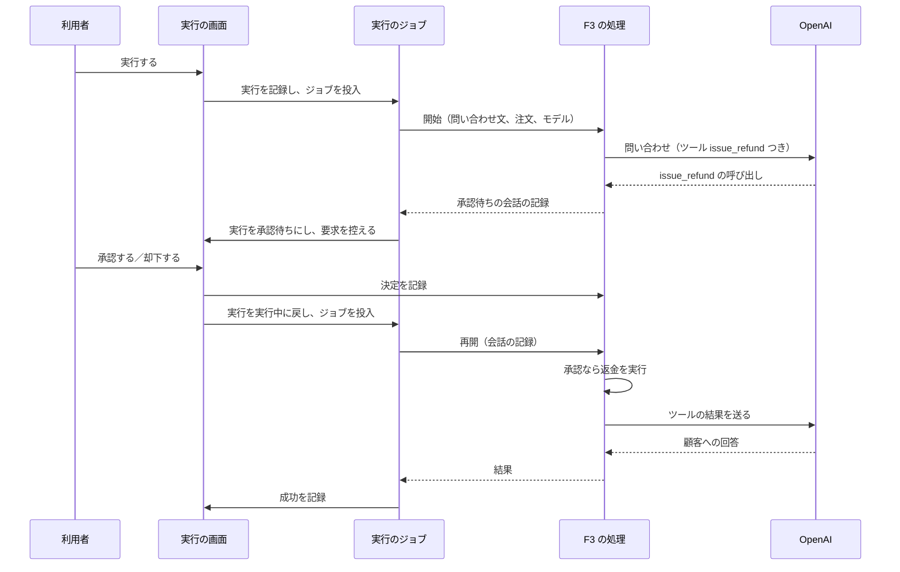
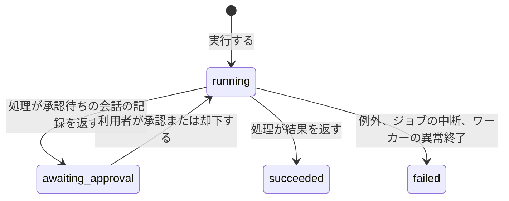

# ChangeSpec: F3 Tool Approval の代表シナリオを追加する

## 変更の目的

要件 F3 の代表シナリオ「AI が提案した返金を承認する」をデモ基盤に載せ、取り消せない操作を AI に提案させ、実行するかどうかを人が決める流れを、実際のプロバイダーに対して確かめられるようにする。あわせて、C2〜C5 が求める説明文、出典、コード断片、既定の入力での実行と、C9 が求める承認待ちの状態の表示、画面を離れた後の履歴からの承認・却下をそろえる。対応する要件は、要件定義書の F3、C2〜C5、C7、C9 である。

この文書では、Sentry の会話を識別する既存の値を「会話 ID」、RubyLLM の Rails 統合が保存する会話（`Chat`）を「会話の記録」と呼び分ける。

## 現状

デモ定義 `config/demos.yml` の `tool-approval` は、要約、公式ドキュメントでの名称（Human Approval for Tools）、出典 1 件（Controlling Tool Execution）を持ち、説明文の本文を持たない。代表シナリオ `approve_refund` は処理（`handler`）を持たず、一覧とデモの画面で「準備中」と表示される。

実行 `Demos::Run` の状態は `running`、`awaiting_approval`、`succeeded`、`failed`、`cancelled` で、遷移は `running` から `awaiting_approval`、`succeeded`、`failed`、`cancelled` へ、`awaiting_approval` から `running`、`failed`、`cancelled` へ、と定義されている。`awaiting_approval` に遷移させるコードはない。実行は、代表シナリオのキー、入力、結果、失敗、トレース ID、開始日時、終了日時、会話 ID（`conversation_id`。必須で一意。作成時に `run-<16 桁の 16 進数>` を採番し、ジョブが workflow の `metadata:` に渡し、Sentry の会話へのリンクに使う）、生成した音声と動画の添付を持つ。会話の記録への参照は持たない。`strict_loading_by_default` が有効で、関連を後から読み込むと例外になる。ワーカーの異常終了で失われたジョブの実行は、`fail_abandoned!` が `running` の実行に限って失敗にする。

実行のジョブ `Demos::RunJob` は、終了した実行では何もせず、開始済み（`started_at` あり）で `retryable` が偽の代表シナリオでも何もしない（TODO として、その実行は `running` のまま残る）。それ以外では `started_at` を記録し、会話 ID を `metadata:` に渡した `RubyLLM.workflow` の内側でトレース ID を記録して `Demos::Scenario#perform` を呼び、返り値を結果として成功を記録する。例外は失敗として記録し、プロバイダーの呼び出しの失敗でなければ `Rails.error` に報告する。再開の経路はない。失敗の種類と原因の候補の表は `FailureKinds` にあり、プロバイダーの呼び出し以外の種類として `WORKER_LOST`（ワーカーの異常終了）だけがある。

代表シナリオ定義 `Demos::Scenario` が処理を呼ぶ操作は `perform` だけで、処理のクラスに入力とモデルをキーワードで渡す。処理は `ApplicationAction` の下に機能ごとの名前空間で置き、基底はクラスの入口として `.perform` だけを持つ。実装済みは F1 の `ResponsesApi::AnswerInquiry` と F10 の `WorkflowInstrumentation::RunTicketWorkflow` である。デモの画面は処理のソースファイルをそのままコード断片として表示する。

実行の画面のうち状態で変わる部分 `app/views/runs/_details.html.erb` は、`running` のあいだだけポーリングし、経過秒数とワーカーの注意書きを出す。`succeeded` なら `result_kind` と同じ名前の表示部品、`failed` なら失敗の内容を表示する。Sentry へのリンクと実行日時、終了日時は状態によらず表示する。`awaiting_approval` に固有の表示はない。実行に対して操作する経路（ルート、コントローラー）はない。履歴とデモの画面の最近の実行には、状態のバッジを表示する（`awaiting_approval` は「承認待ち」）。実行の指示が拒否されたときは、デモの画面を 422 で描画する（Turbo はフォーム送信への 2xx の HTML を描画しないため）。

RubyLLM の Rails 統合は導入済みで、`Chat`（`acts_as_chat`）と `Message`（`acts_as_message`）、テーブル `chats`、`messages`、`ruby_llm_tool_calls`（`approval` 列を持つ）、`ruby_llm_models`、`ruby_llm_usages` がある。開発用 DB の `ruby_llm_models` にはモデルの一覧が読み込まれている。`Chat` の保存時にモデルの記録が無ければ RubyLLM のモデル一覧から作られるため、テスト用 DB でも `Chat.create!(model:)` は動く（一覧が空なら全モデルを流し込むため、会話の記録を作るテストはその分の時間がかかる）。会話の記録を作る代表シナリオはまだない。

購読者 `Observability::RubyLLMSpanSubscriber` は、`tool_call.ruby_llm` を名前 `execute_tool <ツール名>` のスパン（`sentry.op` は `gen_ai.execute_tool`。`capture_content` が真のとき引数と結果の本文を持つ）にする。会話 ID は、イベント自身の `workflow_metadata` になければ、開いている workflow のうち最も内側で会話 ID を持つものから引き継ぐ。

ダミーの注文を表すテーブルはなく、`db/seeds.rb` は実行されるコードを持たない。名前空間ごとのテーブル名の接頭辞は、`Demos` が `demo_` を宣言している。

RubyLLM 2.0.0 の承認の仕様は次のとおりである（gem のソースと公式ガイドで確認した）。

- `RubyLLM::Tool` のクラスで `requires_approval` を宣言すると、モデルがそのツールを呼んだとき、`Chat#ask` と `Chat#complete` はツールを実行せずに戻る。`awaiting_approval?` が真になり、`pending_approvals` が決定待ちの呼び出しを返す。`approve` または `deny` で決定を記録してから `complete` を呼ぶと、承認した呼び出しは実行され、却下した呼び出しはツールを実行せずに「利用者が却下した」という結果のメッセージがモデルに渡り、モデルはそれを踏まえて応答する。却下ではツールの計装イベントは発行されない
- `acts_as_chat` の記録では、`approve` と `deny` はツール呼び出しの記録の `approval` 列に書き、実行ループはその列を読む。決定はリクエストとプロセスをまたいで残る。`pending_approvals` は記録（`tool_call_id`、`name`、`arguments` を持つ）の `ActiveRecord::Relation` を返す
- ツールの登録は実行時だけの設定で、記録には残らない。記録を `Chat.find` で読み込んだだけで `complete` を呼ぶと、承認待ちと判定されずに止まらず、「利用できないツールを呼んだ」というエラーがツールの結果としてモデルに渡り、モデルが続きを話す。公式ガイドは、`chat_model` を宣言した `RubyLLM::Agent` のクラスを通じて記録を読み込む（`Agent.find(id)` で指示文とツールを復元する）ことを勧めている
- `RubyLLM::Agent` の `create!` は、`inputs` として宣言していないキーワード（`model:` など）を `Chat.create!` に渡し、指示文を記録に保存する。`find` は指示文を実行時にだけ適用し、記録は書き換えない。どちらも会話の記録を返す。エージェントのインスタンスは `ask`、`complete`、`approve`、`deny`、`awaiting_approval?`、`pending_approvals`、`messages` を会話に委譲する
- ツールの名前は既定でクラスの完全名から作られ、名前空間の区切りも名前に含まれる（`ToolApproval::IssueRefund` は `tool_approval--issue_refund` になる）。`tool_name` を上書きして決められる
- 記録された会話の再開は済んだところの続きから進む。`run_tools` は結果のメッセージが保存済みのツール呼び出しを飛ばす。ただし、ツールの実行後、結果の保存前に処理が落ちると、再開でそのツールがもう一度実行される（at-least-once）。承認を要するツールは、2 度実行しても安全に書く必要がある
- 応答のないツール呼び出し（決定待ちを含む）が残ったまま `ask` を呼ぶと `RubyLLM::PendingToolCallsError` になる

### 関連ファイル

| ファイル | 役割 |
|---------|------|
| `config/demos.yml` | 10 機能のデモ定義と代表シナリオ定義 |
| `app/models/demos/catalog.rb` | デモ定義の読み込み。`handler`、`models`、`inputs`、`result_kind`、`retryable` の解釈 |
| `app/models/demos.rb` | `Demos` 名前空間とテーブル名の接頭辞。新しい名前空間の前例 |
| `app/models/demos/run.rb` | 実行の記録。状態と遷移、成功と失敗の記録 |
| `app/models/demos/scenario.rb` | 代表シナリオ定義。処理の呼び出し |
| `app/jobs/demos/run_job.rb` | 実行のジョブ。workflow を開き、処理を呼び、成否を記録する |
| `lib/failure_kinds.rb` | 失敗の種類と原因の候補の表 |
| `app/actions/application_action.rb` | 代表シナリオの処理の基底 |
| `app/actions/workflow_instrumentation/run_ticket_workflow.rb` | F10 の処理。処理の内側にクラスを持つ書き方の前例 |
| `app/models/chat.rb`、`app/models/message.rb` | RubyLLM の Rails 統合の記録 |
| `config/routes.rb` | ルート。実行には `index` と `show` と状態の取得だけがある |
| `app/controllers/runs_controller.rb`、`app/controllers/runs/statuses_controller.rb` | 実行の画面と、状態で変わる部分の取得 |
| `app/controllers/demos/runs_controller.rb` | 実行の指示。拒否を 422 で描画する前例 |
| `app/views/runs/_details.html.erb` | 実行の画面のうち状態で変わる部分 |
| `app/views/runs/show.html.erb` | 実行の画面 |
| `app/views/runs/results/_ticket_workflow.html.erb` | F10 の結果の表示部品。複数の項目を持つ結果の前例 |
| `app/helpers/runs_helper.rb` | 状態のバッジ、Sentry へのリンク |
| `app/subscribers/observability/ruby_llm_span_subscriber.rb` | 計装イベントをスパンにする購読者 |
| `db/schema.rb` | スキーマ。`demo_runs`、`chats`、`ruby_llm_tool_calls` |
| `test/models/demos/run_test.rb`、`test/models/demos/scenario_test.rb`、`test/models/demos/catalog_test.rb` | 実行、代表シナリオ定義、デモ定義の検証 |
| `test/lib/failure_kinds_test.rb` | 失敗の種類の表の検証 |
| `test/jobs/demos/run_job_test.rb` | ジョブの検証。処理と `RubyLLM.chat` を差し替える書き方の前例 |
| `test/controllers/demos_controller_test.rb`、`test/controllers/demos/runs_controller_test.rb`、`test/controllers/runs_controller_test.rb`、`test/controllers/runs/statuses_controller_test.rb` | 画面と実行の指示の検証 |
| `test/support/screen_helpers.rb` | 画面のテストの補助（設定値の固定、実行の作成） |

## 変更内容

実行の流れは次のとおりである。ジョブは 2 回動き、1 回目は AI の提案で止まり、2 回目は決定を踏まえて続きを実行する。

実行の状態は、既存の定義のまま次のように遷移する。承認待ちから実行中へ戻るのは、利用者の決定だけである。承認待ちの実行は、ジョブに取られていないため、ワーカーの異常終了では失敗にならない。

- **追加**: ダミーの注文。架空の EC サイト（`shop`）の注文を、説明（注文番号、商品、金額、支払いの状況を含む自由な文）と状態（支払い済み、返金済み）、返金の理由、返金日時で表す。返金は状態を返金済みに変え、理由と日時を記録する。返金済みの注文への返金は、状態、理由、日時を変えない（ツールが 2 度実行されても安全にするため）。注文は代表シナリオの実行ごとに入力から作る。用意した注文を使い回すと、2 回目の実行からは返金済みの注文しか残らず、承認して返金が実行される様子を見られなくなるためである。実行ごとに増える注文は消さない（自習用で件数が少なく、履歴の結果を後から注文と突き合わせられる）。`Shop` の名前空間はテーブル名の接頭辞 `shop_` を宣言する
- **追加**: F3 の代表シナリオの処理。問い合わせ文、注文の説明、使うモデルを受け取る。処理のファイルにはツールとエージェントも置き、コード断片で 3 つがまとめて読めるようにする。基底の `ApplicationAction` は「1 クラス 1 操作」の前提だが、承認で止まる代表シナリオは開始、決定の記録、再開の 3 つの入口を持つ。3 つは同じ会話の続きを扱う操作で、分けると指示文やツールの宣言を共有する置き場所がなくなるため、1 つのクラスに置く
  - ツール `issue_refund`。注文の ID と理由を受け取り、`requires_approval` を宣言する。実行すると注文を返金し、注文の ID、状態、返金日時を返す。注文が見つからなければ、エラーの内容を持つ結果を返す（RubyLLM はエラーの内容を持つ結果をモデルに渡す）。名前は `tool_name` の上書きで `issue_refund` にする（既定ではクラスの名前空間が名前に含まれるため）
  - エージェント。`chat_model` に `Chat` を宣言し、指示文（架空の EC サイトのサポートデスクの担当者として、返金の条件に合えば `issue_refund` で返金を提案し、ツールの結果を踏まえて顧客に回答する）とツールを宣言する。モデルは宣言せず、開始のときに `create!(model:)` で代表シナリオ定義のモデルを渡す。指示文に注文を含めない。`find` で読み込むたびに指示文が組み立て直されるため、注文のような実行ごとの値を指示文に含めると、再開のときにも同じ値が要るからである
  - 開始。入力から注文を作り、エージェントで会話の記録を作り、注文（ID と説明）と問い合わせ文を 1 つのメッセージにして問い合わせる。会話が承認待ちなら会話の記録を返し、そうでなければ結果を返す
  - 決定の記録。会話の記録とツール呼び出しの ID と承認か却下かを受け取り、エージェントで記録を読み込んで `approve` または `deny` を呼ぶ
  - 再開。会話の記録を受け取り、エージェントで読み込んで `complete` を呼び、開始と同じ規則で承認待ちの会話の記録または結果を返す
  - 結果は、顧客への回答、注文（説明、状態、返金の理由、返金日時）、応答したモデルからなる。再開のときの注文は、会話に記録された最初の `issue_refund` の呼び出しの引数の注文 ID から求める。その ID の注文がなければ、結果の注文は空にする
  - ジョブが再び実行されたときに最初からやり直してはならない（`retryable` は偽）。やり直すと注文と提案がもう 1 組できる
  - テストでは、エージェントのクラスの `create!` と `find` を、クラスの特異メソッドの差し替えで台本どおり答える偽物にする（ジョブのテストが `RubyLLM.chat` を差し替えるのと同じ手法）。決定の記録は、会話の記録とツール呼び出しの記録を手で作り、記録の `approval` 列を読んで確かめる
- **追加**: 実行の承認待ちの記録。実行に会話の記録の ID（`chat_id`）と、承認の要求の控え（`approval_requests`。ツール呼び出しの ID、ツール名、引数、決定）を持たせる
  - 承認待ちにする操作は、会話の記録を受け取り、状態を承認待ちにし、会話の記録の ID と、その会話の決定待ちの呼び出しの控えを記録する。控えは既にある項目を残し、ツール呼び出しの ID で重複を除いて追加する。同じ実行が 2 度目の承認待ちになったときに、1 度目の決定を残すためである
  - 再開する操作は、ツール呼び出しの ID と決定を受け取り、控えの該当する項目に決定を書き、状態を実行中に戻し、ジョブを投入する。控えにない ID なら例外にし、何も変えない
  - 会話の記録は関連として宣言しない。実行は関連の後からの読み込みを禁じており、ジョブとコントローラーは会話の記録の ID で記録を読む
- **変更**: 代表シナリオ定義に、決定の記録と再開の操作を加える。どちらも処理のクラスの同名の操作に会話の記録を渡す。処理のクラスがその操作を持たなければ `NoMethodError` になり、ジョブはアプリの不具合として報告する（既存の扱い）
- **変更**: 基底 `ApplicationAction` のコメントに、処理の返り値の規則（結果のハッシュを返す。承認で止まる処理は、承認待ちの会話の記録を返す）と、承認で止まる処理が持つ操作（決定の記録、再開）を書く。ジョブと処理の契約をここに置く
- **変更**: 実行のジョブ
  - 承認待ちの実行では何もしない（決定の受付がジョブを投入し直す）
  - 会話の記録の ID を持つ実行では、`retryable` にかかわらず処理の再開を呼ぶ。会話の記録には、モデルの応答とツールの結果のどこまでが済んだかが残っており、再開は済んだところの続きから進むため、ジョブがもう一度動いても安全である
  - 会話の記録の ID を持たず、開始済みで、`retryable` が偽の実行は、失敗として記録する。失敗の種類は「ジョブの中断」（`FailureKinds` に加える。原因の候補は、ワーカーが止まってジョブが戻され、途中から再開できる記録がないこと。もう一度実行する）。`running` のまま残す現状の TODO は、これで解消する。F3 では、会話の記録を作ってから承認待ちを記録するまでのあいだにジョブが戻されると、この経路になる。作られた会話の記録は使われずに残る
  - 処理の返り値が会話の記録なら実行を承認待ちにし、それ以外なら結果として成功を記録する
  - 再開のときは `started_at` を変えない。`started_at` は再実行の判別と、Sentry のトレースへのリンクの時刻に使っている。2 つ目のトレースのリンクも開始の時刻で開けるかは、実装後に画面で確かめる
  - ワーカーの異常終了で再開のジョブが失われた実行は、現状どおり失敗になる。注文の状態は、そのときまでに返金が実行されていれば返金済みのまま残る
- **追加**: 決定の受付。実行に対する操作として、ツール呼び出しの ID と決定（承認、却下）を受け取る。実行が承認待ちで、ID が控えにあり、決定が承認か却下のときだけ、代表シナリオ定義を通じて決定を記録し、実行を再開して、実行の画面へ移動する。それ以外（実行が承認待ちでない、ID が控えにない、決定が承認でも却下でもない）は、拒否の理由を添えた実行の画面を 422 で描画し、何も記録せず、ジョブを投入しない
- **追加**: 承認待ちの表示。実行の画面の状態で変わる部分に、承認待ちのとき、控えの要求ごとに、ツール名、引数（項目名と値）、「承認する」（主アクション）と「却下する」のボタンを表示する。承認するとツールが実行されて処理が続くこと、却下するとツールは実行されず AI が却下を踏まえて応答すること、画面を離れても履歴からこの実行を開いて決められることを添える。承認待ちのあいだはポーリングしない（既存の条件のまま）。既に決定した要求には、決定を表示してボタンを出さない
- **追加**: F3 の結果の表示部品（`result_kind` は `refund_decision`）。提案（ツール名と引数。要求がなければ「返金の提案なし」）、決定（承認、却下）、注文の状態（説明、状態、返金の理由と日時。注文が空なら「注文が見つからない」）、顧客への回答、応答したモデルを表示する。提案と決定は実行の控えから、回答と注文は結果から読む
- **変更**: デモ定義 `config/demos.yml` の `tool-approval`
  - 役立つケースの本文。`requires_approval` を宣言したツールは、モデルが呼んでも人の決定があるまで実行されないこと。決定は `approve` と `deny` で記録し、`complete` で続きを実行すること。却下はツールを実行せず、却下されたという結果がモデルに渡ること。Rails では決定がツール呼び出しの記録に残り、別のプロセス（ジョブ）が続きを実行できること。記録は `RubyLLM::Agent` のクラスを通じて読み込むと、指示文とツールが復元されること。中断で再実行されうるため、ツールは 2 度実行しても安全に書くこと
  - 使わない場合に困ることの本文。ツールはモデルが呼んだ時点で `ask` の内側で実行され、人が割り込む余地がないこと。`requires_approval` のないツールでは、決定を記録しても無視されて実行されること。人の決定を挟むには、ループを自分で進め（`ask_later`、`generate`、`run_tools`）、応答にツール呼び出しが含まれるかを調べ、決定を自分の記録として保存し、承認ならツールを実行し、却下なら却下の結果をツールの結果として自分で組み立ててモデルに渡し、別のプロセスで続きを実行する仕組みを、自分で書いて保守すること
  - 出典。Controlling Tool Execution（Requiring Approval、Approval in Rails の節）、Durable Agents（Parking for a Human Decision の節）、Agents（Rails-Backed Agents の節）、What's New in 2.0（Human Approval for Tools の節）の 4 件。プロバイダーの仕様に基づく説明はないため、プロバイダーの文書は加えない
  - 代表シナリオ `approve_refund` に、処理、プロバイダー（OpenAI）、モデル（`model: gpt-5-nano`）、入力（`inquiry`: 返金を求める問い合わせ文、`order`: 返金の対象の注文。どちらも必須。既定値は架空の EC サイトの、届いた商品が破損していた注文）、結果の種類（`refund_decision`）、やり直しの可否（偽）を加える

### 新規に追加する責務の配置

| # | 責務 | コンテキスト | 配置先 | 所有するルール・閾値・派生値 |
|---|------|------------|--------|--------------------------|
| 1 | ダミーの注文と返金 | 架空の EC サイト（shop） | Model（注文） | 状態の 2 値（支払い済み、返金済み）。返金済みの注文への返金は何も変えない |
| 2 | 返金のツール | デモ（Tool Approval） | 代表シナリオの処理の内側（F10 の構造化出力のスキーマと同じ置き方） | ツール名 `issue_refund`。引数は注文の ID と理由。注文がないときのエラーの結果 |
| 3 | 返金の相談のエージェント | デモ（Tool Approval） | 代表シナリオの処理の内側 | 指示文、ツール、会話の記録のクラス |
| 4 | F3 の代表シナリオの処理（開始、決定の記録、再開、結果の組み立て） | デモ（Tool Approval） | 代表シナリオの処理（機能ごとの名前空間） | 結果の項目。再開のときの注文の求め方 |
| 5 | 実行の承認待ちの記録と再開 | デモ基盤（実行） | Model（実行） | 控えの項目（ツール呼び出しの ID、ツール名、引数、決定）。控えの重複の除き方。控えにない ID の拒否 |
| 6 | ジョブの中断の失敗の種類 | デモ基盤（実行） | 失敗の種類の表（`lib` の既存の表） | 種類の名前と原因の候補 |
| 7 | 決定の受付 | デモ基盤（実行） | Controller | 承認待ちでない実行、控えにない ID、不正な決定の拒否 |
| 8 | 承認待ちの表示と F3 の結果の表示 | 実行の表示 | View | なし。項目は責務 4 と 5 に従う |

## 採用した実装パターン

このリポジトリでは ADR を起票しない（利用者の決定）。採用案と理由だけを記す。

| # | 判断ポイント | 採用案 | 関連 ADR |
|---|------------|--------|---------|
| 1 | 処理が承認待ちをジョブに伝える方法（会話の記録をそのまま返す、専用の値オブジェクトを返す、例外で抜ける） | 会話の記録を返す。承認待ちは会話の状態であり、ジョブが必要とするのは会話の記録だけである。専用の型を足すと、処理のコード断片にデモ基盤の型が現れる。規則は基底のコメントに契約として書く | なし |
| 2 | 会話へのツールの復元（`RubyLLM::Agent` のクラスで読み込む、`Chat.find` のたびに `with_tools` を呼ぶ） | `RubyLLM::Agent` のクラス。公式ガイドが Rails での承認と再開に勧める形で、指示文とツールの復元が 1 か所にまとまる。`with_tools` を忘れると承認待ちと判定されずに進んでしまうため、復元を 1 か所に集める価値が大きい | なし |
| 3 | ダミーの注文（実行ごとに入力から作る、セットアップで用意した注文を使い回す） | 実行ごとに作る。理由は「変更内容」の注文の項に書いた | なし |
| 4 | 承認待ちの表示が読む情報（実行に控えた要求、会話の記録をエージェントで読み込んで得る決定待ちの呼び出し） | 実行に控える。表示が RubyLLM の記録に依存せず、代表シナリオの定義が消えた実行の履歴でも提案を読める。決定の記録はツール呼び出しの記録に書き、控えには決定の写しを持つ | なし |
| 5 | ジョブが再び動いたときの、`retryable` が偽の実行の扱い（会話の記録を持つなら再開し、持たないなら失敗にする。持たないなら現状どおり実行中のまま残す） | 再開と失敗。会話の記録が済んだところを持つため、続きから進むのは安全である。再開できる記録を持たない実行を実行中のまま残すと、利用者は待ち続けることになる。失敗にして理由を示せば、もう一度実行できる | なし |
| 6 | 再開のときの注文の求め方（ツール呼び出しの引数の注文 ID、実行や会話の記録に注文の ID を持たせる） | ツール呼び出しの引数。実行は代表シナリオに固有の値を持たず、会話の記録はデモ基盤に固有の列を持たない。引数の ID が無効なときの結果は空と定める | なし |

## 結合への影響

| # | 結合点 | 変更前 強さ/距離 | 変更後 強さ/距離 | 備考 |
|---|--------|----------------|----------------|------|
| 1 | F3 の処理 → RubyLLM の公開 API（Tool、Agent、acts_as_chat の approve、deny、complete、pending_approvals） | なし（新規） | Contract(1)/異システム(4) OK | 公開された API だけを使う |
| 2 | F3 の処理（ツール） → 注文の返金の操作 | なし（新規） | Contract(1)/異コンテキスト(3) OK | 注文が公開する返金の操作を呼ぶ。状態の値は注文だけが持つ |
| 3 | 実行 → `Chat#pending_approvals`（acts_as_chat の公開 API） | なし（新規） | Contract(1)/異システム(4) OK | 控えの項目は公開 API の返す記録の属性から作る |
| 4 | ジョブ、代表シナリオ定義 → 処理（契約: 返り値が会話の記録なら承認待ち。再開と決定の記録の操作の名前と引数） | なし（新規） | Contract(1)/異コンテキスト(3) OK | 契約は基底のコメントに書き、代表シナリオ定義が仲介する。処理の側にデモ基盤の型は現れない |
| 5 | 決定の受付 → 実行、代表シナリオ定義 | なし（新規） | Contract(1)/同一コンテキスト(2) OK | 実行の再開の操作と、代表シナリオ定義の決定の記録の操作を呼ぶ |
| 6 | F3 の結果の表示 ⇔ F3 の処理（共有知識: 結果の項目名） | なし（新規） | Model(2)/異コンテキスト(3) OK | F1、F10 と同じ形と距離 |
| 7 | 承認待ちの表示、F3 の結果の表示 → 実行の控えの項目 | なし（新規） | Model(2)/異コンテキスト(3) OK | 控えの項目名は実行が決める |
| 8 | ジョブ ⇔ 購読者（会話 ID の引き継ぎ） | Functional(3)/同一コンテキスト(2) △ | Functional(3)/同一コンテキスト(2) △ | 変更なし。2 つのジョブが同じ会話 ID を渡すので、2 つのトレースが 1 つの会話にまとまる |

不均衡が増える結合点はない。8 番は既存の許容のままである。

## 影響範囲

- `config/demos.yml`: `tool-approval` の定義。一覧とデモの画面の表示が「準備中」から、OpenAI の設定値の有無に応じて「実行できる」または「設定値が足りない（OpenAI）」に変わる
- 新規: `Shop` の名前空間（テーブル名の接頭辞）と注文のモデル、代表シナリオの処理のファイル、決定の受付のコントローラー、承認待ちの表示、結果の表示部品、マイグレーション 2 件（注文のテーブル `shop_orders`、`demo_runs` への `chat_id` と `approval_requests` の追加）
- `app/models/demos/run.rb`: 承認待ちにする操作と再開する操作
- `app/models/demos/scenario.rb`: 決定の記録と再開の操作
- `app/actions/application_action.rb`: コメント（処理の返り値の規則と、承認で止まる処理の操作）
- `app/jobs/demos/run_job.rb`: 承認待ちの実行の無操作、再開の経路、返り値の扱い、`retryable` が偽の実行の失敗
- `lib/failure_kinds.rb`: ジョブの中断の種類
- `config/routes.rb`: 実行に対する決定の受付のルート
- `app/views/runs/_details.html.erb`、`app/views/runs/show.html.erb`: 承認待ちの表示と、拒否された決定の理由の表示
- `app/subscribers/observability/ruby_llm_span_subscriber.rb`、`app/helpers/runs_helper.rb`、`app/views/demos/_scenario.html.erb`（入力欄は定義から汎用に描画される）、`docs/api-keys.md`、`db/seeds.rb`: 変更なし
- Sentry でのトレースの形: 1 回目のジョブのトレースは、`invoke_agent` の下に chat のスパンが 1 つあり、ツールのスパンはない。2 回目のジョブのトレースは、承認なら `execute_tool issue_refund` のスパンと、その後の chat のスパンがあり、却下なら chat のスパンだけがある。2 つのトレースは同じ会話 ID で 1 つの会話にまとまる。実装後に画面で確かめる
- テスト
  - 注文: 返金と、返金済みの注文への返金の検証を加える
  - ツール: 実行の結果、注文がないときの結果、承認が要ること、ツール名の検証を加える
  - 処理: 結果の組み立て（承認待ちなら会話の記録、そうでなければ結果。注文が見つからないとき）と決定の記録の検証を、エージェントの差し替えと手で作った記録で加える。プロバイダーを呼ぶ開始と再開は、実際の画面と Sentry で確かめる
  - 実行: 承認待ちにする操作と再開する操作の検証を加える
  - 代表シナリオ定義: 決定の記録と再開の委譲の検証を加える
  - 失敗の種類: ジョブの中断の種類の検証を加える
  - カタログ: F3 の定義（`retryable` が偽、入力が `inquiry` と `order` の 2 つ）の検証を加える
  - ジョブ: 会話の記録を持つ実行の再開、会話の記録が返ったときの承認待ちの記録、承認待ちの実行での無操作、再開の失敗の検証を加える。「`retryable` が偽の実行を実行中のまま残す」既存の検証は、失敗にする検証に置き換える。処理は既存のテストと同じく差し替える
  - 決定の受付: 承認、却下、承認待ちでない実行、控えにない ID、不正な決定の検証を加える
  - 画面: 承認待ちの表示、F3 の結果の表示（承認、却下、提案なし、注文なし）、デモの画面の説明文と出典とコード断片と入力欄、空白の入力の拒否の検証を加える

使い勝手の点検は、設計の段階では省略した（自習用のデモで、操作者は利用者本人だけである）。実装後に、実装した画面を見て、提案と決定のボタンが結果より先に目に入ることを確かめる。

## 関連 ADR

- なし（このリポジトリでは ADR を起票しない）

## 受け入れ条件

「確認手段」の列は、その行をテストで検証するか、プロバイダーを呼ぶため実際の画面と Sentry で検証するかを示す。

| ID | 変更内容の項目 | 種類 | 条件 | 確認手段 |
|----|--------------|------|------|---------|
| AC-1 | 注文 | 正常 | 支払い済みの注文を理由つきで返金すると、状態が返金済みになり、理由と返金日時が保存される | テスト |
| AC-2 | 注文 | 異常・拒否 | 該当なし（返金の入力は理由の文字列だけで、検証する制約を持たない） | |
| AC-3 | 注文 | 境界 | 該当なし（件数、金額の計算、期間を扱わない） | |
| AC-4 | 注文 | 状態・権限 | 返金済みの注文を返金しても、状態、理由、返金日時は変わらない | テスト |
| AC-5 | ツール | 正常 | 注文の ID と理由で実行すると、その注文が返金され、注文の ID、状態、返金日時が返る。ツールは承認を要し、名前は `issue_refund` である | テスト |
| AC-6 | ツール | 異常・拒否 | 存在しない注文の ID で実行すると、エラーの内容を持つ結果が返り、どの注文も変わらない | テスト |
| AC-7 | ツール | 境界 | 該当なし（件数、期間を扱わない） | |
| AC-8 | ツール | 状態・権限 | 返金済みの注文の ID で実行すると、注文は変わらず、返金済みであることが返る | テスト |
| AC-9 | 処理 | 正常 | 既定の入力で実行すると、実行が承認待ちになり、控えに `issue_refund` の要求が 1 件、注文の ID を引数に持って記録される。注文は支払い済みのままである | 画面 |
| AC-10 | 処理 | 正常 | 承認すると、注文が返金済みになり、実行が成功として記録され、結果の回答が返金を伝える。トレース ID が 2 つ記録され、Sentry の 2 つ目のトレースに `execute_tool issue_refund` のスパンと chat のスパンがあり、2 つのトレースが 1 つの会話にまとまる | 画面 |
| AC-11 | 処理 | 正常 | 却下すると、注文は支払い済みのままで、実行が成功として記録され、結果の回答が返金できないことを伝える。2 つ目のトレースにツールのスパンはない | 画面 |
| AC-12 | 処理 | 正常 | 会話が承認待ちなら会話の記録が返り、承認待ちでなければ回答、注文（説明、状態、返金の理由、返金日時）、応答したモデルからなる結果が返る | テスト（エージェントの作成と読み込みを差し替える） |
| AC-13 | 処理 | 異常・拒否 | 開始または再開でプロバイダーの呼び出しが失敗すると、例外がジョブに伝わり、実行は失敗として記録され、結果は保存されない | テスト（ジョブで処理を差し替える） |
| AC-14 | 処理 | 異常・拒否 | 再開のとき、会話に記録された `issue_refund` の引数の注文 ID の注文がなければ、結果の注文は空になり、回答と応答したモデルは記録される | テスト（エージェントの読み込みを差し替える） |
| AC-15 | 処理 | 境界 | モデルがツールを呼ばずに回答したとき、実行は 1 回目のジョブで成功になり、控えは空で、結果の注文は支払い済みである | テスト（エージェントの作成を差し替える） |
| AC-16 | 処理 | 状態・権限 | 決定の記録で承認を渡すと、そのツール呼び出しの記録に承認が書かれ、却下を渡すと却下が書かれる | テスト（記録を手で作る） |
| AC-17 | 実行の承認待ちの記録 | 正常 | 承認待ちにする操作で、状態が承認待ちになり、会話の記録の ID と、決定待ちの呼び出しごとの控え（ツール呼び出しの ID、ツール名、引数、決定なし）が記録される | テスト |
| AC-18 | 実行の承認待ちの記録 | 正常 | 再開する操作で、控えの該当する項目に決定が書かれ、状態が実行中になり、ジョブが投入される | テスト |
| AC-19 | 実行の承認待ちの記録 | 異常・拒否 | 控えにないツール呼び出しの ID で再開しようとすると例外になり、状態と控えは変わらず、ジョブは投入されない | テスト |
| AC-20 | 実行の承認待ちの記録 | 境界 | 該当なし（決定待ちの呼び出しが 0 件の会話は承認待ちと判定されないため、処理は会話の記録を返さない） | |
| AC-21 | 実行の承認待ちの記録 | 状態・権限 | 承認待ちを経て実行中に戻った実行を再び承認待ちにすると、控えの既存の項目と決定は残り、新しい呼び出しだけが加わる | テスト |
| AC-22 | 実行の承認待ちの記録 | 状態・権限 | 終了した実行は承認待ちにできない（既存の遷移の検証） | テスト |
| AC-23 | 代表シナリオ定義 | 正常 | 決定の記録と再開は、処理のクラスの同名の操作に会話の記録と引数を渡し、その返り値を返す | テスト |
| AC-24 | 代表シナリオ定義 | 異常・拒否 | 処理のクラスがその操作を持たなければ `NoMethodError` になる | テスト |
| AC-25 | 代表シナリオ定義 | 境界 | 該当なし（件数、期間を扱わない） | |
| AC-26 | 代表シナリオ定義 | 状態・権限 | 該当なし（代表シナリオ定義は状態を持たない） | |
| AC-27 | ジョブ | 正常 | 会話の記録の ID を持つ実行中の実行では、開始ではなく再開が呼ばれ、返った結果が成功として記録される | テスト |
| AC-28 | ジョブ | 正常 | 処理が承認待ちの会話の記録を返すと、実行が承認待ちになり、トレース ID が記録される | テスト |
| AC-29 | ジョブ | 異常・拒否 | 再開が失敗すると、実行は失敗として記録され、控えの決定は残る | テスト |
| AC-30 | ジョブ | 境界 | 該当なし（件数、期間を扱わない） | |
| AC-31 | ジョブ | 状態・権限 | 承認待ちの実行でジョブが動いても、開始も再開も呼ばれず、実行は承認待ちのままである | テスト |
| AC-32 | ジョブ | 状態・権限 | 会話の記録の ID を持ち開始済みで `retryable` が偽の実行でジョブが再び動くと、再開が呼ばれる | テスト |
| AC-33 | ジョブ | 状態・権限 | 会話の記録の ID を持たず開始済みで `retryable` が偽の実行でジョブが再び動くと、開始は呼ばれず、実行は「ジョブの中断」の種類と原因の候補を持つ失敗として記録される | テスト |
| AC-34 | ジョブ | 状態・権限 | 再開のジョブがワーカーの異常終了で失われると、実行は失敗になり、注文の状態は変わらない（既存の `fail_abandoned!` の扱い） | テスト（既存） |
| AC-35 | 決定の受付 | 正常 | 承認待ちの実行に承認を送ると、ツール呼び出しの記録に承認が書かれ、実行が実行中になり、ジョブが投入され、実行の画面へ移動する。却下も同様に却下が書かれる | テスト |
| AC-36 | 決定の受付 | 異常・拒否 | 控えにないツール呼び出しの ID、または承認でも却下でもない決定を送ると、拒否の理由を添えた実行の画面が 422 で返り、何も記録されず、ジョブは投入されない | テスト |
| AC-37 | 決定の受付 | 境界 | 該当なし（件数、期間を扱わない） | |
| AC-38 | 決定の受付 | 状態・権限 | 承認待ちでない実行（実行中、成功、失敗）に決定を送ると、承認待ちでない旨を添えた実行の画面が 422 で返り、何も記録されず、ジョブは投入されない | テスト |
| AC-39 | 表示 | 正常 | 承認待ちの実行の画面に、ツール名、引数の項目名と値、「承認する」と「却下する」のボタン、承認と却下と履歴の説明が表示され、ポーリングは止まる。状態の取得の応答も同じ内容を返す | テスト |
| AC-40 | 表示 | 正常 | 成功した F3 の実行の画面に、提案（ツール名と引数）、決定、注文の説明と状態と返金の理由と日時、回答、応答したモデルが表示される。却下した実行では決定が却下、注文が支払い済みと表示される | テスト |
| AC-41 | 表示 | 異常・拒否 | 拒否された決定の理由が、実行の画面の状態のバッジの近くに表示される。結果の注文が空の実行では「注文が見つからない」と表示される | テスト |
| AC-42 | 表示 | 境界 | 提案のない成功した実行では「返金の提案なし」と表示され、決定は表示されない | テスト |
| AC-43 | 表示 | 状態・権限 | 決定の済んだ要求には決定が表示され、ボタンは表示されない。履歴とデモの画面の最近の実行に「承認待ち」のバッジが出る | テスト |
| AC-44 | デモ定義 | 正常 | OpenAI の設定値があるとき、一覧で Tool Approval が「実行できる」になり、デモの画面に説明文の本文、4 つの出典、`requires_approval` とエージェントを含むコード断片、既定の問い合わせ文と注文が入った 2 つの入力欄、有効な実行ボタンが出る。定義したモデルは OpenAI のモデルに解決される | テスト |
| AC-45 | デモ定義 | 異常・拒否 | OpenAI の設定値がないとき、一覧とデモの画面で「設定値が足りない（OpenAI）」になり、実行ボタンが無効になる | テスト |
| AC-46 | デモ定義 | 境界 | 問い合わせ文または注文が空白のとき、実行は記録されず、その入力欄の下に「入力してください」が出る | テスト |
| AC-47 | デモ定義 | 状態・権限 | 該当なし（デモ定義は状態を持たず、操作者は利用者本人だけである） | |

### 未解決の疑問

- なし
