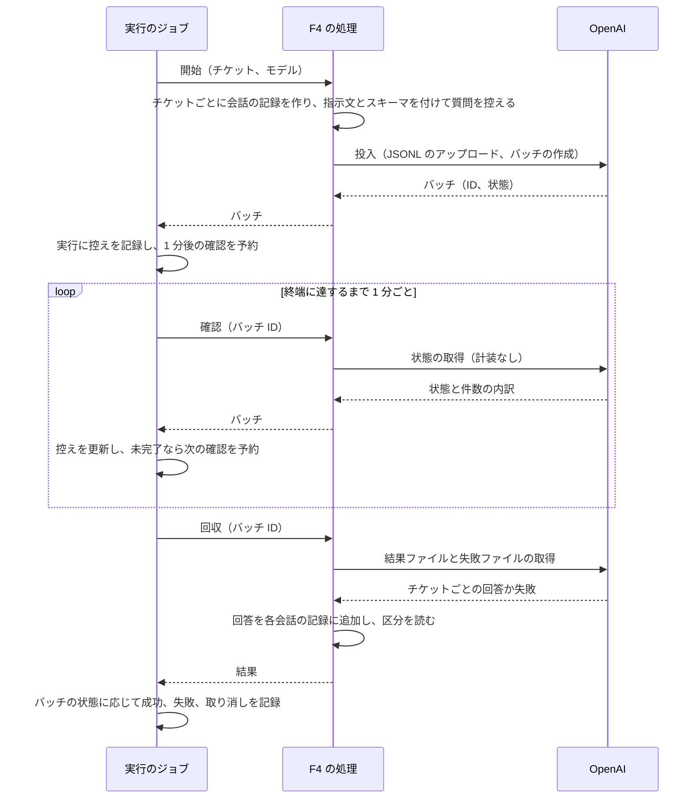
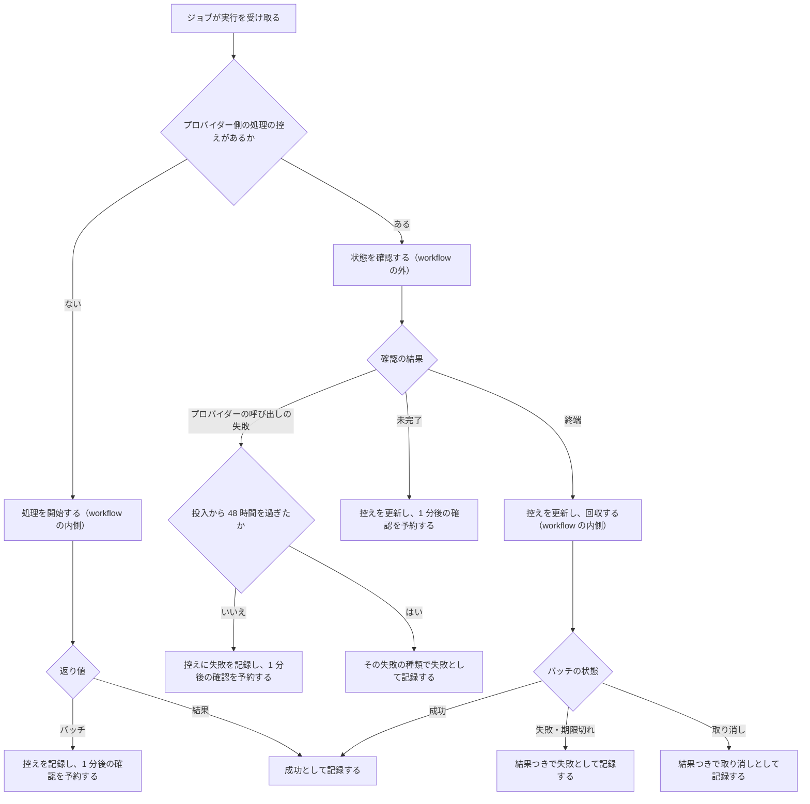

# ChangeSpec: F4 Batches の代表シナリオを追加する

## 変更の目的

要件 F4 の代表シナリオ「サポートチケットをまとめて分類する」をデモ基盤に載せ、複数のチケットの分類を OpenAI の Batch API に 1 回で投入し、結果を後から回収して、全体の状態とチケットごとの成否を履歴で読めるようにする。あわせて、C2〜C5 が求める説明文、出典、コード断片、既定の入力での実行をそろえる。対応する要件は、要件定義書の F4、C2〜C5、C7、C9、2.5 のエラー条件（プロバイダー側の処理の失敗、期限切れ、取り消し。一部のチケットだけの失敗）である。

F4 は、実行のジョブが「プロバイダー側に残した仕事の続きを実行する」最初の代表シナリオである。実行のジョブに残っている TODO（プロバイダー側の記録から再開する）をこの変更で解消し、その形（実行に残す控え、確認の予約、確認の結果の正規化、異常終了した実行の投入し直し）を F6b（動画）と F8（Deep Research）も使う。ただし、同時に作成中の F6b と F8 の ChangeSpec（`add-f6b-video-generation.md`、`add-f8-deep-research.md`）は、同じ TODO を別の形（ID の文字列の列、同じジョブの内側で完了を待つ、判別は `id` と `pending?`）で解消すると書いている。基盤は、「確認（`check`）を持つ処理では、ジョブが確認と予約を行う。持たない処理では、同じジョブの内側で `resume` を呼ぶ」という 1 つの規則に統一する（利用者の決定。「決まったこと」）。F4 は確認を持つ側で、この文書は F4 に要る形を書く。確認を持たない処理の経路は、F6b か F8 を実装するときに足す。

C7（観察情報）は、次のとおり一部を逸脱し、この ChangeSpec で許容する（F9a の前例と同じく、要件定義書は変えない）。RubyLLM の回収は、回答ごとに使用量のイベントだけを発行し、chat のイベントを発行しない。使用量のイベントはブロックを持たないので、所要時間もない。そのため Sentry には、チケットごとのトークン数とバッチ料金のコストは送れるが、プロンプトと応答の本文と、回答ごとの所要時間は送れない。本文は、実行の画面の結果と、会話の記録（`chats`、`messages`）で読む。

## 現状

デモ定義 `config/demos.yml` の `batches`（名前は Batches）は、要約と出典 1 件（Batches）を持ち、説明文の本文を持たない。代表シナリオ `classify_tickets`（サポートチケットをまとめて分類する）は処理（`handler`）を持たず、一覧とデモの画面で「準備中」と表示される。

実行の記録 `Demos::Run` の状態は、実行中、承認待ち、成功、失敗、取り消しの 5 つで、遷移は `TRANSITIONS`（実行中から承認待ち・成功・失敗・取り消しへ、承認待ちから実行中・失敗・取り消しへ）で決まる。遷移の検証は状態が変わる保存でだけ動く（`if: :will_save_change_to_status?`）ので、状態を変えない保存は検証を通らない。`succeed!` は、そのために終了済みの実行を保存の前に明示的に拒む。承認待ちで止まった実行は `chat_id` と `approval_requests` で会話の記録を指す。プロバイダー側に残した処理を指す欄はない。取り消しに遷移する操作はなく、`fail!` と `fail_as!` は失敗だけを記録し、結果（`result`）は成功のときだけ入る。`fail_abandoned!` は、異常終了したワーカーが持っていたジョブの実行を「ワーカーの異常終了」で失敗にする。失敗の内容は `failure`（`provider`、`kind`、`message`、`hint` など）に記録され、実行の画面は失敗した実行でだけそれを表示する。`trace_ids` はトレース ID の文字列の配列で、`add_trace_id!` が同じ ID を 1 度だけ加える。

実行のジョブ `Demos::RunJob` は、会話 ID を渡した `RubyLLM.workflow` の内側でトレース ID を記録し、会話の記録があれば `scenario.resume(chat)` を、なければ `scenario.perform(input)` を呼ぶ。返り値が会話の記録なら承認待ちに、それ以外なら成功として記録する。例外は `FailureKinds` で失敗の種類と原因の候補に変換して失敗として記録し、プロバイダーの呼び出しに由来しない例外だけを報告する。`retryable` が偽の代表シナリオで、開始済み（`started_at` あり）かつ会話の記録がない実行は「ジョブの中断」として失敗にする。ここに、プロバイダー側の記録から再開する TODO がある。ジョブが自分を再投入する箇所はない。ジョブ自身はリトライしない。workflow の ID は渡さないので、実行のたびに新しい ID になる。

代表シナリオ定義 `Demos::Scenario` は、処理のクラスに入力とモデルをキーワードで渡して `perform` を呼び、承認待ちの続きは `decide` と `resume` で処理のクラスに委ねる。処理は `ApplicationAction` の下に機能ごとの名前空間で置き、結果のハッシュを返し、例外はそのまま投げる。承認で止まる処理は、結果の代わりに会話の記録をそのまま返す。この契約は `ApplicationAction` のコメントに書かれている。デモの画面は処理のソースファイルをそのままコード断片として表示する。

実行の画面の状態で変わる部分（`app/views/runs/_details.html.erb`）は、2 秒ごとにサーバーから描き直され、実行中の実行では「実行を指示してから N 秒」とワーカーの注意書きを出す。成功した実行では `result_kind` と同じ名前の結果の表示部品（`app/views/runs/results/`）を描画する。実装済みの表示部品は `text_answer`、`refund_decision`、`ticket_workflow`、`web_search_answer`、`speech`、`token_count`、`raw` で、一覧を成否つきで表示する部品はない。Sentry のトレースへのリンク（`RunsHelper#sentry_trace_url`）は、どのトレースにも実行の開始日時（なければ作成日時）を時刻として渡す。`Observability::SentryLinks` のコメントのとおり、Sentry はこの時刻でトレースを探す。

購読者 `Observability::RubyLLMSpanSubscriber` は、次のとおりイベントをスパンにする。

- `request.ruby_llm` 以外のすべてのイベントに、`gen_ai.agent.name`（workflow の名前）と `gen_ai.conversation.id`（会話 ID）を付ける。会話 ID は、開いている workflow のうち最も内側で会話 ID を持つものから引き継ぐ
- `batch.ruby_llm` は `OTHER_OPERATIONS` に含まれ、`sentry.op` のない素のスパンになる。名前は「batch」（ペイロードにモデルがない）、固有の属性は `ruby_llm.operation` と `gen_ai.provider.name` で、バッチの ID と件数は載らない
- `usage.ruby_llm` は「attempt 操作 モデル」という名前のスパンになり、トークン数とコストは `ruby_llm.attempt.*` の属性に載る。`gen_ai.usage.*`、`gen_ai.operation.name`、`sentry.op` は付けない（囲む操作のスパンが同じ値を合計として持つため、二重に数えないようにしている）。囲む操作のスパンがあるかどうかは見ていない
- `request.ruby_llm` は常に `http.client` のスパンになる。囲むスパンがなければ、そのスパンが 1 つのトレースになる

失敗の種類の表 `FailureKinds` は、プロバイダーの呼び出しの例外の表 `TABLE` と、表の外の 2 つ（ワーカーの異常終了、ジョブの中断）を持つ。プロバイダー側の処理の失敗と取り消しを表す種類はない。`provider_call?` は、`RubyLLM::Error` か `TABLE` にある例外を「プロバイダーの呼び出しに由来する」と判定する。

DB には、Phase 0 の `ruby_llm:install` が作った RubyLLM の `ruby_llm_batches`（`provider_batch_id`、`status`、`raw_status`、`completed`、`request_counts`、`reported_cost`、`chat_ids` など）があり、まだ使われていない。`Chat` と `Message` は `acts_as_chat` と `acts_as_message` の記録で、`chats.ruby_llm_model_id` は必須の外部キーである。テストで会話の記録を作るときは、モデルの記録を先に作る（`create_refund_chat` の前例。作らないと RubyLLM が登録簿の全体を読み込む）。

RubyLLM のログは `config/initializers/ruby_llm.rb` で設定していないので、`RUBYLLM_LOG_FILE` がなければ標準出力（`bin/dev` の端末）に出る。`log/development.log` と Sentry には残らない。

ジョブの基盤は Solid Queue 1.7 で、Puma のプラグイン（`SOLID_QUEUE_IN_PUMA`）が Puma の起動後に別プロセスとして fork する。`config/queue.yml` にディスパッチャーとワーカーがある。Active Job の `wait:` で予約したジョブは `solid_queue_scheduled_executions` に保存され、期日が来るとディスパッチャーが実行待ちに移す。予約は DB にあるので、アプリの停止をまたいで残る。ワーカーが正常に止まると、実行中だったジョブはキューに戻される。ワーカーが異常終了すると `fail_many_claimed.solid_queue` の通知で `fail_abandoned!` が呼ばれる。完了したジョブの行を消す定期タスク（`config/recurring.yml`）は本番だけにあり、開発環境では完了したジョブの行が残る。開発環境の fork したワーカーはコードを再読み込みしないので、コードを変えた後に実行を試すには Puma のホット再起動が要る。

RubyLLM 2.0.0 の Batches の仕様は次のとおりである（gem のソースと公式ガイドで確認した）。

- `Chat#ask_later(text)` は、質問を利用者のメッセージとして会話に加え、プロバイダーに送らずに会話を返す。`RubyLLM.batch(chats)`（`Batch.submit`）は、控えた会話をまとめて投入し `RubyLLM::Batch` を返す。1 回の投入は 1 つのプロバイダーに限られ、OpenAI では 1 つのモデルに限られる。空の投入と、控えのない会話を含む投入は `ArgumentError` になる
- OpenAI（Responses プロトコルのモデル）では、会話ごとの要求を 1 行にした JSONL を `purpose: batch` でアップロードし、`endpoint` を `/v1/responses`、`completion_window` を `24h`（固定）にして `batches` を作る。各行の本文は通常の問い合わせと同じ描画で、`with_instructions` の指示文、`with_schema` のスキーマ（`text.format`）を含む。スキーマは実行時の設定で、会話の記録には保存されない
- `Batch` は `id`、`status`（`:pending`、`:succeeded`、`:failed`、`:cancelled` に正規化した値）、`raw_status`（OpenAI の状態文字列）、`request_counts`（OpenAI では `total`、`completed`、`failed`）、`complete?`、`succeeded?`、`failed?`、`cancelled?`、`provider` を持つ。OpenAI の状態文字列は、終端の `completed` が成功、`cancelled` が取り消し、`failed` と `expired` が失敗に対応する。失敗の理由（OpenAI のバッチの `errors`）は `Batch` に載らない。`RubyLLM::ResearchJob` と `RubyLLM::VideoJob` の述語はこれと違う（`done?`、`completed?`、`failed?` など。`complete?` と `succeeded?` を持たず、理由を `error` で読める）
- OpenAI は、24 時間以内に終わらなかったバッチを `expired` にし、未処理の要求を取り消す。完了した要求の回答は結果ファイルに残り、課金される。取り消したバッチも同じで、処理済みの要求の回答は残る
- 投入は `batch.ruby_llm` の計装イベントを発行する。ペイロードはプロバイダー、要求の件数（`requests`）、投入後に設定されるバッチの ID（`batch_id`）である
- 投入した会話がすべて `acts_as_chat` の記録なら、RubyLLM は投入と同時にバッチを `ruby_llm_batches` に保存する（`batch_store` は `acts_as` の導入で自動的に設定される）。`RubyLLM::Batch.find(id)` は、保存があればプロバイダーを呼ばずに DB から復元し、投入した会話も記録から復元する。保存がなければ `provider:` が要り、その場合は会話を持たない。`find(id, context:)` は、その文脈の設定でプロバイダーに接続する。`RubyLLM.context` は、呼んだ時点の全体の設定の写しを作る
- `refresh` はプロバイダーから状態を取り直し（OpenAI では `GET batches/{id}`）、保存を同期して自分を返す。`messages` は結果ファイルと失敗ファイルを取得し、投入順の回答（失敗した要求は `nil`）を返す。会話を持つバッチでは、回答を各会話に 1 度だけ追加し（会話がまだ応答を待つ状態でなければ届け済みと判定する）、`acts_as_chat` の記録にも保存する。`statuses` は投入順に `:succeeded`、`:failed`、`:cancelled` を返すが、埋まるのは `messages` の後である。結果のない要求は、バッチが取り消しなら `:cancelled`、それ以外は `:failed` になる。失敗した要求の理由は RubyLLM がログに警告として書くだけで、API からは読めない。終端に達したバッチなら、失敗や期限切れでも `messages` は呼べる
- 回収した回答ごとに、RubyLLM はバッチ料金のコストを持つ使用量を作り、`usage.ruby_llm` の計装イベントを発行する（会話を持ち、まだ届けていない回答に限る）。chat のイベントは発行しない。OpenAI のバッチ料金は、登録簿にバッチの単価がないモデルでは標準の 0.5 倍で求める（`gpt-5-nano` はこれに当たる）
- 構造化出力の回答は `Message#parsed` で JSON として読める
- `RubyLLM.context { |config| config.instrumenter = nil }` の文脈で行った操作は、計装イベントを発行しない（`Support::Instrumentation.instrument` は設定の `instrumenter` がなければ通知せずにブロックを実行する）
- 計装ガイドは、別のジョブで回収する場合に、保存した workflow の ID で `RubyLLM.workflow` を開き直して相関させる例を示している。このアプリは workflow の ID ではなく、metadata の会話 ID で相関する

テストは、`test/jobs/demos/run_job_test.rb` が処理のクラスを偽物（`FakeHandler`）に差し替えてジョブを検証し、`test/support/chat_helpers.rb` の `with_chat` が `RubyLLM.chat` を差し替える。処理の単体テストの前例は F3、F6a、F7a、F9a にある。`test/models/demos/scenario_test.rb` は `resume` の委譲を検証する。`test/subscribers/observability/ruby_llm_span_subscriber_test.rb` は、イベントを直接発行してスパンを検証する。`test_helper.rb` は OpenAI の偽の設定値を常に入れ、モデルの登録簿を先に読み、`test/support/` の補助を明示的に読み込む。

### 関連ファイル

| ファイル | 役割 |
|---------|------|
| `config/demos.yml` | 10 機能のデモ定義と代表シナリオ定義 |
| `app/models/demos/catalog.rb`、`app/models/demos/demo.rb`、`app/models/demos/scenario.rb` | デモ定義の読み込み、実行可否、処理の呼び出し |
| `app/models/demos/run.rb` | 実行の記録。状態の遷移、承認待ちの控え、失敗の記録、トレース ID |
| `app/jobs/demos/run_job.rb` | 実行のジョブ。workflow を開き、処理を呼び、成否を記録する。再開の TODO がある |
| `lib/failure_kinds.rb` | 失敗の種類と原因の候補の表 |
| `app/actions/application_action.rb` | 代表シナリオの処理の基底と、返り値の契約 |
| `app/actions/tool_approval/answer_refund_request.rb` | F3 の処理。処理の続きを別のジョブで実行する書き方の前例 |
| `app/actions/workflow_instrumentation/run_ticket_workflow.rb` | F10 の処理。チケットの分類の指示文とスキーマの前例 |
| `app/views/runs/_details.html.erb` | 実行の画面のうち状態で変わる部分。実行中の表示、失敗の表示、結果の表示部品の描画 |
| `app/views/runs/results/_ticket_workflow.html.erb` | F10 の結果の表示部品。区分の表示の前例 |
| `app/helpers/runs_helper.rb` | 実行の画面のヘルパー。状態のバッジ、Sentry へのリンク |
| `app/models/observability/sentry_links.rb` | Sentry のトレースと会話の URL |
| `app/subscribers/observability/ruby_llm_span_subscriber.rb` | 計装イベントをスパンにする購読者 |
| `config/initializers/ruby_llm.rb` | RubyLLM の設定。ログの設定はない |
| `config/initializers/solid_queue.rb` | 異常終了したワーカーのジョブの実行を失敗にする購読 |
| `config/queue.yml`、`config/recurring.yml` | Solid Queue の構成 |
| `db/schema.rb` | `demo_runs`、`ruby_llm_batches`、`chats`、`messages` |
| `test/jobs/demos/run_job_test.rb` | ジョブの検証。処理の偽物 `FakeHandler` |
| `test/models/demos/run_test.rb`、`test/models/demos/scenario_test.rb`、`test/models/demos/catalog_test.rb` | 実行の記録、代表シナリオ定義、デモ定義の検証 |
| `test/lib/failure_kinds_test.rb` | 失敗の種類の検証 |
| `test/helpers/runs_helper_test.rb`、`test/models/observability/sentry_links_test.rb` | ヘルパーと Sentry のリンクの検証 |
| `test/subscribers/observability/ruby_llm_span_subscriber_test.rb` | 購読者の検証 |
| `test/controllers/demos_controller_test.rb`、`test/controllers/demos/runs_controller_test.rb`、`test/controllers/runs_controller_test.rb`、`test/controllers/runs/statuses_controller_test.rb` | 画面と実行の指示の検証 |
| `test/support/screen_helpers.rb`、`test/support/chat_helpers.rb`、`test/test_helper.rb` | 画面と会話の差し替えの補助と、その読み込み |

## 変更内容

投入から回収までの流れは次のとおりである。プロバイダーへの送信は、投入（アップロードとバッチの作成）、1 分ごとの状態の確認、回収（結果ファイルの取得）に分かれ、投入と回収だけがトレースになる。

ジョブが実行を受け取ったときの分岐は次のとおりである。控えのある実行の確認は workflow の外で行い、回収だけを workflow の内側で行う。回収は、バッチが終端に達したときに、その状態によらず行う。期限切れと取り消しでも完了した分の回答は残り、課金されているためである。

- **追加**: F4 の代表シナリオの処理。チケットの本文とモデルを受け取る
  - 開始（`perform`）。入力を空行で区切ってチケットに分け（改行は LF と CRLF のどちらでもよい）、前後の空白を除き、空のものを捨てる。チケットごとに `acts_as_chat` の会話の記録をモデルで作り、分類の指示文とスキーマ（区分の列挙と理由。F10 と同じ形だが、この処理が自分の定義を持つ）を付け、チケットを `ask_later` で控える。控えた会話をまとめて `RubyLLM.batch` で投入し、返った `RubyLLM::Batch` をそのまま返す。会話の記録を使うのは、RubyLLM がバッチを保存し、別のジョブが ID だけで復元でき、回収した回答が記録に残るためである。処理は 1 回の投入までで、投入の失敗は例外のまま投げる
  - 確認（クラスメソッド。バッチ ID を受け取る）。計装のない文脈（`RubyLLM.context` で `instrumenter` を外したもの。確認のたびに作る）でバッチを復元して `refresh` し、バッチを返す。確認は終端に達するまで 1 分ごとに繰り返されるので、計装すると 1 回ごとに 1 つのトレースになる
  - 回収（クラスメソッド。バッチ ID を受け取る）。通常の文脈でバッチを復元し、`messages` で回答を回収して各会話の記録に追加し、その後に `statuses` を読んで結果を組み立てる。復元した会話の利用者のメッセージからチケットの本文を、回答の本文を JSON として読んで区分と理由を得る（スキーマは記録に残らないが、回答は構造化出力なので読める）。使用量のイベントは通常の文脈で発行される
  - 結果は、バッチの ID、プロバイダー、OpenAI の状態文字列、件数の内訳（`total`、`completed`、`failed`）、応答したモデル、チケットの一覧からなる。一覧の要素は、チケットの本文、成否（`succeeded`、`failed`、`cancelled`）、区分、理由で、回答のないチケットの区分と理由は `nil` にする。失敗の理由は RubyLLM から読めないので持たない
  - ジョブが再び動いたときに最初からやり直してはならない（`retryable` は偽）。やり直すと同じチケットをもう一度投入して課金される
  - テストは `test/actions/` に置く。差し替えるのは OpenAI のプロバイダーのバッチの操作（`create_batch`、`find_batch`、`batch_results`。アップロードは `create_batch` の内側なので差し替えの対象になる）で、`RubyLLM::Batch`、保存と復元、回答の追加、使用量のイベントは本物を動かす。補助は `test/support/` に加える。会話の記録は実際に作る（作成と `ask_later` はプロバイダーを呼ばない。モデルの記録を先に作る）
- **追加**: 実行の記録に、プロバイダー側の処理の控えを持たせる（`demo_runs` へのカラム `remote_job` の追加。JSON。名前は Active Job のジョブの属性 `provider_job_id` と紛れないためのもので、F6b と F8 もこの列の種類と識別子を使う）。項目は、種類（`batch`）、識別子（バッチ ID）、プロバイダー、投入日時、最後に確かめた状態（OpenAI の状態文字列）、件数の内訳、最後に確かめた日時、最後の確認の失敗（種類、メッセージ、日時）である。控えは、ジョブが処理から `RubyLLM::Batch` を受け取ったときに記録し（確かめた日時と失敗は空）、確認のたびに状態と件数と日時を更新して失敗を消し、確認が失敗したときは失敗だけを更新する。記録と更新は実行中の実行にだけ行い、それ以外の状態では保存の前に明示的に拒む（遷移の検証は状態を変えない保存では動かない）。実行の状態は控えのあいだも「実行中」のままにする（要件の 5 つの状態に、投入済みの状態はない）。控えは終了した実行にも残り、画面に出す
- **追加**: 実行の記録に、取り消しとして記録する操作と、結果つきで失敗として記録する操作を加える。取り消しは実行中から取り消しへ遷移し、理由（種類、プロバイダー、OpenAI の状態文字列、原因の候補）を失敗と同じ欄に、あれば結果を結果の欄に記録して、終了日時を入れる。実行中以外の実行（承認待ちを含む）への取り消しは、保存の前に明示的に拒む。結果つきの失敗は、既存の失敗の記録に結果を添えるもので、遷移は失敗と同じである。結果に生成物（ファイル）は含めない
- **変更**: 実行の記録のトレース ID に、記録した日時を添える。`trace_ids` の要素を ID と日時の組にし、既存の文字列だけの要素も読めるようにする。Sentry のトレースへのリンクは、その日時（文字列だけの要素では開始日時か作成日時）を時刻として渡す。回収のトレースは投入から数時間後、アプリの停止をはさめば数日後になるので、開始日時では Sentry がトレースを見つけられない
- **追加**: 失敗の種類の表に、表 `TABLE` の外の 2 つを加える。プロバイダー側の処理の失敗（原因の候補: 期限切れ（expired）なら 24 時間以内に処理されなかった。完了した分は課金され、結果に残る。OpenAI のダッシュボードでバッチの状態と理由を確かめる）と、プロバイダー側の処理の取り消し（原因の候補: OpenAI のダッシュボードなどでバッチが取り消された。完了した分は課金され、結果に残る）である。`for` と `provider_call?` の判定は変えない
- **変更**: 実行のジョブ
  - 続きの手がかりを、会話の記録とプロバイダー側の処理の控えの 2 つにする。`retryable` が偽で開始済みの実行は、どちらもないときだけ「ジョブの中断」にする。TODO を解消する
  - 控えのある実行を受け取ったら、workflow の外で代表シナリオ定義に確認を頼み、正規化した状態（未完了か終端か。終端なら成功・失敗・取り消しのどれか。状態文字列、件数の内訳）を受け取って控えを更新する。未完了なら 1 分後の自分を予約して終わる（間隔はジョブの定数）。終端なら workflow の内側でトレース ID を記録して回収を頼み、返った結果を、成功なら成功として、失敗（期限切れを含む）なら「プロバイダー側の処理の失敗」の結果つきの失敗として、取り消しなら結果つきの取り消しとして記録する。理由には OpenAI の状態文字列とプロバイダー名を入れる
  - 確認と回収でプロバイダーの呼び出しに由来する例外（`FailureKinds.provider_call?`）が起きたときは、実行を失敗にせず、控えに最後の確認の失敗を記録して 1 分後の自分を予約する。確認は無料で冪等であり、回収もやり直して回答が重複しない。ただし投入から 48 時間を過ぎていたら、その例外で失敗として記録する（OpenAI のバッチは投入から 24 時間で終端に達するので、48 時間後にも確かめられない実行は打ち切る）。プロバイダーの呼び出しに由来しない例外（アプリの不具合。保存がなく復元できない場合を含む）は、既存の扱いのとおり失敗として記録し、報告する
  - 処理の返り値がプロバイダーに残した処理（`id` と `status` を持つ RubyLLM の値。`Batch`、`ResearchJob`、`VideoJob` が当てはまる）なら、控えを記録し、1 分後の自分を予約する。判別はメソッドの有無で行い、RubyLLM のクラス名は参照しない（F6b と F8 の ChangeSpec は `id` と `pending?` で判別するが、`Batch` は `pending?` を持たない）
  - 開始日時は控えのある実行では更新しない（続きの実行である）。トレース ID は投入と回収で記録し、確認では記録しない
  - 異常終了したワーカーが確認か回収の途中で止まった実行は、失敗にせず、ジョブを投入し直す（下の実行の記録の変更）。確認を予約しているあいだの異常終了は、その実行のジョブが取得済みでないので、実行を変えない
  - 同じ実行の確認のジョブが同時に 2 つ動くのは、ワーカーが次の確認の予約とジョブの終了のあいだで止まってジョブが戻されたときだけである。この場合の同時の回収は防がない（回答の重複の判定は各プロセスのメモリで行われる）。窓が小さいので許容する
  - 開発環境では、確認のジョブの完了した行が 1 分ごとに残る（1 つのバッチにつき最大で 1 日約 1,440 行）。許容する
- **変更**: 実行の記録の `fail_abandoned!`。異常終了したワーカーが持っていたジョブの実行のうち、控えのある実行中の実行は失敗にせず、ジョブを投入し直す。プロバイダー側の処理は続いており、確認は無料で冪等、回収はやり直しても回答が重複しない。控えのない実行は現状どおり「ワーカーの異常終了」で失敗にする。投入し直した実行がまた失われれば同じ扱いを繰り返すが、投入から 48 時間を過ぎた控えの実行は投入し直さず「ワーカーの異常終了」で失敗にする（ワーカーが落ち続けると投入し直しが止まらないため）。48 時間を過ぎたかどうかの判定は実行の記録が持ち、ジョブの打ち切りも同じ判定を使う。`config/initializers/solid_queue.rb` と `RunJob.fail_abandoned` のコメントを、失敗にするか投入し直すかは実行が決める旨に直す。F6b と F8 の ChangeSpec と同じ変更である
- **変更**: 代表シナリオ定義に、控えの確認と回収を処理のクラスに委ねる操作を加える。確認は、処理のクラスの返り値（`RubyLLM::Batch`）を、控えの種類ごとにジョブが読む正規化した状態に変換する。`resume` は会話の記録と控えのどちらでも受け取れるようにし、控えなら識別子を処理のクラスの回収に渡す。確認や回収を持たない処理に控えが渡ったときは、既存の `resume` と同じく `NoMethodError` のまま伝える（アプリの不具合として失敗と報告になる）
- **変更**: `ApplicationAction` のコメントの契約に、プロバイダー側に仕事を残す処理の返り値（`RubyLLM::Batch`）と、確認と回収のクラスメソッドを書き足す
- **追加**: F4 の結果の表示部品（`result_kind` は `batch_classification`）。全体として、OpenAI の状態文字列、件数の内訳（成功 M 件、失敗 K 件、全 N 件）、バッチの ID、応答したモデルを表示する。チケットごとに、本文、成否のバッジ（成功、失敗、取り消し）、区分、理由を投入順に表示する。回答のないチケットは区分と理由の代わりに、失敗（または取り消し）の旨と、失敗の理由が RubyLLM のログ（このアプリでは標準出力）に出る旨を表示する
- **変更**: 実行の画面の状態で変わる部分
  - 控えのある実行では、状態によらず、プロバイダー側の処理の区画を出す。内容は、投入済みである旨、バッチの ID、プロバイダー、OpenAI の状態文字列、件数の内訳、投入日時、最後に確かめた日時、最後の確認の失敗（あれば種類とメッセージと日時）である。実行中の実行では、次の確認まで約 1 分であることと、画面を離れても結果は履歴に届くことも出す。既存の「実行を指示してから N 秒」とワーカーの注意書きはそのまま出す（確認のジョブにもワーカーが要る）
  - 結果の表示部品は、結果のある実行で描画する（成功した実行に限らない）。期限切れと取り消しの実行は、失敗か取り消しの理由と、完了した分を含む結果の両方を出す
  - 失敗の内容の表示を、取り消しになった実行でも出す（種類、プロバイダー、理由、原因の候補）
- **変更**: 購読者
  - `batch.ruby_llm` のスパンに、バッチの ID と要求の件数の属性を載せる。投入に失敗したイベントでは ID がないので載せない
  - `usage.ruby_llm` のイベントを受けたとき、開いているスパンに操作（`GEN_AI_OPERATIONS` と `OTHER_OPERATIONS` のもの）がなければ、その使用量をペイロードの `operation` の操作そのものとして扱い、その操作と同じ名前と属性（`sentry.op`、`gen_ai.operation.name`、プロバイダー、モデル、`gen_ai.usage.*`、`gen_ai.cost.total_tokens`）のスパンにする。F4 では `chat` になる。囲む操作があるときの扱いは変えない。バッチの回収は、回答ごとに使用量のイベントだけを発行するので、これで Sentry の Agents の画面にチケットごとのトークン数とバッチ料金のコストが出る。本文の属性は、イベントに本文がないので付けない。所要時間は、イベントがブロックを持たないのでほぼ 0 になる
- **変更**: デモ定義 `config/demos.yml` の `batches`
  - 役立つケースの本文。チケットの分類や要約のように、すぐに応答を返す必要がない、件数の多い処理に役立つこと。`ask_later` で控えた会話を `RubyLLM.batch` でまとめて投入し、返ったバッチの ID を保存すれば、別のプロセスが `Batch.find` で復元して `refresh` で状態を確かめ、`messages` で回答を回収できること。投入の単位は 1 つのプロバイダーで、OpenAI では 1 つのモデルであること。OpenAI では 24 時間以内に処理され、料金は同期の呼び出しの半額で、レート制限の枠も別であること。`status` が正規化した状態、`raw_status` がプロバイダーの状態、`statuses` がチケットごとの成否で、失敗した要求の回答は `nil` で理由は RubyLLM のログ（このアプリでは標準出力）に出ること。期限切れと取り消しでも完了した分の回答は残り、課金されること。Rails では会話の記録を投入すると RubyLLM がバッチを自分のテーブルに保存し、回収した回答も記録に残ること。コストは `batch.cost` と回答ごとの `cost` で、バッチ料金で求められること。このアプリの回収では、回答ごとの使用量のイベントから Sentry にトークン数とコストが載り、本文と所要時間は載らないこと。バッチの結果は 1 回のモデルの応答で、ツール呼び出しが含まれる場合は `run_tools` の後に次のバッチを投入すること
  - 使わない場合に困ることの本文。同期の呼び出しで 1 件ずつ送ると、件数分の時間とレート制限の枠を使い、料金は標準のままであること。Batch API を直接使うと、JSONL の組み立て、ファイルのアップロード、バッチの作成、状態の確認、結果ファイルと失敗ファイルの取得、`custom_id` による回答と要求の対応づけ、失敗した行の切り分けを、自分で書いて保守すること。プロバイダーを替えると、ファイル方式（OpenAI）と要求の配列方式（Anthropic）のように投入の形が変わること
  - 出典。Batches（RubyLLM。Submitting a Batch、Collecting the Answers、Cost and Usage、Rails Integration の節）、What's New in 2.0（RubyLLM。Batch Processing の節）、Instrumentation（RubyLLM。Workflows and Steps の節の、別のジョブで回収するときの相関）、Batch API（OpenAI のガイド。投入の形、24 時間の期限、期限切れの扱い、半額の割引）、Pricing（OpenAI。Batch の単価）の 5 件。OpenAI の 2 件は、投入の形、期限、料金がプロバイダーの仕様に基づくため加える
  - 代表シナリオ `classify_tickets` に、処理、プロバイダー（OpenAI）、モデル（`model: gpt-5-nano`。Responses プロトコルで送られ、バッチに対応する）、入力（`tickets`: サポートチケット。必須。1 件ごとに空行で区切る。既定値は、配送、返品・返金、商品の不具合、支払い、その他の区分に 1 件ずつ当たる架空の 5 件）、結果の種類（`batch_classification`）、やり直しの可否（偽）を加える

### 新規に追加する責務の配置

| # | 責務 | コンテキスト | 配置先 | 所有するルール・閾値・派生値 |
|---|------|------------|--------|--------------------------|
| 1 | F4 の代表シナリオの処理（チケットの分割、会話の組み立て、投入、状態の確認、回収と結果の組み立て） | デモ（Batches） | 代表シナリオの処理（機能ごとの名前空間） | チケットの区切り（空行）。分類の区分の一覧と指示文。確認は計装しないこと。結果の形 |
| 2 | プロバイダー側の処理の控え、結果つきの失敗と取り消しの記録、トレース ID の日時、控えのある実行の異常終了時の投入し直し | 実行（履歴） | Model（実行） | 控えの項目。控えと取り消しを実行中の実行にだけ行うこと。異常終了で失われた実行のうち控えのあるものは投入し直すこと。打ち切りの期限（投入から 48 時間）と、それを過ぎたかどうかの判定 |
| 3 | 控えの確認の間隔、確認の失敗の扱い、確認の結果ごとの実行の遷移 | 実行（履歴） | Job（実行のジョブ） | 確認の間隔（1 分）。確認の失敗を期限まで持ち越すこと（期限の判定は責務 2 に委ねる）。未完了・成功・失敗・取り消しの対応 |
| 4 | プロバイダー側の処理の状態の正規化（種類ごと） | 実行（履歴） | Model（代表シナリオ定義） | `RubyLLM::Batch` の述語と状態の対応 |
| 5 | F4 の結果の表示と、プロバイダー側の処理の区画の表示 | 実行の表示 | View | なし。項目は責務 1 と 2 に従う |
| 6 | 囲む操作のない使用量のイベントの操作化と、batch のスパンの属性 | 観測 | 購読者（既存） | 囲む操作の有無の判定 |
| 7 | F4 のデモ定義（説明文、出典、既定の入力） | デモ定義 | デモ定義（設定ファイル） | 既定の入力 |

使い勝手の点検は省略する（自習用のデモで、操作者は利用者本人である）。

## 採用した実装パターン

このリポジトリでは ADR を起票しない（利用者の決定）。採用案と理由だけを記す。

| # | 判断ポイント | 採用案 | 関連 ADR |
|---|------------|--------|---------|
| 1 | 結果の回収を何が駆動するか（ジョブが待ち時間つきで自分を再投入する、Solid Queue の定期実行のタスクが未完了の控えをまとめて確かめる、実行の画面のポーリングが確かめる） | ジョブが 1 分後の自分を再投入する。予約は Solid Queue の DB に残り、アプリの停止中に完了した処理も再起動後の最初の確認で回収される（C9）。公式ガイドの Rails の例と同じ形で、実行ごとに閉じる。定期実行のタスクはスケジューラーを足したうえで全実行を横断する別の責務になる。画面のポーリングは、画面を離れると止まり C9 を満たさない | なし |
| 2 | 状態の確認をトレースにするか（確認も workflow の内側で行う、確認は計装のない文脈で行い投入と回収だけをトレースにする、購読者で囲むスパンのないリクエストを捨てる） | 確認は計装のない文脈で行う。確認を計装すると、1 分ごとのトレースが実行の画面の「以前のトレース」と Sentry の会話に積み上がる。購読者で捨てる案は、囲むスパンのないすべてのリクエストに当たる規則を購読者に足すことになり、確認だけを計装しない意図が処理のコードから読めない | なし |
| 3 | 実行とバッチをどう対応づけるか（実行にバッチの ID と最後の状態を控える、RubyLLM のテーブルへの外部キーを持つ） | 実行に控える。`RubyLLM::Batch.find(id)` が公開 API で、RubyLLM のテーブルは非公開である。控えは種類を持ち、F6b と F8 でも使う。最後の状態を控えるのは、実行の画面が会話の記録を読まずに承認の要求を表示している既存の形にそろえるためである | なし |
| 4 | ジョブがプロバイダー側の処理の状態をどう読むか（`RubyLLM::Batch` の述語を直接読む、代表シナリオ定義が種類ごとに正規化した状態をジョブに渡す） | 正規化した状態を渡す。`ResearchJob` と `VideoJob` の述語は `Batch` と違うので、ジョブが直接読むと F6b と F8 で分岐を作り直すことになる | なし |
| 5 | 確認と回収の一時的な失敗をどう扱うか（既存の扱いのとおり実行を失敗にする、プロバイダーの呼び出しの失敗なら次の確認に持ち越し、期限で打ち切る） | 持ち越して打ち切る。RubyLLM のリトライは合計約 1 秒で尽きるので、1 分ごとに最大 24 時間続く確認が接続の失敗 1 回で確定的に失敗になり、OpenAI 側では生きているバッチを回収しなくなる（C9 に反する）。打ち切りは、バッチが終端に達するまでの 24 時間の 2 倍とする | なし |
| 6 | 終端に達したバッチのうち、期限切れと取り消しを回収するか（回収しない、成功と同じく回収して結果つきで失敗か取り消しにする） | 回収する。OpenAI は完了した要求の回答を残し、課金する。回収しないと、課金された回答と、チケットごとの成否（2.5）と、そのコスト（F4）が残らない | なし |
| 7 | 回収したコストを Sentry にどう載せるか（囲む操作のない使用量のイベントを操作のスパンとして送る、attempt のスパンの属性のままにする、送らない） | 囲む操作のない使用量のイベントを操作のスパンとして送る。F4 の要件はコストを観察情報で確認できることで、Sentry の Agents の画面が集計するのは `gen_ai` の操作のスパンである。attempt の属性のままでは、スパンの詳細を開かないと読めない | なし |
| 8 | 回収した回答の本文を Sentry に送るか（送らない、ジョブが回収の後に会話の記録から本文つきのスパンを自分で作る） | 送らない。RubyLLM のイベントからスパンを作るのが計装の方針で、アプリが作るスパンは使用量のスパンと二重になる。本文は実行の画面と会話の記録で読む | なし |
| 9 | チケットの入力の形（1 つの入力欄に空行区切り、固定の件数の入力欄） | 1 つの入力欄に空行区切り。件数を変えて再実行でき（C6）、入力の定義（名前、表示名、既定値、必須）を変えずに済む | なし |
| 10 | 分類の出力の形（区分の列挙を持つ構造化出力、自由文） | 構造化出力。区分を機械的に読めて成否と並べて表示できる。Responses プロトコルのバッチの行にもスキーマが載る | なし |
| 11 | 異常終了で失われた、控えのある実行の扱い（ジョブを投入し直す、失敗にする） | 投入し直す。C9 の「停止中に完了した結果は次回の起動後に届く」は異常終了の後にも成り立つ必要があり、控えがあれば待ち直せる。確認は無料で冪等である。F6b と F8 の ChangeSpec と同じ | なし |

## 結合への影響

| # | 結合点 | 変更前 強さ/距離 | 変更後 強さ/距離 | 備考 |
|---|--------|----------------|----------------|------|
| 1 | `Demos::RunJob`・`Demos::Scenario` → 処理のクラス（`perform`、`resume` に確認を加えた契約） | Contract(1)/異コンテキスト(3) OK | Contract(1)/異コンテキスト(3) OK | 契約は `ApplicationAction` のコメントに集約する。F6b と F8 も同じ契約で書く |
| 2 | 状態の正規化（代表シナリオ定義） → `RubyLLM::Batch`（`id`、`provider`、`raw_status`、`request_counts`、`complete?`、`succeeded?`、`failed?`、`cancelled?`） | なし | Contract(1)/異システム(4) OK | 公開 API。`ResearchJob` と `VideoJob` は述語が違うので、F6b と F8 は種類ごとの正規化を足す。ジョブはこの結合を持たない |
| 3 | F4 の処理 → `Chat`（`acts_as_chat` の記録の作成と `ask_later`） | なし | Model(2)/同一コンテキスト(2) OK | F3 と同じ形 |
| 4 | F4 の処理 ⇔ F10 の処理（共有知識: 分類の区分の一覧と指示文） | なし | Functional(3)/同一コンテキスト(2) △ | 許容する。区分はデモの表示語で変わる見込みがなく、共有すると F4 のコード断片に F10 の定数が現れて、単体で読めなくなる |
| 5 | 購読者 → `usage.ruby_llm` と `batch.ruby_llm` のペイロード | Contract(1)/異システム(4) OK | Contract(1)/異システム(4) OK | `batch_id` と `requests` への依存が増える。囲む操作の有無は購読者の内側の状態で判定する |
| 6 | `Demos::RunJob` → プロバイダーに残した処理の値（`id`、`status`） | なし | Contract(1)/異システム(4) OK | メソッドの有無で判別し、クラス名は参照しない（F6a の生成物の判別と同じ形） |
| 7 | 実行（異常終了した実行の投入し直し） → ジョブの投入 | なし | Contract(1)/同一コンテキスト(2) OK | `start` と `resume!` が既に投入している |

## 影響範囲

- `config/demos.yml`: `batches` の定義。一覧とデモの画面の表示が「準備中」から、OpenAI の設定値の有無に応じて「実行できる」または「設定値が足りない（OpenAI）」に変わる
- 新規: 代表シナリオの処理のファイル、結果の表示部品、`demo_runs` に控えのカラムを加えるマイグレーション（`db/schema.rb` が変わる）
- `app/models/demos/run.rb`: 控えの記録と更新、結果つきの失敗と取り消しの記録、トレース ID の日時、`fail_abandoned!` の投入し直し。既存の遷移の表は変えない（実行中から取り消しへの遷移は既にある）
- `app/jobs/demos/run_job.rb`: 続きの手がかりの拡張、確認と予約、失敗の持ち越しと打ち切り、回収、失敗と取り消しの記録。既存の F3 の続き（会話の記録）の扱いは変えない
- `app/models/demos/scenario.rb`: 確認の委譲と状態の正規化、`resume` の引数の拡張
- `app/actions/application_action.rb`: コメントの契約
- `lib/failure_kinds.rb`: 種類の追加。`bin/check_keys` も読み込むが、表の追加は影響しない
- `app/views/runs/_details.html.erb`: プロバイダー側の処理の区画、結果のある実行での結果の描画、取り消しの理由の表示。既存の表示の順序（状態の行、Sentry のリンク、結果）は変えない
- `app/helpers/runs_helper.rb`、`app/models/observability/sentry_links.rb`: トレースへのリンクの時刻をトレースごとの日時にする。成否のバッジのラベル。既存の実行（文字列だけのトレース ID）のリンクは変わらない
- `app/subscribers/observability/ruby_llm_span_subscriber.rb`: batch のスパンの属性、囲む操作のない使用量のスパン。囲む操作のある使用量（F1〜F10 の同期の呼び出し）の扱いは変えない
- `config/initializers/solid_queue.rb`: コメントを、失敗にするか投入し直すかは実行が決める旨に直す
- Sentry でのトレースの形（実装後に画面で確かめる）: 投入のトレースは、ジョブの `invoke_agent` の下に `batch` のスパン（ID と件数）、その下にファイルのアップロードとバッチの作成の `http.client`。回収のトレースは、`invoke_agent` の下にバッチの取得と結果ファイルの取得の `http.client` と、チケットごとの `chat` のスパン（トークン数、バッチ料金のコスト、本文なし、所要時間ほぼ 0）。確認はスパンを出さない。2 つのトレースは実行の会話 ID でまとまる。実行の画面では、回収のトレースが最新、投入のトレースが「以前のトレース 1」になる。Sentry は数値のコストを受け取るとそのまま使う。登録簿に単価のないモデルに替えるとコストは `nil` になり、Sentry が標準の単価で推定した値が出る
- 既定の入力の実行は、OpenAI がバッチを処理する時間に依存する。24 時間の期限内に完了しなければ期限切れとして失敗になる。開発環境でコードを変えた後に実行を試すには、Puma のホット再起動が要る
- テスト
  - 処理: 分割と会話の組み立て（指示文が付き、チケットが控えられ、投入の要求の本文にスキーマが載り、1 回の投入にまとまる）、投入の返り値と `ruby_llm_batches` の行、確認が計装のない文脈で復元すること、回収の結果の組み立て（成功、回答のないチケット、取り消されたバッチ）、回収のやり直しで回答が重複しないことの検証を、プロバイダーのバッチの操作の差し替えで加える。プロバイダーを呼ぶ実行は、実際の画面と Sentry で確かめる
  - ジョブ: 処理の偽物に確認と回収を持たせ、控えの記録と予約、確認の結果ごとの遷移、失敗の持ち越しと打ち切り、トレース ID の記録の有無、控えのある実行が「ジョブの中断」にならないことの検証を加える。既存の「ジョブの中断」の検証（会話の記録も控えもない）は残る
  - 実行の記録: 控えの記録と更新、結果つきの失敗と取り消し、実行中以外への拒否、トレース ID の日時、`fail_abandoned!` が控えのある実行を投入し直し、控えのない実行を失敗にすることの検証を加える
  - 代表シナリオ定義: 確認の委譲と正規化、控えでの `resume`、確認を持たない処理の `NoMethodError` の検証を加える
  - 失敗の種類: 2 つの種類と、`for` と `provider_call?` が変わらないことの検証を加える
  - ヘルパーと Sentry のリンク: トレースごとの日時と、文字列だけのトレース ID の検証を加える
  - 購読者: batch のスパンの属性、囲む操作のない使用量のスパン、囲む操作のある使用量のスパンが変わらないことの検証を加える。既存の attempt のスパンの検証で、操作の内側で発行していないものがあれば、操作の内側に移す
  - デモ定義: F4 の定義（プロバイダーが OpenAI、入力が `tickets`、`retryable` が偽、`result_kind` が `batch_classification`）の検証を加える
  - 画面: プロバイダー側の処理の区画（実行中と終了後）、結果の表示（全体、チケットごと、回答のないチケット、期限切れの結果つきの失敗）、取り消しの理由の表示、デモの画面の説明文と出典とコード断片と入力欄、空白の入力の拒否の検証を加える。`test/support/screen_helpers.rb` に控えのある実行と F4 の結果を作る補助を、`test/test_helper.rb` に新しい補助の読み込みを加える

## 関連 ADR

- なし（このリポジトリでは ADR を起票しない）

## 受け入れ条件

「確認手段」の列は、その行をテストで検証するか、プロバイダーを呼ぶため実際の画面と Sentry で検証するかを示す。

| ID | 変更内容の項目 | 種類 | 条件 | 確認手段 |
|----|--------------|------|------|---------|
| AC-1 | 処理（投入） | 正常 | 既定の 5 件で実行すると、5 つの会話の記録がそれぞれ指示文とチケット 1 件を持って作られ、投入の要求は 5 件で各要求の本文に指示文とスキーマ（`text.format`）が載り、処理は `RubyLLM::Batch` を返す。`ruby_llm_batches` に 5 つの会話を指す行ができる | テスト（プロバイダーのバッチの操作を差し替える） |
| AC-2 | 処理（投入） | 異常・拒否 | 投入の呼び出しが失敗すると、例外がそのまま伝わり、バッチは返らず、`ruby_llm_batches` に行はできない。ジョブは失敗として記録し、控えを記録せず、確認を予約しない | テスト |
| AC-3 | 処理（投入） | 境界 | 空行が連続する入力、前後に空行のある入力、区切りの空行に空白だけの行がある入力、CRLF で区切った入力は、いずれも空のチケットを含まない同じ一覧に分かれる。チケット 1 件の入力は 1 つの会話の 1 回の投入になる | テスト |
| AC-4 | 処理（投入） | 状態・権限 | 開始済みの実行でジョブが再び動いても、控えがあれば投入をやり直さない（AC-24）。控えも会話の記録もなければ「ジョブの中断」で失敗になり、投入しない | テスト |
| AC-5 | 処理（確認・回収） | 正常 | 確認は、確認のたびに作った計装のない文脈でバッチを復元して状態を取り直し、`raw_status` と `request_counts` と述語を持つバッチを返す。取り直しの HTTP は計装イベントを発行しない。回収は、通常の文脈でバッチを復元し、回答を各会話の記録に追加し、回答ごとに使用量のイベントを発行し、結果にバッチの ID、プロバイダー、OpenAI の状態文字列、件数の内訳、応答したモデル、投入順のチケットの一覧（本文、成否、区分、理由）を入れる | テスト（プロバイダーのバッチの操作を差し替える） |
| AC-6 | 処理（確認・回収） | 異常・拒否 | 回答のないチケットは、成否が `failed`（取り消されたバッチでは `cancelled`）で、区分と理由が `nil` になる。他のチケットの結果は残る。確認または回収の呼び出しが失敗すると例外がそのまま伝わる | テスト |
| AC-7 | 処理（確認・回収） | 境界 | 全チケットが失敗した完了済みのバッチの回収は、成否がすべて `failed` の一覧を返す。1 件のバッチの回収は 1 要素の一覧を返す。期限切れのバッチの回収は、完了した分の区分と、未処理の分の `failed` を返す | テスト |
| AC-8 | 処理（確認・回収） | 状態・権限 | 回収を同じバッチにもう一度行っても、会話の記録に回答は増えず、結果は同じになる | テスト（プロバイダーのバッチの操作を差し替え、回収を 2 度行う） |
| AC-9 | 実行の記録（控え、結果つきの失敗と取り消し、トレースの日時） | 正常 | 控えを記録すると、種類、識別子、プロバイダー、投入日時、状態文字列、件数の内訳が保存され、確認日時と最後の失敗は空で、状態は実行中のままになる。確認で更新すると状態文字列、件数の内訳、確認日時が変わり、最後の失敗が消える。確認の失敗を記録すると最後の失敗（種類、メッセージ、日時）だけが変わる。取り消しとして記録すると、状態が取り消し、理由と結果と終了日時が保存される。結果つきの失敗は、状態が失敗で、理由と結果と終了日時が保存される。トレース ID を記録すると ID と日時の組が加わる | テスト |
| AC-10 | 実行の記録（控え、結果つきの失敗と取り消し、トレースの日時） | 異常・拒否 | 終了済み（成功、失敗、取り消し）の実行に控えの記録や更新、取り消しの記録、結果つきの失敗の記録を行うと拒否され、何も変わらない | テスト |
| AC-11 | 実行の記録（控え、結果つきの失敗と取り消し、トレースの日時） | 境界 | 件数の内訳が `nil` のバッチの控えも記録できる。文字列だけの既存のトレース ID と、ID と日時の組が混在する実行でも、リンクの時刻はそれぞれ開始日時（か作成日時）と記録した日時になる | テスト |
| AC-12 | 実行の記録（控え、結果つきの失敗と取り消し、トレースの日時） | 状態・権限 | 承認待ちの実行に控えの記録や取り消しの記録を行うと拒否される。異常終了したワーカーの実行の一覧に控えのある実行中の実行が含まれると、その実行は失敗にならず、同じ実行のジョブが投入し直され、控えは残る。控えのない実行中の実行は「ワーカーの異常終了」で失敗になる（既存）。投入から 48 時間を過ぎた控えのある実行中の実行は、投入し直されず「ワーカーの異常終了」で失敗になる | テスト |
| AC-13 | 代表シナリオ定義 | 正常 | 控えの確認は処理のクラスの確認にバッチ ID を渡し、返った `RubyLLM::Batch` から、未完了か終端か、終端なら成功・失敗・取り消しのどれか、状態文字列、件数の内訳を持つ正規化した状態を返す。控えでの `resume` は処理のクラスの回収にバッチ ID を渡し、その結果を返す。会話の記録での `resume` は既存のとおり | テスト |
| AC-14 | 代表シナリオ定義 | 異常・拒否 | 確認や回収を持たない処理に控えを渡すと `NoMethodError` のまま伝わる | テスト |
| AC-15 | 代表シナリオ定義 | 境界 | 該当なし（正規化は状態の対応づけで、数値・件数・期間の境目を持たない。件数の内訳は変換せずに渡す） | |
| AC-16 | 代表シナリオ定義 | 状態・権限 | 正規化した状態は、`completed` を成功、`expired` と `failed` を失敗、`cancelled` を取り消し、終端でない状態を未完了にする | テスト |
| AC-17 | 失敗の種類 | 正常 | プロバイダー側の処理の失敗と取り消しの種類が、名前と原因の候補を持つ | テスト |
| AC-18 | 失敗の種類 | 異常・拒否 | 該当なし（種類の表の追加で、入力を受け取る処理がない） | |
| AC-19 | 失敗の種類 | 境界 | 該当なし（数値・件数・期間を扱わない） | |
| AC-20 | 失敗の種類 | 状態・権限 | 2 つの種類は表 `TABLE` の外にあり、`for` と `provider_call?` の結果は変わらない | テスト |
| AC-21 | `ApplicationAction` の契約 | 正常・異常・拒否・境界・状態・権限 | 該当なし（コメントだけの変更で、ふるまいを変えない） | |
| AC-22 | ジョブ | 正常 | 処理がプロバイダーに残した処理（`id` と `status` を持つ値）を返すと、控えが記録され、1 分後の同じ実行のジョブが予約され、投入のトレース ID が日時つきで記録される。控えのある実行のジョブは、確認の結果が未完了なら控えを更新して 1 分後の自分を予約し、トレース ID を増やさず、処理の開始と回収を呼ばない。終端なら控えを更新し、回収を workflow の内側で呼び、成功なら結果で成功を、失敗（期限切れを含む）なら「プロバイダー側の処理の失敗」とプロバイダー名と状態文字列で結果つきの失敗を、取り消しなら結果つきの取り消しを記録し、回収のトレース ID を日時つきで記録する。開始日時は投入のときだけ入る | テスト |
| AC-23 | ジョブ | 異常・拒否 | 確認または回収でプロバイダーの呼び出しに由来する例外が起きると、実行は実行中のままで、控えに最後の失敗が記録され、1 分後の自分が予約され、トレース ID は増えない。プロバイダーの呼び出しに由来しない例外が起きると、実行は既存の扱いで失敗になり、報告され、次の確認を予約しない | テスト |
| AC-24 | ジョブ | 境界 | 投入から 48 時間を過ぎた後の確認でプロバイダーの呼び出しに由来する例外が起きると、実行はその例外の種類で失敗になり、次の確認を予約しない。48 時間ちょうどまでは持ち越す。同じ実行の確認のジョブが逐次に 2 度動いても、控えと予約は同じ結果になる | テスト |
| AC-25 | ジョブ | 状態・権限 | 終了済みか承認待ちの実行のジョブは何もしない（既存）。控えがあり `retryable` が偽で開始済みの実行は「ジョブの中断」にならず、確認に進む | テスト |
| AC-26 | 表示（プロバイダー側の処理の区画） | 正常 | 控えのある実行中の実行の画面に、投入済みである旨、バッチの ID、プロバイダー、OpenAI の状態文字列、件数の内訳、投入日時、最後に確かめた日時、次の確認まで約 1 分であること、画面を離れても履歴に届くことが出る。状態のバッジは「実行中」で、ポーリングは続く。終了した実行では、同じ区画が次の確認と履歴の案内なしで出る | テスト |
| AC-27 | 表示（プロバイダー側の処理の区画） | 異常・拒否 | 最後の確認の失敗がある控えでは、その種類とメッセージと日時が区画に出る | テスト |
| AC-28 | 表示（プロバイダー側の処理の区画） | 境界 | 件数の内訳がまだない（`nil`）控えでは、内訳の代わりに「—」が出る。確認日時がない（投入直後）控えでは、確認日時の代わりに「未確認」が出る | テスト |
| AC-29 | 表示（プロバイダー側の処理の区画） | 状態・権限 | 控えのない実行では区画が出ない（既存の実行の画面は変わらない） | テスト |
| AC-30 | 表示（結果と理由） | 正常 | 成功した F4 の実行の画面に、OpenAI の状態文字列、件数の内訳、バッチの ID、応答したモデルと、チケットごとの本文、成否のバッジ、区分、理由が投入順に出る。失敗した実行の画面に「プロバイダー側の処理の失敗」とプロバイダー名と状態文字列と原因の候補が出る。取り消しになった実行の画面に「プロバイダー側の処理の取り消し」とプロバイダー名と状態文字列と原因の候補が出る | テスト |
| AC-31 | 表示（結果と理由） | 異常・拒否 | 回答のないチケットは、区分と理由の代わりに、失敗（または取り消し）の旨と、理由が RubyLLM のログに出る旨が表示される | テスト |
| AC-32 | 表示（結果と理由） | 境界 | チケットが 1 件だけの結果でも一覧の形で表示される。全チケットが失敗した結果は、全体の状態が成功のまま、すべてのチケットが失敗のバッジになる | テスト |
| AC-33 | 表示（結果と理由） | 状態・権限 | 結果のある失敗と取り消しの実行では、理由と結果の表示部品の両方が出る。結果のない失敗の実行では、理由だけが出る（既存） | テスト |
| AC-34 | 購読者 | 正常 | `batch.ruby_llm` のスパンに、バッチの ID と要求の件数の属性が載る。workflow の内側で、操作のスパンがない状態で発行された `usage.ruby_llm` は、ペイロードの操作（chat）と同じ名前と属性（`sentry.op`、`gen_ai.operation.name`、プロバイダー、モデル、トークン数、コスト、会話 ID）のスパンになり、workflow の子になる | テスト |
| AC-35 | 購読者 | 異常・拒否 | 該当なし（購読者はイベントを受けるだけで、拒否する入力がない。スパンを作れない例外は既存の扱いで報告して処理を続ける） | |
| AC-36 | 購読者 | 境界 | 操作のスパンの内側で発行された `usage.ruby_llm` は、これまでどおり attempt のスパンになり、`gen_ai.usage.*`、`gen_ai.operation.name`、`sentry.op` を持たない。バッチの ID がない（投入に失敗した）`batch.ruby_llm` のスパンは、ID の属性を持たず、失敗の属性を持つ | テスト |
| AC-37 | 購読者 | 状態・権限 | 該当なし（購読者に状態と権限の違いはない。開いているスパンの有無は境界として AC-34 と AC-36 で扱う） | |
| AC-38 | デモ定義 | 正常 | OpenAI の設定値があるとき、一覧で Batches が「実行できる」になり、デモの画面に説明文の本文、5 つの出典、`ask_later` と `RubyLLM.batch` を含むコード断片、既定の 5 件が入った入力欄、有効な実行ボタンが出る。実行すると、入力の本文がそのまま記録される | テスト |
| AC-39 | デモ定義 | 異常・拒否 | OpenAI の設定値がないとき、一覧とデモの画面で「設定値が足りない（OpenAI）」になり、実行ボタンが無効になる | テスト |
| AC-40 | デモ定義 | 境界 | 入力が空白だけのとき、実行は記録されず、入力欄の下に「入力してください」が出る | テスト |
| AC-41 | デモ定義 | 状態・権限 | 該当なし（デモ定義は状態を持たず、操作者は利用者本人だけである） | |
| AC-42 | 画面と Sentry での確認（C7、C9） | 正常 | 既定の 5 件で実行すると、実行はしばらく実行中（投入済みの区画つき）で、その後に成功になり、5 件の区分が出る。Sentry では、投入のトレースに `batch` のスパン（ID と件数 5）があり、回収のトレースに 5 つの `chat` のスパン（トークン数と、標準の半額のコスト）があり、2 つのトレースが 1 つの会話にまとまる。実行の画面から回収のトレース（最新）と投入のトレース（以前のトレース 1）の両方が開ける | 画面 |
| AC-43 | 画面と Sentry での確認（C7、C9） | 異常・拒否 | 該当なし（失敗と取り消しをプロバイダーで再現する手段がない。AC-7 と AC-22 のテストで扱う） | |
| AC-44 | 画面と Sentry での確認（C7、C9） | 境界 | 該当なし（画面での確認は既定の入力に限る） | |
| AC-45 | 画面と Sentry での確認（C7、C9） | 状態・権限 | 投入の後にアプリを止め、OpenAI 側で完了した後に起動すると、最初の確認で回収されて成功になる | 画面 |

### 未解決の疑問

- なし

### 決まったこと

- プロバイダー側の処理の続きを実行する基盤は、候補 (b) に統一する（2026-09-23、利用者の決定）。ジョブは、確認（`check`）を持つ処理では確認と予約を行い、持たない処理では同じジョブの内側で `resume` を呼ぶ。F4 が先に実装し、確認を持つ経路だけを入れる。確認を持たない経路は F6b か F8 を実装するときに足す。それまでは、確認を持たない処理に控えが渡ると `NoMethodError` になる（AC-14）。控えは JSON の列 `remote_job` に置き、F6b と F8 は種類と識別子を使う。異常終了した実行の投入し直しと、判別の仕方（`id` と `status`）は共通にする
- 異常終了した実行の投入し直しは、投入から 48 時間までに限る（2026-09-23、利用者の決定）。確認のジョブでワーカーが落ち続けると、確認の例外の経路を通らないので、ジョブの打ち切りの規則だけでは投入し直しが止まらないためである。期限の判定は実行の記録が持ち、ジョブと `fail_abandoned!` が同じ判定を使う
