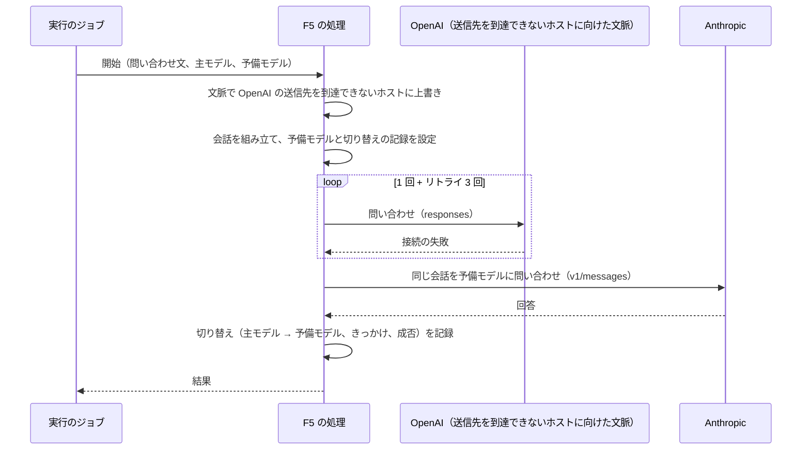

# ChangeSpec: F5 Model Fallbacks の代表シナリオを追加する

## 変更の目的

要件 F5 の代表シナリオ「主モデルが応答できないときに予備モデルで回答する」をデモ基盤に載せる。主モデル（OpenAI）が応答できない状況を再現し、予備モデル（Anthropic）で回答を得て、結果で応答したモデルと切り替えの経過（失敗したモデルとエラーの種類）が分かるようにする。あわせて、C2〜C5 が求める説明文、出典、コード断片、既定の入力での実行をそろえる。対応する要件は、要件定義書の F5、C2〜C5、C7 である。C7 では、失敗した試行と成功した試行の両方を Sentry のトレースで確認できることが、F5 の働きを確かめる手段になる。ただし、失敗した試行 1 回ずつの所要時間は分からない（RubyLLM の試行のイベントは瞬間のイベントで、リトライは 1 つの HTTP 呼び出しのイベントの内側で起きる）。分かるのは、主モデルへの 4 回の試行をまとめた所要時間と、試行ごとのプロバイダー、モデル、状態、トークン、コストである。この逸脱は、この ChangeSpec で許容する（要件定義書は変えない）。要件定義書が「機能設計で決める」とした再現の手段は、この ChangeSpec で決める。

## 現状

デモ定義 `config/demos.yml` の `model-fallbacks`（名前は Model Fallbacks）は、要約と出典 1 件（Error Handling）を持ち、説明文の本文を持たない。代表シナリオ `fall_back_to_another_provider`（主モデルが応答できないときに予備モデルで回答する）は処理（`handler`）を持たず、一覧とデモの画面で「準備中」と表示される。`docs/api-keys.md` と `.env.example` は、Model Fallbacks の主系を OpenAI、切替先を Anthropic と記載済みである。

代表シナリオ定義 `Demos::Scenario` は、`providers` に列挙したすべてのプロバイダーの設定値がそろったときだけ実行できると判定する。`models` は名前ごとに処理へキーワードで渡すので、主モデルと予備モデルを別の名前で持てる。処理は `ApplicationAction` の下に機能ごとの名前空間で置き、結果のハッシュを返し、例外はそのまま投げる。F1 の `ResponsesApi::AnswerInquiry` は、指示文つきの会話を 1 つ組み立てて 1 回問い合わせ、回答と応答したモデルを返す。デモの画面は処理のソースファイルをそのままコード断片として表示する。

実行のジョブ `Demos::RunJob` は、会話 ID を渡した `RubyLLM.workflow` の内側で処理を呼び、返り値を結果として成功を記録する。例外は `Demos::Run#fail_with!` が `FailureKinds` で失敗の種類と原因の候補に変換して記録し、プロバイダーの欄には代表シナリオの `providers` を「、」でつないで載せる。`FailureKinds` の表には、`Faraday::ConnectionFailed`（接続の失敗）、`Faraday::TimeoutError`（タイムアウト）、`RubyLLM::RateLimitError`（レート制限）などの行があり、`for(error)` が例外のインスタンスを `is_a?` で順に判定する。クラス名の文字列から種類を引く手段はない。

購読者 `Observability::RubyLLMSpanSubscriber` は、`chat.ruby_llm` を `chat <モデル>` のスパン（プロバイダー、要求したモデル、応答したモデル、トークン、コスト）に、`request.ruby_llm` を `POST <パス>` のスパン（プロバイダー、状態コード）に、`usage.ruby_llm` を `attempt chat <モデル>` のスパン（試行の状態、トークン、コスト）にする。計装のブロックが例外で終わると、そのスパンに `error.type` と `error.message` を載せて状態をエラーにする（テスト済み）。実行の画面の結果の表示部品は `text_answer`、`refund_decision`、`ticket_workflow`、`web_search_answer`、`speech`、`token_count`、`raw` がある。

テストは、`test/support/chat_helpers.rb` の `with_chat` が `RubyLLM.chat` だけを差し替える（`RubyLLM::Context#chat` は `Chat.new` を直接呼ぶので、この差し替えは効かない）。`test/support/screen_helpers.rb` の `with_openai_key` は OpenAI の設定値だけを固定し、`test_helper.rb` も OpenAI の偽の設定値だけを入れる。`dotenv-rails` はテスト環境でも `.env` を読むので、開発者の手元では Anthropic の設定値に実際のキーが入ったままテストが動き、`.env` のない CI では入らない。テストの補助は `test_helper.rb` が個別に `require_relative` で読む。

RubyLLM 2.0.0 の Model Fallbacks の仕様は次のとおりである（gem のソース、公式ガイド、2026-09-23 の実 API での確認による）。

- `Chat#with_fallbacks(*models, on:)` は、生成が失敗したときに順に試す予備モデルを、モデル ID の文字列または `RubyLLM::Model` で受け取る。切り替えはその 1 回の生成だけに効き、終わると会話は元のモデルに戻る（`chat.model` は主モデルのまま）。会話の履歴、指示文、ツール、スキーマは予備モデルに引き継がれる
- 既定で切り替えの対象になる例外は `RubyLLM::RateLimitError`、`RubyLLM::ServerError`、`RubyLLM::ServiceUnavailableError`、`RubyLLM::OverloadedError`、`Faraday::TimeoutError`、`Faraday::ConnectionFailed` である。認証の失敗（401）、不正なリクエスト（400）、入力の上限超過、モデルが見つからない、設定値の不足は対象でなく、そのまま例外になる。`on:` で対象を選べる
- 切り替えの前に、同じモデルへのリトライが先に行われる。HTTP 層の Faraday のリトライが、タイムアウト、接続の失敗、レート制限、サーバー側のエラー、サービス停止、過負荷を `max_retries`（既定 3）回まで、0.1 秒から 2 倍ずつ（ゆらぎ 0.5、上限 30 秒）の間隔でやり直す。429 の Retry-After が上限を超えると待たずに失敗する。切り替えは、リトライが尽きて例外が会話の層に上がってから起きる。主モデルへの物理的な試行は 1 + 3 = 4 回になる
- `before_fallback` と `after_fallback` のコールバックは `RubyLLM::Fallback` を受け取る。`from` と `to`（`RubyLLM::Model`。`id` と `provider` を持つ）、`error`（切り替えのきっかけの例外）、`attempt`（1 始まり）、`response`、`fallback_error`、`succeeded?`、`failed?` を持つ。`response` と `fallback_error` は `after_fallback` の時点で入り、`before_fallback` の時点ではどちらも `nil` なので、成否は `after_fallback` でしか読めない。`RubyLLM::Fallback` 自身の `provider` は設定時の値で、モデル ID の文字列で設定すると `nil` になる。プロバイダーは `from` と `to` から読む
- 予備モデルがすべて失敗すると、最後の予備モデルの例外が投げられる。主モデルの例外ではない
- 物理的な試行ごとに `usage.ruby_llm`（状態、トークン、コスト）が発行される。送信に至らなかった試行（接続の失敗）はトークン 0、コスト 0 になる。`response.tokens`、`response.cost`、`chat.tokens`、`chat.cost` は失敗した試行を含めて集計する。失敗した試行の使用量が分からないとき（サーバー側のエラーやタイムアウトなど、届いたかもしれない失敗）は、`cost.total` が `nil` になる。`chat.ruby_llm` は試行するモデルごとに発行され、主モデルの分は例外で終わる。`request.ruby_llm` はリトライを含む 1 回の HTTP 呼び出しの単位で、主モデルへの 4 回の試行（初回と 3 回のリトライ）は 1 つの request の内側に入る。失敗した試行の `usage.ruby_llm` は HTTP 層の内側で発行されるので request の内側に入り、成功した試行の分は応答を受け取った後に発行されるので request の外、chat の内側に入る
- `RubyLLM.context { |config| ... }` は、全体の設定の複製に上書きを加えた文脈を返し、`context.chat(model:)` はその設定で会話を作る。`openai_api_base` は OpenAI への送信先である。予備モデルへの切り替えは会話と同じ設定を使うので、文脈で OpenAI の送信先だけを変えれば、Anthropic の送信先は既定のままになる
- プロバイダーを付けないモデル ID は、登録簿のプロバイダーの優先順位（openai、anthropic、gemini、…）で解決される。`claude-haiku-4-5` は anthropic、azure、vertexai にあり、anthropic に解決される。`gpt-5-nano` は openai に解決される
- 実 API で確認したこと: OpenAI の送信先を `https://api.openai.invalid/v1` にした文脈の会話（主モデル `gpt-5-nano`、予備 `claude-haiku-4-5`）に問い合わせると、`Faraday::ConnectionFailed`（メッセージは `Failed to open TCP connection to api.openai.invalid:443 (getaddrinfo(3): Name or service not known)`）が 4 試行で約 0.8 秒のうちに起き、Anthropic への切り替えが約 2.4 秒で応答して、全体は約 3.2 秒だった。`response.model` は `claude-haiku-4-5-20251001`、トークンは入力 68 と出力 127、コストは約 0.0007 ドルだった。`.invalid` は RFC 2606 で予約されたトップレベルドメインで、RFC 6761 の 6.4 節はリゾルバーが否定応答（NXDOMAIN）を返すべきである（SHOULD）と定めている。この再現は、リゾルバーがこの定めに従い、HTTP プロキシ（`HTTPS_PROXY` などの環境変数。Faraday は既定で使う）を経由しないことを前提にする。前提が崩れると別の例外（`Faraday::SSLError` など）になり、既定の切り替えの対象でなければ切り替わらず、失敗の種類の表にもないのでアプリの不具合として報告される

### 関連ファイル

| ファイル | 役割 |
|---------|------|
| `config/demos.yml` | 10 機能のデモ定義と代表シナリオ定義 |
| `app/models/demos/catalog.rb`、`app/models/demos/scenario.rb`、`app/models/demos/demo.rb`、`app/models/demos.rb` | デモ定義の読み込み、実行可否の判定、処理の呼び出し、プロバイダーの表示名 |
| `app/helpers/demos_helper.rb`、`app/views/demos/_scenario.html.erb` | デモの画面。実行可否のバッジ、足りないプロバイダー名、コード断片 |
| `app/models/demos/run.rb` | 実行の記録。失敗の記録にプロバイダーの欄を載せる |
| `app/jobs/demos/run_job.rb` | 実行のジョブ。workflow を開き、処理を呼び、成否を記録する |
| `lib/failure_kinds.rb` | 失敗の種類と原因の候補の表 |
| `app/actions/application_action.rb` | 代表シナリオの処理の基底と、返り値の契約 |
| `app/actions/responses_api/answer_inquiry.rb` | F1 の処理。会話を 1 つ組み立てる書き方の前例 |
| `app/views/runs/_details.html.erb` | 実行の画面のうち状態で変わる部分。結果の表示部品と失敗の表示を描画する |
| `app/views/runs/results/_web_search_answer.html.erb` | 回答と一覧を並べる結果の表示部品。前例 |
| `app/helpers/runs_helper.rb` | 実行の画面のヘルパー |
| `app/subscribers/observability/ruby_llm_span_subscriber.rb` | 計装イベントをスパンにする購読者。変更しない |
| `test/support/chat_helpers.rb`、`test/support/screen_helpers.rb`、`test/test_helper.rb` | テストの補助。会話の差し替えと設定値の固定 |
| `test/actions/provider_tools/answer_with_web_search_test.rb` | 処理の単体テストの前例 |
| `test/models/demos/catalog_test.rb`、`test/lib/failure_kinds_test.rb` | デモ定義と失敗の種類の表の検証 |
| `test/jobs/demos/run_job_test.rb`、`test/models/demos/run_test.rb` | ジョブと実行の記録の検証。やり直しと失敗の記録の既存の検証 |
| `.github/workflows/ci.yml` | CI。`.env` がなく、プロバイダーの設定値は入らない |
| `test/controllers/demos_controller_test.rb`、`test/controllers/demos/runs_controller_test.rb`、`test/controllers/runs_controller_test.rb` | 画面と実行の指示の検証 |

## 変更内容

処理の流れは次のとおりである。主モデルへの送信は到達できないホストに向くため、失敗した試行では OpenAI に届かず課金も起きない。

- **追加**: F5 の代表シナリオの処理。問い合わせ文、主モデル、予備モデルを受け取る
  - 障害の再現。`RubyLLM.context` で `openai_api_base` を到達できないホスト `https://api.openai.invalid/v1` に上書きした文脈を作り、その文脈で主モデルの会話を組み立てる。ホストは処理の定数として持つ
  - 会話には、F1 と同じ趣旨のサポートデスクの指示文を付け、`with_fallbacks` に予備モデルを渡し、`after_fallback` で切り替えの経過を記録する。問い合わせ文を 1 回 `ask` する
  - 結果は、回答、応答したモデル（応答の `model`）、主モデルの識別子、再現に使った送信先、切り替えの経過の一覧からなる。経過の 1 件は、試行番号、切り替え元のプロバイダーとモデル、切り替え先のプロバイダーとモデル（どちらも記録の `from` と `to` から読む）、きっかけの例外のクラス名とメッセージ、予備モデルが応答したかどうかを持つ。切り替えが起きなければ一覧は空になる。予備モデルが 1 つの構成では、予備モデルの失敗は例外になって結果が残らないので、保存される経過の成否は常に「応答した」になる
  - 予備モデルも失敗したときは、その例外をそのまま投げる。ジョブが失敗として記録し、失敗の種類はその例外の種類、プロバイダーの欄は「OpenAI、Anthropic」になり、どちらの失敗かは示さない。主モデルへの送信は OpenAI に届かないので、失敗として記録される例外は予備モデル（Anthropic）のものである。原因の候補の文はプロバイダーを問わない既存の文のままで、レート制限の候補にある OpenAI の残高の注意は、この実行では当てはまらない。切り替えの経過は失敗の記録には残らない（記録に載せる場所がなく、Sentry のトレースで両方の試行を確認できる）
  - ジョブが再び動いたときは最初からやり直してよい（`retryable` は真）。やり直しで増えるのは問い合わせ 1 回と、それに伴う課金である
  - テストは `test/actions/` に置く。`RubyLLM.context` を差し替える補助を、`with_chat` と同じ `test/support/chat_helpers.rb` に加える（`test_helper.rb` の読み込みを増やさない）。補助は、設定のブロックに実際の設定の複製を渡して、テストが送信先の上書きを確かめられるようにし、返す文脈の `chat` は台本どおり答える偽物を返して、渡されたオプションを控える。偽物の会話は `with_instructions`、`with_fallbacks`、`after_fallback` を受け付けて控え、`ask` のときに控えたコールバックを切り替えの記録で呼ぶ。記録は `RubyLLM::Fallback` と同じ読み出し（`from`、`to`、`error`、`attempt`、`response`、`fallback_error`、`succeeded?`）を持つテスト用の値でよい（`RubyLLM::Fallback` を組み立てる手段は公開 API でない）
- **追加**: F5 の結果の表示部品（`result_kind` は `fallback_answer`）。応答したモデル、主モデルと再現に使った送信先、切り替えの経過、回答をこの順に表示する。切り替えの経過をこのデモの見どころとして回答より前に置き、長い回答に押し出されないようにする（実装後に画面で確かめて利用者が決めた）。経過の 1 件は、試行番号、切り替え元から切り替え先への行（プロバイダーとモデル）、エラーの種類（失敗の種類の表の名前と、例外のクラス名）、メッセージ、予備モデルが応答したかどうかを持つ。表にないクラス名はクラス名だけを表示する。経過が空のときは、切り替えが起きず主モデルが応答した旨を表示する
- **変更**: 失敗の種類の表 `FailureKinds` に、例外のクラス名の文字列から種類を引く手段を加える。判定は `for` と同じ順序と同じ継承の判定で、表にないクラス名、定義されていないクラス名、クラスでない定数の名前、`nil`、空の文字列では `nil` を返す。このファイルは Rails なしで読み込まれる（`bin/check_keys`）ので、ActiveSupport の `constantize` は使わず、Ruby の定数の参照と `NameError` の捕捉で書く。既存の `for` と `provider_call?` は変えない
- **変更**: テストの補助。`test_helper.rb` に、OpenAI と同じ形で Anthropic の偽の設定値を入れる。手元の `.env` の実際のキーに依存せず、差し替えの漏れた呼び出しが Anthropic に届いても認証で失敗するようにするためである。`with_openai_key` と同じ形で Anthropic の設定値を固定する補助を `screen_helpers.rb` に加え、F5 の画面のテストは両方の設定値を固定して行う
- **変更**: デモ定義 `config/demos.yml` の `model-fallbacks`
  - 役立つケースの本文。プロバイダーの障害やレート制限が起きても応答を続けたい場合に役立つこと。`with_fallbacks` に予備モデルを順に渡すと、生成が既定の対象の例外（レート制限、サーバー側のエラー、サービス停止、過負荷、タイムアウト、接続の失敗）で失敗したときに次のモデルで同じ会話を送り直すこと。認証の失敗、不正なリクエスト、入力の上限超過、モデル名の誤りでは切り替わらず、`on:` で対象を選べること。切り替えの前に同じモデルへのリトライ（`max_retries`、既定 3 回）が先に尽きること。レート制限で Retry-After が `retry_max_interval` を超えると待たずに失敗し、すぐ切り替わること。切り替えはその 1 回の生成だけで、次の問い合わせは主モデルに戻ること。予備モデルは別のプロバイダーでもよく、会話の履歴、指示文、ツール、スキーマが引き継がれるので、予備モデルがそれらに対応している必要があること。`before_fallback` で切り替え元、切り替え先、きっかけの例外、試行番号を、`after_fallback` でそれらに加えて成否を読めること。使用量とコストは失敗した試行を含めて集計され、使用量の分からない失敗（サーバー側のエラーやタイムアウト）が含まれると合計のコストは `nil` になること。このデモでは、主モデルの送信先を文脈（`RubyLLM.context`）で到達できないホストに向けて障害を再現しているので、Sentry のトレースに主モデルの失敗した試行（4 回）と予備モデルの成功した試行が並ぶこと。このデモの実行が失敗として記録されるのは予備モデル（Anthropic）も失敗したときで、失敗の表示のプロバイダーの欄には両方のプロバイダー名が出ること
  - 使わない場合に困ることの本文。例外を rescue して別のモデルの会話を組み立て直し、履歴、指示文、添付を相手のプロバイダーの形で送り直す処理を自分で書いて保守すること。リトライと切り替えの順序、ストリーミングの途中で失敗したときの扱い、試行ごとの使用量の集計、元のモデルに戻す処理も自分で決めること
  - 出典。Error Handling（RubyLLM。Model Fallbacks、Fallback Callbacks、Automatic Retries の節）、What's New in 2.0（RubyLLM。Model Fallbacks の節）、Connection, Logging and Contexts（RubyLLM。Timeouts & Retries の節は `retry_max_interval` と Retry-After の扱い、Contexts: Isolated Configurations の節は送信先の上書き）、Instrumentation and Observability（RubyLLM。Usage Events の節。試行ごとのイベント）の 4 件。プロバイダーの仕様に基づく説明はないので、プロバイダーの文書は含めない
  - 代表シナリオ `fall_back_to_another_provider` に、処理、プロバイダー（OpenAI と Anthropic）、モデル（`model: gpt-5-nano`、`fallback_model: claude-haiku-4-5`）、入力（`inquiry`: 顧客からの問い合わせ文。必須。既定値は架空の注文についての問い合わせ文で、F1 の既定値とは別の文）、結果の種類（`fallback_answer`）、やり直しの可否（真）を加える

### 新規に追加する責務の配置

| # | 責務 | コンテキスト | 配置先 | 所有するルール・閾値・派生値 |
|---|------|------------|--------|--------------------------|
| 1 | F5 の代表シナリオの処理（障害の再現、会話の組み立て、切り替えの記録、結果の組み立て） | デモ（Model Fallbacks） | 代表シナリオの処理（機能ごとの名前空間） | 再現に使う送信先（到達できないホスト）。経過として記録する項目 |
| 2 | F5 の結果の表示 | 実行の表示 | View | なし。エラーの種類の名前は責務 3 に従う |
| 3 | 例外のクラス名から失敗の種類を引く | 実行の失敗の分類 | 既存の失敗の種類の表 | `for` と同じ順序と継承の判定 |
| 4 | F5 のデモ定義（説明文、出典、既定の入力、主モデルと予備モデル） | デモ定義 | デモ定義（設定ファイル） | 既定の入力。主モデルと予備モデルの選択 |

結合強度評価は省略する。処理は F1 と同じ形でデモ基盤に呼ばれ、既存の結合点には触れない。新たに増える結合点は、表示部品が失敗の種類の表を例外のクラス名で引く 1 点で、公開のメソッド 1 つを通す Contract の強さ、同じアプリ内の別コンテキストの距離であり、不均衡は増えない。既存の失敗の表示は記録時に求めた名前を読むだけで、この表を描画時には引かないので、表の名前を変えると過去の F5 の結果の表示だけが変わる。これは許容する（結果にはクラス名だけを残し、名前は表に一元化する）。使い勝手の点検は省略する（自習用のデモで、操作者は利用者本人である）。ログ・記録要件への影響はない（個人情報、権限、状態の変更、既存ログの変更を含まない）。

## 採用した実装パターン

このリポジトリでは ADR を起票しない（利用者の決定）。採用案と理由だけを記す。

| # | 判断ポイント | 採用案 | 関連 ADR |
|---|------------|--------|---------|
| 1 | 主モデルが応答できない状況の再現手段（文脈で送信先を到達できないホストに向ける、アプリ内に 503 や 429 を返す偽の送信先を持つ、極端に短いタイムアウト、`on:` に独自の例外を指定して `before_request` で投げる） | 文脈で送信先を到達できないホストに向ける。処理が通常の RubyLLM のコードのまま書け、リゾルバーが `.invalid` に否定応答を返しプロキシを経由しない前提のもとで失敗の結果が決まり、失敗した試行は OpenAI に届かず課金されない。接続の失敗は既定の切り替えの対象で、トレースに失敗した request と試行のスパンが残る。偽の送信先は、ジョブがアプリ自身の URL を知る必要があり、デモのためだけの経路が増える。短いタイムアウトは、要求が OpenAI に届いている可能性があり（RubyLLM も課金されたかもしれない失敗として使用量を不明にする）、成否も決まらない。独自の例外は HTTP の試行を起こさないので、失敗した試行が観察情報に載らない | なし |
| 2 | リトライの扱い（既定の 3 回のまま、文脈で 0 回にして切り替えを直ちに起こす） | 既定のまま。実運用と同じ順序（リトライが尽きてから切り替え）をトレースの 4 つの試行で見せる。増える時間は約 0.8 秒である | なし |
| 3 | 切り替えの経過の取り方（`after_fallback` のコールバック、会話の使用量の内部の一覧、Sentry だけ） | `after_fallback`。切り替え元、切り替え先、きっかけの例外、試行番号、成否がそろう公開の API である。使用量の一覧は公開 API でなく、Sentry だけでは結果に残らない | なし |
| 4 | 予備モデルの指定（モデル ID の文字列、プロバイダーを明示した `RubyLLM::Model`） | モデル ID の文字列。`claude-haiku-4-5` は登録簿の優先順位で anthropic に解決される。`RubyLLM::Model` を渡す形はプロバイダーを明示できるが、コード断片が長くなる | なし |
| 5 | エラーの種類の表示（処理が失敗の種類の表を引いて記録する、表示部品がクラス名から引く） | 表示部品がクラス名から引く。処理はアプリの表を知らない RubyLLM のコードのままにする | なし |

## 影響範囲

- `config/demos.yml`: `model-fallbacks` の定義。一覧とデモの画面の表示が「準備中」から、OpenAI と Anthropic の設定値の有無に応じて「実行できる」または「設定値が足りない（足りないプロバイダー名）」に変わる
- 新規: 代表シナリオの処理のファイル、結果の表示部品、処理のテスト、`RubyLLM.context` を差し替えるテストの補助
- `lib/failure_kinds.rb`: クラス名から種類を引く手段の追加。`bin/check_keys` は `for` だけを使うので影響しない
- `test/test_helper.rb`: Anthropic の偽の設定値の追加。`test/support/screen_helpers.rb`: Anthropic の設定値を固定する補助の追加。`test/support/chat_helpers.rb`: `RubyLLM.context` を差し替える補助の追加
- `app/models/`、`app/jobs/`、`app/controllers/`、`app/helpers/runs_helper.rb`、`app/subscribers/observability/ruby_llm_span_subscriber.rb`、`app/views/runs/_details.html.erb`、`db/schema.rb`、`docs/api-keys.md`、`.env.example`: 変更なし。表示部品は既存の仕組みで名前から描画される
- Sentry でのトレースの形: ジョブの `invoke_agent` の下に、`chat gpt-5-nano`（状態エラー、`error.type` は `Faraday::ConnectionFailed`、プロバイダー openai）が 1 つあり、その子の `POST responses`（状態エラー）の子に `attempt chat gpt-5-nano` が 4 つ（失敗、トークン 0）ある。続いて `chat claude-haiku-4-5`（プロバイダー anthropic、応答したモデル、トークン、コスト）が 1 つあり、その子に `POST v1/messages`（200）と `attempt chat claude-haiku-4-5` 1 つ（成功）が並ぶ。HTTP 呼び出しのスパン（`POST`）を除くすべてのスパンの会話 ID は実行のものになる（購読者は HTTP 呼び出しのスパンに会話 ID を載せない。既存の扱い）。試行のスパンのトークンの属性（`ruby_llm.attempt.input_tokens`、`ruby_llm.attempt.output_tokens`）は、購読者は載せているが Sentry に保存されない。F5 に限らず全デモで同じで、原因（Sentry のデータスクラブの可能性が高い）の特定と対処は別の変更で扱う（実装後に利用者が決めた）。Sentry の Agents と Conversations の画面が失敗した chat をどう表示するか（LLM Calls の数、エラーの表示）は未確認で、実装後に画面で確かめて記録する。受け入れの判定は、画面の見え方ではなくスパンの名前、入れ子、属性で行う
- テスト
  - 処理: 文脈と会話の組み立て（送信先の上書き、主モデル、指示文、予備モデル、コールバック）、切り替えの経過の記録、切り替えが起きない場合、予備モデルの失敗が例外のまま伝わることの検証を、`RubyLLM.context` の差し替えで加える。プロバイダーを呼ぶ実行は、実際の画面と Sentry で確かめる
  - 失敗の種類の表: クラス名からの検索の検証を加える
  - カタログ: F5 の定義（プロバイダーが OpenAI と Anthropic、モデルが 2 つ、入力が `inquiry`、`retryable` が真、`result_kind` が `fallback_answer`）の検証を加える。モデルがプロバイダーに解決されることの検証は既存のテストが全代表シナリオを対象に行う
  - 画面: F5 の結果の表示（切り替え 1 件、切り替えなし、表にないクラス名、成否が偽の台本）、デモの画面の説明文と出典とコード断片と入力欄、片方または両方の設定値がないときの表示、実行の指示と空白の入力の拒否、設定値が足りないときの実行の指示の拒否の検証を加える
  - ジョブ: カタログの F5 の代表シナリオでジョブを通し、予備モデルの失敗（文脈の差し替えで、台本の会話が例外を投げる）が失敗の種類、プロバイダーの欄「OpenAI、Anthropic」、不具合としての報告なしで記録されることの検証を加える（F10 と F9a の前例と同じ形）。この検証が、デモ定義の `models` の名前と処理のキーワード引数の対応も確かめる。F5 の再実行の検証は新たに書かず、`retryable` が真の代表シナリオを最初からやり直す既存の検証と、カタログの `retryable` の検証で足りるとする

## 関連 ADR

- なし（このリポジトリでは ADR を起票しない）

## 受け入れ条件

「確認手段」の列は、その行をテストで検証するか、プロバイダーを呼ぶため実際の画面と Sentry で検証するかを示す。テストの補助の追加は本体のふるまいを変えないため、行を置かない。

| ID | 変更内容の項目 | 種類 | 条件 | 確認手段 |
|----|--------------|------|------|---------|
| AC-1 | 処理 | 正常 | 既定の入力で実行すると、実行が成功になり、結果に回答、`claude-haiku-4-5` で始まる応答したモデル、主モデル `gpt-5-nano`、再現に使った送信先、切り替えの経過 1 件（試行 1、openai の gpt-5-nano から anthropic の claude-haiku-4-5 へ、`Faraday::ConnectionFailed`、`api.openai.invalid` を含むメッセージ、予備モデルが応答した）が記録される。Sentry のトレースのスパンが「影響範囲」に書いた名前、入れ子、属性（失敗した chat と request の状態エラーと `error.type`、試行の状態とコスト、成功した chat のプロバイダー、応答したモデル、トークン、コスト）になり、HTTP 呼び出しのスパンを除くすべてのスパンの会話 ID が実行のものになる | 画面（Sentry のスパンの属性） |
| AC-2 | 処理 | 正常 | 会話は、`openai_api_base` を到達できないホストに上書きした文脈で、主モデルを指定して作られ、指示文と予備モデルが設定され、問い合わせ文が 1 回だけ渡る。コールバックが切り替えを通知すると、その切り替え元、切り替え先、例外のクラス名とメッセージ、試行番号、成否が結果の経過に記録される | テスト（文脈と会話を差し替える） |
| AC-3 | 処理 | 異常・拒否 | 予備モデルも失敗して問い合わせが例外を投げると、例外がそのまま伝わり、結果は返らず、切り替えの経過はどこにも残らない。カタログの F5 の代表シナリオでジョブを通すと、実行は失敗として記録され、失敗の種類はその例外の種類、プロバイダーの欄は「OpenAI、Anthropic」、メッセージは例外のもので、結果は `nil` のまま、不具合としては報告されない | テスト（処理は文脈と会話を差し替える。記録はジョブの検証） |
| AC-4 | 処理 | 境界 | 切り替えが 0 件（主モデルが応答した台本）のとき、経過は空で、応答したモデルは主モデルの応答のモデルになる。1 件のときは経過が 1 件になる。予備モデルは 1 つなので、2 件以上は起きない | テスト（文脈と会話を差し替える） |
| AC-5 | 処理 | 状態・権限 | 開始済みの実行でジョブが再び動くと、もう一度問い合わせて成功する | テスト（カタログの `retryable` が真であることと、既存のジョブの検証） |
| AC-6 | 表示 | 正常 | 成功した F5 の実行の画面に、応答したモデル、主モデルと再現に使った送信先、切り替えの経過の行（試行 1、openai の gpt-5-nano から anthropic の claude-haiku-4-5 へ、「接続の失敗」と `Faraday::ConnectionFailed`、メッセージ、予備モデルが応答した旨）と回答が表示され、応答したモデルと切り替えの経過（経過が空のときはその旨）は回答より前にある | テスト |
| AC-7 | 表示 | 異常・拒否 | 該当なし（表示は入力を受け取らず、失敗した実行では結果の表示部品は描画されない。既存の扱い） | |
| AC-8 | 表示 | 境界 | 経過が空の実行の画面では、切り替えが起きず主モデルが応答した旨が出て、経過の行は出ない。失敗の種類の表にないクラス名の経過は、クラス名だけが表示される。成否が偽の経過（台本の結果。予備モデルが 1 つの構成では保存されない）は、予備モデルが失敗した旨で表示される | テスト |
| AC-9 | 表示 | 状態・権限 | 該当なし（表示部品は成功した実行でだけ描画される。既存の扱い） | |
| AC-10 | 失敗の種類の表 | 正常 | `Faraday::ConnectionFailed` のクラス名から「接続の失敗」、`RubyLLM::RateLimitError` のクラス名から「レート制限」が引ける。判定は `for` と同じ順序と継承の判定である | テスト |
| AC-11 | 失敗の種類の表 | 異常・拒否 | 表にないクラス名（`RubyLLM::ToolCallParseError`）、定義されていないクラス名、クラスでない定数の名前（`RubyLLM::VERSION`）、`nil`、空の文字列では `nil` を返し、例外にならない | テスト |
| AC-12 | 失敗の種類の表 | 境界 | 該当なし（この項目は数値・件数・期間を扱わない） | |
| AC-13 | 失敗の種類の表 | 状態・権限 | 該当なし（表は状態を持たず、操作者は利用者本人だけである） | |
| AC-14 | デモ定義 | 正常 | OpenAI と Anthropic の設定値があるとき、一覧で Model Fallbacks が「実行できる」になり、デモの画面に説明文の本文、4 つの出典、`with_fallbacks` と `RubyLLM.context` を含むコード断片、既定の問い合わせ文が入った入力欄、有効な実行ボタンが出る。定義した主モデルは OpenAI に、予備モデルは Anthropic に解決される | テスト |
| AC-15 | デモ定義 | 異常・拒否 | Anthropic の設定値だけがないとき「設定値が足りない（Anthropic）」、OpenAI の設定値だけがないとき「設定値が足りない（OpenAI）」、両方ないとき「設定値が足りない（OpenAI、Anthropic）」になり、実行ボタンが無効になる。その状態で実行の指示を送っても、実行は記録されず、代表シナリオの欄に「設定値が足りない: Anthropic」のように足りないプロバイダー名が出る（既存の扱い） | テスト |
| AC-16 | デモ定義 | 境界 | 問い合わせ文が空白のとき、実行は記録されず、入力欄の下に「入力してください」が出る | テスト |
| AC-17 | デモ定義 | 状態・権限 | 該当なし（デモ定義は状態を持たず、操作者は利用者本人だけである） | |

### 決定した疑問

- F5 の実行が失敗したとき、失敗の表示のプロバイダーの欄は「OpenAI、Anthropic」になり、どちらの失敗かを示さない。C10 は原因の切り分けのためにプロバイダー名を求めている。この設計では、失敗として記録される例外は予備モデル（Anthropic）のものに限られる。そこで、説明文と失敗の記録の仕様にそのことを書いて許容する（2026-09-23、利用者の決定）。代表シナリオごとに失敗の記録のプロバイダーを上書きする仕組みを足す案は、実行の記録の既存の契約に手が入るので採らない
