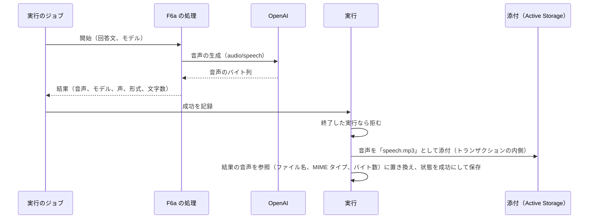

# ChangeSpec: F6a Speech Generation の代表シナリオを追加する

## 変更の目的

要件 F6a の代表シナリオ「回答文を読み上げる」をデモ基盤に載せ、サポートの回答文を音声にして、履歴から再生できるようにする。あわせて、C2〜C5 が求める説明文、出典、コード断片、既定の入力での実行と、C8 が求める「生成した音声を結果に含め、履歴から再生できる」ことをそろえる。対応する要件は、要件定義書の F6a、C2〜C5、C7、C8 である。C7 については、OpenAI の音声の生成が使用量（トークン）を返さず、登録簿にも単価がないため、RubyLLM のコストが不明になる。この実行は、C7 の「RubyLLM が単価を持たない操作では、コストが不明であることが分かる」を確かめる例になる。

生成した音声を実行に保存する仕組みは、この ChangeSpec で基盤に加える。F6b（動画の生成。xAI。Phase 3）は同じ仕組みで動画を保存する。同じデモの F6b は、この ChangeSpec の対象外で、準備中のまま残す。

## 現状

デモ定義 `config/demos.yml` の `video-and-speech`（名前は Video and Speech Generation）は、要約と出典 2 件（Text to Speech、Video Generation）を持ち、説明文の本文を持たない。代表シナリオ `speak_answer`（回答文を読み上げる）と `generate_product_video`（商品の紹介動画を生成する）はどちらも処理（`handler`）を持たず、「準備中」と表示される。

実行 `Demos::Run` は `has_many_attached :generated_files`（生成した音声と動画の添付）を宣言しているが、添付するコードも読むコードもない。Active Storage の添付の関連は `strict_loading: false` で宣言されるため、`strict_loading_by_default` が有効な実行でも、添付を後から読んで例外にならない（テスト環境で確認した）。Active Storage のサービスは開発環境が `local`（`storage/` の Disk）、テスト環境が `test`（`tmp/storage` の Disk）で、添付を配信するルートはある。

`Demos::Run#succeed!(result)` は、結果のハッシュをそのまま JSON の列 `result` に保存し、状態を成功にする。遷移の検証は状態が変わる更新でだけ走るため、失敗または取り消しの実行を成功にする更新は拒まれるが、成功した実行にもう一度成功を記録する更新は拒まれず、結果が上書きされる（ジョブは終了した実行では処理を呼ばないので、この経路は現状では通らない）。処理の返り値の契約は `ApplicationAction` のコメントにあり、「結果のハッシュを返す。承認で止まる処理は会話の記録を返す」と定める。ジョブ `Demos::RunJob#record` は、返り値が会話の記録なら承認待ちに、それ以外なら結果として成功を記録する。ハッシュの中身は見ない。

実行の画面の状態で変わる部分は、成功した実行で `result_kind` と同じ名前の結果の表示部品を描画する。実装済みの表示部品（`text_answer`、`refund_decision`、`ticket_workflow`、`raw`）は、結果の JSON と実行の列（`refund_decision` は承認の要求の控え）だけを読み、添付を読む部品はない。状態の取得（`Runs::StatusesController`）も同じ部品を返す。

購読者 `Observability::RubyLLMSpanSubscriber` は、`speech.ruby_llm` を `generate_content <モデル>` のスパン（`sentry.op` は `gen_ai.generate_content`、`ruby_llm.operation` は `speech`）にし、ペイロードの `tokens` と `cost` から使用量の属性を作る（`nil` の値は載せない）。プロンプトと応答の本文の属性（`gen_ai.input.messages` など）は `chat.ruby_llm` にだけ載せる。`usage.ruby_llm` は試行のスパン、`request.ruby_llm` は `http.client` のスパンにする。

RubyLLM 2.0.0 の音声の生成の仕様は次のとおりである（gem のソースと公式ガイドで確認した）。

- `RubyLLM.speak(input, model:, voice:, format:, provider_options:)` は `RubyLLM::Speech` を返す。`Speech` は音声のバイト列（`data`、`to_blob`）、モデルの識別子（`model`）、声（`voice`）、形式（`format`。既定は `mp3`）、MIME タイプ（`mime_type`。`mp3` は `audio/mpeg`）を持ち、`save(path)` でファイルに書ける。ブロックを渡すと、届いた順に `SpeechChunk` を受け取りながら、完全な `Speech` を返す
- `model:` を省くと設定の `default_speech_model`（既定は `gpt-4o-mini-tts-2025-12-15`）を使う。モデルは登録簿で解決する。登録簿の OpenAI の `gpt-4o-mini-tts` は、入出力のモダリティも単価も空である
- OpenAI では `audio/speech` に POST する。音声の実装は Chat Completions のプロトコルに定義され、`gpt-4o-mini-tts` の解決先である Responses のプロトコルがそれを継承する。ペイロードは `model`、`input`、`voice`（省くと `alloy`）、`response_format` に `provider_options` を合わせたもので、応答のバイト列をそのまま `Speech` にする。使用量（トークン）は付かないため、`Speech#tokens` は空で、`Speech#cost` の合計は `nil` になる
- `Speech#format` は初期化で `mp3` に既定化され、`nil` にならない。`RubyLLM::Video` と `RubyLLM::Image` は `to_blob`、`mime_type`、`model` を持つが `format` を持たず、`to_blob` は URL しか持たないときにプロバイダーからダウンロードする
- 計装は `speech.ruby_llm` のイベントで、ペイロードにプロバイダー、モデル、入力の本文（`input`）、声、形式、`provider_options`、ストリーミングの有無、トークン、コストを持ち、終了時に結果（`result`）、応答のモデル、声、形式、音声のバイト数（`audio_bytes`）を加える。生成は使用量の追跡（`track_usage(:speech)`）を通るので `usage.ruby_llm` も発行され、HTTP 層が `request.ruby_llm` を発行する
- OpenAI の音声の API（Create speech）の仕様は次のとおり。入力は文書上 4,096 文字まで。ただし `gpt-4o-mini-tts` には文書に載っていない 2,000 トークンの入力の上限があり、超えると 400（`Input of N tokens is over the maximum input limit of 2000 tokens`）で拒まれる。日本語は 1 文字が約 0.66 トークンなので、約 3,000 文字でこちらが先に効く（2026-09-22 に実 API で確認。文によって変わる）。モデルは `tts-1`、`tts-1-hd`、`gpt-4o-mini-tts`（と日付つきの識別子）。声は `gpt-4o-mini-tts` で `alloy`、`ash`、`ballad`、`coral`、`echo`、`fable`、`onyx`、`nova`、`sage`、`shimmer`、`verse`、`marin`、`cedar` の 13 種（`tts-1` 系は `marin`、`cedar` などを含まない 9 種）で、OpenAI は `gpt-4o-mini-tts` に `marin` か `cedar` を勧める。話し方の指示（`instructions`）は `tts-1` と `tts-1-hd` では使えない。形式は `mp3`（既定）、`opus`、`aac`、`flac`、`wav`、`pcm`。速さは 0.25〜4.0（既定 1.0）。日本語に対応する（声は英語に最適化されている）。OpenAI の利用規約は、AI が生成した音声であることを聞き手に明示することを求める

失敗の種類の表 `FailureKinds` には `RubyLLM::BadRequestError`（不正なリクエスト）の行がある。OpenAI が上限を超える入力を拒むと、この種類になる。

Active Storage の既定では、インラインで配信する MIME タイプ（`content_types_allowed_inline`）に `audio/mpeg` が含まれず、添付の URL は `Content-Disposition: attachment` で配信される。設定はどの環境にもない。

テストは、`test/models/demos/run_test.rb` が成功の記録（結果と終了日時）と終了した実行の書き換えの拒否を検証し、`test/subscribers/observability/ruby_llm_span_subscriber_test.rb` が `speech.ruby_llm` の使用量の属性を検証する。処理の単体テストの前例は F3 の `test/actions/tool_approval/answer_refund_request_test.rb` で、アプリ側のエージェントのクラスの `create!` と `find` を特異メソッドの差し替えで偽物にする。ジョブのテストは `RubyLLM.chat` を同じ手法で差し替え、`ensure` で戻す（テストはプロセス並列で走るので、戻し忘れは同じワーカーの他のテストに漏れる）。購読者のテストは、GenAI 以外の操作の共通の経路の例として `speech.ruby_llm` を使っている。

### 関連ファイル

| ファイル | 役割 |
|---------|------|
| `config/demos.yml` | 10 機能のデモ定義と代表シナリオ定義 |
| `app/models/demos/run.rb` | 実行の記録。成功の記録と添付の宣言。変更対象 |
| `app/models/demos/catalog.rb`、`app/models/demos/scenario.rb` | デモ定義の読み込み、処理の呼び出し |
| `app/jobs/demos/run_job.rb` | 実行のジョブ。返り値を実行に記録する |
| `app/actions/application_action.rb` | 代表シナリオの処理の基底と、返り値の契約。変更対象 |
| `app/actions/responses_api/answer_inquiry.rb` | F1 の処理。前例 |
| `app/subscribers/observability/ruby_llm_span_subscriber.rb` | 計装イベントをスパンにする購読者。変更対象 |
| `app/views/runs/_details.html.erb` | 実行の画面のうち状態で変わる部分 |
| `app/views/runs/results/_text_answer.html.erb` | F1 の結果の表示部品。前例 |
| `app/helpers/runs_helper.rb` | 実行の画面のヘルパー |
| `lib/failure_kinds.rb` | 失敗の種類と原因の候補の表。変更しない |
| `config/storage.yml`、`config/environments/development.rb`、`config/environments/test.rb` | Active Storage のサービス。変更しない |
| `config/application.rb` | アプリの設定。インラインで配信する MIME タイプを加える。変更対象 |
| `test/models/demos/run_test.rb` | 実行の検証 |
| `test/actions/tool_approval/answer_refund_request_test.rb` | 処理の単体テストの前例 |
| `test/subscribers/observability/ruby_llm_span_subscriber_test.rb` | 購読者の検証 |
| `test/models/demos/catalog_test.rb`、`test/controllers/demos_controller_test.rb`、`test/controllers/runs_controller_test.rb`、`test/controllers/runs/statuses_controller_test.rb` | デモ定義と画面の検証 |
| `test/support/screen_helpers.rb` | 画面のテストの補助 |

## 変更内容

処理の流れは次のとおりである。処理は RubyLLM の音声をそのまま結果に含め、実行がそれを添付に変える。

- **追加**: 生成物の保存。実行の成功の記録で、結果の最上位の値のうち生成物（`to_blob` と `mime_type` を持つもの。RubyLLM の `Speech`、`Video`、`Image` が当てはまる）を、`generated_files` に添付する。ファイル名は「キー.拡張子」で、拡張子は生成物が `format` を持てばその値（`Speech`）、なければ MIME タイプから求める（例: `speech.mp3`）。MIME タイプは生成物のもの。結果のその値は、参照（`filename`、`content_type`、`byte_size` の 3 項目）に置き換えて保存する。他の値は変えない。生成物がなければ現状と同じ。終了した実行（成功、失敗、取り消し）への記録は、添付する前に拒み、既存の遷移の検証と同じ種類の例外にして、ファイルも結果の変更も残さない。添付と結果の保存は 1 つのトランザクションで行い、途中で失敗すると例外がそのまま伝わり、添付の記録も結果も残らず、状態も変わらない（ディスクに書かれたファイルは残りうる）。`to_blob` がプロバイダーからのダウンロードになる生成物（`Video`、`Image` の URL 応答）では、そのダウンロードが成功の記録の中で起きる。F6b の ChangeSpec で、処理の側で先に取得するかを決める
- **変更**: 基底 `ApplicationAction` のコメントの契約に、結果の値に生成物を含めてよいこと、実行がそれを添付にして参照に置き換えることを加える。ジョブは変えない（返り値を実行に渡すだけ）
- **追加**: F6a の代表シナリオの処理。回答文と使うモデルを受け取り、`RubyLLM.speak` を声、形式、話し方の指示つきで呼ぶ。声は `marin`（OpenAI が `gpt-4o-mini-tts` で勧める声の 1 つ）、形式は `mp3`（ブラウザーで再生できる）、話し方の指示は `provider_options` の `instructions` で、サポートデスクの担当者として落ち着いた口調で読む旨を固定で渡す（OpenAI 固有の項目を使う例として）。結果は、音声（キー `speech`。`Speech` そのまま）、モデルの識別子、声、形式、回答文の文字数からなる。入力の長さは検証せず、上限を超える入力は OpenAI が拒み、既存の「不正なリクエスト」の失敗になる
  - ジョブが再び動いたときは最初からやり直してよい（`retryable` は真）。音声がもう一度生成され、費用ももう一度かかる（F1 と同じ扱い）
  - テストは `test/actions/` に置き、`RubyLLM.speak` を特異メソッドの差し替えで偽物にする。偽物は受け取った引数を控え、`RubyLLM::Speech.new(data:, model:, voice:, format:)` で作った音声を返す（この構築はプロバイダーを呼ばない）
- **追加**: F6a の結果の表示部品（`result_kind` は `speech`）。結果の参照のファイル名で添付を探し、再生の操作（`audio` 要素。添付のリダイレクト配信の URL を指す）、保存のリンク、モデル、声、形式、回答文の文字数、音声のバイト数（Rails の標準のヘルパーで整形する。`app/helpers/runs_helper.rb` は変えない）を表示する。「この音声は AI が生成したものである」と添える（OpenAI の利用規約が求める明示）。参照があるのに添付が見つからない実行では、「音声が見つからない」と出し、他の項目は表示する
- **変更**: Active Storage のインラインで配信する MIME タイプに `audio/mpeg` を加える（`config/application.rb`）。既定のままだと添付の URL が `Content-Disposition: attachment` で配信され、ブラウザーの `audio` 要素で再生できない可能性がある。再生と途中からの再生（Range）が実際に成立するかは、実装後にブラウザーで確かめる。成立しなければ、リダイレクト配信をプロキシ配信（`rails_storage_proxy_path`）に替える
- **変更**: 購読者。`speech.ruby_llm` のスパンに、声、形式、音声のバイト数を属性（`ruby_llm.speech.voice`、`ruby_llm.speech.format`、`ruby_llm.speech.audio_bytes`）として載せる。`capture_content` が真のとき、入力の本文を `gen_ai.input.messages`（役割は `user`、text の部分 1 つ）として載せる。応答は音声なので本文の属性には載せない。失敗したスパンは既存の扱い（失敗の状態と例外の内容）のままで、バイト数は載らない。共通の経路の既存の検証は、例を `image.ruby_llm` に替えて残す
- **変更**: デモ定義 `config/demos.yml` の `video-and-speech`
  - 役立つケースの本文。回答文や自動音声応答の文面を読み上げたい場合に役立つこと。`RubyLLM.speak` が音声のバイト列を持つ `Speech` を返し、`save` でファイルに、`to_blob` で Rails の添付にできること。声はプロバイダーの既定があり `voice:` で選べること、形式は `mp3` が既定で `format:` で選べること。OpenAI では `provider_options` の `instructions` で話し方を指示できること（`tts-1` 系では使えない）。ブロックを渡せば届いた順に再生できること。計装イベント `speech.ruby_llm` で所要時間が分かること。OpenAI の音声は使用量を返さず登録簿にも単価がないため、RubyLLM のコストが不明になり、Sentry にコストが載らないこと。OpenAI では入力は文書上 4,096 文字までだが、`gpt-4o-mini-tts` には文書に載っていない 2,000 トークンの上限があり、日本語では約 3,000 文字で先に効くこと（文書に書かれていない制約が実在する例として、実測の日付を添えて書く）。日本語に対応すること（声は英語に最適化されている）。AI が生成した音声であることを聞き手に明示する必要があること。動画の生成については、F6b の実装時に本文を加える
  - 使わない場合に困ることの本文。プロバイダーの音声 API を直接呼ぶと、エンドポイント、パラメーターの名前（声、形式）、バイナリの応答の受け取り、ストリーミング、エラーの変換を自分で書いて保守すること。プロバイダーを替える（ElevenLabs、Gemini、Deepgram など）と要求と応答の形が変わり、書き直しになること。RubyLLM では `model:` を替えるだけで同じ `Speech` が返ること
  - 出典。Text to Speech（RubyLLM。Basic Speech Generation、Voices、Formats、Style の節）、What's New in 2.0（RubyLLM。Video and Speech Generation の節）、Text to speech（OpenAI のガイド。声、言語、形式、話し方の指示、明示の規約）、Create speech（OpenAI の API リファレンス。入力の上限とパラメーター）の 4 件に、既存の Video Generation（RubyLLM）を残す。OpenAI の 2 件は、声、形式、上限がプロバイダーの仕様に基づくため加える
  - 代表シナリオ `speak_answer` に、処理、プロバイダー（OpenAI）、モデル（`model: gpt-4o-mini-tts`）、入力（`text`: 読み上げる回答文。必須。既定値は、架空の EC サイトのサポートデスクが顧客に送る、配送の遅れを詫びて次の手順を案内する数文の回答文）、結果の種類（`speech`）、やり直しの可否（真）を加える

### 新規に追加する責務の配置

| # | 責務 | コンテキスト | 配置先 | 所有するルール・閾値・派生値 |
|---|------|------------|--------|--------------------------|
| 1 | 生成物の保存（結果の生成物を添付にし、参照に置き換える） | デモ基盤（実行） | Model（実行） | 生成物の判別（`to_blob` と `mime_type` を持つ）。ファイル名の規則（キー.拡張子。拡張子は `format` があればその値、なければ MIME タイプから）。参照の項目（`filename`、`content_type`、`byte_size`）。終了した実行の拒否。添付と保存の原子性 |
| 2 | F6a の代表シナリオの処理（音声の生成と結果の組み立て） | デモ（Video and Speech） | 代表シナリオの処理（機能ごとの名前空間） | 声、形式、話し方の指示。結果の項目と文字数 |
| 3 | F6a の結果の表示（再生、保存、AI 生成の明示） | 実行の表示 | View | なし。項目は責務 1 と 2 に従う |
| 4 | 音声のイベントの属性 | 観測 | 購読者（既存） | 属性の名前。本文を載せる条件（`capture_content`） |

## 採用した実装パターン

このリポジトリでは ADR を起票しない（利用者の決定）。採用案と理由だけを記す。

| # | 判断ポイント | 採用案 | 関連 ADR |
|---|------------|--------|---------|
| 1 | 生成物を実行に保存する方法（結果の中の生成物を実行が添付に変える、処理が実行に直接添付する、バイト列を結果の JSON に入れる） | 実行が添付に変える。処理は RubyLLM の `Speech` を返すだけで、デモ基盤の型も実行も知らずに済み、コード断片が RubyLLM のコードのままになる。処理が実行に添付するには実行を渡す必要があり、契約が変わる。バイト列を JSON に入れるのは、列の大きさと再生の経路の点で不適である | なし |
| 2 | 変換の置き場所（実行の成功の記録、ジョブの記録） | 実行。何を保持するかは実行の責務で、ジョブは返り値を渡す経路に留める。承認待ちの記録（`await_approval!`）が会話の記録から控えを作るのと同じ置き方である | なし |
| 3 | 結果から添付を指す方法（キーから作ったファイル名、添付の ID） | ファイル名。表示部品は結果のキーから探せ、添付の ID を結果に写す必要がない。同じキーの生成物は 1 つの実行に 1 つである | なし |
| 4 | 声と話し方の指示（処理の固定値、利用者の入力） | 固定値。要件の入力は回答文だけで、声の選択はコード断片で読める。入力を増やすと、声の名前の検証が要る | なし |

## 結合への影響

| # | 結合点 | 変更前 強さ/距離 | 変更後 強さ/距離 | 備考 |
|---|--------|----------------|----------------|------|
| 1 | 実行 → 生成物の型（`to_blob`、`mime_type`、任意の `format`。RubyLLM の `Speech`、`Video`、`Image` の公開 API） | なし（新規） | Contract(1)/異システム(4) OK | メソッドの有無で判別し、RubyLLM のクラス名は参照しない |
| 2 | ジョブ、実行 ⇔ 処理（契約: 結果の値に生成物を含めてよい） | Contract(1)/異コンテキスト(3) OK | Contract(1)/異コンテキスト(3) OK | 契約を基底のコメントに足す。処理の側にデモ基盤の型は現れない |
| 3 | F6a の表示 → 実行の参照の項目名（ファイル名、MIME タイプ、バイト数） | なし（新規） | Model(2)/異コンテキスト(3) OK | 項目名は実行が決める。F3 の控えの項目名と同じ形 |
| 4 | F6a の表示 ⇔ F6a の処理（共有知識: 結果の項目名） | なし（新規） | Model(2)/異コンテキスト(3) OK | F1、F10 と同じ形と距離 |
| 5 | 購読者 → `speech.ruby_llm` のペイロード | Contract(1)/異システム(4) OK | Contract(1)/異システム(4) OK | 公開されたイベントの項目だけを読む |

不均衡が増える結合点はない。

使い勝手の点検は省略する（自習用のデモで、操作者は利用者本人である）。

## 影響範囲

- `config/demos.yml`: `video-and-speech` の定義。一覧とデモの画面の表示が「準備中」から、OpenAI の設定値の有無に応じて「実行できる」または「設定値が足りない（OpenAI）」に変わる。F6b の代表シナリオは準備中のまま
- 新規: 代表シナリオの処理のファイル、結果の表示部品
- `app/models/demos/run.rb`: 成功の記録での生成物の添付と参照への置き換え
- `app/actions/application_action.rb`: コメントの契約
- `app/subscribers/observability/ruby_llm_span_subscriber.rb`: `speech.ruby_llm` の属性
- `config/application.rb`: インラインで配信する MIME タイプ
- `app/jobs/demos/run_job.rb`、`app/models/demos/scenario.rb`、`app/controllers/`、`app/helpers/runs_helper.rb`、`app/views/runs/_details.html.erb`、`lib/failure_kinds.rb`、`config/storage.yml`、`db/schema.rb`: 変更なし。添付のテーブルは Phase 0 で作成済み。承認待ちの記録（`await_approval!`）と失敗の記録（`fail_with!`、`fail_abandoned!`）は生成物を扱わず、変えない。ワーカーの異常終了で失われた実行には添付は作られない
- 添付の失敗は、ジョブが例外を受けて失敗として記録し、プロバイダーの呼び出しの失敗ではないのでアプリの不具合として報告する（既存の扱い）
- 生成した音声は `storage/`（開発環境）に残り、消さない（履歴から再生するため）。1 回の実行の音声は数百 KB である
- 他の ChangeSpec との関係。`move-sentry-links-above-run-result.md` は `app/views/runs/_details.html.erb` の順序と結果の枠（`data-run-result`）を変え、結果の表示部品は変えない。`add-f9a-token-counting.md` は `config/demos.yml` の別の項目と、別の処理と表示部品を足す。3 件が共通して加筆するのは、`config/demos.yml`（別の項目）、`test/controllers/runs_controller_test.rb`、`test/controllers/runs/statuses_controller_test.rb`、`test/models/demos/catalog_test.rb`、`test/controllers/demos_controller_test.rb` で、いずれも別の検証を足すだけなので、どの順に実装しても衝突は加筆の重なりに留まる。実装順は development-start の実装台帳で決める
- Sentry でのトレースの形: ジョブの `invoke_agent` の下に `generate_content gpt-4o-mini-tts` のスパンがあり、その下に試行のスパンと `http.client`（`POST audio/speech`）がある。トークンとコストの属性はない。入力の本文が載る。実装後に画面で、コストが表示されないこと（Sentry の推定も出ないこと）を確かめる。Sentry が音声のモデルのコストを推定して表示した場合は、その値が RubyLLM の値ではないことを説明文に書く
- テスト
  - 実行: 生成物を含む結果の成功の記録（添付のファイル名と MIME タイプ、参照への置き換え、他の値の保持）、`format` のない生成物の拡張子、生成物が複数の結果、生成物のない結果（既存）、終了した実行（成功済みを含む）への拒否で添付も結果の変更も残らないこと、添付の途中の失敗で添付の記録と結果が残らないことの検証を加える
  - 処理: `RubyLLM.speak` の呼び出しの引数と、結果の組み立ての検証を、`RubyLLM.speak` の差し替えで加える。プロバイダーを呼ぶ実行は、実際の画面と Sentry で確かめる
  - 購読者: 声、形式、バイト数の属性と、本文の属性の有無（`capture_content` の真偽）の検証を加える。共通の経路の既存の検証は例を `image.ruby_llm` に替える
  - カタログ: F6a の定義（プロバイダーが OpenAI、入力が `text`、`retryable` が真、`result_kind` が `speech`）と、F6b が準備中のままであることの検証を加える
  - 画面: F6a の結果の表示（再生の操作、保存のリンク、項目、AI 生成の明示、添付が見つからないとき）、状態の取得の応答、デモの画面の説明文と出典とコード断片と入力欄、空白の入力の拒否の検証を加える。添付は `ActiveStorage::Blob.create_and_upload!` などで作る

## 関連 ADR

- なし（このリポジトリでは ADR を起票しない）

## 受け入れ条件

「確認手段」の列は、その行をテストで検証するか、プロバイダーを呼ぶため実際の画面と Sentry で検証するかを示す。

| ID | 変更内容の項目 | 種類 | 条件 | 確認手段 |
|----|--------------|------|------|---------|
| AC-1 | 生成物の保存 | 正常 | 最上位の値に生成物を 1 つ含む結果で成功を記録すると、`generated_files` に「キー.形式」のファイル名と生成物の MIME タイプで添付され、保存された結果ではその値がファイル名、MIME タイプ、バイト数の参照に置き換わり、他の値はそのまま残り、状態は成功で終了日時が記録される | テスト |
| AC-2 | 生成物の保存 | 異常・拒否 | 生成物が 2 つあり 2 つ目の添付の保存が例外になると、例外がそのまま伝わり、1 つ目を含めて添付の記録は残らず、結果は保存されず、状態は実行中のままである。ジョブ経由では失敗として記録され、アプリの不具合として報告される | テスト（ストレージの保存を差し替える） |
| AC-3 | 生成物の保存 | 境界 | 生成物を含まない結果は現状どおり保存され、添付は作られない。生成物を 2 つ含む結果では、2 つとも添付され、2 つとも参照に置き換わる | テスト |
| AC-4 | 生成物の保存 | 状態・権限 | 成功、失敗、取り消しのいずれかで終了した実行に、生成物を含む結果で成功を記録しようとすると、既存の遷移の検証と同じ種類の例外で拒まれ、添付は作られず、結果も状態も変わらない | テスト |
| AC-5 | 処理 | 正常 | 既定の入力で実行すると、実行が成功になり、`speech.mp3`（`audio/mpeg`）が添付され、結果にモデルの識別子、声 `marin`、形式 `mp3`、回答文の文字数、音声の参照が記録される。Sentry のトレースに `invoke_agent` の下の `generate_content gpt-4o-mini-tts`、試行、`http.client`（`POST audio/speech`）のスパンがあり、コストの属性はなく、入力の本文が載る | 画面 |
| AC-6 | 処理 | 正常 | `RubyLLM.speak` は回答文、モデル、声 `marin`、形式 `mp3`、話し方の指示を含む `provider_options` で 1 回呼ばれ、返った音声がそのまま結果の音声の値になり、モデル、声、形式は返った音声のもの、文字数は回答文の文字数になる | テスト（`RubyLLM.speak` を差し替える） |
| AC-7 | 処理 | 異常・拒否 | 音声の生成が失敗すると、例外がそのまま伝わり、結果は返らない。2,000 トークンを超える回答文（日本語で約 3,000 文字）では OpenAI が拒み、実行は「不正なリクエスト」の失敗として記録され、添付は作られない | テスト（差し替え）と画面（日本語 3,500 文字程度） |
| AC-8 | 処理 | 境界 | 2,000 トークンに収まる長めの回答文（日本語 1,500 文字程度）は生成され、添付される | 画面 |
| AC-9 | 処理 | 状態・権限 | 開始済みの実行でジョブが再び動くと、音声をもう一度生成して成功する。成功した実行ではジョブは何もしない（既存） | テスト（カタログの `retryable` が真であることと、既存のジョブの検証） |
| AC-10 | 表示 | 正常 | 成功した F6a の実行の画面に、添付の URL を指す再生の操作、保存のリンク、モデルの識別子、声、形式、文字数、バイト数、AI が生成した音声である旨が表示される。状態の取得の応答も同じ内容を返す | テスト |
| AC-10a | 表示 | 正常 | 既定の入力で実行した音声が、実行の画面のブラウザーで再生でき、途中からの再生もできる。添付の URL の応答はインラインで配信される | 画面 |
| AC-10b | 契約（基底のコメント） | 正常 | 該当なし（コメントの変更で、ふるまいを持たない。生成物を含む結果の扱いは AC-1〜AC-4 で検証する） | |
| AC-10c | 契約（基底のコメント） | 異常・拒否 | 該当なし（同上） | |
| AC-10d | 契約（基底のコメント） | 境界 | 該当なし（同上） | |
| AC-10e | 契約（基底のコメント） | 状態・権限 | 該当なし（同上） | |
| AC-11 | 表示 | 異常・拒否 | 該当なし（表示は入力を受け取らず、失敗した実行では結果の表示部品は描画されない。既存の扱い） | |
| AC-12 | 表示 | 境界 | 結果に音声の参照があるのに、そのファイル名の添付がない実行の画面では、「音声が見つからない」と出て、再生の操作は出ず、他の項目は表示される | テスト |
| AC-13 | 表示 | 状態・権限 | 該当なし（表示部品は成功した実行でだけ描画される。既存の扱い） | |
| AC-14 | 購読者 | 正常 | `speech.ruby_llm` のスパンに、`capture_content` が真のとき、入力の本文が `gen_ai.input.messages`（役割 `user`、text の部分）として載り、声、形式、音声のバイト数の属性が載る。既存の `sentry.op`、モデル、プロバイダーの属性は変わらない | テスト |
| AC-15 | 購読者 | 異常・拒否 | 失敗した音声の生成のスパンは、既存の扱いで失敗の状態と例外の内容を持ち、バイト数の属性は載らない | テスト |
| AC-16 | 購読者 | 境界 | 該当なし（属性は本文の長さで扱いを変えない） | |
| AC-17 | 購読者 | 状態・権限 | `capture_content` が偽のとき、本文は載らず、声、形式、バイト数は載る | テスト |
| AC-18 | デモ定義 | 正常 | OpenAI の設定値があるとき、一覧で Video and Speech Generation が「実行できる」になり、デモの画面に説明文の本文（2,000 トークンの上限と実測の日付を含む）、5 つの出典、`RubyLLM.speak` を含むコード断片、既定の回答文が入った入力欄、有効な実行ボタンが出る。定義したモデルは OpenAI のモデルに解決される。F6b の代表シナリオは「準備中」のまま | テスト |
| AC-19 | デモ定義 | 異常・拒否 | OpenAI の設定値がないとき、一覧とデモの画面で「設定値が足りない（OpenAI）」になり、実行ボタンが無効になる | テスト |
| AC-20 | デモ定義 | 境界 | 回答文が空白のとき、実行は記録されず、入力欄の下に「入力してください」が出る | テスト |
| AC-21 | デモ定義 | 状態・権限 | 該当なし（デモ定義は状態を持たず、操作者は利用者本人だけである） | |

### 未解決の疑問

- なし
