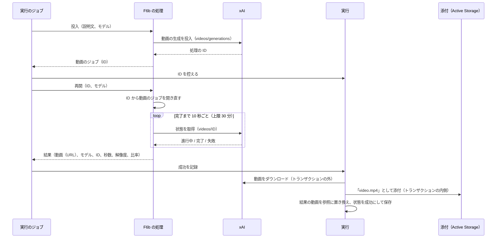
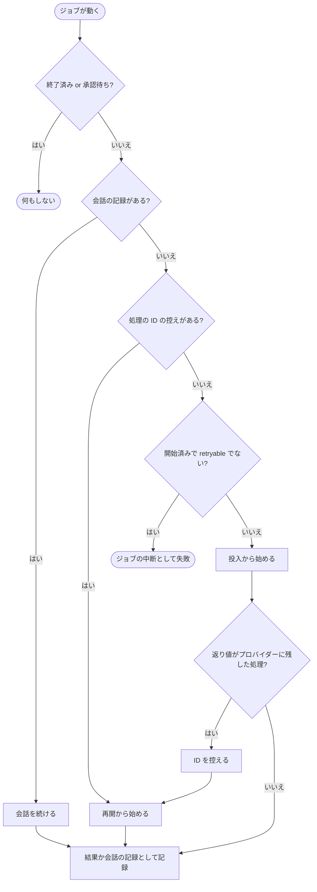

# ChangeSpec: F6b Video Generation の代表シナリオを追加する

## 変更の目的

要件 F6b の代表シナリオ「商品の紹介動画を生成する」をデモ基盤に載せ、商品の説明文から xAI で短い動画を生成し、完成後に履歴から再生できるようにする。対応する要件は、要件定義書の F6b、C2〜C5、C7〜C10 である。F6b は結果が後から届く代表シナリオなので、C9 が求める「利用者が画面を離れても結果は履歴に届く」「アプリの停止中にプロバイダー側の処理が完了した場合、次回の起動後に履歴へ届く」を成り立たせる基盤（プロバイダーに残した処理の ID の控えと、そこからの再開）が要る。

この基盤は、同時に作成中の F8 の ChangeSpec（`add-f8-deep-research.md`）が同じ設計（ID を文字列の列に控え、同じジョブの中で完了を待ち、ジョブが再び動いたときは控えから再開し、異常終了で失われた実行はジョブを投入し直す）で定義している。F6b と F8 のどちらを先に実装しても、先に実装した側が基盤を加え、後の側はそれを使う。F4 の ChangeSpec（`add-f4-batches.md`）は同じ TODO を別の設計（JSON の控え、1 分ごとに別のジョブで状態を確かめる、異常終了は失敗のまま）で解消すると書いている。統一は利用者が決めた（「未解決の疑問」）。

要件からの逸脱を 2 点、この文書で許容する（要件定義書は変えない）。3.2 は「結果が後から届く機能では 1 回の実行が投入と回収とで複数のトレースに分かれる」とするが、F6b は投入から回収までを同じジョブで行うので、中断されなければ 1 つのトレースになる。C7 については、xAI の動画の生成が RubyLLM のチャットのイベントを発行せず、トークン数とコストがどのイベントにも載らない。Sentry の Agents の画面では LLM Calls が 0 になり、プロンプトは投入のスパンの属性で読む。コストは、RubyLLM のモデルの登録簿に単価がないため RubyLLM の値が不明になる（C7 の「単価を持たない操作」の例。F6a に続く 2 例目）。

## 現状

デモ定義 `config/demos.yml` の `video-and-speech` は、F6a の実装で役立つケースと使わない場合に困ることの本文を持ち、本文の末尾に「動画の生成（`RubyLLM.animate`）の説明は、商品の紹介動画の代表シナリオとあわせて用意する」とある。出典は 5 件で、そのうち Video Generation（RubyLLM）が動画の出典である。代表シナリオ `generate_product_video`（商品の紹介動画を生成する）は名前だけで処理（`handler`）を持たず、「準備中」と表示される。

実行 `Demos::Run` の状態は `running`、`awaiting_approval`、`succeeded`、`failed`、`cancelled` で、遷移の検証は状態が変わる更新でだけ行われる（状態を変えない更新は検証の対象にならず、終了した実行や承認待ちの実行の他の列を書き換えても例外にならない）。承認待ちは `chat_id` と `approval_requests` で会話の記録を控えるが、プロバイダーに残した処理を控える列はない。`succeed!(result)` は、結果の最上位の値のうち生成物（`to_blob` と `mime_type` を持つもの）を、トランザクションの内側で `to_blob` を読んで添付し、参照（`filename`、`content_type`、`byte_size`）に置き換える。コメントに「URL しか持たない `Video` や `Image` はそのトランザクションの中でダウンロードする。動画のシナリオを実装するときに、処理の側で先に取得するかを決める」という TODO がある。`fail_abandoned!` は、ワーカーの異常終了で失われたジョブの実行を、`running` であれば「ワーカーの異常終了」として失敗にする。

ジョブ `Demos::RunJob#perform` は、終了した実行と承認待ちの実行では何もせず、`chat_id` があれば会話を続け（`scenario.resume`）、なければ処理を呼ぶ（`scenario.perform`）。`started_at` があり、代表シナリオが `retryable` でなく、会話の記録もない実行は、「ジョブの中断」として失敗にする。ここに「プロバイダー側に処理を預ける最初の代表シナリオ（F4、F6b、F8）を実装するときに、会話を続けるのと同じ方法でプロバイダー側の記録から続ける」という TODO がある。`started_at` は会話を続けるときだけ保ち、それ以外は更新する（Sentry のトレースのリンクの時刻に使う）。ジョブは 1 回の実行につき 1 つのワークフロー（`RubyLLM.workflow`。会話 ID を渡す）を開き、その内側のトレース ID を実行に加える。返り値が会話の記録なら承認待ちに、それ以外は `succeed!` に渡す。処理の返り値の契約は `ApplicationAction` のコメントにあり、「結果のハッシュを返す。値に生成物を含めてよい。承認で止まる処理は会話の記録を返し、`decide` と `resume` を持つ」と定める。代表シナリオ `Demos::Scenario` は `perform` に入力と `models` の値をキーワードで渡し、`decide` と `resume` は引数をそのまま処理に渡す。

購読者 `Observability::RubyLLMSpanSubscriber` は、`video.ruby_llm`（`RubyLLM.animate` の全体）を `generate_content <モデル>` のスパンにし、`video_job.ruby_llm`（投入）は GenAI の操作を持たない素のスパン `video_job <モデル>` にする。素のスパンの属性は `ruby_llm.operation`、プロバイダー、モデルと、相関の属性（`gen_ai.agent.name`、`gen_ai.conversation.id`）で、プロンプトの本文もジョブの ID も載らない。`request.ruby_llm` は `http.client` のスパン（メソッドと URL のパス）になる。

失敗の種類の表 `FailureKinds` は、`RubyLLM::Error` の下位の種類（認証、不正なリクエスト、レート制限など）と、設定値の不足、モデルが見つからない、Faraday のタイムアウトと接続の失敗を持つ。基底の `RubyLLM::Error` の行はなく、表にない例外は種類が例外のクラス名になり、原因の候補は出ない。表にない `RubyLLM::Error` の下位には `ToolCallParseError`、`UnsupportedAttachmentError`、`UnsupportedServerToolError` があり、RubyLLM は表にない HTTP のステータス（404、409、422 など）も基底の `RubyLLM::Error` にする。`test/lib/failure_kinds_test.rb` は `ToolCallParseError` の分類が `nil` であることを検証している。`provider_call?` は `RubyLLM::Error` ならプロバイダーの呼び出しの失敗とみなし、アプリの不具合として報告しない。Faraday の 4xx の例外（`Faraday::ClientError` とその下位）は表になく、`provider_call?` も偽になる。

Active Storage のインラインで配信する MIME タイプは、Rails の既定（画像と PDF）に F6a で `audio/mpeg` を加えたもので、`video/mp4` は含まれない。含まれない MIME タイプの添付の URL は `Content-Disposition: attachment` で配信される。`test/controllers/runs_controller_test.rb` は、音声の添付がインラインで配信され、Range の要求に 206 で応えることを検証している。

実行の画面の状態で変わる部分（`app/views/runs/_details.html.erb`）は、実行中に「実行を指示してから N 秒」と、ジョブのワーカーの案内を出す。プロバイダー側の処理に関する表示はない。F6a の結果の表示部品 `_speech.html.erb` は、結果の参照のファイル名で添付を探し、`audio` 要素で再生する。

RubyLLM 2.0.0 の動画の生成の仕様は次のとおりである（gem のソースと公式ガイドで確認した）。

- `RubyLLM.animate(prompt, model:, provider_options:)` は投入から完了までを待って `RubyLLM::Video` を返す。`RubyLLM.animate_later` は同じ引数で投入だけを行い、`RubyLLM::VideoJob` をすぐ返す。動画の生成はどのプロバイダーでも非同期で、`animate` も内部では `animate_later` と `wait` である
- `VideoJob` は `id`（プロバイダーの処理の ID）、`status`（`:pending`、`:completed`、`:failed`）、`pending?`、`done?`、`completed?`、`failed?`、`model`、`error`、`raw` を持つ。`refresh` はプロバイダーに状態を問い合わせ、`wait(timeout:, interval:)` は `interval` 秒待ってから `refresh` を繰り返し、`timeout` 秒で `RubyLLM::Error`（`Video generation timed out after N seconds`）を投げる。失敗した処理では `wait` と `video` が `RubyLLM::Error`（`Video generation failed: <理由>`）を投げる。既定は設定の `video_generation_timeout`（600 秒）と `video_generation_poll_interval`（5 秒）。`video` は完了後に `Video` を返す。xAI の `video` は `raw`（状態の応答）から動画を組み立てるので、開き直した処理は `:pending` で作って `wait` に状態を取らせる必要がある
- ID から `VideoJob` を開き直す公開 API はない（`Batch.find` と `ResearchJob.find` はあるが `VideoJob.find` はない）。`VideoJob.new(id:, protocol:, model:)` はプロトコルのインスタンスを要し、ガイドに載っていない。プロトコルは `RubyLLM::Models.resolve(model_id, provider:)` が返すプロバイダーの `protocol_for(model, operation: :animate)`（公開のメソッド）で得たクラスを `new(provider, model)` して作る。RubyLLM 自身の `Provider#animate_later` は非公開の `resolve_protocol` を使い、設定の `xai_protocol` を先に見る点だけが違う。xAI は `protocol_for` を上書きしておらず、既定の経路も同じ設定を見るので、結果は同じになる
- `Video` は `url`、`data`、`mime_type`、`model`、`duration`、`raw` を持ち、`format` を持たない。`to_blob` は `data` があればそれを、なければ `url` からダウンロードして返す。ダウンロードは計装のない素の接続（`Transport::Connection.basic`。`raise_error` つき）で、`request.ruby_llm` を発行せず、結果を保持しないので 2 回呼ぶと 2 回ダウンロードする。失敗は Faraday の例外（4xx は `Faraday::ClientError` の下位、5xx は `Faraday::ServerError`）になる
- xAI では `videos/generations` に POST し、応答の `request_id` を処理の ID にする。状態は `videos/<id>` への GET で、`done` を完了、`failed` と `expired` を失敗（理由は応答の `error`、なければ状態の名前）、それ以外を進行中にする。完了した処理の `video` は、応答の `video.url` と `video.duration`、`model` から作る `Video`（MIME タイプは `video/mp4` 固定）である。`provider_options` はペイロードにそのまま合わさる
- モデルを省くと設定の `default_video_model`（既定は `grok-imagine-video-1.5`）を使う。アプリの登録簿は `ruby_llm_models` テーブルから読まれ、xAI の `grok-imagine-video-1.5` と `grok-imagine-video` は単価が空である（開発 DB で確認した）。登録簿のメタデータの `context_window` は 1024 だが、プロンプトの上限として使われてはいない
- 計装は、投入が `video_job.ruby_llm`（ペイロードにプロバイダー、モデル、プロンプト、`provider_options`、終了時に `job_id`）で、投入の POST の `request.ruby_llm` はそのブロックの内側で発行される（スパンは `video_job` の子になる）。状態の GET の `request.ruby_llm` は `wait` の内側で発行される。`video.ruby_llm` は `animate` を使ったときだけ発行される

xAI の動画の生成の仕様は次のとおりである（xAI の公式ドキュメントで確認した。2026-09-23 時点）。

- 生成は投入とポーリングの 2 段階で、完了まで「典型的には最大で数分」かかる。動画の URL は一時的なもので、コピーを残すならすぐダウンロードするよう案内されている。URL の有効期間の数値は書かれていない。完了後に URL だけが失効したときに状態が `expired` に変わるかも書かれていない
- モデルは `grok-imagine-video-1.5` と `grok-imagine-video`。パラメーターは `prompt`、`duration`（1〜15 秒。REST リファレンスの既定は 8）、`aspect_ratio`（`16:9` が既定。`1:1`、`9:16`、`4:3`、`3:4`、`3:2`、`2:3`）、`resolution`（`480p` が既定。`720p`、`1080p`。`1080p` は 1.5 だけ）、`generate_audio`（既定は真）。プロンプトの長さの上限は書かれていない
- 料金は秒数と解像度で決まる。`grok-imagine-video-1.5` は 480p が 0.080 ドル/秒、720p が 0.140 ドル/秒、1080p が 0.250 ドル/秒。`grok-imagine-video` は 480p が 0.050 ドル/秒、720p が 0.070 ドル/秒
- 状態の応答は `status`、`model`、`video`（`url`、`duration`、`respect_moderation`）、`progress`（0〜99）と、`usage`（`cost_in_usd_ticks` など）を持ちうる。RubyLLM 2.0.0 の `Video` と計装は `usage` を読まない（xAI のチャットの `ReportedCost` は `cost_in_usd_ticks` に 1e-10 を掛けて金額にするが、動画では使っていない）。`respect_moderation` が偽の動画は `url` が空になる。RubyLLM は `done` を一律に完了とするので、この場合 `wait` は例外を投げず、`Video#url` が `nil` の動画が返る
- 失敗した処理の応答の `error` はコードとメッセージを持つオブジェクトで、長すぎるプロンプトは `invalid_argument` として投入後の失敗になる（認証、モデルの誤り、レート制限は投入の時点で同期のエラーになる）。RubyLLM 2.0.0 は `error` を文字列に変換せずにメッセージに埋め込むため、失敗の理由はハッシュの文字列表現になる

Solid Queue は、ワーカーが正常に停止するとき（`bin/dev` の停止、Puma のホット再起動）、実行中のジョブの終了を `shutdown_timeout`（5 秒）まで待ち、終わらないジョブはプロセスの登録の削除にあわせてキューに戻す（`Process::Executor` の `release_all_claimed_executions`）。ワーカーが異常終了したときは、ジョブを失敗にして再実行せず、`fail_many_claimed.solid_queue` の通知で `Run.fail_abandoned!` が実行を失敗にする（`config/initializers/solid_queue.rb`）。通知が出るのは、fork の異常終了を監督プロセスが検知したとき、または心拍が `process_alive_threshold`（5 分）より古い登録を掃除したときで、アプリ全体を強制終了した場合は次回の起動後の掃除で最大 5 分ほど遅れて出る。開発環境のジョブのワーカーは Puma の fork で動き（3 スレッド、1 プロセス）、コードを再読み込みしない。

テストは、`test/models/demos/catalog_test.rb` が「商品の紹介動画は準備中のまま」を、`test/controllers/demos_controller_test.rb` が `#generate_product_video` に「準備中」が出て実行ボタンがないことと、OpenAI の設定値がないとき一覧とデモの画面の Video and Speech Generation が「設定値が足りない（OpenAI）」になることを検証している。`test/test_helper.rb` は OpenAI の偽の設定値だけを入れ、`test/support/screen_helpers.rb` の補助も OpenAI の設定値だけを差し替える。xAI の設定値は開発者の `.env` から読まれる（`dotenv-rails` は test でも動く）。`test/jobs/demos/run_job_test.rb` は `perform` と `resume` を持つ偽の処理（`FakeHandler`）で、やり直しの可否、会話の続行、失敗の記録を検証する。`test/models/demos/run_test.rb` は成功の記録、添付、`fail_abandoned!` を検証する。`test/models/demos/scenario_test.rb` は、`resume` を持たない処理への委譲が `NoMethodError` になることを検証している。処理の単体テストの前例は F6a の `test/actions/video_and_speech/speak_answer_test.rb`（`RubyLLM.speak` を特異メソッドで差し替える）と F3（アプリ側のクラスのクラスメソッドを差し替える）で、空白の入力の拒否の前例は `test/controllers/demos/runs_controller_test.rb` にある。

`docs/change-specs/` には、この文書のほかに F2、F4、F5、F7b、F8 の ChangeSpec が未コミットで作成中である。

### 関連ファイル

| ファイル | 役割 |
|---------|------|
| `config/demos.yml` | 10 機能のデモ定義と代表シナリオ定義。変更対象 |
| `app/models/demos/run.rb` | 実行の記録。ID の控え、成功の記録、異常終了の扱い。変更対象 |
| `app/jobs/demos/run_job.rb` | 実行のジョブ。投入、控え、再開の流れ。変更対象 |
| `app/models/demos/scenario.rb` | 代表シナリオ。処理への委譲。変更対象 |
| `app/actions/application_action.rb` | 処理の基底と返り値の契約。変更対象 |
| `app/actions/video_and_speech/speak_answer.rb` | F6a の処理。同じ名前空間の前例 |
| `app/subscribers/observability/ruby_llm_span_subscriber.rb` | 計装イベントをスパンにする購読者。変更対象 |
| `app/views/runs/_details.html.erb` | 実行の画面のうち状態で変わる部分。変更対象 |
| `app/views/runs/results/_speech.html.erb` | F6a の結果の表示部品。前例 |
| `lib/failure_kinds.rb` | 失敗の種類と原因の候補の表。変更対象 |
| `app/models/demos.rb` | プロバイダーの表示名。変更対象 |
| `config/application.rb` | インラインで配信する MIME タイプ。変更対象 |
| `config/initializers/solid_queue.rb` | ワーカーの異常終了の通知の購読。コメントを変更対象 |
| `db/schema.rb` | `demo_runs` に列を加える |
| `docs/change-specs/add-f8-deep-research.md`、`docs/change-specs/add-f4-batches.md` | 同じ基盤を定義する作成中の ChangeSpec |
| `test/models/demos/run_test.rb`、`test/jobs/demos/run_job_test.rb`、`test/models/demos/scenario_test.rb` | 実行、ジョブ、代表シナリオの検証 |
| `test/actions/video_and_speech/speak_answer_test.rb` | 処理の単体テストの前例 |
| `test/subscribers/observability/ruby_llm_span_subscriber_test.rb` | 購読者の検証 |
| `test/lib/failure_kinds_test.rb` | 失敗の種類の検証。変更対象 |
| `test/models/demos/catalog_test.rb`、`test/controllers/demos_controller_test.rb`、`test/controllers/demos/runs_controller_test.rb`、`test/controllers/runs_controller_test.rb`、`test/controllers/runs/statuses_controller_test.rb` | デモ定義と画面の検証 |
| `test/test_helper.rb`、`test/support/screen_helpers.rb` | テストの設定値の固定と画面のテストの補助。変更対象 |

## 変更内容

処理の流れは次のとおりである。処理は投入と再開の 2 つに分かれ、ジョブは投入の直後に ID を実行に控えてから、同じワークフローの内側で再開を呼ぶ。

ジョブが再び動いたときの分岐は次のとおりである。会話の記録の続行と同じ形で、控えがあれば投入を飛ばして再開から始める。

- **追加**: プロバイダーに残した処理の ID の控え。実行に文字列の列 `remote_job_id`（空を許す）を加える（Active Job 自身が `provider_job_id` の属性を持ち、実行のジョブの中で取り違えやすいため、この名前にする）。控える操作は `running` で控えのない実行にだけ ID を書き、状態は変えない（要件の状態は 5 つで、プロバイダー側で処理中であることは控えの有無で分かる）。空の ID、控えが既にある実行、終了した実行、承認待ちの実行への記録は例外で拒む（状態を変えないので既存の遷移の検証は働かず、明示の検査を置く）。F8 の ChangeSpec と同じ列と操作である
- **変更**: ジョブ `Demos::RunJob`。投入の返り値がプロバイダーに残した処理（`id` と `pending?` を持つもの。RubyLLM の `VideoJob` と `ResearchJob` が当てはまる。`Batch` は `pending?` を持たず、F4 の ChangeSpec が扱う）なら、その ID を実行に控えてから、同じワークフローの内側で代表シナリオの ID からの再開を呼び、その返り値を結果として記録する。ジョブが再び動いたとき、控えがあれば `retryable` によらず投入を飛ばして再開から始め、`started_at` は会話を続けるときと同じく保つ。「ジョブの中断」は、控えも会話の記録もない開始済みの実行に限る。TODO の記述は消す。ワークフローは 1 回のジョブにつき 1 つのままなので、中断されなければ投入から回収までが 1 つのトレースになり、再開したときだけ 2 つ目のトレースができる
- **変更**: 代表シナリオ `Demos::Scenario` に ID からの再開を加え、ID と `models` の値をキーワードで処理の `resume` に渡す（`models` が空なら ID だけになり、F8 の `resume(id)` にもそのまま使える）。会話の記録の `resume` は変えない。基底 `ApplicationAction` のコメントの契約に、プロバイダーに処理を残す処理は `perform` で RubyLLM の処理の値を返し、`.resume(id, **models)` で完了を待って結果を返すか例外を投げること、ジョブが投入の直後に ID を控えることを加える
- **変更**: 実行の成功の記録。生成物のバイト列（`to_blob`）を、トランザクションを開く前にすべて読み、トランザクションの内側では読んだバイト列を添付する。ダウンロードになる生成物（URL しか持たない `Video`）でも、SQLite の書き込みトランザクションの中でネットワークを待たない。終了した実行への記録は `to_blob` を読む前に拒む（既存の検査の位置のまま）。ダウンロードの失敗は例外がそのまま伝わり、添付も結果も残らず、状態も変わらない。TODO の記述は消す
- **変更**: ワーカーの異常終了の扱い（`Run.fail_abandoned!`）。失われたジョブの実行のうち、控えのある `running` の実行は失敗にせず、ジョブを投入し直す（プロバイダー側の処理は続いており、控えから待ち直せる）。控えのない実行は現状どおり「ワーカーの異常終了」として失敗にする。投入し直した実行がまた失われれば同じ扱いを繰り返す。再開は状態の取得だけで費用がかからず、繰り返しの上限は設けない（Solid Queue の README はジョブ自身がワーカーを落とす場合を挙げて独自の再実行に歯止めを勧めるが、このアプリの再開は状態の取得だけで、落とす要因を持たない）。`RunJob.fail_abandoned` と `config/initializers/solid_queue.rb` のコメントを、失敗にするか投入し直すかは実行が決める旨に直す。F8 の ChangeSpec と同じ変更である
- **追加**: F6b の代表シナリオの処理。説明文と使うモデルを受け取る
  - 投入（`perform`）は、説明文から紹介動画のプロンプトを組み立て（架空の EC サイトの商品紹介動画として、説明文の商品を見せる旨の固定の前置きに説明文を続ける）、`RubyLLM.animate_later` を `provider_options` の `duration: 6`（秒）、`resolution: "480p"`、`aspect_ratio: "16:9"` つきで呼び、返った `VideoJob` をそのまま返す。秒数は短い紹介動画として固定し（1.5 の 480p で約 0.48 ドル）、解像度と比率は xAI の既定と同じ値を、選び方をコード断片で読めるように明示する
  - 再開（`resume(id, model:)`）は、ID とモデルから `VideoJob` を開き直し（`Models.resolve(model, provider: :xai)` → `protocol_for` → プロトコルの生成 → `VideoJob.new`。状態は `:pending`。この組み立ては 1 つのメソッドに閉じ込め、2.0.0 に `VideoJob.find` がないための代替であることをコメントに書く）、`wait(timeout: 1800, interval: 10)` で完了を待ち、`video` を取る。上限の 30 分は「最大で数分」に対する余裕で、間隔の 10 秒は Sentry に載る状態の取得のスパンの数を抑える値である（最大 180 個）。完了しても動画の URL がない応答（xAI のモデレーションで除外された場合）は `RubyLLM::Error` を投げて失敗にする。結果は、動画（キー `video`。`Video` そのまま）、モデルの識別子（`Video#model`）、処理の ID、秒数（`Video#duration`。xAI が返さなければ空）、解像度、比率からなる。失敗、期限切れ、待ち時間の超過は `wait` の例外をそのまま伝える
  - やり直しの可否（`retryable`）は偽。投入をもう一度行うと動画がもう一度生成され、費用ももう一度かかる
  - 取り消しは起きない。`VideoJob` に取り消しの状態はなく、xAI の状態は `done`、`failed`、`expired` である（F4 の ChangeSpec の「F6b の設計時に確かめる」への回答）
  - テストは `test/actions/` に置き、`RubyLLM.animate_later` を特異メソッドの差し替えで、開き直しを処理のクラスメソッドの差し替えで、それぞれ偽物にする。偽の `VideoJob` は `wait` と `video` を持ち、`video` は `RubyLLM::Video.new(url:, mime_type:, model:, duration:)` で作る（プロバイダーを呼ばない）
- **追加**: F6b の結果の表示部品（`result_kind` は `product_video`）。結果の参照のファイル名で添付を探し、再生の操作（`video` 要素。添付のリダイレクト配信の URL を指す）、保存のリンク、モデルの識別子、秒数（空なら「—」）、解像度、比率、動画のバイト数を表示し、AI が生成した動画である旨を添える。参照があるのに添付が見つからない実行では「動画が見つからない」と出し、他の項目は表示する
- **変更**: 実行の画面の状態で変わる部分。控えのある実行では、状態の行の下に「プロバイダー側の処理の ID」として ID を表示する（実行中も終了後も。結果を待っている処理がプロバイダー側にあることと、コンソールから開き直せる手がかりを示す。F8 の ChangeSpec と同じ表示）。ポーリングの応答（`Runs::StatusesController`）も同じ部品なので、投入の直後の控えが次のポーリングで現れる
- **変更**: Active Storage のインラインで配信する MIME タイプに `video/mp4` を加える（`config/application.rb`）。再生と途中からの再生（Range）が成立することは、F6a の音声と同じ形のテストとブラウザーで確かめる
- **変更**: 失敗の種類の表 `FailureKinds`。末尾に基底 `RubyLLM::Error` の行（種類「プロバイダーのエラー」、原因の候補「プロバイダーがエラーを返した。動画や調査の処理の失敗・期限切れ、待ち時間の上限、表にない HTTP のステータスなど。メッセージを確かめる」）と、`Faraday::ClientError` の行（種類「取得の失敗」、原因の候補「プロバイダーが取得を拒んだ（4xx）。動画の URL の期限切れなど。もう一度実行する」）を加える。表は先頭から `is_a?` で照合するので、既存の下位の種類が先に当たる。表にない `RubyLLM::Error` の下位（`ToolCallParseError` など）と、RubyLLM が基底の `RubyLLM::Error` にする HTTP のステータス（404 など）は、種類がクラス名から「プロバイダーのエラー」に変わり、既存のテストの `nil` の検証を書き換える。`Faraday::ClientError` は `provider_call?` で真になり、アプリの不具合として報告されなくなる。さらに `Faraday::ClientError` の後に基底 `Faraday::Error` の行（種類「取得の失敗」、原因の候補「ネットワークか、プロバイダー側の障害。もう一度実行する」）を加える。RubyLLM は API への要求の HTTP エラーを自分の例外に変換し、素の Faraday の例外は計装のないダウンロード（`Transport::Connection.basic`）からだけ出るので、ダウンロードの 5xx（`Faraday::ServerError`）や TLS の失敗（`Faraday::SSLError`）も取得の失敗として扱い、アプリの不具合として報告しない（実装後の照合で見つかり、利用者が追加を決めた）
- **変更**: プロバイダーの表示名 `Demos.provider_name`。RubyLLM の `display_name` はクラス名から作られ、xAI は「XAI」になるので、xAI だけ「xAI」と表示する名前の表を持つ（実装後に見つかり、利用者が決めた。Vertex AI の表示名は F8 の実装時に決める）
- **変更**: 購読者。`video_job.ruby_llm` のスパンに、処理の ID（`ruby_llm.video_job.id`）と `provider_options`（`ruby_llm.video_job.options`。JSON 文字列）を載せ、`capture_content` が真のときプロンプトを `gen_ai.input.messages`（役割は `user`、text の部分 1 つ）として載せる。GenAI の操作の属性は付けないままにする（投入だけのスパンで、生成の全体ではない）
- **変更**: テストの設定値の固定。`test/test_helper.rb` で xAI の偽の設定値も入れ、`test/support/screen_helpers.rb` に xAI の設定値を差し替える補助を加える。既存の「OpenAI の設定値がないとき Video and Speech Generation が設定値不足になる」検証は、両方ないときと OpenAI だけないときの 2 つに書き換える
- **変更**: デモ定義 `config/demos.yml` の `video-and-speech`
  - 役立つケースの本文の末尾の「動画の説明はあわせて用意する」を、動画の本文に置き換える。商品の説明文から短い紹介動画を用意したい場合に役立つこと。`RubyLLM.animate` は完了まで待って `Video` を返し、`animate_later` は `VideoJob` をすぐ返して `refresh`、`wait`、`video` で回収できること。生成はどのプロバイダーでも非同期で、待ち時間の上限（600 秒）と間隔（5 秒）は設定と `wait` の引数で変えられること。xAI は動画を一時的な URL で返し、`to_blob` がダウンロードすること（このデモは実行の成功の記録でダウンロードして添付する）。xAI のパラメーター（秒数 1〜15、比率、解像度、音声）と料金（1.5 は 480p が 0.080 ドル/秒、720p が 0.140、1080p が 0.250）。xAI は状態の応答に費用を返すが RubyLLM 2.0.0 の `Video` は読まず、登録簿にも単価がないので RubyLLM のコストが不明になり、Sentry にコストが載らないこと。2.0.0 には ID から `VideoJob` を開き直す公開 API がなく、このデモは RubyLLM の内部の組み立てを 1 つのメソッドで再現していること（gem のバージョンを固定しているので成立する）。計装は投入が `video_job.ruby_llm`、投入とポーリングが `request.ruby_llm` で、`video.ruby_llm` は `animate` のときだけ発行され、ダウンロードは計装されないこと。完了まで最大で数分かかり、このデモは投入から回収までを同じジョブで行い、アプリの停止でジョブが戻されても控えた ID から待ち直すこと
  - 使わない場合に困ることの本文に加える。動画の API を直接呼ぶと、投入、ポーリング、状態の判定（xAI は `pending`、`done`、`failed`、`expired`）、ダウンロードを自分で書くこと。プロバイダーごとに処理の ID の形、状態の名前、応答の形が違い、RubyLLM は `VideoJob` の `status`（`:pending`、`:completed`、`:failed`）に正規化すること
  - 出典に、Video Generation（xAI。エンドポイント、パラメーター、状態、一時的な URL、エラーの種類）、Imagine Overview（xAI）、grok-imagine-video-1.5 のモデルのページ（xAI。解像度ごとの料金）の 3 件を加える
  - 代表シナリオ `generate_product_video` に、処理、プロバイダー（xAI）、モデル（`model: grok-imagine-video-1.5`）、入力（`description`: 商品の説明文。必須。既定値は、架空の EC サイトが扱う商品 1 つの数文の説明文）、結果の種類（`product_video`）、やり直しの可否（偽）を加える

### 新規に追加する責務の配置

| # | 責務 | コンテキスト | 配置先 | 所有するルール・閾値・派生値 |
|---|------|------------|--------|--------------------------|
| 1 | プロバイダーに残した処理の ID の控えと、控えのある実行の異常終了時の投入し直し | デモ基盤（実行） | Model（実行） | 控えは `running` で控えのない実行にだけ書ける。異常終了で失われた実行のうち控えのあるものは投入し直す |
| 2 | 投入、控え、再開の順序と、再実行時の分岐 | デモ基盤（ジョブ） | Job（既存） | 手がかりは会話の記録か控え。プロバイダーに残した処理の判別（`id` と `pending?`）。控えも会話もない開始済みの実行は中断 |
| 3 | ID からの再開の委譲 | デモ基盤（代表シナリオ） | Model（代表シナリオ。定義の値オブジェクト） | ID と `models` をキーワードで渡す |
| 4 | F6b の代表シナリオの処理（投入、再開、ジョブの開き直し、結果の組み立て） | デモ（Video and Speech） | 代表シナリオの処理（機能ごとの名前空間） | プロンプトの前置き。秒数 6、解像度 480p、比率 16:9。待ち時間の上限 30 分と間隔 10 秒。URL のない動画の拒否。結果の項目。開き直しの組み立て。プロバイダーは xAI に固定 |
| 5 | F6b の結果の表示（再生、保存、AI 生成の明示）と、処理の ID の表示 | 実行の表示 | View | なし。項目は責務 1 と 4 に従う |
| 6 | 動画のジョブのイベントの属性 | 観測 | 購読者（既存） | 属性の名前。本文を載せる条件（`capture_content`） |
| 7 | プロバイダーのエラーと取得の失敗の種類と原因の候補 | デモ基盤（失敗の分類） | 失敗の種類の表（`lib` の既存の表） | 基底の例外の照合順（末尾）。3 行の名前と原因の候補 |
| 8 | 動画のインライン配信 | デモ基盤（設定） | アプリの設定（既存の項目への追加） | なし |

## 採用した実装パターン

このリポジトリでは ADR を起票しない（利用者の決定）。採用案と理由だけを記す。

| # | 判断ポイント | 採用案 | 関連 ADR |
|---|------------|--------|---------|
| 1 | 結果が後から届く処理の待ち方（投入と再開を同じジョブで行い ID の控えを挟む、`RubyLLM.animate` で同期に待つ、回収を別ジョブの定期ポーリングにする） | 同じジョブで投入と再開を行い、間に控えを挟む。同期に待つと控えが残らず、停止中に完了した処理を次回の起動後に届けられない（C9）。別ジョブの定期ポーリングは、ポーリングごとにワークフローとトレースが分かれるか、トレースを持たない取得を作るかになり、前者では実行の画面に「以前のトレース」が数十並ぶ。採用案は中断されなければ 1 つのトレースで済み、F8 の ChangeSpec と同じ形になる | なし |
| 2 | 控えからの再開の起点（ジョブが控えを見て再開を呼ぶ、処理が自分で控えを読む） | ジョブ。会話の記録の続行（`chat_id` → `resume`）と同じ置き方で、処理は実行を知らずに済む | なし |
| 3 | 控えの項目（ID の文字列、ID とモデルの JSON） | ID の文字列。モデルは代表シナリオ定義の `models` にあり、再開に添えて渡せる。F8 の列と同じにし、基盤を 1 つにする | なし |
| 4 | 動画のダウンロードの時点（成功の記録がトランザクションの前に読む、処理が先に取得して新しい型で返す） | 成功の記録がトランザクションの前に読む。処理が先に取得しても `Video#to_blob` は結果を保持しないため、バイト列を持つ別の型に包み直す必要があり、コード断片に RubyLLM でない型が現れる | なし |
| 5 | `VideoJob` の開き直し（RubyLLM の内部の組み立てを再現する、xAI の状態の API を直接呼ぶ、再投入する） | 内部の組み立てを再現し、1 つのメソッドに閉じ込める。直接呼ぶ案も同じ非公開の接続を使い、`wait` と `video` の再利用ができない。再投入は費用がもう一度かかる | なし |
| 6 | 待ち時間の上限を超えた実行の扱い（失敗にする。控えを残したまま遅延つきで投入し直す） | 失敗にする。上限の 30 分は xAI の「最大で数分」に対して十分な余裕があり、超えた場合はプロバイダー側の異常とみなしてよい。投入し直す案はジョブに遅延の予約と全体の上限を足すことになる | なし |
| 7 | ワーカーの異常終了で失われた、控えのある実行の扱い（ジョブを投入し直す、失敗にする） | 投入し直す。C9 の「停止中に完了した結果は次回の起動後に届く」は、強制終了の後にも成り立つ必要がある。F8 の ChangeSpec と同じ | なし |
| 8 | 秒数、解像度、比率（処理の固定値、利用者の入力） | 固定値。要件の入力は説明文だけで、値の選び方はコード断片で読める | なし |
| 9 | `wait` の例外（基底の `RubyLLM::Error`）の分類（基底の行を表の末尾に足す、表を変えず種類をクラス名のままにする、処理で例外を包み直す） | 基底の行を足す。C10 の原因の候補が出るようになり、表にない HTTP のステータスにも効く。包み直す案は処理のコード断片が RubyLLM のコードでなくなる | なし |

## 結合への影響

| # | 結合点 | 変更前 強さ/距離 | 変更後 強さ/距離 | 備考 |
|---|--------|----------------|----------------|------|
| 1 | ジョブ → プロバイダーに残した処理の型（`id`、`pending?`。RubyLLM の `VideoJob`、`ResearchJob` の公開 API） | なし（新規） | Contract(1)/異システム(4) OK | メソッドの有無で判別し、クラス名は参照しない（F6a の生成物の判別と同じ形） |
| 2 | ジョブ、実行、代表シナリオ ⇔ 処理（契約: `perform` がプロバイダーに残した処理を返してよい。`resume(id, **models)`） | Contract(1)/異コンテキスト(3) OK | Contract(1)/異コンテキスト(3) OK | 契約を基底のコメントに足す。会話の記録の `resume` と同じ形 |
| 3 | ジョブ ⇔ 実行（順序の前提: 控えがあれば再開から始める） | Functional(3)/同一コンテキスト(2) △（会話の記録の続行で既にある） | Functional(3)/同一コンテキスト(2) △ | 同じ形の前提を 1 つ足す。変動性は低い（再開の規則は要件 C9 で固定）。許容 |
| 4 | F6b の処理 → RubyLLM の内部の組み立て（`Models.resolve`、`Provider#protocol_for`、プロトコルの生成、`VideoJob.new`） | なし（新規） | Intrusive(4)/異システム(4) NG | 許容。2.0.0 に `VideoJob.find` がなく、バージョンを固定している。1 つのメソッドに閉じ込め、公開 API ができたら置き換える |
| 5 | F6b の表示、処理の ID の表示 → 実行の参照と控えの列 | なし（新規） | Model(2)/異コンテキスト(3) OK | 項目名は実行が決める。F6a と F8 と同じ形 |
| 6 | F6b の表示 ⇔ F6b の処理（共有知識: 結果の項目名） | なし（新規） | Model(2)/異コンテキスト(3) OK | F6a と同じ形と距離 |
| 7 | 購読者 → `video_job.ruby_llm` のペイロード | Contract(1)/異システム(4) OK | Contract(1)/異システム(4) OK | 公開されたイベントの項目だけを読む |
| 8 | 実行（異常終了した実行の投入し直し） → ジョブの投入 | Contract(1)/同一コンテキスト(2) OK | Contract(1)/同一コンテキスト(2) OK | `start` と `resume!` が既に投入している |

不均衡が増える結合点は 4 の 1 つで、理由を上に記した。

使い勝手の点検は省略する（自習用のデモで、操作者は利用者本人である）。ログ・記録要件への影響評価は省略する（個人情報、金銭、権限、監査ログを扱わない。プロンプトを Sentry に送る扱いは既存と同じ）。

## 影響範囲

- `config/demos.yml`: `video-and-speech` の定義。F6b の代表シナリオが「準備中」から、xAI の設定値の有無に応じて「実行できる」または「設定値が足りない（xAI）」に変わる。デモの可否は「最も実行できる代表シナリオ」で決まるので、OpenAI か xAI のどちらかがあれば「実行できる」になり、既存の検証を書き換える
- 新規: 代表シナリオの処理のファイル、結果の表示部品、`remote_job_id` の列を加えるマイグレーション
- `app/models/demos/run.rb`: 控える操作、成功の記録のダウンロードの時点、異常終了時の投入し直し
- `app/jobs/demos/run_job.rb`: 投入、控え、再開の流れ。`fail_abandoned` のコメント。F3 の会話の続行、F1 などのやり直しは変えない
- `app/models/demos/scenario.rb`、`app/actions/application_action.rb`: ID からの再開の委譲と契約
- `app/subscribers/observability/ruby_llm_span_subscriber.rb`: `video_job.ruby_llm` の属性
- `lib/failure_kinds.rb`: 3 行。`bin/check_keys` も同じ表を読み、表にない例外の種類が「プロバイダーのエラー」に変わる（既存の下位の種類の分類は変わらない）
- `app/models/demos.rb`: xAI の表示名。一覧とデモの画面の「設定値が足りない」、実行の失敗の記録のプロバイダー欄、`Run.start` の拒否の文言が「xAI」になる
- `config/application.rb`: インラインで配信する MIME タイプ
- `config/initializers/solid_queue.rb`: コメントだけ
- `app/views/runs/_details.html.erb`: 処理の ID の表示
- `db/schema.rb`: 列の追加。既存の実行は `remote_job_id` が空で、ふるまいは変わらない
- `test/test_helper.rb`、`test/support/screen_helpers.rb`: xAI の設定値の固定と差し替え
- `app/controllers/`、`app/helpers/runs_helper.rb`、`config/storage.yml`: 変更なし。履歴の一覧は状態のバッジだけを出すので変えない
- F8 の ChangeSpec と重なる変更: 列の追加、控える操作、ジョブの分岐、契約、異常終了時の投入し直し、処理の ID の表示。先に実装した側が入れ、後の側は差分だけを入れる。`FailureKinds` は F8 も行を足すが、別の行なので加筆の重なりに留まる。F4 の ChangeSpec との重なりは「未解決の疑問」に書く
- 待ち時間の上限（30 分）を超えた実行は「プロバイダーのエラー」の失敗になり、その後にプロバイダー側で完了しても回収しない。控えた ID は残り、コンソールから開き直せる
- 完了後に URL だけが失効した動画のダウンロードは、Faraday の 4xx として「取得の失敗」の失敗になる。状態が `expired` に変わる場合は `wait` の例外として「プロバイダーのエラー」になる。どちらになるかは xAI の文書に書かれていない
- 投入から控えるまでのあいだにジョブが戻されると、次のジョブは手がかりを持たず「ジョブの中断」になり、投入された動画は使われずに残る（F3 の会話の記録と同じ窓）
- ワーカーの異常終了で投入し直された実行は、次にワーカーが動いたときに再開する。アプリ全体を強制終了した場合、通知は次回の起動後の掃除で最大 5 分ほど遅れる
- 1 回の実行は待ちのあいだワーカーの 3 スレッドのうち 1 つを占める（F8 と同じ）
- 生成した動画は `storage/`（開発環境）に残り、消さない。480p の 6 秒の動画の大きさは実装後に実測する
- Sentry でのトレースの形: ジョブの `invoke_agent` の下に `video_job grok-imagine-video-1.5`（プロンプト、処理の ID、`provider_options` を持つ）があり、その下に `http.client`（`POST videos/generations`）、続けて `invoke_agent` の直下に 10 秒ごとの `http.client`（`GET videos/<id>`）が並ぶ。ダウンロードのスパンはない。chat のスパン、トークンとコストの属性はなく、Sentry の LLM Calls は 0 になる。待ちの途中で中断された実行では、1 つ目のトレースは `invoke_agent` が閉じずに送られず、子のスパンだけが届く。再開した 2 つ目のトレースには `GET` だけが並び、2 つは同じ会話 ID で 1 つの会話にまとまり、実行の画面に「以前のトレース 1」が出る。トレースのリンクの時刻は最初の `started_at` のまま（既存）
- テスト
  - 実行: 控える操作（項目、状態が `running` のまま）、控えられない場合（空の ID、控え済み、終了済み、承認待ち）の拒否、異常終了時の投入し直しと失敗の使い分け、ダウンロードがトランザクションの前に起きること（`to_blob` が 1 回だけ呼ばれ、失敗時に添付も結果も残らないこと）の検証を加える
  - ジョブ: 偽の処理の `resume` に ID を受けさせ、投入の返り値がプロバイダーに残した処理のときの控えと再開、控えのある実行の再実行が投入を飛ばすこと、`started_at` が保たれること、再開の失敗の記録、控えのある実行が「ジョブの中断」にならないことの検証を加える
  - 代表シナリオ: ID からの再開の委譲（ID と `models` の受け渡し、`resume` を持たない処理での `NoMethodError`）の検証を加える
  - 処理: 投入の引数（プロンプトに説明文を含むこと、`provider_options`）と返り値、再開の開き直しと待ち（ID、モデル、上限、間隔）、結果の組み立て、URL のない動画の拒否、失敗の伝播の検証を、`RubyLLM.animate_later` と開き直しの差し替えで加える。プロバイダーを呼ぶ実行は、実際の画面と Sentry で確かめる
  - 購読者: `video_job.ruby_llm` の属性と本文の有無（`capture_content` の真偽）の検証を加える
  - 失敗の種類: 2 行の分類、下位の種類が先に当たること、`ToolCallParseError` が「プロバイダーのエラー」になることに既存の検証を書き換える
  - カタログ: F6b の定義（プロバイダーが xAI、入力が `description`、`retryable` が偽、`result_kind` が `product_video`）の検証に置き換える（「準備中のまま」の検証は消す）
  - 画面: F6b の結果の表示、処理の ID の表示、状態の取得の応答、インライン配信と Range の応答（F6a の音声と同じ形）、デモの画面の説明文と出典とコード断片と入力欄、xAI と OpenAI の設定値の有無での表示、空白の入力の拒否の検証を加える

## 関連 ADR

- なし（このリポジトリでは ADR を起票しない）

## 受け入れ条件

「確認手段」の列は、その行をテストで検証するか、プロバイダーを呼ぶため実際の画面と Sentry で検証するかを示す。

| ID | 変更内容の項目 | 種類 | 条件 | 確認手段 |
|----|--------------|------|------|---------|
| AC-1 | ID の控え | 正常 | `running` で控えのない実行に ID を控えると、`remote_job_id` に保存され、状態、`started_at`、結果、終了日時は変わらない | テスト |
| AC-2 | ID の控え | 異常・拒否 | 空の ID を控えようとすると例外になり、何も変わらない | テスト |
| AC-3 | ID の控え | 境界 | 該当なし（控えは 1 つの実行に 1 つの文字列で、件数・長さ・期間の境目を持たない。空は AC-2 で扱う） | |
| AC-4 | ID の控え | 状態・権限 | 控えが既にある実行、終了した実行（成功、失敗、取り消し）、承認待ちの実行に控えようとすると例外で拒まれ、控えも状態も変わらない | テスト |
| AC-5 | ジョブの投入、控え、再開 | 正常 | 投入がプロバイダーに残した処理を返すと、その ID が実行に控えられたうえで、代表シナリオの ID からの再開がその ID で呼ばれ、返り値が結果として成功に記録される。控えと再開は同じワークフローの内側で行われ、トレース ID は 1 つである | テスト |
| AC-6 | ジョブの投入、控え、再開 | 異常・拒否 | 再開が例外を投げると、実行は失敗として記録され、控えは残り、結果は空である。プロバイダーの呼び出しの失敗はアプリの不具合として報告されない。投入が例外を投げると、控えは残らない | テスト |
| AC-7 | ジョブの投入、控え、再開 | 境界 | 投入が結果のハッシュを返す既存の代表シナリオでは、控えは作られず、再開は呼ばれない（既存のふるまい） | テスト |
| AC-8 | ジョブの投入、控え、再開 | 状態・権限 | 控えのある `running` の実行でジョブが再び動くと、`retryable` によらず投入は呼ばれず再開から始まり、`started_at` は保たれ、成功すれば結果が記録され、2 つ目のトレース ID が加わる。控えも会話の記録もない開始済みの `retryable` でない実行は「ジョブの中断」になる（既存）。終了した実行と承認待ちの実行では何もしない（既存） | テスト |
| AC-9 | 代表シナリオの委譲と契約 | 正常 | ID からの再開は、ID と `models` の値をキーワードで処理の `resume` に渡し、その返り値を返す。`models` が空なら ID だけを渡す | テスト |
| AC-10 | 代表シナリオの委譲と契約 | 異常・拒否 | `resume` を持たない処理への ID からの再開は `NoMethodError` になる（会話の記録の `resume` と同じ扱い） | テスト |
| AC-11 | 代表シナリオの委譲と契約 | 境界 | 該当なし（委譲は値の範囲を持たない） | |
| AC-12 | 代表シナリオの委譲と契約 | 状態・権限 | 該当なし（委譲は状態を持たない。実行の状態による分岐はジョブが持ち、AC-8 で検証する） | |
| AC-13 | 成功の記録のダウンロードの時点 | 正常 | URL しか持たない生成物を含む結果で成功を記録すると、`to_blob` はトランザクションを開く前に 1 回だけ読まれ、添付のバイト列はその内容で、参照のバイト数と一致する | テスト |
| AC-14 | 成功の記録のダウンロードの時点 | 異常・拒否 | `to_blob` が例外になると、例外がそのまま伝わり、添付の記録も結果も残らず、状態は `running` のままである。ジョブ経由では失敗として記録される | テスト |
| AC-15 | 成功の記録のダウンロードの時点 | 境界 | 生成物を含まない結果と、バイト列を持つ生成物（`Speech`）を含む結果は、現状どおり保存される | テスト |
| AC-16 | 成功の記録のダウンロードの時点 | 状態・権限 | 終了した実行と承認待ちの実行への成功の記録は、`to_blob` を読む前に拒まれる | テスト |
| AC-17 | 異常終了時の投入し直し | 正常 | 失われたジョブの実行のうち、控えのある `running` の実行は失敗にならず `running` のままで、そのジョブが投入し直される | テスト |
| AC-18 | 異常終了時の投入し直し | 異常・拒否 | 控えのない `running` の実行は「ワーカーの異常終了」として失敗になる（既存） | テスト |
| AC-19 | 異常終了時の投入し直し | 境界 | 失われたジョブが 0 件のとき、何も起きない。控えのある実行と控えのない実行が混在するとき、それぞれの扱いになる | テスト |
| AC-20 | 異常終了時の投入し直し | 状態・権限 | `running` でない実行（終了済み、承認待ち）は対象にならない（既存） | テスト |
| AC-21 | 処理 | 正常 | 既定の入力で実行すると、実行中の画面に処理の ID が出て、数分後に実行が成功になり、`video.mp4`（`video/mp4`）が添付され、結果にモデルの識別子、処理の ID、秒数、解像度、比率、動画の参照が記録される。Sentry のトレースに `invoke_agent` の下の `video_job grok-imagine-video-1.5`（プロンプト、処理の ID、`provider_options` を持つ）とその子の `POST videos/generations`、10 秒ごとの `GET videos/<id>` のスパンがあり、コストの属性はない | 画面 |
| AC-22 | 処理 | 正常 | 投入は `RubyLLM.animate_later` を、説明文を含むプロンプト、モデル、`duration: 6`、`resolution: "480p"`、`aspect_ratio: "16:9"` を含む `provider_options` で 1 回呼び、返った `VideoJob` をそのまま返す。再開は ID とモデルで開き直した `VideoJob` を上限 1800 秒、間隔 10 秒で `wait` してから `video` を取り、動画（`Video` そのまま）、モデルの識別子、処理の ID、秒数、解像度、比率を結果にする | テスト（差し替え） |
| AC-23 | 処理 | 異常・拒否 | 投入が失敗すると例外がそのまま伝わり、処理は返らない。再開で処理が失敗、期限切れ、待ち時間の上限超過になると `RubyLLM::Error` がそのまま伝わり、実行は「プロバイダーのエラー」の失敗として記録され、メッセージ（`Video generation failed: …` または `timed out after 1800 seconds`）が残り、添付は作られない。完了しても URL のない動画は `RubyLLM::Error` になる。長すぎるプロンプトは xAI の文書では投入後の失敗になるので、この行の扱いになる | テスト（差し替え） |
| AC-24 | 処理 | 境界 | `wait` には上限 1800 秒と間隔 10 秒を渡す。秒数が空の動画の結果は秒数が空になる。秒数、解像度、比率は固定値で、説明文の長さの上限は xAI の文書にない | テスト（差し替え） |
| AC-25 | 処理 | 状態・権限 | 控えのある実行でジョブが再び動くと、投入せずに再開して成功する（AC-8）。`bin/dev` の停止と再開で確かめ、2 つ目のトレースに `GET` だけが並び、2 つが 1 つの会話にまとまることを Sentry で確かめる | テスト（カタログの `retryable` が偽であること）と画面 |
| AC-26 | 表示（結果） | 正常 | 成功した F6b の実行の画面に、添付の URL を指す再生の操作、保存のリンク、モデルの識別子、秒数、解像度、比率、バイト数、AI が生成した動画である旨が表示される。状態の取得の応答も同じ内容を返す | テスト |
| AC-27 | 表示（結果） | 正常 | 既定の入力で生成した動画が、実行の画面のブラウザーで再生でき、途中からの再生もできる | 画面 |
| AC-28 | 表示（結果） | 異常・拒否 | 該当なし（結果の表示部品は入力を受け取らず、失敗した実行では描画されない。既存の扱い） | |
| AC-29 | 表示（結果） | 境界 | 結果に動画の参照があるのに、そのファイル名の添付がない実行の画面では、「動画が見つからない」と出て、再生の操作は出ず、他の項目は表示される。秒数が空の結果では秒数が「—」になる | テスト |
| AC-30 | 表示（結果） | 状態・権限 | 結果の表示部品は成功した実行でだけ描画される（既存） | テスト |
| AC-31 | 表示（処理の ID） | 正常 | 控えのある実行の画面に、状態の行の下に処理の ID が表示され、実行中はポーリングが続く。成功した実行と失敗した実行でも表示される | テスト |
| AC-32 | 表示（処理の ID） | 異常・拒否 | 該当なし（表示は入力を受け取らない） | |
| AC-33 | 表示（処理の ID） | 境界 | 該当なし（ID は文字列 1 つで、件数・長さの境目を持たない） | |
| AC-34 | 表示（処理の ID） | 状態・権限 | 控えのない実行の画面には処理の ID の行は出ない | テスト |
| AC-35 | インライン配信 | 正常 | `video/mp4` の添付の URL の応答が `Content-Disposition: inline` で配信され、Range の要求に 206 で応える（F6a の音声と同じ検証） | テストと画面 |
| AC-36 | インライン配信 | 異常・拒否 | 該当なし（設定の追加で、拒否のふるまいを持たない） | |
| AC-37 | インライン配信 | 境界 | 該当なし（設定の追加で、値の範囲を持たない） | |
| AC-38 | インライン配信 | 状態・権限 | 該当なし（設定は環境によらず同じ） | |
| AC-39 | 失敗の種類 | 正常 | 基底の `RubyLLM::Error` は「プロバイダーのエラー」、`Faraday::ClientError`（`Faraday::ResourceNotFound` など）は「取得の失敗」に分類され、原因の候補を持ち、どちらもプロバイダーの呼び出しの失敗とみなされる | テスト |
| AC-40 | 失敗の種類 | 異常・拒否 | ダウンロードの 5xx（`Faraday::ServerError`）と TLS の失敗（`Faraday::SSLError`）は「取得の失敗」に分類され、原因の候補を持ち、プロバイダーの呼び出しの失敗とみなされる。`ArgumentError` など RubyLLM と Faraday 以外の例外は現状どおり `nil` になる | テスト |
| AC-41 | 失敗の種類 | 境界 | 下位の種類（`RubyLLM::UnauthorizedError`、`Faraday::TimeoutError` など）は現状どおりそれぞれの種類に分類され、新しい行には当たらない。表にない下位の `RubyLLM::ToolCallParseError` は「プロバイダーのエラー」になる（既存の `nil` の検証を書き換える） | テスト |
| AC-42 | 失敗の種類 | 状態・権限 | 該当なし（表は状態を持たない） | |
| AC-43 | 購読者 | 正常 | `video_job.ruby_llm` のスパンに、処理の ID、`provider_options` の JSON、`capture_content` が真のときプロンプトの本文（`gen_ai.input.messages`、役割 `user`、text の部分）が載る。既存の `ruby_llm.operation`、モデル、プロバイダー、相関の属性は変わらず、GenAI の操作の属性は付かない | テスト |
| AC-44 | 購読者 | 異常・拒否 | 失敗した投入のスパンは、既存の扱いで失敗の状態と例外の内容を持ち、処理の ID は載らない | テスト |
| AC-45 | 購読者 | 境界 | プロンプトが空のとき、本文の属性は載らず、他の属性は載る | テスト |
| AC-46 | 購読者 | 状態・権限 | `capture_content` が偽のとき、本文は載らず、処理の ID と `provider_options` は載る | テスト |
| AC-47 | デモ定義 | 正常 | xAI の設定値があるとき、`#generate_product_video` が「実行できる」になり、デモの画面に動画の説明文（解像度ごとの料金と `VideoJob.find` がない旨を含む）、使わない場合に困ることの動画の本文、8 つの出典、`RubyLLM.animate_later` と `wait` を含むコード断片、既定の説明文が入った入力欄、有効な実行ボタンが出る。定義したモデルは xAI のモデルに解決される | テスト |
| AC-48 | デモ定義 | 異常・拒否 | xAI の設定値がないとき、`#generate_product_video` が「設定値が足りない（xAI）」になり、実行ボタンが無効になる。OpenAI と xAI の両方がないとき、一覧の Video and Speech Generation は「設定値が足りない（OpenAI、xAI）」になる。OpenAI だけないときは「実行できる」のまま | テスト |
| AC-49 | デモ定義 | 境界 | 説明文が空白のとき、実行は記録されず、入力欄の下に「入力してください」が出る | テスト |
| AC-50 | デモ定義 | 状態・権限 | 該当なし（デモ定義は状態を持たず、操作者は利用者本人だけである） | |
| AC-51 | テストの設定値の固定 | 正常 | テストは開発者の `.env` の xAI の設定値の有無によらず同じ結果になる（偽の設定値を常に入れ、差し替えの補助で外す） | テスト |
| AC-52 | テストの設定値の固定 | 異常・拒否 | 該当なし（テストの補助で、拒否のふるまいを持たない） | |
| AC-53 | テストの設定値の固定 | 境界 | 該当なし（同上） | |
| AC-54 | テストの設定値の固定 | 状態・権限 | 該当なし（同上） | |

### 実装後の照合で許容した条件

実装後の照合で、この表にない次の 7 件が見つかった。利用者はいずれも受け入れ条件に加えないことを決めた。F6b のジョブでは起きない状態か、既存の生成物の扱いと同じためである。

- 投入の返り値が `id` と `pending?` を持てば、`pending?` が偽でも控えて再開する（xAI の投入は常に処理中を返す）
- 会話の記録と控えの両方を持つ実行は会話を続ける（F6b では起きない。F8 の ChangeSpec が検証を定めている）
- 処理が会話の記録を返したときは控えない（既存の承認待ちの扱い）
- 生成物が複数あるときは、すべてをトランザクションの前に読み、1 つでも失敗すればどれも添付しない（AC-14 と同じ扱い）
- URL がなくても `data` を持つ動画は拒まない（xAI は `data` を返さない）
- `provider_options` が空なら `ruby_llm.video_job.options` を載せない（F6b は常に指定する）
- 結果に動画の参照がないときは「動画が見つからない」と出し、大きさは空になる（F6a の音声と同じ扱い）

### 未解決の疑問

なし。作成時に挙げた 3 点は、実装の開始時（2026-09-23）に利用者が次のとおり決めた。

- F4 の ChangeSpec との基盤の統一: ジョブの規則を「確認（`check`）を持つ処理では確認と予約を行い、持たない処理では同じジョブの内側で `resume` を呼ぶ」の 1 つにする（F4 の ChangeSpec の候補 (b)）。F6b と F8 はこの文書の形のまま載り、確認の経路は F4 が加える。列の名前は F8 の ChangeSpec の推奨に合わせて `remote_job_id` にする
- 待ち時間の上限（30 分）を超えた実行は失敗のままにする。控えは残るので、後から手で開き直せる
- 基底 `RubyLLM::Error` の行を足し、`ToolCallParseError` などの種類が「プロバイダーのエラー」に変わることを受け入れる
