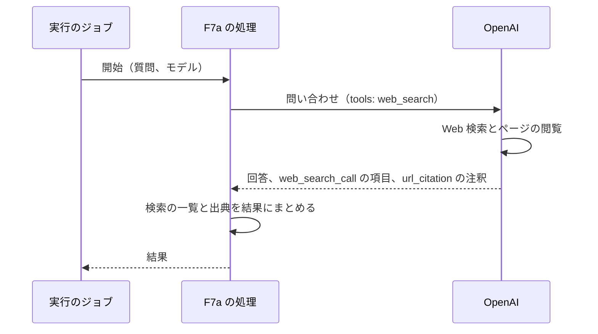

# ChangeSpec: F7a Provider Tools（Web 検索）の代表シナリオを追加する

## 変更の目的

要件 F7a の代表シナリオ「Web 検索で最新の情報を含めて回答する」をデモ基盤に載せ、プロバイダー側の Web 検索を使って最新の情報を含む回答を得て、行われた検索と出典を確かめられるようにする。あわせて、C2〜C5 が求める説明文、出典、コード断片、既定の入力での実行をそろえる。対応する要件は、要件定義書の F7a、C2〜C5、C7 である。C7 については、RubyLLM が算出するコストが登録簿のトークン単価だけに基づき、OpenAI が検索の回数で課金する分（1,000 回あたり 10 ドル）を含まないため、Sentry に載るコストは実際より小さくなる。この逸脱は説明文に書いて許容する（要件定義書は変えない）。また、C7 の「プロンプトと応答の本文」の確認で、応答に含まれる検索の呼び出しも Sentry の会話の記録で読めるようにし、行われた検索を観察情報としても残す。

同じデモの F7b（コード実行。Should）は、この ChangeSpec の対象外で、準備中のまま残す。

## 現状

デモ定義 `config/demos.yml` の `provider-tools`（名前は Provider Tools）は、要約と出典 1 件（Provider Tools）を持ち、説明文の本文を持たない。代表シナリオ `search_web`（Web 検索で最新の情報を含めて回答する）と `run_code`（注文データを集計するコードを実行する）はどちらも処理（`handler`）を持たず、「準備中」と表示される。

代表シナリオ定義 `Demos::Scenario` は、処理のクラスに入力とモデルをキーワードで渡して `perform` を呼ぶ。F1 の `ResponsesApi::AnswerInquiry` は、指示文つきの会話を 1 つ組み立てて 1 回問い合わせ、回答（`content`）と応答したモデルを返す。実行のジョブは、返り値を結果として成功を記録し、例外は失敗として記録する。実行の画面は、成功した実行で `result_kind` と同じ名前の結果の表示部品を描画する。実装済みの表示部品に、外部へのリンクを表示するものはない（箇条書きは F10 の `ticket_workflow`、項目の一覧は F3 の `refund_decision` にある）。デモの画面の出典のリンクは、デモ定義に書いた信頼できる URL である。モデルが返した URL をリンクにする箇所はまだない。

購読者 `Observability::RubyLLMSpanSubscriber` は、`chat.ruby_llm` のスパンに、`capture_content` が真のとき、入力と応答のメッセージを `Observability::MessageFormatter` で GenAI のメッセージの形（役割と部分の一覧）にして載せる。部分の種類は、思考（`reasoning`）、本文（`text`）、自前のツールの呼び出し（`tool_call`。`message.tool_calls` から）、ツールの結果（`tool_call_response`）で、プロバイダー側のツールの呼び出し（`server_tool_calls`）と出典（`citations`）は読まない。使用量の属性は `tokens` の入力、出力、キャッシュ、思考から作り、`server_tool_use` は読まない。

RubyLLM 2.0.0 のプロバイダー側のツールの仕様は次のとおりである（gem のソースと公式ガイドで確認した）。

- `Chat#with_provider_tools(:web_search)` は、プロトコルの別名の表でプロバイダーの形に変換して、リクエストの `tools` に加える。OpenAI（Responses プロトコル）では `{ type: "web_search" }` になる。別名がないプロトコルでは、リクエストの時点で `RubyLLM::UnsupportedServerToolError` になる。OpenAI では `:web_search` がページの閲覧も担い、別の `:web_fetch` は要らない。`web_search: { ... }` の形でプロバイダーの語彙の選択肢（許可するドメインなど）を渡せる
- 応答の `Message#server_tool_calls` は、Responses の出力項目のうち本文、推論、自前のツールの呼び出し以外（`web_search_call` など）を `RubyLLM::ServerToolCall` にしたもので、種類（`type`。`web_search_call`）、名前（`name`。OpenAI の項目にはなく `nil`）、ID、入力（`input`。項目の `action`）、結果（`result`。項目の `result`、`results`、`outputs`、`output`、`encrypted_content` のいずれか。検索の項目にはなく `nil`）、項目そのもの（`raw`）を持つ。`raw_content` に出力項目がそのまま残り、次の問い合わせで再送される
- 応答の `Message#citations` は、本文の注釈 `url_citation` を `RubyLLM::Citation` にしたもので、URL、題名、回答の該当する範囲の本文（`text`）と位置（`start_index`、`end_index`）を持つ。文書の引用と同じクラスである
- `Message#tokens.server_tool_use` は、Responses プロトコルでは常に `nil` になる。Responses の使用量の解釈は入力、出力、キャッシュ、思考のトークンだけを読み、`server_tool_use` を読まない（読むのは Chat Completions の側）。OpenAI の Responses API の使用量にもこの項目はない。応答の本体には文書に載っていない `tool_usage`（`web_search` の `num_requests`）があるが（2026-09-22 に実 API で確認）、RubyLLM は読まない。RubyLLM のコストは登録簿のトークン単価だけで求め、ツールの回数の課金は含まない
- 実 API の応答（`gpt-5-nano`、2026-09-22）では、`search` の `action` に `queries`（配列）と `query`（文字列）の両方があり、`open_page` の `action` は `url` を持つ。`ServerToolCall#input` は、実 API の応答では文字列のキーの Hash、Rails の記録から読み戻したときは記号のキーの Hash になる（記録の読み戻しは `from_h` でキーを記号にする）
- Rails の記録（`acts_as_message`）は `citations` と `server_tool_calls` の列を持ち、記録した会話でも読める（このアプリの `messages` テーブルにも列がある）
- OpenAI の Web 検索の仕様は次のとおり（2026-09-22 時点の公式の文書）。応答の出力項目 `web_search_call` は `action` を持ち、その種類は `search`（検索。通常は検索した語句 `queries` を含む）、`open_page`（ページを開く）、`find_in_page`（ページ内の検索）である。検索結果の一覧（`sources`）は `include` で要求したときだけ付き、RubyLLM は要求しない。本文の注釈 `url_citation` は URL、題名、本文の位置を持つ。`gpt-5-nano` は Web 検索に対応する（実 API でも確認した）。OpenAI は `gpt-5` について、推論の強さが `minimal` のときは Web 検索を使えないとしている（`gpt-5-nano` に当てはまるかは文書にない。RubyLLM は指定がなければ推論の強さを送らない）。課金は 1,000 回あたり 10 ドルに、検索結果のトークンがモデルの入力の単価で加わる

`RubyLLM::Message.new(role:, content:, model:, server_tool_calls:, citations:)` はプロバイダーを呼ばずに組み立てられ、`server_tool_calls` と `citations` には Hash を渡せる（`raw` は要らない）ので、テストの偽物の応答に使える。`test_helper.rb` は OpenAI の偽の設定値を常に入れる。処理の単体テストの前例は F3 の `test/actions/tool_approval/answer_refund_request_test.rb` で、ジョブのテストは `RubyLLM.chat` を特異メソッドの差し替えで偽物にする。

### 関連ファイル

| ファイル | 役割 |
|---------|------|
| `config/demos.yml` | 10 機能のデモ定義と代表シナリオ定義 |
| `app/models/demos/catalog.rb`、`app/models/demos/scenario.rb`、`app/models/demos/run.rb` | デモ定義の読み込み、処理の呼び出し、実行の記録 |
| `app/jobs/demos/run_job.rb` | 実行のジョブ |
| `app/actions/application_action.rb` | 代表シナリオの処理の基底 |
| `app/actions/responses_api/answer_inquiry.rb` | F1 の処理。会話を 1 つ組み立てる書き方の前例 |
| `app/subscribers/observability/message_formatter.rb` | メッセージを GenAI の形にする。変更対象 |
| `app/subscribers/observability/ruby_llm_span_subscriber.rb` | 計装イベントをスパンにする購読者。変更しない |
| `app/views/runs/_details.html.erb` | 実行の画面のうち状態で変わる部分 |
| `app/views/runs/results/_ticket_workflow.html.erb` | 箇条書きを持つ結果の表示部品。前例 |
| `app/helpers/runs_helper.rb` | 実行の画面のヘルパー。安全なリンクのヘルパーを加える。変更対象 |
| `test/actions/tool_approval/answer_refund_request_test.rb` | 処理の単体テストの前例 |
| `test/jobs/demos/run_job_test.rb` | `RubyLLM.chat` を差し替える補助の現在の置き場所 |
| `test/subscribers/observability/ruby_llm_span_subscriber_test.rb` | 購読者とメッセージの形の検証 |
| `test/models/demos/catalog_test.rb`、`test/controllers/demos_controller_test.rb`、`test/controllers/runs_controller_test.rb` | デモ定義と画面の検証 |
| `test/support/screen_helpers.rb` | 画面のテストの補助 |

## 変更内容

処理の流れは次のとおりである。検索はプロバイダーの側で行われ、アプリは 1 回の問い合わせを送るだけである。

- **追加**: F7a の代表シナリオの処理。質問と使うモデルを受け取る。モデルで会話を組み立て、指示文（架空の EC サイトのサポートデスクの担当者として、最新の情報を Web 検索で確かめ、出典を示して日本語で簡潔に回答する）を付け、`with_provider_tools(:web_search)` で Web 検索を有効にして、質問を 1 回問い合わせる
  - 結果は、回答の本文、応答したモデル、行われた検索の一覧、出典の一覧からなる。検索の一覧は `server_tool_calls` から作り、1 件ごとに項目の種類（`type`。`web_search_call` など）、操作の種類（`action` の `type`。`search`、`open_page`、`find_in_page`。`action` がなければ `nil`）、検索した語句（`queries` があればその配列、`query` だけならそれを 1 件の配列に。なければ空）、開いたページの URL（`action` の `url`。なければ `nil`）を持つ。`action` の読み取りは、文字列のキーと記号のキーのどちらでも同じ結果になるようにする。出典の一覧は `citations` から作り、1 件ごとに URL、題名、回答の該当する範囲の本文、位置を持つ（それぞれ `nil` になりうる）。検索も出典もないときは空の配列にする
  - 問い合わせの失敗は例外のまま投げる。ジョブが失敗として記録する。既定のモデル `gpt-5-nano` で Web 検索が拒まれた場合（対応の変更など）は、`gpt-5-mini` に替える
  - ジョブが再び動いたときは最初からやり直してよい（`retryable` は真）。検索と問い合わせがもう一度行われ、費用ももう一度かかる（F1 と同じ扱い）
  - テストは `test/actions/` に置く。`RubyLLM.chat` を台本どおり答える偽物（`with_instructions` と `with_provider_tools` を受け付けて引数を控え、`ask` に `RubyLLM::Message` を返す）に差し替える。差し替えの補助は、F9a の ChangeSpec と同じく `test/support/` の共有の補助を使う。補助は `RubyLLM.chat` を渡された物に差し替えて戻すことだけを担い、偽物の会話のクラスは各テストが定義する（先に実装した方が移し、後から実装する方はそのまま使う）
- **追加**: F7a の結果の表示部品（`result_kind` は `web_search_answer`）。回答の本文、行われた検索（操作の種類と語句、または開いたページの URL を 1 件ずつ。操作の種類がなければ項目の種類だけ。なければ「検索なし」）、出典（題名をリンクにし、URL と該当する本文を添えて 1 件ずつ。なければ「出典なし」）、応答したモデルを表示する。出典の題名がなければ URL をリンクの文字にする。モデルが返した URL は、`http` か `https` のときだけリンクにし、それ以外（`javascript:` など）と URL のない出典は、リンクにせず文字列として表示する。この判定は `app/helpers/runs_helper.rb` のヘルパーに置く。リンクは新しいタブで開く（デモの画面の出典と同じ）。開いたページの URL も同じヘルパーで表示する
- **変更**: メッセージの形（`Observability::MessageFormatter`）。応答のメッセージのプロバイダー側のツールの呼び出しを、自前のツールの呼び出しと同じ `tool_call` の部分（ID、名前、引数）として載せる。名前は呼び出しの `name`、なければ種類（`web_search_call`）、引数は `input`（検索では `action`。なければ空の Hash）にする。部分の順序は、思考、本文、自前のツールの呼び出し、プロバイダー側のツールの呼び出しとする。本文がなく検索の呼び出しだけを持つメッセージは、これまで部分が 0 件で落ちていたが、変更後は載る。出典は部分にしない（GenAI のメッセージの形に対応する種類がない。注釈が指す本文の範囲は本文に含まれるが、URL と題名は Sentry には載らず、実行の画面で読む）。購読者は変えない
- **変更**: デモ定義 `config/demos.yml` の `provider-tools`
  - 役立つケースの本文。検索の仕組みを自前で構築、運用したくない場合に役立つこと。`with_provider_tools(:web_search)` を付けるだけで、モデルがプロバイダーの側で検索とページの閲覧を行い、最新の情報を回答に含めること。別名（`:web_search`、`:code_execution`、`:file_search`、`:mcp` など）はプロバイダーごとにプロバイダーの形に変換され、対応しないプロバイダーでは `UnsupportedServerToolError` になること。応答の `server_tool_calls` で行われた検索（語句、開いたページ）を、`citations` で出典（URL、題名、回答の該当する範囲）を読めること。OpenAI では `:web_search` がページの閲覧も担うこと。Rails の記録では `citations` と `server_tool_calls` の列に残ること。課金は検索の回数（1,000 回あたり 10 ドル）と検索結果のトークンで、RubyLLM のコストは回数の課金を含まないため、Sentry のコストは実際より小さいこと。回数は応答の `server_tool_calls` の件数で数えられ、応答の本体の `tool_usage`（文書に未記載）にも載ること。OpenAI は `gpt-5` で推論の強さを `minimal` にすると使えないとしていること。コードの実行（F7b）については、F7b の実装時に本文を加える
  - 使わない場合に困ることの本文。検索エンジンの API を選んで契約し、自前のツールとして関数を書き、検索結果の取得、ページの本文の取り出し、要約、回答の文と出典の対応づけを自分で実装して保守すること。モデルは検索の語句を決めるだけで、検索と閲覧の往復のたびにツールの呼び出しと結果の受け渡しが要り、往復の回数だけ問い合わせが増えること
  - 出典。Provider Tools（RubyLLM。Enabling Provider Tools、Tool Options、Reading Results の節）、What's New in 2.0（RubyLLM。Provider Tools の節）、Web search（OpenAI のガイド。出力項目、注釈、対応モデルと推論の強さ）、Pricing（OpenAI。ツールの課金）の 4 件。OpenAI の 2 件は、出力の形と課金がプロバイダーの仕様に基づくため加える
  - 代表シナリオ `search_web` に、処理、プロバイダー（OpenAI）、モデル（`model: gpt-5-nano`。Web 検索に対応し、Responses プロトコルで送られる）、入力（`question`: 最新の情報を必要とする質問。必須。既定値は、架空の EC サイトのサポートデスクが顧客に案内するために、配送や返品に関わる公的な制度の直近 1 年の変更を出典つきで尋ねる質問）、結果の種類（`web_search_answer`）、やり直しの可否（真）を加える

### 新規に追加する責務の配置

| # | 責務 | コンテキスト | 配置先 | 所有するルール・閾値・派生値 |
|---|------|------------|--------|--------------------------|
| 1 | F7a の代表シナリオの処理（会話の組み立て、問い合わせ、検索と出典の一覧の組み立て） | デモ（Provider Tools） | 代表シナリオの処理（機能ごとの名前空間） | 指示文。検索の一覧の項目（種類、語句、URL）と `queries`／`query` の読み分け。出典の一覧の項目 |
| 2 | F7a の結果の表示 | 実行の表示 | View | なし。項目は責務 1 に従う |
| 3 | プロバイダー側のツールの呼び出しのメッセージの形 | 観測 | メッセージの形の変換（既存） | 名前の決め方（`name`、なければ種類）。部分の順序 |
| 5 | モデルが返した URL の安全なリンク | 実行の表示 | Helper（実行の画面） | リンクにする URL の条件（`http`、`https`） |
| 4 | F7a のデモ定義（説明文、出典、既定の入力） | デモ定義 | デモ定義（設定ファイル） | 既定の入力 |

結合強度評価は省略する（既存の結合点に触れない純粋な追加で、処理は F1 と同じ形でデモ基盤に呼ばれる。メッセージの形の変更は、既に読んでいる `RubyLLM::Message` の公開 API の別の属性を読むだけである）。使い勝手の点検は省略する（自習用のデモで、操作者は利用者本人である）。

## 採用した実装パターン

このリポジトリでは ADR を起票しない（利用者の決定）。採用案と理由だけを記す。

| # | 判断ポイント | 採用案 | 関連 ADR |
|---|------------|--------|---------|
| 1 | 検索の一覧の元（`server_tool_calls` の `action`、`raw` の項目そのもの） | `action`。RubyLLM が `input` として正規化した値で、種類と語句が読める。`raw` は OpenAI の項目の形にそのまま依存する | なし |
| 2 | 出典を Sentry に載せるか（メッセージの部分にする、載せない） | 載せない。GenAI のメッセージの形に出典の種類がなく、回答の本文はそのまま載る。URL と題名は Sentry には載らず、実行の画面で読む | なし |
| 3 | 検索の語句の読み方（`queries` と `query` の両方を読む、`queries` だけ） | 両方。OpenAI の文書は `queries` を示すが、項目の形はモデルと時期で変わりうる。片方しかないときも語句が消えないようにする | なし |

## 影響範囲

- `config/demos.yml`: `provider-tools` の定義。一覧とデモの画面の表示が「準備中」から、OpenAI の設定値の有無に応じて「実行できる」または「設定値が足りない（OpenAI）」に変わる。F7b の代表シナリオは準備中のまま
- 新規: 代表シナリオの処理のファイル、結果の表示部品
- `app/subscribers/observability/message_formatter.rb`: プロバイダー側のツールの呼び出しの部分。F1、F3、F10 の応答には `server_tool_calls` がないので、既存の実行のスパンの内容は変わらない
- `app/helpers/runs_helper.rb`: モデルが返した URL を安全にリンクにするヘルパー
- `app/models/`、`app/jobs/`、`app/controllers/`、`app/subscribers/observability/ruby_llm_span_subscriber.rb`、`app/views/runs/_details.html.erb`、`lib/failure_kinds.rb`、`db/schema.rb`: 変更なし
- 他の ChangeSpec との関係。`move-sentry-links-above-run-result.md` は `app/views/runs/_details.html.erb`、`test/controllers/runs_controller_test.rb`、`test/controllers/runs/statuses_controller_test.rb` を変え、結果の表示部品を `data-run-result` の枠で包む。F7a の表示部品もその枠の内側に描画され、状態の取得の応答にも出る。`add-f9a-token-counting.md` と `add-f6a-speech-generation.md` とは、`config/demos.yml`（別の項目）、`test/models/demos/catalog_test.rb`、`test/controllers/demos_controller_test.rb`、`test/controllers/runs_controller_test.rb` への加筆が重なる。いずれも別の検証を足すだけで、衝突は加筆の重なりに留まる。`test/support/` の差し替えの補助は F9a と共用する。実装順は development-start の実装台帳で決める
- Sentry でのトレースの形: ジョブの `invoke_agent` の下に `gen_ai.chat` のスパンが 1 つあり、その下に試行と `http.client`（`POST responses`）がある。応答のメッセージの部分に、本文と、`web_search_call` の呼び出し（`tool_call` の部分）が載る。コストは登録簿のトークン単価で求めた値で、検索の回数の課金を含まない。実装後に画面で、検索の部分が Transcript に出ることと、コストの値を確かめる
- テスト
  - 処理: 会話の組み立て（指示文、`:web_search` の有効化、質問）、結果の組み立て（`queries` の検索、`query` だけの検索、`open_page`、検索なし、出典あり、出典なし）、問い合わせの失敗が例外のまま伝わることの検証を、`RubyLLM.chat` の差し替えで加える。プロバイダーを呼ぶ実行は、実際の画面と Sentry で確かめる
  - メッセージの形: `server_tool_calls` を持つ応答の部分（名前は `name`、なければ種類。引数は `input`。順序）、本文のない応答が載ること、出典が部分にならないこと、持たない応答の部分が変わらないことの検証を加える
  - ヘルパー: `http` と `https` の URL だけをリンクにし、それ以外を文字列にすることの検証を加える
  - カタログ: F7a の定義（プロバイダーが OpenAI、入力が `question`、`retryable` が真、`result_kind` が `web_search_answer`）と、F7b が準備中のままであることの検証を加える
  - 画面: F7a の結果の表示（検索と出典あり、検索なし、出典なし）、デモの画面の説明文と出典とコード断片と入力欄、空白の入力の拒否の検証を加える

## 関連 ADR

- なし（このリポジトリでは ADR を起票しない）

## 受け入れ条件

「確認手段」の列は、その行をテストで検証するか、プロバイダーを呼ぶため実際の画面と Sentry で検証するかを示す。

| ID | 変更内容の項目 | 種類 | 条件 | 確認手段 |
|----|--------------|------|------|---------|
| AC-1 | 処理 | 正常 | 既定の入力で実行すると、実行が成功になり、結果に回答の本文、応答したモデル、1 件以上の検索（種類と語句）、1 件以上の出典（URL と題名）が記録される。Sentry のトレースに `invoke_agent` の下の `gen_ai.chat` があり、応答のメッセージに本文と `web_search_call` の `tool_call` の部分が載る | 画面 |
| AC-2 | 処理 | 正常 | 会話は指示文つきで組み立てられ、`:web_search` が有効にされ、質問が 1 回問い合わされる。応答の `server_tool_calls` と `citations` が、定めた項目の一覧として結果に入る。`queries` の配列はそのまま、`query` だけの検索は 1 件の配列として語句になり、`open_page` の URL は記録される | テスト（会話を差し替える） |
| AC-3 | 処理 | 異常・拒否 | 問い合わせが失敗すると、例外がそのまま伝わり、結果は返らない。ジョブは失敗として記録する（既存の扱い） | テスト（会話を差し替える） |
| AC-4 | 処理 | 境界 | 応答に `server_tool_calls` も `citations` もないとき、結果の検索と出典は空の配列で、回答とモデルは記録される。`action` のない項目は、項目の種類だけを持ち、操作の種類、語句、URL のない 1 件として記録される。`action` のキーが記号でも文字列でも同じ結果になる。URL や題名のない出典は、その項目が `nil` のまま記録される | テスト（会話を差し替える） |
| AC-5 | 処理 | 状態・権限 | 開始済みの実行でジョブが再び動くと、もう一度問い合わせて成功する（F1 と同じ） | テスト（カタログの `retryable` が真であることと、既存のジョブの検証） |
| AC-6 | 表示 | 正常 | 成功した F7a の実行の画面に、回答の本文、検索の一覧（操作の種類と語句、開いたページの URL）、出典の一覧（題名のリンク、URL、該当する本文）、応答したモデルが表示され、リンクは新しいタブで開く | テスト |
| AC-7 | 表示 | 異常・拒否 | 出典または開いたページの URL が `http` でも `https` でもない（`javascript:` など）実行の画面では、その URL はリンクにならず文字列として表示され、他の項目は表示される | テスト |
| AC-8 | 表示 | 境界 | 検索が 0 件の実行では「検索なし」、出典が 0 件の実行では「出典なし」と表示され、回答は表示される。題名のない出典は URL がリンクの文字になり、URL のない出典はリンクにならず題名が表示される。操作の種類のない検索は項目の種類だけが表示される | テスト |
| AC-9 | 表示 | 状態・権限 | 該当なし（表示部品は成功した実行でだけ描画される。既存の扱い） | |
| AC-10 | メッセージの形 | 正常 | `server_tool_calls` を持つ応答は、本文の部分に加えて、呼び出しごとに `tool_call` の部分（ID、名前、引数）を、自前のツールの呼び出しの後に持つ。名前は `name`、なければ種類、引数は `input`（なければ空の Hash）である。出典は部分にならない | テスト |
| AC-11 | メッセージの形 | 異常・拒否 | 該当なし（変換は入力を検証せず、例外を投げる経路を持たない。属性がない応答は境界で扱う） | |
| AC-12 | メッセージの形 | 境界 | `server_tool_calls` が空か、属性を持たない応答（`respond_to?` が偽）の部分は、現状と同じである。本文がなく `server_tool_calls` だけを持つ応答は、`tool_call` の部分だけを持つメッセージとして載る | テスト |
| AC-13 | メッセージの形 | 状態・権限 | 該当なし（変換は状態を持たない） | |
| AC-14 | デモ定義 | 正常 | OpenAI の設定値があるとき、一覧で Provider Tools が「実行できる」になり、デモの画面に説明文の本文（RubyLLM のコストが検索の回数の課金を含まないことを含む）、4 つの出典、`with_provider_tools` を含むコード断片、既定の質問が入った入力欄、有効な実行ボタンが出る。定義したモデルは OpenAI のモデルに解決される。F7b の代表シナリオは「準備中」のまま | テスト |
| AC-15 | デモ定義 | 異常・拒否 | OpenAI の設定値がないとき、一覧とデモの画面で「設定値が足りない（OpenAI）」になり、実行ボタンが無効になる | テスト |
| AC-16 | デモ定義 | 境界 | 質問が空白のとき、実行は記録されず、入力欄の下に「入力してください」が出る | テスト |
| AC-17 | デモ定義 | 状態・権限 | 該当なし（デモ定義は状態を持たず、操作者は利用者本人だけである） | |

### 未解決の疑問

- なし
