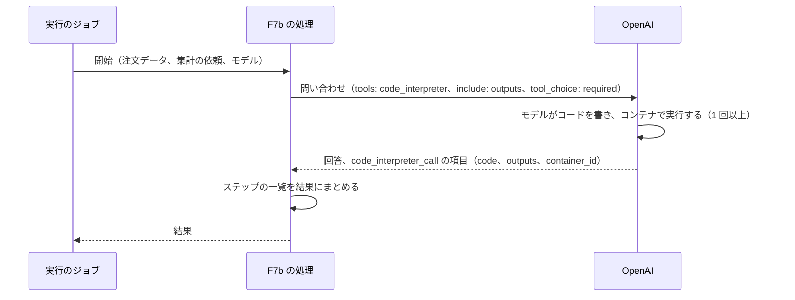

# ChangeSpec: F7b Provider Tools（コード実行）の代表シナリオを追加する

## 変更の目的

要件 F7b（Should）の代表シナリオ「注文データを集計するコードを実行する」をデモ基盤に載せ、プロバイダー側のコード実行で注文データの集計結果を得て、実行されたコードとその出力を確かめられるようにする。あわせて、Provider Tools の説明文にコード実行の本文と出典を加え、C2〜C5 をコード実行についてもそろえる。C7 については、F7a と同じく、RubyLLM が算出するコストがコンテナの課金（定価で、1 GB のコンテナの 20 分のセッションあたり 0.03 ドル）を含まないため、Sentry に載るコストは実際より小さい。この逸脱は説明文に書いて許容する（要件定義書は変えない）。

## 現状

デモ定義 `config/demos.yml` の `provider-tools` は、Web 検索（F7a）の説明文の本文、出典 4 件、代表シナリオ `search_web` の定義を持つ。もう 1 つの代表シナリオ `run_code`（注文データを集計するコードを実行する）は名前だけで、処理（`handler`）、プロバイダー、モデル、入力、結果の種類を持たず、デモの画面の `#run_code` に「準備中」と表示される。一覧はデモ単位の状態を表示し、`search_web` が実装済みなので Provider Tools は既に「実行できる」である。説明文の本文はコード実行について、別名の一覧に `:code_execution` の名前が出るだけである。

デモ基盤の振る舞いのうち、この変更が前提にするものは次のとおりである。代表シナリオ定義 `Demos::Scenario` は、処理のクラスに入力とモデルをキーワードで渡して `perform` を呼ぶので、処理の引数は入力の名前とモデルで決まる。デモの画面のコード断片は、処理のクラスのソースファイルそのものを表示する。説明文は、空行で段落に分け、バッククォートで囲んだ語を `code` で表示する。実行のジョブは、返り値を結果として `Run#succeed!` に渡し、結果は JSON の列に保存される。実行の画面は、成功した実行で `result_kind` と同じ名前の結果の表示部品（`runs/results/_<result_kind>`）を描画する。

F7a の処理 `ProviderTools::AnswerWithWebSearch` は、指示文つきの会話に `with_provider_tools(:web_search)` を付けて質問を 1 回問い合わせ、回答、応答したモデル、`server_tool_calls` から作った検索の一覧、`citations` から作った出典の一覧を結果として返す。検索の一覧は `ServerToolCall#input` から作り、`raw` は読まない（OpenAI の項目の形にそのまま依存しないため）。`input` の Hash のキーを文字列にそろえて読む。結果の表示部品 `runs/results/_web_search_answer` は、回答、行われた検索、出典、応答したモデルを表示し、モデルが返した URL は `RunsHelper#model_url_link` で `http` と `https` のときだけリンクにする。テストは `test/support/chat_helpers.rb` の `with_chat` で `RubyLLM.chat` を台本どおり答える偽物に差し替える。偽物の会話のクラスは各テストが定義し、`with_instructions`、`with_provider_tools`、`ask` を受け付ける。

`Observability::MessageFormatter` は、応答のメッセージの `server_tool_calls` を `tool_call` の部分（ID、名前は `name` がなければ種類、引数は `input` がなければ空の Hash）として、自前のツールの呼び出しの後に載せる。呼び出しの結果（`result`）は読まない。`tool_call_response` の部分は、役割が `tool` のメッセージからだけ作る。

既存のテストのうち、`test/models/demos/catalog_test.rb` は `run_code` が実装されていないこと（`implemented?` が偽）を、`test/controllers/demos_controller_test.rb` は `#run_code` に「準備中」が出て入力欄と実行ボタンがないことを検証している。F7a の実行の開始と空白の入力の拒否は `test/controllers/demos/runs_controller_test.rb` が検証している。

RubyLLM 2.0.0 のコード実行の仕様は次のとおりである（gem のソースで確認した）。

- `Chat#with_provider_tools(:code_execution)` は、OpenAI（Responses プロトコル）では `{ type: "code_interpreter", container: { type: "auto" } }` になり、リクエストの `tools` に加わる。`:code_interpreter` も同じ形になる
- Responses の要求の `include` は `["reasoning.encrypted_content"]` に固定されている。`Chat#with_provider_options` の値はリクエストに deep merge され、配列は追記ではなく置き換えになる。リクエストのキーは記号なので、`include` も記号のキーで渡したときだけ上書きになる。`with_provider_options` を 2 回呼ぶと先の指定は消える。`Chat#before_request` のコールバックは、その後のリクエストを受け取り、その場で書き換える（戻り値は使われない）
- `Chat#with_tool_options(choice:)` は、自前のツール（`with_tools`）がないと `tool_choice` を送らない。プロバイダー側のツールだけを使う会話でツールの使用を強制するには、`with_provider_options(tool_choice: ...)` でプロバイダーの語彙のまま渡す。この挙動は公式ガイドにはなく、gem のソースだけが根拠である
- 応答の `Message#server_tool_calls` の各要素は、Responses の出力項目のうち本文、推論、自前のツールの呼び出し以外から作られる。種類（`type`）は項目の種類、名前（`name`）は項目の `name`（`code_interpreter_call` にはなく `nil`）、入力（`input`）は項目の `action`、`arguments`、`code` のうち最初にあるもの（コード実行では実行したコードの文字列）、結果（`result`）は項目の `result`、`results`、`outputs`、`output`、`encrypted_content` のうち最初に値があるもの（なければ `nil`）、`raw` は項目そのものである。`raw_content` に出力項目がそのまま残り、次の問い合わせで再送される
- `ServerToolCall` を Hash から組み立てるとき（Rails の記録からの読み戻し、テストの偽物の応答）は、`input`、`result`、`raw` のすべてのキーが記号になる（配列の中の Hash も含む）。`raw` のない Hash から組み立てると `raw` は `nil` になる
- 本文の注釈 `container_file_citation`（コードが作ったファイル）は `Citation`（`source_id` がファイルの ID、`title` がファイル名）になるだけで、OpenAI（Responses）ではファイルを取得する処理がなく、`Message#attachments` は空のままである。公式ガイドは生成ファイルが `attachments` に入ると一般に書くが、OpenAI についてはこのとおりである

OpenAI のコード実行の仕様と、実 API（`gpt-5-nano`、2026-09-23、3 回）で確認した事実は次のとおりである。

- `gpt-5-nano` は Responses API で `code_interpreter` に対応する（OpenAI のモデルの文書。実 API でも確認した）。実行環境は Python である
- 出力項目 `code_interpreter_call` は `id`、`type`、`status`、`code`、`container_id`、`outputs` を持つ。`status` の値は `in_progress`、`completed`、`incomplete`、`interpreting`、`failed` である。`code` は文字列か `null`、`outputs` は配列か `null` で、要素は標準出力などの `{ type: "logs", logs: 文字列 }` か、画像の `{ type: "image", url: 文字列 }` である
- API リファレンスは、要求の `include` の値 `code_interpreter_call.outputs` を「コード実行の出力を項目に含める」と説明する。既定で入らないとは明記していない。実 API では、指定なしの応答で 3 ステップすべての `outputs` が `null` で `ServerToolCall#result` は `nil`、指定ありの応答で `[{ "type" => "logs", "logs" => "..." }]` が入った
- 3 回の応答のステップ（`code_interpreter_call`）は 3、0、1 だった。ステップが複数の応答では、いずれも同じ `container_id` だった。コードを実行した 2 回の応答は別のコンテナだった。コードの改行は、CR LF と LF が混ざった応答と、LF だけの応答があった。所要時間は 16〜24 秒だった
- 指示文で「コードを実行して集計し、暗算はしない」と書いた `tool_choice` なしの 2 回のうち、1 回はコードを実行せず推論だけで回答した（ステップ 0）。要求に `tool_choice: "required"` を付けた 1 回は、ステップ 1 で実行し、応答は `completed` で終わった（`incomplete_details` なし）
- コンテナは `auto` の指定で作られる（以前の項目が使ったコンテナが生きていれば再利用される）。使われないまま 20 分たつと失効する。課金は定価で、1 GB のコンテナの 20 分のセッションあたり 0.03 ドル（4 GB で 0.12 ドル）に、トークンの課金が加わる。料金の文書は「対象のセッションは分単位で課金され、最低 5 分」とも書くが、対象の条件は書いていない。実際の請求額は応答の本体には載らない。RubyLLM のコストは登録簿のトークン単価だけで求め、実 API では 0.0013〜0.0015 ドルだった。コンテナの回数は、応答の本体の `tool_usage` にはない（`web_search` と `image_gen` の項目だけ。実 API の観測）。各ステップの `container_id` で、使われたコンテナを区別できる

`RubyLLM::Message.new(role:, content:, model:, server_tool_calls:)` はプロバイダーを呼ばずに組み立てられ、`server_tool_calls` には `RubyLLM::ServerToolCall` か Hash を渡せるので、テストの偽物の応答に使える。`test_helper.rb` は OpenAI の偽の設定値を常に入れる。

### 関連ファイル

| ファイル | 役割 |
|---------|------|
| `config/demos.yml` | 10 機能のデモ定義と代表シナリオ定義。変更対象 |
| `app/models/demos/catalog.rb`、`app/models/demos/scenario.rb`、`app/models/demos/run.rb` | デモ定義の読み込み、処理の呼び出し、実行の記録。変更しない |
| `app/jobs/demos/run_job.rb` | 実行のジョブ。変更しない |
| `app/actions/application_action.rb` | 代表シナリオの処理の基底 |
| `app/actions/provider_tools/answer_with_web_search.rb` | F7a の処理。会話の組み立てと `server_tool_calls` の読み方の前例 |
| `app/views/runs/results/_web_search_answer.html.erb` | F7a の結果の表示部品。前例 |
| `app/views/demos/_scenario.html.erb` | コード断片を `pre` と `code` で表示する前例 |
| `app/helpers/demos_helper.rb` | 説明文の描画（段落と `code`）。変更しない |
| `app/subscribers/observability/message_formatter.rb` | メッセージを GenAI の形にする。変更対象 |
| `app/subscribers/observability/ruby_llm_span_subscriber.rb` | 計装イベントをスパンにする購読者。変更しない |
| `test/actions/provider_tools/answer_with_web_search_test.rb` | 処理の単体テストの前例（偽物の会話のクラス） |
| `test/support/chat_helpers.rb` | `RubyLLM.chat` の差し替えの補助。そのまま使う |
| `test/subscribers/observability/ruby_llm_span_subscriber_test.rb` | 購読者とメッセージの形の検証。変更対象 |
| `test/models/demos/catalog_test.rb`、`test/controllers/demos_controller_test.rb`、`test/controllers/demos/runs_controller_test.rb`、`test/controllers/runs_controller_test.rb` | デモ定義、実行の開始、画面の検証。変更対象 |

## 変更内容

処理の流れは次のとおりである。コードの実行はプロバイダーのコンテナで行われ、アプリは 1 回の問い合わせを送るだけである。図から読み取るのは、アプリがコードを書かず、実行環境も持たないことと、コードと出力が 1 つの応答で戻ることである。

- **追加**: F7b の代表シナリオの処理。注文データ（`orders`）、集計の依頼（`request`）、使うモデル（`model`）をキーワードで受け取る。モデルで会話を組み立て、指示文（架空の EC サイトのサポートデスクの担当者として、与えられた注文データをコードを実行して集計し、日本語の本文で結果を示す。ファイルや画像は作らない）を付け、`with_provider_tools(:code_execution)` でコード実行を有効にし、`with_provider_options(include: ["reasoning.encrypted_content", "code_interpreter_call.outputs"], tool_choice: "required")` で出力の取得とツールの使用の強制を要求し、注文データと集計の依頼を 1 つの本文にして 1 回問い合わせる
  - 結果は、回答の本文、応答したモデル、実行のステップの一覧からなる。ステップの一覧は `server_tool_calls` から作り、1 件ごとに項目の種類（`type`。`code_interpreter_call` など）、状態（`raw` の `status`）、コンテナの ID（`raw` の `container_id`）、実行したコード（`input` が文字列ならそのまま。改行の形も変えない。文字列でなければ `nil`）、出力の一覧を持つ。`raw` はキーを文字列にそろえて読み、`raw` が `nil` なら状態とコンテナの ID は `nil` にする。出力の一覧は、`result` が配列のとき、その要素のうち Hash であるものをキーを文字列にそろえて残したもので、Hash でない要素は捨てる。`result` が配列でなければ空にする。ステップがなければ空の配列にする
  - 問い合わせの失敗は例外のまま投げる。ジョブが失敗として記録する
  - ジョブが再び動いたときは最初からやり直してよい（`retryable` は真）。コンテナがもう一度作られ、費用ももう一度かかる（F7a と同じ扱い）
  - テストは `test/actions/` に置く。`RubyLLM.chat` の差し替えは `test/support/` の共有の補助を使う。偽物の会話のクラスはこのテストが定義し、F7a の偽物に加えて `with_provider_options` を受け付けて引数を控える
- **追加**: F7b の結果の表示部品（`result_kind` は `code_execution_answer`）。回答の本文、実行されたコード、コンテナ、応答したモデルを表示する。実行されたコードは、ステップごとに、番号、状態（`nil` なら出さない。値は変換せずそのまま出す）、コード（`pre` と `code`）、出力を表示する。出力は、種類が `logs` の要素をその本文（`pre`）で、`image` の要素を「画像の出力（このアプリでは取得しない）」で、それ以外の種類の要素を「その他の出力（種類）」で表示し、出力が 0 件なら「出力なし」と表示する。コードのないステップは項目の種類だけを表示する。ステップが 0 件なら「コードの実行なし」と表示する。コンテナは、ステップのコンテナの ID から `nil` を除き、重複を除いて表示し、1 件もなければ表示しない。モデルが返した URL を表示する箇所はない（画像の URL は表示しない）。コード、出力、状態はモデルとコンテナが返した値なので、ERB の既定のエスケープで文字列として表示する
- **変更**: メッセージの形（`Observability::MessageFormatter`）。応答のメッセージのプロバイダー側のツールの呼び出しごとに、`tool_call` の部分の直後に、結果（`result`）が配列なら `tool_call_response` の部分（ID は呼び出しの ID、結果は `result` の値そのまま）を置く。配列に限るのは、コード実行の出力や検索結果のような一覧を載せ、暗号化された内容や base64 の画像のような不透明な文字列を送らないためである。結果のない呼び出し（F7a の `web_search_call` など）の部分は変わらない。購読者は変えない
- **変更**: デモ定義 `config/demos.yml` の `provider-tools`
  - 役立つケースの本文に、コード実行の段落を加える。コードを実行する隔離環境を自前で構築、運用したくない場合に役立つこと。`with_provider_tools(:code_execution)` は OpenAI で `code_interpreter`（コンテナは `auto`）になり、モデルが Python のコードを書いてプロバイダーのコンテナで実行し、出力を読んで回答すること。実行されたコードは `server_tool_calls` の `input` で読めるが、出力は RubyLLM の既定の要求では返らず、`with_provider_options` で `include` に `code_interpreter_call.outputs` を足すと `result` に入ること。`with_provider_options` は RubyLLM の既定値を置き換えるので、既定の `reasoning.encrypted_content` も並べて書くこと。プロバイダー側のツールだけを使う会話では `with_tool_options` はツールの使用を強制せず（gem のソースで確認）、`tool_choice` をプロバイダーの語彙で渡すこと。コードが作ったファイルは `citations` の注釈になるだけで、OpenAI では `attachments` に入らないこと。状態とコンテナの ID は RubyLLM が正規化せず、`raw` で読むこと。課金はコンテナ（定価で 1 GB の 20 分のセッションあたり 0.03 ドル。対象のセッションは分単位で最低 5 分）とトークンで、RubyLLM のコストはコンテナの課金を含まないため Sentry のコストは実際より小さいこと。このアプリで確かめた既定の入力の応答では、RubyLLM が求めたコストは約 0.0013〜0.0015 ドルで、コンテナの定価 0.03 ドルの 20 分の 1 ほどだったこと（実装後の実行で測り直す）。コンテナの回数は応答の本体にはなく、各ステップの `container_id` で区別すること
  - 使わない場合に困ることの本文に、コード実行の段落を加える。モデルが書いたコードを安全に実行する隔離環境（コンテナやサンドボックス）を用意し、実行時間、メモリ、ネットワークの制限と、環境の破棄を自分で運用すること。コードを受け取って実行し、出力をモデルに返す往復を自前のツールとして書くこと
  - 出典に 3 件を加える。Code Interpreter（OpenAI のガイド。コンテナの `auto` と再利用、既定の 1 GB、失効、ファイルの引用、`tool_choice: "required"` の例）、Create a model response（OpenAI の API リファレンス。`include` の値、`tool_choice`、出力項目 `code_interpreter_call` の構造）、Advanced Request Control（RubyLLM。`with_provider_options` が RubyLLM の既定値を上書きすること）。既存の 4 件は残し、Pricing の題名を「Web 検索とコンテナの課金」に直す（URL は変えない）
  - 代表シナリオ `run_code` に、処理、プロバイダー（OpenAI）、モデル（`model: gpt-5-nano`）、入力 2 つ（`orders`: 注文データ（CSV）。必須。既定値は、注文番号、注文日、カテゴリ、商品、金額、状態の列を持つ 8 行のダミーの注文で、返金済みを 2 行含む。`request`: 集計の依頼。必須。既定値は、カテゴリごとの売上金額の合計（返金済みを除く）、返金済みの件数と金額の合計、全体の平均注文金額（返金済みを除く）を求める依頼）、結果の種類（`code_execution_answer`）、やり直しの可否（真）を加える

### 新規に追加する責務の配置

| # | 責務 | コンテキスト | 配置先 | 所有するルール・閾値・派生値 |
|---|------|------------|--------|--------------------------|
| 1 | F7b の代表シナリオの処理（会話の組み立て、問い合わせ、ステップの一覧の組み立て） | デモ（Provider Tools） | 代表シナリオの処理（機能ごとの名前空間） | 指示文。要求に足す `include` と `tool_choice`。ステップの項目（種類、状態、コンテナの ID、コード、出力）と、`input`・`result`・`raw` の読み分け |
| 2 | F7b の結果の表示 | 実行の表示 | 実行の画面の結果の表示部品（`result_kind` ごと） | 出力の種類ごとの表示（`logs`、`image`、その他、0 件）。コンテナの重複の除去 |
| 3 | プロバイダー側のツールの結果のメッセージの形 | 観測 | メッセージの形の変換（既存） | 部分を作る条件（`result` が配列）。部分の順序（呼び出しの直後） |
| 4 | F7b のデモ定義（説明文、出典、既定の入力） | デモ定義 | デモ定義（設定ファイル） | 既定の入力 |

結合強度評価は省略する（既存の結合点に触れない純粋な追加で、処理は F7a と同じ形でデモ基盤に呼ばれる。メッセージの形の変更は、既に読んでいる `RubyLLM::ServerToolCall` の別の属性を読むだけである。処理が `raw` から読む 2 項目は OpenAI の項目の形への依存だが、読む項目を状態とコンテナの ID に限り、判断ポイント 5 に理由を残す）。ログ・記録要件への影響評価は省略する（入力はダミーデータで、権限や状態の変更を扱わない）。使い勝手の点検は省略する（自習用のデモで、操作者は利用者本人である）。

## 採用した実装パターン

このリポジトリでは ADR を起票しない（利用者の決定）。採用案と理由だけを記す。1〜4 は 2026-09-23 に利用者が採用案を決めた。

| # | 判断ポイント | 採用案 | 関連 ADR |
|---|------------|--------|---------|
| 1 | 出力を得る `include` の足し方（`with_provider_options` で列挙、`before_request` で追記） | `with_provider_options` で `reasoning.encrypted_content` と `code_interpreter_call.outputs` を列挙する。`tool_choice` と同じ 1 つの呼び出しに集まり、コード断片が宣言的に読める。RubyLLM の既定値を再記述することになるが、gem は 2.0.0 に固定されている。`with_provider_options` は 1 回だけ呼び、キーは記号で渡す | なし |
| 2 | コード実行の強制（`tool_choice: "required"`、指示文だけ） | 強制する。指示文だけの 2 回のうち 1 回コードを実行せず、コードの実行を見せるデモとして結果が成り立たない。実 API で応答が完了することを確認した。自前のツールを併用しない会話でだけ成り立つ | なし |
| 3 | 注文データの渡し方（問い合わせの本文に CSV、コンテナにファイル） | 問い合わせの本文に含める。Files API とファイルの作成・削除の責務が要らず、Sentry の会話の記録にデータが載る。8 行のダミーデータで足りる | なし |
| 4 | コードの出力を Sentry に載せるか（`tool_call_response` の部分にする、載せない） | 載せる。ツールの結果には GenAI のメッセージの形に対応する種類がある。Sentry の画面での表示は未確認なので、実装後に確かめる。表示されないか、Transcript の表示を壊す場合は、部分を作る処理を外し、AC-1、AC-10、AC-12 を「結果の部分を作らない」に読み替えて、この行に結果を追記する | なし |
| 5 | 状態とコンテナの ID の元（`raw`、読まない） | `raw` から読む。F7a は `raw` を読まない方針だったが、状態とコンテナの ID は RubyLLM が正規化した属性にない。読む項目を 2 つに限り、キーをそろえて読む | なし |

## 影響範囲

- `config/demos.yml`: `provider-tools` の定義。`#run_code` の表示が「準備中」から、OpenAI の設定値の有無に応じて「実行できる」または「設定値が足りない（OpenAI）」に変わる。一覧のデモ単位の状態は変わらない。説明文と出典が増え、Pricing の出典の題名が変わる（既存のテストは URL だけを検証しているので変わらない）
- 新規: 代表シナリオの処理のファイル、結果の表示部品
- `app/subscribers/observability/message_formatter.rb`: プロバイダー側のツールの結果の部分。F1、F3、F10 の応答には `server_tool_calls` がなく（F6a と F9a は chat のイベントを出さない）、F7a の `web_search_call` は `result` を持たないので、既存の実行のスパンの内容は変わらない
- `app/models/`、`app/jobs/`、`app/controllers/`、`app/helpers/`、`app/subscribers/observability/ruby_llm_span_subscriber.rb`、`app/views/runs/_details.html.erb`、`lib/failure_kinds.rb`、`db/schema.rb`: 変更なし
- 他の ChangeSpec との関係。`docs/change-specs/` には F2、F4、F5、F6b、F8 の ChangeSpec が並んでいる（いずれも 2026-09-23 に作成、未コミット）。`config/demos.yml`（別の項目）、`test/models/demos/catalog_test.rb`、`test/controllers/demos_controller_test.rb`、`test/controllers/runs_controller_test.rb`、`test/controllers/demos/runs_controller_test.rb`（F4、F5）への加筆が重なる。F4、F6b、F8 は `app/subscribers/observability/ruby_llm_span_subscriber.rb` を変え、`test/subscribers/observability/ruby_llm_span_subscriber_test.rb` に検証を加える。F7b は購読者を変えず、`message_formatter.rb` を変える。F2 は `message_formatter.rb` を変更しないと明記している。いずれも別の検証を足すだけで、衝突は加筆の重なりに留まる。後にマージする側が両方を残す。実装順は development-start の実装台帳で決める
- Sentry でのトレースの形: ジョブの `invoke_agent` の下に `gen_ai.chat` のスパンが 1 つあり、その下に試行と `http.client`（`POST responses`）がある。応答のメッセージの部分に、本文と、ステップごとの `code_interpreter_call` の呼び出し（`tool_call`。引数はコードの文字列）とその結果（`tool_call_response`。出力の配列）が載る。コストはトークンの単価で求めた値で、コンテナの課金を含まない。実装後に画面で、結果の部分が Transcript に出ることと、コストの値を確かめる（判断ポイント 4）
- テスト
  - 処理: 会話の組み立て（指示文の中身、`:code_execution` の有効化、`include` と `tool_choice` の指定、本文に注文データと依頼が入ること）、結果の組み立て（`logs` の出力を持つステップ、`image` の出力を持つステップ、未知の種類の出力、Hash でない要素、配列でない `result`、出力のないステップ、コードのないステップ、ステップなし、`raw` と `result` のキーが記号の場合、`raw` が `nil` の場合、CR LF と LF が混ざったコード）、問い合わせの失敗が例外のまま伝わることの検証を、`RubyLLM.chat` の差し替えで加える。プロバイダーを呼ぶ実行は、実際の画面と Sentry で確かめる
  - メッセージの形: 呼び出しが 2 件ある応答での部分の順序（呼び出し、その結果、次の呼び出し、その結果）、`result` が `nil` または文字列の呼び出しに結果の部分が作られないこと、F7a の応答の部分が変わらないことの検証を加える
  - カタログ: `run_code` の定義（プロバイダーが OpenAI、入力が `orders` と `request` でどちらも必須、`retryable` が真、`result_kind` が `code_execution_answer`）の検証を加え、「準備中のまま」の検証を置き換える
  - 実行の開始: 既定の入力で実行が記録されジョブがキューに入ること、空白の入力の拒否の検証を `test/controllers/demos/runs_controller_test.rb` に加える
  - 画面: デモの画面の説明文、出典 7 件、コード断片（`with_provider_tools(:code_execution)`、`with_provider_options`、`code_interpreter_call.outputs`、`tool_choice`）、既定の入力の 2 つの入力欄、有効な実行ボタン、OpenAI の設定値がないときの無効化の検証を加え、`#run_code` の「準備中」の検証を置き換える。実行の画面の結果の表示（ステップと出力あり、ステップなし、出力なし、画像の出力、未知の種類の出力、コードのないステップ、状態のないステップ、コンテナの ID がすべて `nil`、複数のコンテナ、HTML のタグを含むコードと出力）の検証を加える

## 関連 ADR

- なし（このリポジトリでは ADR を起票しない）

## 受け入れ条件

「確認手段」の列は、その行をテストで検証するか、プロバイダーを呼ぶため実際の画面と Sentry で検証するかを示す。

| ID | 変更内容の項目 | 種類 | 条件 | 確認手段 |
|----|--------------|------|------|---------|
| AC-1 | 処理 | 正常 | 既定の入力で実行すると、実行が成功になり、結果に回答の本文、応答したモデル、1 件以上のステップ（コードと、`logs` の出力）が記録される。Sentry のトレースに `invoke_agent` の下の `gen_ai.chat` があり、応答のメッセージに本文、`code_interpreter_call` の `tool_call` の部分、その `tool_call_response` の部分が載り、Transcript に結果の部分が表示されて他の部分の表示が崩れない。コストの値を控え、説明文の実測値を更新する | 画面 |
| AC-2 | 処理 | 正常 | 会話は指示文つき（サポートデスクの担当者、コードを実行して集計、ファイルや画像を作らない）で組み立てられ、`:code_execution` が有効にされ、`include`（`reasoning.encrypted_content` と `code_interpreter_call.outputs`）と `tool_choice`（`required`）が記号のキーで渡され、注文データと集計の依頼を含む本文が 1 回問い合わされる。応答の `server_tool_calls` が、定めた項目のステップの一覧として結果に入る。`logs` の出力は本文つきで、`image` の出力は URL つきで、それぞれキーが文字列の Hash として記録される | テスト（会話を差し替える） |
| AC-3 | 処理 | 異常・拒否 | 問い合わせが失敗すると、例外がそのまま伝わり、結果は返らない。ジョブは失敗として記録する（既存の扱い） | テスト（会話を差し替える） |
| AC-4 | 処理 | 境界 | 応答に `server_tool_calls` がないとき、結果のステップは空の配列で、回答とモデルは記録される。`result` が `nil` か配列でないステップは出力が空の配列になる。出力の要素のうち Hash でないものは捨てられ、未知の種類の要素は種類つきで残る。`input` が文字列でないステップはコードが `nil` になる。`raw` が `nil` のステップ、または `raw` に `status` と `container_id` がないステップは、それらが `nil` になる。`raw` と `result` のキーが記号でも文字列でも同じ結果になる。CR LF と LF が混ざったコードは、改行の形を変えずに記録される | テスト（会話を差し替える） |
| AC-5 | 処理 | 状態・権限 | 開始済みの実行でジョブが再び動くと、もう一度問い合わせて成功する（F7a と同じ） | テスト（カタログの `retryable` が真であることと、既存のジョブの検証） |
| AC-6 | 表示 | 正常 | 成功した F7b の実行の画面に、回答の本文、ステップごとの番号、状態、コード（`pre` と `code`）、`logs` の出力の本文、コンテナの ID、応答したモデルが表示される | テスト |
| AC-7 | 表示 | 異常・拒否 | コードや出力に HTML のタグが含まれる実行の画面では、タグはエスケープされた文字列として表示され、要素にはならない。`image` の出力の URL（`javascript:` を含む）は、リンクにも文字列にも表示されない | テスト |
| AC-8 | 表示 | 境界 | ステップが 0 件の実行では「コードの実行なし」と表示され、コンテナは表示されず、回答は表示される。出力が 0 件のステップでは「出力なし」と表示される。`image` の出力は「画像の出力（このアプリでは取得しない）」、未知の種類の出力は「その他の出力（種類）」と表示される。コードのないステップは項目の種類だけが表示される。状態が `nil` のステップでは状態が表示されず、`failed` などの値はそのまま表示される。同じコンテナの ID を持つ複数のステップでは、コンテナは 1 件だけ表示される。異なる ID なら件数分表示され、ID がすべて `nil` ならコンテナは表示されない | テスト |
| AC-9 | 表示 | 状態・権限 | 該当なし（表示部品は成功した実行でだけ描画される。既存の扱い） | |
| AC-10 | メッセージの形 | 正常 | 配列の `result` を持つプロバイダー側の呼び出しが 2 件ある応答は、本文の部分に続けて、1 件目の `tool_call`、その `tool_call_response`（ID は呼び出しの ID、結果は `result` の値そのまま）、2 件目の `tool_call`、その `tool_call_response` の順に部分を持つ | テスト |
| AC-11 | メッセージの形 | 異常・拒否 | 該当なし（変換は入力を検証せず、例外を投げる経路を持たない。属性がない応答は境界で扱う） | |
| AC-12 | メッセージの形 | 境界 | `result` が `nil` の呼び出しと、`result` が文字列（暗号化された内容など）の呼び出しには `tool_call_response` の部分が作られず、F7a の `web_search_call` の応答の部分は現状と同じである。`result` が空の配列の呼び出しには、空の配列を結果とする部分が作られる。`server_tool_calls` を持たない応答の部分は現状と同じである | テスト |
| AC-13 | メッセージの形 | 状態・権限 | 該当なし（変換は状態を持たない） | |
| AC-14 | デモ定義 | 正常 | OpenAI の設定値があるとき、デモの画面の `#run_code` が「実行できる」になり、説明文にコード実行の本文（出力の取得に `include` が要ること、RubyLLM のコストがコンテナの課金を含まないことを含む）、7 つの出典、`#run_code` に `with_provider_tools(:code_execution)`、`with_provider_options`、`code_interpreter_call.outputs`、`tool_choice` を含むコード断片、既定値が入った 2 つの入力欄、有効な実行ボタンが出る。定義したモデルは OpenAI のモデルに解決される。`#search_web` の表示は変わらない | テスト |
| AC-15 | デモ定義 | 正常 | 既定の入力で `run_code` の実行を送ると、実行が記録されてジョブがキューに入り、実行の画面へ移動する | テスト |
| AC-16 | デモ定義 | 異常・拒否 | OpenAI の設定値がないとき、`#run_code` が「設定値が足りない（OpenAI）」になり、実行ボタンが無効になる | テスト |
| AC-17 | デモ定義 | 境界 | 注文データか集計の依頼のどちらかが空白のとき、実行は記録されず、その入力欄の下に「入力してください」が出る。両方が空白のときは両方の入力欄の下に出る | テスト |
| AC-18 | デモ定義 | 状態・権限 | 該当なし（デモ定義は状態を持たず、操作者は利用者本人だけである） | |

### 未解決の疑問

- なし
