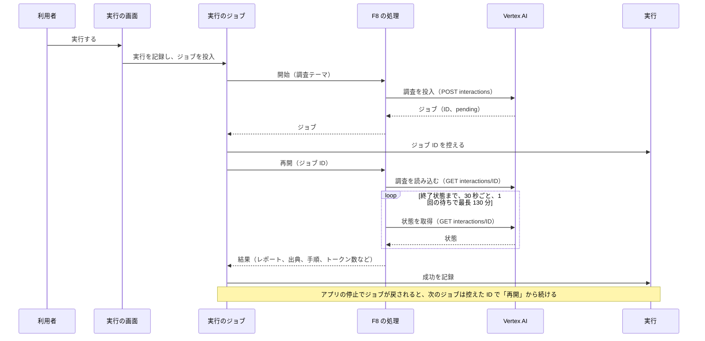
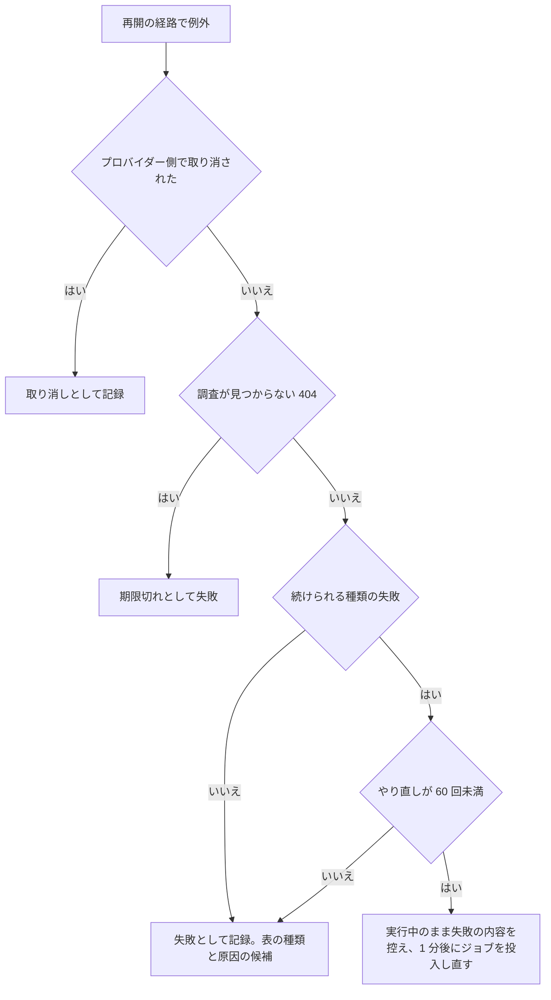
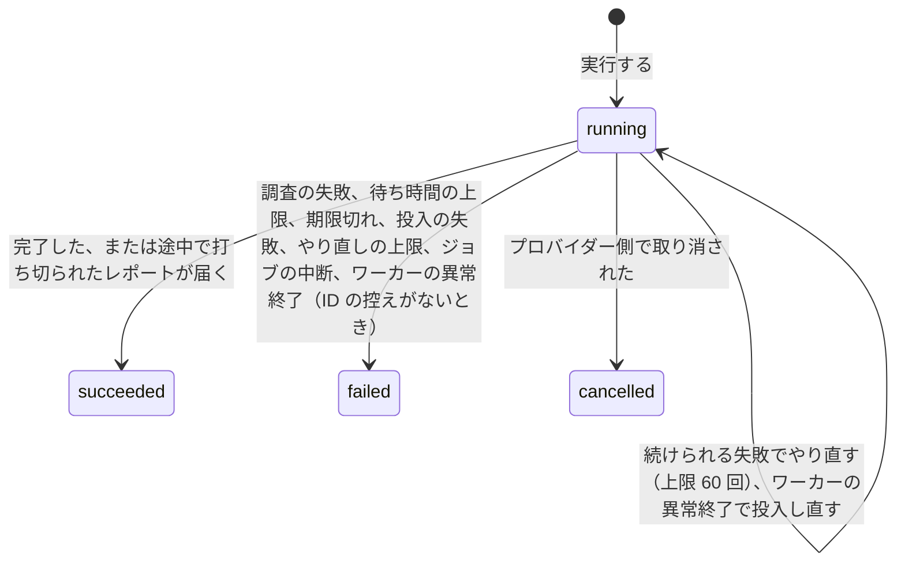

# ChangeSpec: F8 Deep Research の代表シナリオを追加する

## 変更の目的

要件 F8 の代表シナリオ「調査テーマのレポートを作る」をデモ基盤に載せ、調査テーマを Vertex AI の Deep Research エージェントに投入し、数分以上の待ち時間の後にレポートと出典を履歴から読めるようにする。あわせて、C2〜C5 が求める説明文、出典、コード断片、既定の入力での実行と、C9 が求める「利用者が画面を離れても結果が履歴に届き、アプリの停止中にプロバイダー側の処理が完了しても次回の起動後に届く」こと、C10 が求める失敗の表示をそろえる。対応する要件は、要件定義書の F8、C2〜C5、C7、C9、C10 である。

C7 については、Deep Research の投入と結果の回収が RubyLLM のチャットのイベントを発行せず、レポートの本文、トークン数、コストがどの計装イベントにも載らない。Sentry のトレースには投入のリクエスト（プロンプトを持つ）と状態の取得のリクエストだけが載り、レポートの本文、トークン数、コストは実行の画面で読む。F9a と同じ種類の逸脱として、この文書で許容する。コストは、Vertex AI が金額を返さず、エージェントには登録簿の単価がないため、RubyLLM の値が不明になる（C7 の「単価を持たない操作」の例）。

プロバイダーに残した処理の ID を実行に控え、ジョブが再び動いたときにその ID から続きを待つ仕組みは、この ChangeSpec で基盤に加える。F4（Batches）と F6b（動画の生成）でこの仕組みを使えるかは、それぞれの ChangeSpec で確かめる（RubyLLM 2.0.0 の `Batch` は `pending?` を持たず、`VideoJob` には ID から読み込む公開 API がない）。

前提として、Vertex AI の Deep Research は 2026-09-19 時点でクォータの超過として投入を拒まれており、引き上げの申請は利用者が引き受けている。加えて、2026-09-23 に投入を試したところ、Application Default Credentials が失効していた（`invalid_rapt`。`gcloud auth application-default login` で作り直す）。クォータが付与されないまま実装した場合、実行は既存の「レート制限」の失敗として画面に出て、説明文とコード断片は読める（要件定義書の判定の条件どおり）。

## 現状

デモ定義 `config/demos.yml` の `deep-research`（名前は Deep Research、公式ドキュメントでの名称は Hosted Research）は、要約と出典 1 件（Hosted Research）を持ち、説明文の本文を持たない。代表シナリオ `research_topic`（調査テーマのレポートを作る）は処理（`handler`）を持たず、「準備中」と表示される。

実行 `Demos::Run` は、状態 `running`、`awaiting_approval`、`succeeded`、`failed`、`cancelled` を持ち、遷移は `running` から `awaiting_approval`、`succeeded`、`failed`、`cancelled` へ、`awaiting_approval` から `running`、`failed`、`cancelled` へと定義されている。`cancelled` に遷移させるコードはなく、画面のバッジ「取り消し」の様式だけがある。遷移の検証は状態が変わる更新でだけ走るため、同じ状態への更新（成功した実行への 2 度目の成功など）は検証を通らず、`succeed!` は `refuse_transition!` で先に拒んでいる。会話の記録の ID（`chat_id`）と承認の要求の控え（`approval_requests`）を持ち、プロバイダーに残した処理を指す列はない。失敗の記録 `fail_with!` は `FailureKinds` の表から種類と原因の候補を引き、プロバイダー名は代表シナリオ定義の `providers` から書く。`fail_as!` はプロバイダーの呼び出し以外の失敗（`WORKER_LOST`、`INTERRUPTED`）を記録する。ワーカーの異常終了で失われたジョブの実行は `fail_abandoned!` が `running` の実行に限って失敗にする（`config/initializers/solid_queue.rb` の `fail_many_claimed.solid_queue` の購読から `RunJob.fail_abandoned` を経て呼ばれる。両方のコメントは「失敗にする」と書いている）。

実行のジョブ `Demos::RunJob` は、終了した実行と承認待ちの実行では何もしない。会話の記録の ID があれば `Chat.find` で読み、`retryable` によらず処理の再開（`Demos::Scenario#resume(chat)`。引数はそのまま処理に渡す。コメントと引数名は会話の記録を前提にしている）を呼ぶ。会話の記録がなく、開始済み（`started_at` あり）で `retryable` が偽なら「ジョブの中断」として失敗にする（TODO として、F4、F6b、F8 の最初の実装でプロバイダー側の記録から再開する旨が書かれている）。それ以外は `started_at` を記録し、会話 ID を `metadata:` に渡した `RubyLLM.workflow` の内側でトレース ID を記録し、処理の開始（`perform`）を呼ぶ。返り値が会話の記録なら承認待ちに、それ以外なら結果として成功を記録する。例外はすべて失敗として記録し、プロバイダーの呼び出しの失敗（`FailureKinds.provider_call?`）でなければ `Rails.error` に報告する。ジョブ自身は再試行しない（再試行のたびにプロバイダーを呼んで費用がかかるため）。処理の返り値の契約は `ApplicationAction` のコメントにあり、結果のハッシュ（生成物を含んでよい）か、承認待ちの会話の記録を返すと定める。

Solid Queue（1.7.0）は、`SOLID_QUEUE_IN_PUMA` では Puma のプラグインが fork モードで監督プロセスを動かし、Puma の停止で監督プロセスに割り込みを送る。監督プロセスはワーカーに終了を伝えて `shutdown_timeout`（既定 5 秒）待ち、終わらないワーカーには `exit!` させる割り込みを送り、自身の登録を消すときにワーカーの登録も消す。登録の削除で、取得済みのジョブは待ち行列に戻る（`release_all`）。`exit!` は `at_exit` を通らないため、そのワーカーが送り終えていないスパンは送られない。ワーカーが異常終了したときは、別のプロセスが登録を掃除するとき（最後の心拍から `process_alive_threshold`。既定 5 分）に取得済みのジョブを失敗にし、再実行しない。

`FailureKinds` の表は、RubyLLM のエラーのクラスごとに種類の名前と原因の候補を持ち、`is_a?` で順に照合する。`RubyLLM::Error` 自体の行はないため、表にないサブクラスは種類がクラス名、原因の候補なしで記録される。`provider_call?` は `RubyLLM::Error` のすべてをプロバイダーの呼び出しの失敗とみなす。`RubyLLM::RateLimitError` の行の原因の候補は「レート制限か、残高の不足。OpenAI は残高の不足もこの種類で返す」で、クォータには触れていない。`bin/check_keys` も同じ表を使う。

実行の画面の状態で変わる部分 `app/views/runs/_details.html.erb` は、`running` のあいだ 2 秒ごとにポーリングし、経過秒数を出す。成功なら `result_kind` と同じ名前の結果の表示部品、失敗なら失敗の種類、プロバイダー名、メッセージ、原因の候補を表示する。`cancelled` に固有の表示はない。Sentry のトレースへのリンクは、すべてのトレースに `started_at` の時刻を渡す。結果の表示部品のうち、出典の一覧を持つのは F7a の `web_search_answer` で、すべての出典に該当箇所を出し、モデルが返した URL は `RunsHelper#model_url_link` が `http`／`https` のときだけリンクにする。

購読者 `Observability::RubyLLMSpanSubscriber` は、`research_job.ruby_llm` を GenAI の操作を持たない「その他の操作」（`OTHER_OPERATIONS`。`batch`、`tokenization`、`research_job` など）として、名前 `research_job`（モデルがないため操作名だけ）のスパンにする。属性は `ruby_llm.operation`、プロバイダー、モデル（`nil` は載せない）、ペイロードの `tokens` と `cost` から作る使用量、会話 ID とエージェント名（`correlation_attributes`）で、失敗時は `error.type`、`error.message` と失敗の状態を持つ。プロンプトの本文を載せるのは `chat.ruby_llm` と `speech.ruby_llm` だけである。`image.ruby_llm` は「その他の操作」ではなく `generate_content` の GenAI の操作で、購読者のテストが発行するのは chat、request、workflow、workflow_step、tool_call、usage、speech、image のイベントだけである。「その他の操作」の経路（`sentry.op` を付けない分岐）を通すテストはない。`request.ruby_llm` は `http.client` のスパンにし、名前は `<メソッド> <パス>` で、パスはプロバイダーの API のベースからの相対パスである。Vertex AI では `projects/<プロジェクト ID>/locations/global/interactions[/<ジョブ ID>]` になる。

代表シナリオ定義 `Demos::Scenario` は、処理に入力と `models` をキーワードで渡す。カタログのテストは、実装済みの代表シナリオが `models` を 1 つ以上持つこと、`models` の各値が RubyLLM の登録簿で解決でき、その提供元が `providers` に含まれることを検証する。Deep Research のエージェント ID は登録簿のモデルではないため、`models` に置くとこの検証が通らない。

RubyLLM 2.0.0 の Hosted Research の仕様は次のとおりである（gem のソースと公式ガイドで確認した）。

- `RubyLLM.research_later(prompt, provider:, agent:)` は 1 つの調査を投入し、`RubyLLM::ResearchJob` を返す。`provider:` と `agent:` は必須で、Vertex AI では `agent` が `deep-research-preview-04-2026` でなければ `ArgumentError` になる。`vertexai_location` が `global` でなければ `ArgumentError` になる。投入の計装イベントは `research_job.ruby_llm` で、ペイロードはプロバイダー、エージェント、プロンプト（`prompt`）、`metadata` と、投入が成功したときのジョブ ID（`job_id`）と状態（`status`）である。トークンとコストは持たない
- `RubyLLM::ResearchJob.find(id, provider:)` は投入せずに既存の調査を読み込む（GET を 1 回出す）。`refresh` は状態を取り直し、`wait(timeout: 600, interval: 5)` は終了状態まで `refresh` と `sleep` を繰り返し、終了状態のジョブでは取得せずに戻る。`find`、`refresh`、`wait` は `request.ruby_llm`（GET `interactions/<ID>`）以外のイベントを発行しない
- 状態は `pending`（Vertex AI の `queued`、`in_progress`）、`completed`、`incomplete`（`incomplete`、`budget_exceeded`）、`failed`、`cancelled` である。`wait` は `failed` と `cancelled` で `RubyLLM::ResearchJob::Error`（`job` を持つ。メッセージは `Research <状態>: <理由> (job <ID>)`）を上げ、`timeout` を超えると `RubyLLM::ResearchJob::TimeoutError`（`Error` のサブクラス。プロバイダー側の処理は続く）を上げる。`refresh` と `wait` の状態の取得の HTTP が失敗すると、元の例外を `cause` に持つ `Error`（メッセージは `Research request failed: <元のメッセージ> (job <ID>)`）になり、1 回の取得がタイムアウトすると `Faraday::TimeoutError` を `cause` に持つ `TimeoutError` になる。`find` の GET の失敗は包まれず、元の例外（`RubyLLM::UnauthorizedError` など。404 は `RubyLLM::Error` そのもの）がそのまま上がる。応答を解釈できないときは `Error`（`Research returned an invalid job response`）になる。HTTP 層はタイムアウト、レート制限、サーバーエラーを既定で 3 回まで（間隔は 1 秒未満）再試行する
- `message` は `completed` と `incomplete` でレポートの `RubyLLM::Message` を返し（`incomplete` は `finish_reason` が `:max_tokens` の部分的なレポート）、`pending` では `nil`、`failed` と `cancelled` では `Error` を上げる。レポートが空だと状態の取得の時点で `Error` になる。`Message` は `content`、`citations`（`url`、`title`、`text`、`cited_text`、`start_index`、`end_index`。URL とタイトルは `nil` になりうる）、`thinking`（`RubyLLM::Thinking` か `nil`。要約の `text` も `nil` になりうる）、`server_tool_calls`（`type`、`id`、`name`、`input`、`result`。プロバイダー側の検索などの手順で、`_call` の手順は `input` を、`_result` の手順は `result` を持つ）を持ち、`model` は `nil` である
- `job.tokens` は入力、出力、思考、キャッシュ読み出しのトークン数（Vertex AI の `usage` から。報告のない項目は `nil`。出力は思考を含む合計、入力はツールの使用を含みキャッシュを除いた値）、`job.cost.total` はプロバイダーが金額を返したときだけの値で、Vertex AI は返さないため `nil` になる。`job.raw` はプロバイダーの応答そのもので、`raw["status"]` に Vertex AI の状態の文字列がある
- `job.cancel` は取り消しを要求し、プロバイダーの応答だけが取り消しを確定する。ブロッキングの `RubyLLM.research` は、ジョブを得た後の待ちのタイムアウト、中断、その他の例外で取り消しを試みるが、`research_later` と `wait` は試みない
- 投入はコンテキストの設定（`config.request_timeout`。既定 300 秒）で 1 回のリクエストを制限し、投入の POST は再試行しない
- 調査の記録のテーブルは RubyLLM の Rails 統合に用意されていない。Provider API Coverage（2.0.0.rc1 の監査）の Asynchronous research の行で、組み込みで対応するのは Vertex AI だけで、OpenAI と Azure は Partial（Responses のバックグラウンドモードで長い調査は走るが、取得、ポーリング、取り消しの仕組みがない）である

Vertex AI の Deep Research の仕様は次のとおりである（Google Cloud のドキュメント「Use the Gemini Deep Research Agent」で確認した）。

- エージェント `deep-research-preview-04-2026` は Preview（Pre-GA）で、ロケーションは `global`、API は Agent Platform API（`aiplatform.googleapis.com`）である。必要なロールは `roles/aiplatform.user` と `roles/serviceusage.serviceUsageConsumer`
- 調査は検索と読み取りを繰り返すため、完了まで数分かかる。実行時間の上限は 120 分で、超えると失敗になる（ドキュメントは HTTP 500 が典型と書く。上限の起点と、超えた調査がどの状態で返るかは書かれていない）
- ツールを指定しなければ、Google 検索と URL コンテキスト（ページの取得）を使う。MCP サーバーなどを指定できる
- 課金はモデルの使用量（トークン）とツールの実行（検索とグラウンディング）の合算である
- プロンプトと生成物は標準の処理で 7 日間保存される
- クォータは Google Cloud のコンソールで引き上げを申請する。数値の上限はドキュメントに書かれていない

このプロジェクトの Vertex AI の設定は `GOOGLE_CLOUD_PROJECT` と `GOOGLE_CLOUD_LOCATION`（`global`）で、認証は Application Default Credentials である。`docs/api-keys.md` に取得手順と、2026-09-19 のクォータの超過の記録がある。`dotenv-rails` は test でも `.env` を読むため、画面のテストは `test/support/screen_helpers.rb` の補助で設定値を固定するが、補助があるのは OpenAI のキーだけである。

テストは、`test/jobs/demos/run_job_test.rb` が処理を偽物のハンドラーに差し替えて開始、再開、中断、承認待ちを検証し、`test/models/demos/run_test.rb` が成功、失敗、承認待ち、`fail_abandoned!` を検証し、`test/lib/failure_kinds_test.rb` が表の各行を検証する。処理の単体テストの前例は、F6a が `RubyLLM.speak` を、F7a と F9a が `RubyLLM.chat` を特異メソッドの差し替え（`test/support/chat_helpers.rb` の `with_chat`）で偽物にする書き方である。

### 関連ファイル

| ファイル | 役割 |
|---------|------|
| `config/demos.yml` | 10 機能のデモ定義と代表シナリオ定義。変更対象 |
| `app/models/demos/run.rb` | 実行の記録。状態と遷移、成功、失敗、承認待ちの記録、異常終了した実行の失敗。変更対象 |
| `app/models/demos/scenario.rb` | 代表シナリオ定義。処理の開始と再開の呼び出し。再開のコメントと引数名を変える |
| `app/jobs/demos/run_job.rb` | 実行のジョブ。開始と再開の分岐、返り値の記録、失敗の記録。変更対象 |
| `app/actions/application_action.rb` | 代表シナリオの処理の基底と、返り値の契約。変更対象 |
| `app/actions/tool_approval/answer_refund_request.rb` | F3 の処理。開始と再開を持つ処理の前例 |
| `app/actions/provider_tools/answer_with_web_search.rb` | F7a の処理。出典と検索の手順を結果にする前例 |
| `lib/failure_kinds.rb` | 失敗の種類と原因の候補の表。変更対象 |
| `config/initializers/solid_queue.rb` | 異常終了したワーカーのジョブの実行を扱う購読。コメントを変える |
| `app/subscribers/observability/ruby_llm_span_subscriber.rb` | 計装イベントをスパンにする購読者。変更対象 |
| `app/views/runs/_details.html.erb` | 実行の画面のうち状態で変わる部分。変更対象 |
| `app/views/runs/results/_web_search_answer.html.erb` | F7a の結果の表示部品。出典の一覧の前例 |
| `app/helpers/runs_helper.rb` | 実行の画面のヘルパー。`model_url_link` を使う。変更しない |
| `db/schema.rb` | スキーマ。`demo_runs` に列を加える |
| `docs/api-keys.md` | 認証情報の取得手順と Deep Research のクォータの記録。変更対象 |
| `bin/check_keys` | 疎通確認。失敗の種類の表を使う。変更しない |
| `test/jobs/demos/run_job_test.rb`、`test/models/demos/run_test.rb`、`test/lib/failure_kinds_test.rb`、`test/subscribers/observability/ruby_llm_span_subscriber_test.rb` | ジョブ、実行、失敗の種類、購読者の検証 |
| `test/models/demos/catalog_test.rb`、`test/controllers/demos_controller_test.rb`、`test/controllers/demos/runs_controller_test.rb`、`test/controllers/runs_controller_test.rb`、`test/controllers/runs/statuses_controller_test.rb` | デモ定義、実行の指示、画面の検証 |
| `test/support/screen_helpers.rb`、`test/support/chat_helpers.rb` | 画面のテストの補助と、差し替えの補助の前例 |

## 変更内容

実行の流れは次のとおりである。ジョブは投入の直後にジョブ ID を実行に控え、同じジョブの中で完了を待つ。アプリの停止でジョブが待ち行列に戻された場合、次のジョブは控えた ID から続きを待つ。続きを待つ経路で、続けられる種類の失敗（ネットワーク、プロバイダーの障害、レート制限、認証情報の失効）が起きたときは、実行を失敗にせず、1 分後にジョブを投入し直す。

再開の経路の失敗の扱いは次のとおりである。

実行の状態は、既存の定義のまま次のように遷移する。取り消しは、プロバイダー側で調査が取り消されたときにだけ起きる（このアプリに取り消す操作はない）。

- **追加**: F8 の代表シナリオの処理。調査テーマを受け取り、エージェント ID は処理の定数として持つ（Vertex AI の Deep Research に使えるエージェントは 1 つで、RubyLLM がその ID を検証する。登録簿のモデルではないため `models` には置かない）
  - 開始は `RubyLLM.research_later` で調査を投入し、返ったジョブをそのまま返す（結果ではなくジョブを返す契約は、承認待ちの会話の記録を返す F3 と同じ形）。ツールは指定せず、既定の Google 検索と URL コンテキストに任せる
  - 再開はジョブ ID を受け取り、`RubyLLM::ResearchJob.find` で読み込み、`wait` で終了状態まで待つ。1 回の待ちの上限は 130 分（Vertex AI の実行時間の上限 120 分に、最後の状態を読むための余裕を足した値。上限と同じ値だと、プロバイダーが 120 分で終了状態にしても、アプリの締め切りがその前後に来て読めないことがある）、状態の取得の間隔は 30 秒とする。上限を超えても取り消しは要求しない。取得の間隔は、Sentry に載る状態の取得のスパンの数を抑えるための値で、1 回の待ちで読み込みの 1 回を含めて最大 261 個になる
  - 結果は、レポートの本文、完了か途中で打ち切りか（`completed?` の真偽）、プロバイダーの状態の文字列（`raw["status"]`）、`finish_reason`、出典の一覧（URL、タイトル、回答の該当箇所、開始と終了の位置、引用の断片。F7a の項目に引用の断片を足す）、プロバイダー側の手順の一覧（種類、名前、入力、結果）、思考の要約（`thinking&.text`。なければ `nil`）、ジョブ ID、エージェント ID、トークン数（入力、出力、思考、キャッシュ読み出し。報告のない項目は `nil`）、コスト（金額。なければ `nil`）からなる。RubyLLM の公式ガイドが「レポートは手順、思考の要約、出典の URL を省くことがある」と書くとおり、これらは空でありうる
  - 調査が失敗または取り消された場合、投入または状態の取得が失敗した場合、待ち時間の上限を超えた場合は、RubyLLM の例外をそのまま伝える。続けるかどうかはジョブが決める
  - ジョブが再び動いたときに最初からやり直してはならない（`retryable` は偽）。やり直すと調査がもう 1 つ投入され、費用がもう一度かかる
  - テストは `test/actions/` に置き、`RubyLLM.research_later` と `RubyLLM::ResearchJob.find` を特異メソッドの差し替えで台本どおり答える偽物にする。偽物のジョブは `wait` で自身を返すか台本の例外を上げ、`message`、`tokens`、`cost`、`completed?`、`raw`、`id`、`agent` を台本どおり返す。`message.thinking` が `nil` の台本を含める。差し替えの補助は `test/support/` に置く。プロバイダーを呼ぶ実行は、実際の画面と Sentry で確かめる
- **追加**: 実行に、プロバイダーに残した処理の ID（`remote_job_id`。文字列。列は NULL を許す。名前は Active Job のジョブの属性 `provider_job_id` と紛れないようにする）を持たせる。控える操作は、`running` の実行でだけ ID を記録し、状態、`started_at`、結果は変えない。空白の ID と、既に別の ID を持つ実行への上書きは例外で拒み、同じ ID なら何もしない。ジョブは投入の直後にこれを呼ぶ
- **追加**: 実行の取り消しの記録。失敗の記録と同じ形で例外を受け取り、状態を `cancelled`、終了日時を記録し、理由（種類、プロバイダー名、メッセージ、原因の候補）を失敗の記録の列に書く。種類と原因の候補は失敗の種類の表の固定の値（種類「取り消し」。原因の候補は、プロバイダー側で調査が取り消された。RubyLLM のジョブの `cancel` など）から引き、プロバイダー名は代表シナリオ定義から書く。遷移の定義に従い実行中と承認待ちから記録でき、終了した実行への記録は `refuse_transition!` で先に拒む（既存の遷移の検証は同じ状態への更新を通してしまうため）
- **追加**: 実行のやり直しの控え。実行を `running` のまま、失敗の内容（種類、プロバイダー名、メッセージ、原因の候補）と、やり直した回数を失敗の記録の列に書く。回数が上限（60 回）に達したら偽を返し、呼び出し側が失敗として記録する。終了した実行への記録は拒む。成功の記録は失敗の記録の列を空に戻す
- **変更**: ワーカーの異常終了で失われたジョブの実行のうち、プロバイダーに残した処理の ID を持つ `running` の実行は、失敗にせず、やり直しとして控えてジョブを投入し直す。プロバイダー側の処理は続いており、控えた ID から待ち直せるため、失敗にすると届くはずの結果を捨てることになる。やり直しの上限に達していれば、現状どおり「ワーカーの異常終了」で失敗にする（ジョブ自身がワーカーを落としている場合に、投入と異常終了が際限なく繰り返されないため）。ID を持たない実行は現状どおり失敗にする。操作の名前（`fail_abandoned!`、`RunJob.fail_abandoned`）とコメント（実行、ジョブ、`config/initializers/solid_queue.rb`）を、投入し直す場合を含む名前と説明に変える
- **変更**: 実行のジョブ
  - 続きの手がかりを、会話の記録（`chat_id`）か、プロバイダーに残した処理の ID（`remote_job_id`）のどちらかとし、両方あれば会話の記録を使う。どちらかがあれば、`retryable` によらず処理の再開を呼び、`started_at` は変えない。どちらもなく、開始済みで `retryable` が偽なら、現状どおり「ジョブの中断」として失敗にする。RunJob の TODO はこれで解消する
  - 処理の開始の返り値が、プロバイダーに残した処理（`id` と `pending?` を持つ値。RubyLLM 2.0.0 では `ResearchJob` が当てはまる）なら、その ID を実行に控えてから、同じ workflow の内側で処理の再開を ID で呼び、その返り値を結果として記録する。投入から控えるまでのあいだにジョブが戻されると、次のジョブは手がかりを持たず「ジョブの中断」になり、投入された調査は使われずに残る（F3 の会話の記録と同じ窓）
  - 例外の扱いを、次の順で決める。プロバイダー側で処理が取り消されたことを示す例外（`FailureKinds.cancelled?`）は取り消しとして記録する。処理の ID を持つ実行の再開で、調査が見つからない例外（`FailureKinds.not_found?`。404）は「期限切れ」として失敗にする。処理の ID を持つ実行の再開で、続けられる種類の失敗（`FailureKinds.retry_later?`）は、やり直しとして控えて 1 分後に同じジョブを投入し直す（上限に達していれば失敗として記録する）。それ以外は現状どおり失敗として記録する。取り消し、期限切れ、やり直しはプロバイダーの呼び出しの結果なので、アプリの不具合として報告しない。再開の経路は状態の取得だけで費用がかからないため、ジョブが再試行しない理由（呼び出しのたびに費用がかかる）は当てはまらない。会話の記録の再開（F3）はモデルを呼ぶため、やり直しの対象にしない
- **変更**: 代表シナリオ定義の再開のコメントと引数名を、会話の記録と処理の ID のどちらも受け取る説明にする。ふるまいは変えない
- **変更**: 基底 `ApplicationAction` のコメントの契約に、プロバイダーに処理を残す処理は開始でその処理（`id` と `pending?` を持つ RubyLLM の値）を返し、`.resume(id)` で続きを待って結果を返すこと、ジョブが投入の直後に ID を控え、続けられる失敗ではジョブを投入し直すことを加える
- **変更**: 失敗の種類の表 `FailureKinds`
  - `RubyLLM::ResearchJob::TimeoutError` の行（種類「待ち時間の上限」。原因の候補は、アプリの 1 回の待ちの上限を超えた。プロバイダー側の処理は続いているかもしれず、実行の画面のジョブ ID で状態を確かめる。数値は書かない）を、`RubyLLM::ResearchJob::Error` の行より前に置く
  - `RubyLLM::ResearchJob::Error` の行（種類「調査の失敗」。原因の候補は、プロバイダーが調査を失敗として報告したか、レポートが空か、応答を解釈できなかった。メッセージの内容を確かめる）
  - 包んだ例外の規則。`RubyLLM::ResearchJob::Error`（`TimeoutError` を含む）で `cause` が表にある例外なら、`cause` の行の種類と原因の候補を使う。包んだ例外はジョブ ID をメッセージに足すだけで、原因は元の例外にあるため。1 回の取得のタイムアウト（`cause` が `Faraday::TimeoutError`）はこの規則で「タイムアウト」になり、「待ち時間の上限」は締め切りを超えたときだけになる
  - `RubyLLM::RateLimitError` の行の原因の候補に、Vertex AI の Deep Research ではプロジェクトのクォータ（Google Cloud のコンソールで引き上げを申請する）を足す。`bin/check_keys` のレート制限の行の文も変わる
  - 固定の種類 `CANCELLED`（取り消し）と `EXPIRED`（期限切れ。原因の候補は、プロバイダーの保存期間（7 日）を過ぎたか、ID の誤り）
  - 判定。`cancelled?(error)` は `RubyLLM::ResearchJob::Error` でそのジョブが `cancelled?` のとき真。`not_found?(error)` は例外か `cause` が 404 の応答を持つ `RubyLLM::Error` のとき真。`retry_later?(error)` は例外か `cause` の種類が、タイムアウト、接続の失敗、サーバー側のエラー、過負荷、サービス停止、レート制限、認証の失敗のいずれかのとき真（待ち時間の上限、調査の失敗、不正なリクエスト、権限の不足、設定値の不足は偽）
- **追加**: F8 の結果の表示部品（`result_kind` は `research_report`）。レポートの本文（Markdown の記法はそのまま。F7a の回答と同じ扱いで、整形はしない）、途中で打ち切られたレポートには「途中で打ち切られた（プロバイダーの状態: <文字列>）」の注意、出典の一覧（タイトルと URL。URL は `model_url_link` で `http`／`https` のときだけリンクにする。該当箇所と引用の断片はあれば出す。URL もタイトルもない出典は該当箇所か引用の断片だけを出す。0 件なら「出典なし」）、プロバイダー側の手順の一覧（種類、名前、入力または結果。0 件なら「手順の報告なし」）、思考の要約（折りたたみ。なければ出さない）、トークン数（入力、出力（思考を含む）、思考、キャッシュ読み出し。報告のない項目は「—」）、コスト（値があれば値、なければ「不明（Vertex AI は金額を返さず、エージェントには単価がない）」）、エージェント ID を表示する。ジョブ ID は状態の行に出るため、ここには出さない
- **変更**: 実行の画面の状態で変わる部分。プロバイダーに残した処理の ID を持つ実行では、状態によらず、状態の行の下に「プロバイダー側のジョブ ID」として ID を表示する（結果を待っている処理がプロバイダー側にあることと、コンソールから `RubyLLM::ResearchJob.find` で扱える手がかりを示す）。やり直しを控えた `running` の実行では、その下に「続きの取得に失敗し、1 分後にやり直す（N 回目、上限 60 回）」と、失敗の種類、プロバイダー名、メッセージ、原因の候補を表示し、ポーリングは続ける。取り消しの実行では、失敗と同じ枠で理由（種類、プロバイダー名、メッセージ、原因の候補）を表示する。取り消しは終了した状態なのでポーリングは止まる（既存の条件のまま）
- **変更**: 購読者。`research_job.ruby_llm` のスパンに、エージェント（`ruby_llm.research.agent`）、ジョブ ID（`ruby_llm.research.job_id`）、投入直後の状態（`ruby_llm.research.status`）を属性として載せる。`capture_content` が真で、プロンプトが空でないとき、プロンプトを `gen_ai.input.messages`（役割は `user`、text の部分 1 つ）として載せる（F6a の音声と同じ形）。失敗したスパンは既存の扱いのままで、ジョブ ID と状態は載らない。「その他の操作」の共通の経路（`sentry.op` を付けない分岐と使用量の属性）の検証を、`research_job.ruby_llm` で加える
- **変更**: デモ定義 `config/demos.yml` の `deep-research`
  - 役立つケースの本文。複数の情報源にあたる調査を、検索、ページの取得、計画、レポートの執筆まで含めてプロバイダーのエージェントに任せ、数分以上の待ち時間を許容してレポートを得たい場合に役立つこと。`RubyLLM.research_later` が投入だけを行い、`id` を持つジョブを返すこと。ID を自分の記録に保存し、別のプロセスから `RubyLLM::ResearchJob.find` で読み込んで `refresh` か `wait` で待てること（RubyLLM は調査の記録のテーブルを用意しない）。レポートはチャットと同じ `RubyLLM::Message` で、`content`、`citations`、`thinking`、`server_tool_calls` を持ち、手順、思考の要約、出典の URL は省かれることがあること。`job.tokens` でトークン数が分かり（出力は思考を含む）、プロバイダーが金額を返さないためコストは不明になること。`report.model` は `nil` で、エージェントはモデルではないこと。出力の予算などで途中で打ち切られたレポートは `incomplete?` と `finish_reason` の `:max_tokens` で分かること。失敗と取り消しは `message` を読むと例外になり、状態と理由はジョブに残ること。ブロッキングの `RubyLLM.research` は待ちの途中の例外や中断で取り消しを試みるが、このアプリは投入と待ちを分け、取り消しを試みないこと。組み込みで対応するプロバイダーは 2.0.0 では Vertex AI だけで（OpenAI と Azure は Responses のバックグラウンドモードで長い調査は走るが、取得、ポーリング、取り消しの仕組みがない）、エージェントは Preview、ロケーションは `global`、既定のツールは Google 検索と URL コンテキスト、完了まで数分、実行時間の上限は 120 分、課金はトークンとツールの実行の合算、プロンプトと生成物はプロバイダー側に 7 日間保存されること。このアプリの実装として、ジョブ ID を実行に控え、アプリの停止でジョブが戻されても続きを待つこと、続けられる失敗（認証情報の失効など）では 1 分後にやり直すこと、コンソールから `RubyLLM::ResearchJob.find(id, provider: :vertexai).cancel` で取り消すと実行が「取り消し」になること、Sentry のトレースには投入（プロンプトつき）と状態の取得のリクエストだけが載り、レポートの本文、トークン数、コストは実行の画面で読むこと（C7 の逸脱の明示）
  - 使わない場合に困ることの本文。検索のツール、ページの取得のツール、調査の計画と繰り返しのループ、出典の追跡、長時間の実行の中断と再開を、自分で書いて保守すること。Vertex AI の Interactions API を直接呼ぶ場合は、投入、状態の取得、応答の手順（`steps`）からのレポート、出典、思考、使用量の読み取りと、エラーの変換を自分で書くこと。RubyLLM ではレポートがチャットと同じ `Message` と `Citation` になり、ジョブ ID からの復元と取り消しが用意されていること
  - 出典。Hosted Research（RubyLLM。既存）、What's New in 2.0（RubyLLM。Hosted Research の節）、Use the Gemini Deep Research Agent（Google Cloud。エージェント ID、Preview、`global`、既定のツール、所要時間と実行時間の上限、課金、保存期間）、Provider API Coverage（RubyLLM。URL は `https://rubyllm.com/provider-coverage/`。Asynchronous research の行。組み込みの対応が Vertex AI だけであること）の 4 件
  - 代表シナリオ `research_topic` に、処理、プロバイダー（Vertex AI）、入力（`topic`: 調査テーマ。必須。既定値は、架空の EC サイトのサポートデスクが返品と交換の案内文を見直すために、日本の通信販売の返品・キャンセルに関する法制度と公的機関の指針を、出典つきで整理してほしいという数文の依頼）、結果の種類（`research_report`）、やり直しの可否（偽）を加える。`models` は置かない
- **変更**: カタログのテスト。実装済みの代表シナリオが `models` を持つことの検証は、Deep Research の代表シナリオを除く（エージェントは登録簿のモデルではなく、処理が定数で持つ）。`models` の提供元の検証は、`models` が空なら何も検証しないため、変えない
- **追加**: 画面のテストの補助に、Vertex AI の設定値（プロジェクト ID とロケーション）を固定する補助を加える（OpenAI のキーの補助と同じ形）
- **変更**: `docs/api-keys.md` の Deep Research のクォータの節に、実装時の投入の結果（クォータの状況と、通った場合は所要時間の実測、120 分の上限を超えた調査が返る状態が分かればそれも）と、2026-09-23 に ADC の失効を確認したことを書く

### 新規に追加する責務の配置

| # | 責務 | コンテキスト | 配置先 | 所有するルール・閾値・派生値 |
|---|------|------------|--------|--------------------------|
| 1 | F8 の代表シナリオの処理（投入、待ち、結果の組み立て） | デモ（Deep Research） | 代表シナリオの処理（機能ごとの名前空間） | エージェント ID。1 回の待ちの上限 130 分と取得の間隔 30 秒。結果の項目。プロバイダーは Vertex AI に固定 |
| 2 | プロバイダーに残した処理の控えと、やり直しの控え、控えを持つ実行の再投入 | デモ基盤（実行） | Model（実行） | 控えは `running` の実行にだけ書け、空と上書きを拒む。やり直しの上限 60 回。異常終了で失われた実行のうち控えを持つものは投入し直す |
| 3 | 取り消しの記録 | デモ基盤（実行） | Model（実行） | 理由の項目（種類、プロバイダー名、メッセージ、原因の候補）。終了した実行には記録しない |
| 4 | 続きの手がかりの判別、投入の直後の控え、再開の経路の例外の振り分け | デモ基盤（実行） | Job（既存） | 手がかりの優先（会話の記録が先）。プロバイダーに残した処理の判別（`id` と `pending?`）。やり直しの間隔 1 分 |
| 5 | 調査の失敗の種類、包んだ例外の規則、取り消し・期限切れ・続けられる失敗の判定 | デモ基盤（実行） | 失敗の種類の表（`lib` の既存の表） | 行の名前と原因の候補。`cause` を使う規則。続けられる種類の一覧 |
| 6 | F8 の結果の表示、ジョブ ID の表示、やり直しと取り消しの表示 | 実行の表示 | View | なし。項目は責務 1〜3 に従う |
| 7 | 調査の投入のイベントの属性 | 観測 | 購読者（既存） | 属性の名前。本文を載せる条件（`capture_content` と空でないこと） |

## 採用した実装パターン

このリポジトリでは ADR を起票しない（利用者の決定）。採用案と理由だけを記す。

| # | 判断ポイント | 採用案 | 関連 ADR |
|---|------------|--------|---------|
| 1 | 完了を待つ方式（同じジョブの中で待ち、中断後は控えた ID から再開する。状態の取得ごとにジョブを投入し直す。定期実行で待ちの実行をまとめて確かめる） | 同じジョブの中で待つ。F3 の「記録があれば続きから」と同じ経路に載り、ジョブの構造を変えない。中断のない実行は 1 つのトレースになり、状態の取得が同じトレースの `http.client` として並ぶ。ワーカーのスレッドを待ちのあいだ 1 つ占めるが、ワーカーは 3 スレッドあり、自習用の同時実行の数で足りる。取得ごとにジョブを投入し直す案は、取得ごとにトレースが分かれるか、トレースを持たない取得を作るかのどちらかになる | なし |
| 2 | ジョブが処理の ID を知る方法（開始がジョブを返し、ジョブが控えてから再開を呼ぶ。開始にブロックを渡して投入の直後に知らせる。処理が実行を受け取って自分で書く） | 開始がジョブを返す。承認待ちの会話の記録を返す F3 と同じ契約の形で、処理のコード断片に実行やデモ基盤の型が現れない。ブロックは処理の入口を複雑にし、実行を渡す案は契約を変える | なし |
| 3 | 控えの置き場所（実行の文字列の列。実行の JSON の列。RubyLLM の記録） | 文字列の列。F8 に要るのは ID 1 つで、プロバイダーは代表シナリオ定義が持つ。RubyLLM 2.0.0 は調査の記録のテーブルを用意しない。F4 は RubyLLM のバッチの記録を持つため、そのときに列の使い方を見直してよい | なし |
| 4 | 1 回の待ちの上限（130 分。120 分。60 分。RubyLLM の既定の 10 分） | 130 分。120 分だとプロバイダーの上限と同じで、プロバイダーが上限で終了状態にしてもアプリの締め切りがその前後に来て読めないことがある。60 分と既定の 10 分は、プロバイダー側で続いている調査をアプリが見捨てることになる。上限に達した実行は失敗にし、ジョブ ID を画面に残す | なし |
| 5 | 取り消しの扱い（実行の状態 `cancelled` にする。失敗にする） | `cancelled`。要件定義書の状態の定義がプロバイダー側の取り消しをこの状態と定めており、Phase 0 の状態の定義にも用意されている。判定は失敗の種類の表に置き、ジョブは RubyLLM の調査のクラスを直接見ない | なし |
| 6 | 再開の経路の一時的な失敗の扱い（続けられる種類なら実行中のまま 1 分後にやり直す（上限つき）。失敗にする。失敗した実行を控えた ID から再開する操作を足す） | やり直す。アプリを止めているあいだに認証情報が失効すると（このプロジェクトで実際に起きた）、失敗にする案では起動後の再開が「認証の失敗」で終わり、完了して課金された調査が届かず C9 が成り立たない。再開の経路は状態の取得だけで費用がかからない。上限は、ジョブ自身がワーカーを落とす場合や、プロバイダーが応答を返し続けない場合に繰り返しを止めるためで、異常終了からの再投入も同じ回数に数える。失敗した実行を再開する操作は、終了した実行の状態を変える経路を作るため採らない | なし |
| 7 | エージェント ID の置き場所（処理の定数。代表シナリオ定義の `models`。新しい定義の項目） | 処理の定数。エージェントは登録簿のモデルではなく、カタログの検証が登録簿で解決する `models` には置けない。使えるエージェントは 1 つで、定義で選ぶ余地がない。コード断片でエージェント ID が読める | なし |
| 8 | レポートの表示（本文をそのまま。Markdown を整形する） | そのまま。F7a の回答と同じ扱いで、整形の gem を足さない。読みにくければ別の ChangeSpec で扱う | なし |
| 9 | C7 の逸脱の扱い（説明文で明示し、レポートとトークン数は画面で読む。ジョブが再開の結果を受け取ったときに workflow のスパンへ本文とトークン数を属性として書く） | 説明文で明示する。属性を書く案は、観測の責務が購読者とジョブの 2 か所に分かれ、ジョブが結果の項目名を知ることになる。F9a の逸脱と同じ扱いにする | なし |

## 結合への影響

| # | 結合点 | 変更前 強さ/距離 | 変更後 強さ/距離 | 備考 |
|---|--------|----------------|----------------|------|
| 1 | F8 の処理 → RubyLLM の公開 API（`research_later`、`ResearchJob.find`、`wait`、`message`、`tokens`、`cost`、`raw`） | なし（新規） | Contract(1)/異システム(4) OK | 公開された API だけを使う |
| 2 | ジョブ、代表シナリオ定義 → 処理（契約: 開始がプロバイダーに残した処理を返す。`resume(id)`） | Contract(1)/異コンテキスト(3) OK | Contract(1)/異コンテキスト(3) OK | 契約を基底のコメントに足す。処理の側にデモ基盤の型は現れない |
| 3 | ジョブ → プロバイダーに残した処理の型（`id`、`pending?`。RubyLLM の `ResearchJob` の公開 API） | なし（新規） | Contract(1)/異システム(4) OK | メソッドの有無で判別し、RubyLLM のクラス名は参照しない（F6a の生成物の判別と同じ形） |
| 4 | 失敗の種類の表 → `RubyLLM::ResearchJob::Error`、`TimeoutError`、`Error#job`、`ResearchJob#cancelled?`、`RubyLLM::Error#response` | なし（新規） | Contract(1)/異システム(4) OK | 公開されたクラスと属性だけを使う。表は既に RubyLLM のクラスに依存している |
| 5 | ジョブ → 失敗の種類の表の判定（`cancelled?`、`not_found?`、`retry_later?`） | Contract(1)/同一コンテキスト(2) OK | Contract(1)/同一コンテキスト(2) OK | `provider_call?` と同じ形の判定を足す |
| 6 | 実行（異常終了した実行の再投入） → ジョブの投入 | Contract(1)/同一コンテキスト(2) OK | Contract(1)/同一コンテキスト(2) OK | `start` と `resume!` が既に投入している |
| 7 | F8 の表示 ⇔ F8 の処理（共有知識: 結果の項目名） | なし（新規） | Model(2)/異コンテキスト(3) △ | F1、F7a、F9a と同じ形と距離（それらの ChangeSpec は OK と書いたが、フレームワークの判定では変動性で決める △ である）。変動性は低い（項目は RubyLLM の `Message` と `ResearchJob` の属性に従う）ため許容 |
| 8 | 状態で変わる部分の表示 → 実行の列（`remote_job_id`、失敗の記録の項目とやり直しの回数） | Model(2)/異コンテキスト(3) △ | Model(2)/異コンテキスト(3) △ | 承認の要求の控えと同じ形。項目名は実行が決め、変動性は低い。許容 |
| 9 | 購読者 → `research_job.ruby_llm` のペイロード | Contract(1)/異システム(4) OK | Contract(1)/異システム(4) OK | 公開されたイベントの項目だけを読む |
| 10 | 処理 ⇔ 失敗の種類の表（共有知識: 1 回の待ちの上限の数値） | なし（新規） | Functional(3)/異コンテキスト(3) NG → 解消 | 原因の候補の文に数値を書かず、数値は処理だけが持つ |

10 番は、原因の候補に数値を書くと処理と表が同じ閾値を持つことになるため、表の文から数値を外して解消した。不均衡が増える結合点はない。

使い勝手の点検は省略する（自習用のデモで、操作者は利用者本人である）。実装後に、待ちのあいだの画面で、ジョブ ID、経過時間、やり直しの理由が結果を待つ手がかりとして読めることを確かめる。

## 影響範囲

- `config/demos.yml`: `deep-research` の定義。一覧とデモの画面の表示が「準備中」から、Vertex AI の設定値の有無に応じて「実行できる」または「設定値が足りない（Vertex AI）」に変わる
- 新規: 代表シナリオの処理のファイル、結果の表示部品、マイグレーション 1 件（`demo_runs` への `remote_job_id` の追加）、処理のテストと差し替えの補助
- `app/models/demos/run.rb`: 控える操作、取り消しの記録、やり直しの控え、成功の記録での失敗の記録の消去、異常終了した実行の再投入（名前とコメントの変更を含む）
- `app/jobs/demos/run_job.rb`: 続きの手がかりの判別、投入の直後の控えと再開、例外の振り分け（取り消し、期限切れ、やり直し）。TODO の解消。異常終了した実行を扱う操作の名前とコメント
- `app/models/demos/scenario.rb`: 再開のコメントと引数名
- `app/actions/application_action.rb`: コメントの契約
- `lib/failure_kinds.rb`: 2 行、固定の種類 2 つ、包んだ例外の規則、判定 3 つ、レート制限の原因の候補。`bin/check_keys` はレート制限で NG になったときの原因の候補の文だけが変わる
- `config/initializers/solid_queue.rb`: コメント（投入し直す場合がある）
- `app/subscribers/observability/ruby_llm_span_subscriber.rb`: `research_job.ruby_llm` の属性
- `app/views/runs/_details.html.erb`: ジョブ ID の表示、やり直しの表示、取り消しの理由の表示
- `test/support/screen_helpers.rb`: Vertex AI の設定値を固定する補助
- `docs/api-keys.md`: クォータの節
- `app/controllers/`、`app/helpers/runs_helper.rb`、`config/routes.rb`、`bin/check_keys`: 変更なし。承認待ちの記録（`await_approval!`、`resume!`）と決定の受付は変えない
- 既存の実行への影響: `remote_job_id` が空の既存の実行は、ジョブと異常終了の扱いで現状どおりに扱われる。会話の記録を持つ F3 の実行の再開は変えない（手がかりの判別で会話の記録を先に見て、やり直しの対象にしない）
- 費用と時間: 1 回の実行は数分から数十分かかり、待ちのあいだワーカーの 3 スレッドのうち 1 つを占める。F8 の実行を 3 つ同時に動かすとワーカーが埋まり、他のデモのジョブは空くまで待つ（自習用として許容する）。ジョブが戻されて再開すると、状態の取得だけが繰り返され、調査はもう一度投入されない。やり直しは 1 分間隔で最大 60 回、1 回の待ちは最大 130 分なので、続けられる失敗が締め切りの直前に繰り返された場合の待ちの合計に理論上の上限はあるが大きい（60 × 130 分）。実際には失敗はすぐに繰り返されるか解消されるため、許容する
- 設定の誤り: `GOOGLE_CLOUD_LOCATION` が `global` 以外だと RubyLLM が `ArgumentError` を上げ、実行はアプリの不具合として報告される（原因の候補は出ない）。`.env.example` の既定は `global` で、`docs/api-keys.md` に制約が書かれているため、許容する
- Sentry でのトレースの形: ジョブの `invoke_agent` の下に `research_job` のスパン（投入。プロンプト、エージェント、ジョブ ID、状態を持つ）と、その下に `http.client`（`POST projects/<プロジェクト ID>/locations/global/interactions`）があり、続けて読み込みの `GET` と最初の状態の取得の `GET` が間を空けずに並び、以降はおよそ 30 秒と応答時間の間隔で `GET projects/<プロジェクト ID>/locations/global/interactions/<ジョブ ID>` が並ぶ。スパン名と `url.path` にプロジェクト ID が載る。chat のスパン、試行のスパン、トークン数とコストの属性はない。ジョブが戻されて再開した実行では、1 つ目のトレースは `invoke_agent` のスパンが閉じられず、ワーカーが `exit!` で止まると送り終えていない `GET` のスパンも欠けるため、1 つ目のトレースは不完全か空になりうる。2 つ目のトレースに `GET` だけが並び、2 つのトレースは同じ会話 ID で 1 つの会話にまとまる。トレースへのリンクの時刻は `started_at` なので、日をまたいで再開したトレースのリンクが開けるかは実装後に確かめ、開けなければトレースごとに時刻を控える変更を別の ChangeSpec で扱う
- Sentry でプロンプトが出る画面: `research_job` のスパンは `sentry.op` を持たないため、Agents の画面にプロンプトが出るかは F6a と同じとは限らない。実装後に確かめ、スパンの属性としてだけ読める場合はその旨を説明文に書く
- 実装時に実 API で確かめること: 120 分の上限を超えた調査が返る状態と、`budget_exceeded` が何の予算を指すか、`cancel` が Vertex AI で効くか（RubyLLM の対応状況の監査では効くと記録されている）
- 他の ChangeSpec との関係。`docs/change-specs/` には、同時に作成中の F2、F4、F5、F6b、F7b、F9b の ChangeSpec がある（すべて未コミット）。F6b（`add-f6b-video-generation.md`）はこの文書と同じ設計（ID の文字列の列、投入と同じジョブの内側で `resume(id, **models)` が完了まで待つ、異常終了で失われた実行はジョブを投入し直す、状態の行の下に ID を表示する、`id` と `pending?` で判別する）で、重なる変更は、列の追加、控える操作、ジョブの分岐、基底の契約、異常終了の扱い、ID の表示である。先に実装した側が基盤を入れ、後の側は差分だけを入れる。食い違いは、列の名前（F6b は `provider_job_id`、この文書は `remote_job_id`）、同じ ID をもう一度控えたときの扱い（F6b は拒む、この文書は何もしない）、再開の経路の続けられる失敗の扱い（F6b は失敗にする、この文書はやり直す）、異常終了からの再投入の上限（F6b はなし、この文書は 60 回）の 4 点で、「未解決の疑問」に書く。`FailureKinds` は、F6b が基底 `RubyLLM::Error` と `Faraday::ClientError` の行を末尾に足し、この文書は `ResearchJob` の 2 行を足す。`ResearchJob::Error` は `RubyLLM::Error` のサブクラスなので、この文書の行を基底の行より前に置けば両立する。F4（`add-f4-batches.md`）は同じ TODO を別の設計（状態つきの JSON の控え、計装のない文脈で 1 分ごとに別のジョブで確認、投入と回収の 2 つのトレース、`id` と `status` で判別、取り消しは正規化した状態で検出、確認の失敗は投入から 48 時間まで持ち越す）で解消する。バッチは最長 24 時間かかり、同じジョブの内側では待てないためである。F2、F5、F7b、F9b とは、`config/demos.yml` の別の項目と、画面とカタログのテストへの加筆で重なる
- テスト
  - 処理: 投入の引数（テーマ、プロバイダー、エージェント）、開始がジョブを返すこと、再開の読み込みと待ち（ID、プロバイダー、上限、間隔）、結果の組み立て（完了、途中で打ち切り、出典と手順がない、思考が `nil`、トークン数の一部が報告なし）、完了済みのジョブを読み込んだときの結果、失敗と取り消しの伝播の検証を、`RubyLLM.research_later` と `RubyLLM::ResearchJob.find` の差し替えで加える
  - 実行: 控える操作（`running` でだけ書ける。空と上書きの拒否、同じ ID の無操作）、取り消しの記録（理由の項目。終了した実行の拒否）、やり直しの控え（回数、上限で偽、終了した実行の拒否）、成功の記録での失敗の記録の消去、異常終了した実行の扱い（控えを持つ実行はやり直しを控えてジョブを投入し直して `running` のまま、上限に達していれば失敗、持たない実行は失敗）の検証を加える
  - ジョブ: 控えを持つ実行の再開（開始は呼ばれず、`started_at` は変わらない）、会話の記録と控えの両方を持つ実行では会話の記録が使われること、開始がジョブを返したときの控えと再開と成功の記録、控えを持ち開始済みで `retryable` が偽の実行の再開、取り消しの例外での取り消しの記録、404 での期限切れ、続けられる失敗でのやり直しの控えと 1 分後の再投入、上限に達したときの失敗、続けられない失敗（調査の失敗、待ち時間の上限）での失敗、会話の記録の再開の失敗が現状どおり失敗になること、控えも会話の記録もない開始済みの実行の「ジョブの中断」（既存）の検証を加える
  - 失敗の種類: 2 行、固定の種類 2 つ、包んだ例外の `cause` の扱い（`TimeoutError` を含む）、3 つの判定、レート制限の原因の候補の検証を加える
  - 購読者: エージェント、ジョブ ID、状態、プロンプトの属性と、`capture_content` が偽のときと空のプロンプトの本文の省略、失敗したスパン、「その他の操作」の共通の経路の検証を加える
  - カタログ: F8 の定義（プロバイダーが Vertex AI、入力が `topic`、`retryable` が偽、`result_kind` が `research_report`、`models` が空）の検証を加え、`models` を持つことの検証から F8 を除く
  - 画面: F8 の結果の表示（完了、途中で打ち切り、URL のない出典、出典と手順がない、思考がない、トークン数の一部が報告なし、コストの有無）、実行中、成功、失敗、取り消しの実行でのジョブ ID の表示、やり直しを控えた実行の表示とポーリングの継続、取り消しの実行の理由の表示とポーリングの停止、Vertex AI の設定値の有無での一覧とデモの画面、説明文と出典とコード断片と入力欄、空白の入力の拒否の検証を加える

## 関連 ADR

- なし（このリポジトリでは ADR を起票しない）

## 受け入れ条件

「確認手段」の列は、その行をテストで検証するか、プロバイダーを呼ぶため実際の画面と Sentry で検証するかを示す。画面で確かめる行は、クォータが付与され、ADC が有効であることが前提になる。

| ID | 変更内容の項目 | 種類 | 条件 | 確認手段 |
|----|--------------|------|------|---------|
| AC-1 | 処理 | 正常 | 開始は、テーマをプロンプト、プロバイダーを Vertex AI、エージェントを `deep-research-preview-04-2026` として `RubyLLM.research_later` を 1 回呼び、返ったジョブをそのまま返す。ツールは指定しない | テスト（差し替え） |
| AC-2 | 処理 | 正常 | 再開は、ID とプロバイダー Vertex AI で `RubyLLM::ResearchJob.find` を 1 回呼び、上限 130 分、間隔 30 秒で `wait` を 1 回呼び、完了したジョブからレポートの本文、完了の真偽（真）、プロバイダーの状態、`finish_reason`、出典（URL、タイトル、該当箇所、開始と終了の位置、引用の断片）、手順（種類、名前、入力、結果）、思考の要約、ジョブ ID、エージェント ID、トークン数（入力、出力、思考、キャッシュ読み出し）、コスト（空）からなる結果を返す | テスト（差し替え） |
| AC-3 | 処理 | 正常 | 既定の入力で実行すると、実行が `running` のまま数分待ち、画面にジョブ ID が出た後、成功として記録され、レポート、出典、トークン数が表示される。Sentry のトレースに `invoke_agent` の下の `research_job`（プロンプト、エージェント、ジョブ ID を持つ）、`POST` の `http.client`、連続する 2 つの `GET` とそれに続くおよそ 30 秒ごとの `GET` があり、chat のスパンとコストの属性はない。プロンプトが Sentry のどの画面で読めるかを記録する | 画面 |
| AC-4 | 処理 | 異常・拒否 | 投入がプロバイダーの例外（レート制限など）になると、例外がそのまま伝わり、ジョブは返らない。再開で `wait` が調査の失敗の例外を上げると、例外がそのまま伝わり、結果は返らない | テスト（差し替え） |
| AC-5 | 処理 | 境界 | 途中で打ち切られたジョブ（`completed?` が偽、`finish_reason` が `max_tokens`）からは、部分的な本文、完了の真偽（偽）、プロバイダーの状態を持つ結果が返る。出典と手順がないジョブからは空の一覧が、思考が `nil` のジョブからは `nil` の要約が返る。トークン数の報告がない項目は空になる | テスト（差し替え） |
| AC-6 | 処理 | 状態・権限 | 読み込んだジョブが完了済みなら、`wait` は待たずに戻り、結果が返る（RubyLLM の `wait` は終了状態のジョブでは取得しない。偽物では `wait` が 1 回呼ばれ、結果が組み立てられることを確かめる） | テスト（差し替え） |
| AC-7 | 処理 | 状態・権限 | 取り消し済みのジョブでは、`wait` の例外がそのまま伝わり、結果は返らない | テスト（差し替え） |
| AC-8 | 実行の控え | 正常 | `running` の実行に ID を控えると、`remote_job_id` に保存され、状態、`started_at`、結果は変わらない | テスト |
| AC-9 | 実行の控え | 異常・拒否 | 空白の ID を控えようとすると例外になり、何も変わらない。別の ID を持つ実行に控えようとすると例外になり、ID は変わらない | テスト |
| AC-10 | 実行の控え | 境界 | 同じ ID をもう一度控えても、例外にならず、何も変わらない | テスト |
| AC-11 | 実行の控え | 状態・権限 | 終了した実行と承認待ちの実行に控えようとすると例外になり、何も変わらない | テスト |
| AC-12 | 取り消しの記録 | 正常 | `running` の実行に取り消しの例外を記録すると、状態が `cancelled`、終了日時が記録され、理由（種類「取り消し」、プロバイダー名、例外のメッセージ、原因の候補）が失敗の記録の列に保存される | テスト |
| AC-13 | 取り消しの記録 | 異常・拒否 | 該当なし（入力は例外で、メッセージが空でも記録する。拒否は状態で決まり、AC-15 で扱う） | |
| AC-14 | 取り消しの記録 | 境界 | 該当なし（件数、期間、文字数を扱わない） | |
| AC-15 | 取り消しの記録 | 状態・権限 | 終了した実行に取り消しを記録しようとすると、遷移の検証と同じ種類の例外で先に拒まれ、状態も理由も変わらない。取り消された実行に再び記録しようとしても同じである。承認待ちの実行には記録できる（遷移の定義どおり） | テスト |
| AC-16 | やり直しの控え | 正常 | `running` の実行にやり直しを控えると、状態は `running` のまま、失敗の内容（種類、プロバイダー名、メッセージ、原因の候補）と回数 1 が失敗の記録の列に保存され、真が返る。もう一度控えると回数が 2 になる。成功を記録すると失敗の記録の列は空になる | テスト |
| AC-17 | やり直しの控え | 異常・拒否 | 該当なし（入力は例外か固定の種類で、検証する制約を持たない。拒否は状態と回数で決まり、AC-18、AC-19 で扱う） | |
| AC-18 | やり直しの控え | 境界 | 回数が 59 の実行に控えると 60 になり真が返る。60 の実行に控えると偽が返り、回数は変わらない | テスト |
| AC-19 | やり直しの控え | 状態・権限 | 終了した実行と承認待ちの実行に控えようとすると例外になり、何も変わらない | テスト |
| AC-20 | ジョブ | 正常 | 開始がプロバイダーに残した処理を返すと、その ID が実行に控えられ、同じ workflow の内側で再開が ID で呼ばれ、返った結果が成功として記録され、トレース ID は 1 つである | テスト |
| AC-21 | ジョブ | 正常 | 控えを持つ `running` の実行でジョブが動くと、開始は呼ばれず、再開が控えた ID で呼ばれ、`started_at` は変わらず、結果が成功として記録される | テスト |
| AC-22 | ジョブ | 正常 | 既定の入力で実行し、待ちのあいだにアプリを止め、プロバイダー側の完了をコンソールで確かめてから起動し直すと、実行は `running` のまま残り、起動後に読み込みの 1 回で結果が届いて成功になる。トレース ID が 2 つ記録され、2 つ目のトレースには状態の取得だけがあり、2 つは 1 つの会話にまとまる。1 つ目のトレースのリンクが開けるか、開けたときに何が欠けているかを記録する | 画面 |
| AC-23 | ジョブ | 正常 | 既定の入力で実行し、待ちのあいだにコンソールで `RubyLLM::ResearchJob.find(id, provider: :vertexai).cancel` を呼ぶと、実行が「取り消し」になり、理由が表示される | 画面 |
| AC-24 | ジョブ | 異常・拒否 | 再開が調査の失敗の例外を上げると、実行は「調査の失敗」の種類で失敗として記録され、控えた ID は残り、アプリの不具合としては報告されない。締め切りを超えた待ち時間の上限の例外では「待ち時間の上限」の種類になる。会話の記録の再開の失敗は現状どおり失敗になり、やり直されない | テスト |
| AC-25 | ジョブ | 異常・拒否 | 控えを持つ実行の再開で、続けられる種類の例外（認証の失敗、接続の失敗、サーバー側のエラー、1 回の取得のタイムアウトなど）が起きると、実行は `running` のまま、失敗の内容と回数が控えられ、同じジョブが 1 分後に投入され、アプリの不具合としては報告されない | テスト |
| AC-26 | ジョブ | 境界 | やり直しの回数が上限に達した実行の再開で続けられる種類の例外が起きると、実行はその例外の種類で失敗として記録され、ジョブは投入されない | テスト |
| AC-27 | ジョブ | 状態・権限 | 控えを持ち、開始済みで `retryable` が偽の実行でジョブが再び動くと、再開が呼ばれる。会話の記録と控えの両方を持つ実行では会話の記録で再開が呼ばれる。控えも会話の記録もなく、開始済みで `retryable` が偽の実行では「ジョブの中断」として失敗する（既存） | テスト |
| AC-28 | ジョブ | 状態・権限 | 再開がプロバイダー側の取り消しの例外を上げると、実行は取り消しとして記録され、理由にプロバイダーのメッセージが入り、アプリの不具合としては報告されない。再開で調査が見つからない例外（404）が起きると、実行は「期限切れ」の種類で失敗として記録される | テスト |
| AC-29 | 異常終了した実行の再投入 | 正常 | ワーカーの異常終了で失われたジョブの実行のうち、控えを持つ `running` の実行はやり直しが控えられ、ジョブが投入し直され、`running` のままである | テスト |
| AC-30 | 異常終了した実行の再投入 | 異常・拒否 | 該当なし（入力は Solid Queue のジョブの ID の一覧で、既存の操作が検証する） | |
| AC-31 | 異常終了した実行の再投入 | 境界 | やり直しの回数が上限に達した控えを持つ実行は、「ワーカーの異常終了」で失敗になり、ジョブは投入されない | テスト |
| AC-32 | 異常終了した実行の再投入 | 状態・権限 | 控えを持たない `running` の実行は現状どおり失敗し、承認待ちと終了した実行は変わらない | テスト |
| AC-33 | 失敗の種類 | 正常 | `TimeoutError` は「待ち時間の上限」、`ResearchJob::Error` は「調査の失敗」の種類と原因の候補を返し、どちらもプロバイダーの呼び出しの失敗とみなされる。レート制限の原因の候補に Vertex AI のクォータが含まれる | テスト |
| AC-34 | 失敗の種類 | 異常・拒否 | 該当なし（表の引数は例外で、知らない例外には `nil` を返す。既存） | |
| AC-35 | 失敗の種類 | 境界 | `cause` が表にある例外（認証の失敗など）を包んだ `ResearchJob::Error` は、`cause` の行の種類と原因の候補を返す。`cause` が `Faraday::TimeoutError` の `TimeoutError` は「タイムアウト」を返す。`cause` が表にない例外を包んだものは「調査の失敗」を返す | テスト |
| AC-36 | 失敗の種類 | 状態・権限 | 取り消しの判定は、取り消されたジョブを持つ `ResearchJob::Error` でだけ真になり、失敗したジョブの `Error`、`TimeoutError`、他の例外では偽になる。見つからない判定は、例外か `cause` が 404 の応答を持つ `RubyLLM::Error` でだけ真になる。続けられる判定は、例外か `cause` の種類がタイムアウト、接続の失敗、サーバー側のエラー、過負荷、サービス停止、レート制限、認証の失敗のときだけ真になり、待ち時間の上限、調査の失敗、不正なリクエスト、権限の不足、設定値の不足、表にない例外では偽になる | テスト |
| AC-37 | 表示 | 正常 | 成功した F8 の実行の画面に、レポートの本文、出典（タイトルのリンクと URL、該当箇所、引用の断片）、手順（種類、名前、入力または結果）、思考の要約の折りたたみ、トークン数、コストが不明である旨、エージェント ID が表示され、状態の行の下にジョブ ID が表示される。状態の取得の応答も同じ内容を返す | テスト |
| AC-38 | 表示 | 正常 | 控えを持つ実行の画面に、実行中、失敗、取り消しのいずれでも状態の行の下にジョブ ID が表示される。やり直しを控えた `running` の実行では、やり直す旨（回数と上限）と失敗の種類、プロバイダー名、メッセージ、原因の候補が表示され、ポーリングは続く。取り消しの実行では、失敗と同じ枠で種類「取り消し」、プロバイダー名、メッセージ、原因の候補が表示され、ポーリングは止まる | テスト |
| AC-39 | 表示 | 異常・拒否 | 該当なし（表示は入力を受け取らず、失敗した実行では結果の表示部品は描画されない。既存の扱い） | |
| AC-40 | 表示 | 境界 | 途中で打ち切られたレポートには、プロバイダーの状態を添えた打ち切りの注意が出る。URL のない出典はリンクにならず、`http`／`https` 以外の URL は文字列のまま出る。出典と手順が 0 件なら「出典なし」「手順の報告なし」が出る。思考の要約がなければ折りたたみは出ない。報告のないトークン数は「—」になる。コストに値があればその値が出る | テスト |
| AC-41 | 表示 | 状態・権限 | 控えを持たない実行の画面にジョブ ID の行は出ない。やり直しの表示は `running` でやり直しを控えた実行にだけ出る。結果の表示部品は成功した実行でだけ描画される（既存） | テスト |
| AC-42 | 購読者 | 正常 | `research_job.ruby_llm` のスパンに、`capture_content` が真のとき、プロンプトが `gen_ai.input.messages`（役割 `user`、text の部分）として載り、エージェント、ジョブ ID、状態の属性が載る。既存の `ruby_llm.operation`、プロバイダーの属性は変わり、`sentry.op` は付かない | テスト |
| AC-43 | 購読者 | 異常・拒否 | 失敗した投入のスパンは、既存の扱いで失敗の状態と例外の内容を持ち、ジョブ ID と状態の属性は載らない | テスト |
| AC-44 | 購読者 | 境界 | 空のプロンプトでは `gen_ai.input.messages` は載らず、他の属性は載る | テスト |
| AC-45 | 購読者 | 状態・権限 | `capture_content` が偽のとき、プロンプトは載らず、エージェント、ジョブ ID、状態は載る | テスト |
| AC-46 | デモ定義 | 正常 | Vertex AI の設定値があるとき、一覧で Deep Research が「実行できる」になり、デモの画面に説明文の本文（C7 の逸脱と 120 分の上限を含む）、4 つの出典、`research_later` と `ResearchJob.find` を含むコード断片、既定の調査テーマが入った入力欄、有効な実行ボタンが出る | テスト |
| AC-47 | デモ定義 | 異常・拒否 | Vertex AI の設定値がないとき、一覧とデモの画面で「設定値が足りない（Vertex AI）」になり、実行ボタンが無効になり、実行を指示しても記録されない | テスト |
| AC-48 | デモ定義 | 境界 | 調査テーマが空白のとき、実行は記録されず、入力欄の下に「入力してください」が出る | テスト |
| AC-49 | デモ定義 | 状態・権限 | 該当なし（デモ定義は状態を持たず、操作者は利用者本人だけである） | |
| AC-50 | 契約（基底のコメント）、代表シナリオ定義のコメント | 正常 | 該当なし（コメントの変更で、ふるまいを持たない。プロバイダーに残した処理を返す扱いは AC-20〜AC-28 で検証する） | |
| AC-51 | 契約（基底のコメント）、代表シナリオ定義のコメント | 異常・拒否 | 該当なし（同上） | |
| AC-52 | 契約（基底のコメント）、代表シナリオ定義のコメント | 境界 | 該当なし（同上） | |
| AC-53 | 契約（基底のコメント）、代表シナリオ定義のコメント | 状態・権限 | 該当なし（同上） | |
| AC-54 | カタログのテストと画面のテストの補助 | 正常 | 実装済みの代表シナリオのうち F8 だけが `models` を持たず、他はすべて持つ。Vertex AI の設定値を固定する補助で、設定値の有無の両方を検証できる | テスト |
| AC-55 | カタログのテストと画面のテストの補助 | 異常・拒否 | 該当なし（テストの変更で、入力を受け取らない） | |
| AC-56 | カタログのテストと画面のテストの補助 | 境界 | 該当なし（同上） | |
| AC-57 | カタログのテストと画面のテストの補助 | 状態・権限 | 該当なし（同上） | |
| AC-58 | `docs/api-keys.md` | 正常 | クォータの節に、実装時の投入の結果と ADC の失効の記録がある | 目視 |
| AC-59 | `docs/api-keys.md` | 異常・拒否 | 該当なし（文書の変更で、ふるまいを持たない） | |
| AC-60 | `docs/api-keys.md` | 境界 | 該当なし（同上） | |
| AC-61 | `docs/api-keys.md` | 状態・権限 | 該当なし（同上） | |

### 未解決の疑問

- Vertex AI の Deep Research のクォータが付与されたか（利用者が申請を引き受けている）。付与されていなければ、AC-3、AC-22、AC-23 は確かめられず、既定の入力の実行は「レート制限」の失敗として画面に出る。実装はこの条件によらず進められる
- Application Default Credentials の作り直し（`gcloud auth application-default login`）。ブラウザーの操作が要るため利用者が行う。済むまで Vertex AI の実行はすべて「認証の失敗」になる
- プロバイダーに残した処理の続きを実行する基盤を、F4 の形と F6b・F8 の形のどちらに統一するか。F4 の ChangeSpec が挙げる候補のうち、「確認（`check`）を持つ処理ではジョブが確認と予約を行い、持たない処理では同じジョブの内側で `resume` を呼ぶ」という 1 つの規則を推奨する。F6b と F8 は今の形のまま載り、F4 だけが確認を持つ。控えは ID の文字列の列を基本にし、F4 が表示に使う状態と件数の置き場所は F4 の ChangeSpec で決める。異常終了の再投入と判別は共通にできる。決めるのは実装順を決めるときで、先に実装する側が基盤を加える
- 列の名前。F6b の `provider_job_id` と、この文書の `remote_job_id`（Active Job のジョブの属性 `provider_job_id` と紛れないための名前）のどちらにするか。`remote_job_id` を推奨する。先に実装する側の名前に、後の側の文書を合わせる
- 再開の経路の続けられる失敗の扱い。この文書はやり直し（1 分後、上限 60 回）、F4 は持ち越し（1 分後、投入から 48 時間まで）、F6b は失敗にする。基盤として 1 つに決めるなら、回数か期間の上限をジョブの規則にして 3 つで共有する
