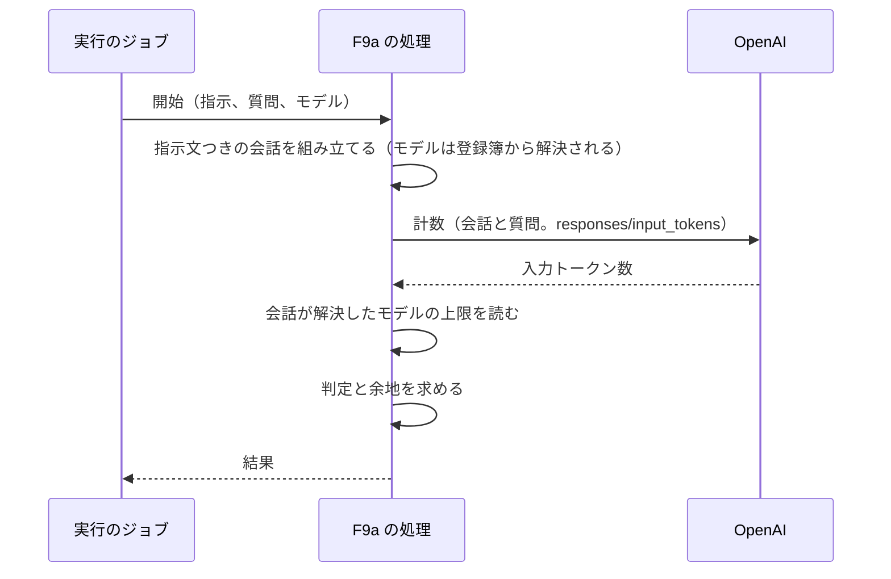

# ChangeSpec: F9a Token Counting の代表シナリオを追加する

## 変更の目的

要件 F9a の代表シナリオ「送信前に入力のトークン数を数える」をデモ基盤に載せ、指示と質問からなる会話の入力トークン数を、送信せずにプロバイダーの数え方で数え、モデルの上限に収まるかを確かめられるようにする。あわせて、C2〜C5 が求める説明文、出典、コード断片、既定の入力での実行をそろえる。対応する要件は、要件定義書の F9a、C2〜C5 である。C7（観察情報）は、計数がプロバイダーへの送信を 1 回行うため、所要時間と送信先だけが Sentry で確認できる。トークン数、コスト、プロンプトと応答の本文は、計数が使用量を作らないため Sentry に載らない。数えたトークン数は結果として実行の画面に出る。この逸脱は、この ChangeSpec で許容する（要件定義書は変えない）。

同じデモの 2 つ目の代表シナリオ F9b（Tokenization。xAI）は、この ChangeSpec の対象外で、準備中のまま残す。

## 現状

デモ定義 `config/demos.yml` の `tokenization`（名前は Tokenization and Token Counting）は、要約と出典 1 件（Tokenization）を持ち、説明文の本文を持たない。代表シナリオ `count_tokens`（送信前に入力のトークン数を数える）と `tokenize_text`（テキストのトークンへの分割を見る）はどちらも処理（`handler`）を持たず、一覧とデモの画面で「準備中」と表示される。デモの実行可否は、代表シナリオのうち最も実行しやすいものに合わせる（`Demos::Demo#availability`）。

代表シナリオ定義 `Demos::Scenario` は、処理のクラスに入力とモデルをキーワードで渡して `perform` を呼ぶ。処理は `ApplicationAction` の下に機能ごとの名前空間で置き、結果のハッシュを返し、例外はそのまま投げる。F1 の `ResponsesApi::AnswerInquiry` は、指示文つきの会話を 1 つ組み立てて 1 回問い合わせ、回答と応答したモデルを返す。デモの画面は処理のソースファイルをそのままコード断片として表示する。

実行のジョブ `Demos::RunJob` は、会話 ID を渡した `RubyLLM.workflow` の内側でトレース ID を記録して処理を呼び、返り値を結果として成功を記録する。例外は `FailureKinds` で失敗の種類と原因の候補に変換して失敗として記録する。`retryable` が真の代表シナリオは、ジョブが再び動くと最初からやり直す。

実行の画面の状態で変わる部分は、成功した実行で `result_kind` と同じ名前の結果の表示部品（`app/views/runs/results/`）を描画する。実装済みの表示部品は `text_answer`（F1）、`refund_decision`（F3）、`ticket_workflow`（F10）、`raw`（定義が消えた実行）で、数値を表示する部品はない。

購読者 `Observability::RubyLLMSpanSubscriber` は、`chat.ruby_llm` を `gen_ai.chat` のスパンに、`request.ruby_llm` を `http.client` のスパン（`url.path` に RubyLLM が POST した相対パス）にする。使用量のスパンは `usage.ruby_llm` から作る。

RubyLLM 2.0.0 のトークン計数の仕様は次のとおりである（gem のソースと公式ガイドで確認した）。

- `Chat#count_tokens(message = nil)` は、会話の履歴、指示文、ツール、スキーマ、思考の設定、添付を含む入力トークン数を、プロバイダーの計数エンドポイントで数えて整数で返す。`message` を渡すと、それを利用者のメッセージとして数えるが、会話には加えない。プロバイダー側のツール、`provider_options`、compaction、`before_request` の変更は数えない。計数エンドポイントのないプロバイダーでは `RubyLLM::Error` になる。`RubyLLM.count_tokens(text, model:)` は、そのモデルの会話を作って同じことをする
- OpenAI（Responses プロトコル）では、`responses/input_tokens` に POST する。送るのは通常の問い合わせのペイロードのうち `model`、`input`、`instructions`、`tools`、`tool_choice`、`parallel_tool_calls`、`reasoning`、`text` で、応答の `input_tokens` を返す
- `Chat#count_tokens` は `RubyLLM.instrument` を通らない。計装イベントは、HTTP 層が発行する `request.ruby_llm` だけで、`chat.ruby_llm` と `usage.ruby_llm` は発行されない。使用量の記録（`ruby_llm_usages`）も作られない
- モデルの上限は、会話が組み立て時に登録簿から解決したモデルの情報（`Chat#model` が返す `RubyLLM::Model`）の `context_window` と `max_output_tokens` で分かる。登録簿は、`acts_as_chat` の導入により DB の `ruby_llm_models` が先に読まれ、テーブルが空なら gem の `models.json` が読まれる（テスト用 DB は空なので `models.json` になる）。どちらでも、OpenAI の `gpt-5-nano` は 400,000 と 128,000 である。同じ識別子で Azure の行もあり、そちらは両方とも `nil` だが、プロバイダーを指定しない解決は OpenAI を先に選ぶ。2 つの値は別々の列で、片方だけが `nil` のモデルもありうる
- 計数の結果は、出力の長さと課金の使用量を示さない。送信後の使用量は応答の `tokens` と `cost` で読む

失敗の種類の表 `FailureKinds` には、入力がモデルの上限を超えたときの `RubyLLM::ContextLengthExceededError` の行がある。

テストは、`test/jobs/demos/run_job_test.rb` が `RubyLLM.chat` を台本どおり答える偽物に差し替える書き方（そのテストの内側だけの補助 `with_chat`）を持ち、`test/models/demos/catalog_test.rb` がデモ定義を、`test/controllers/runs_controller_test.rb` が結果の表示部品を検証する。処理の単体テストの前例は F3 の `test/actions/tool_approval/answer_refund_request_test.rb` だけで、F1 と F10 の処理には単体テストがない。`test_helper.rb` は OpenAI の偽の設定値を常に入れる（会話の組み立てが設定値を要求するため）。

### 関連ファイル

| ファイル | 役割 |
|---------|------|
| `config/demos.yml` | 10 機能のデモ定義と代表シナリオ定義 |
| `app/models/demos/catalog.rb`、`app/models/demos/demo.rb`、`app/models/demos/scenario.rb` | デモ定義の読み込み、実行可否、処理の呼び出し |
| `app/models/demos/run.rb` | 実行の記録 |
| `app/jobs/demos/run_job.rb` | 実行のジョブ。workflow を開き、処理を呼び、成否を記録する |
| `lib/failure_kinds.rb` | 失敗の種類と原因の候補の表 |
| `app/actions/application_action.rb` | 代表シナリオの処理の基底と、返り値の契約 |
| `app/actions/responses_api/answer_inquiry.rb` | F1 の処理。会話を 1 つ組み立てる書き方の前例 |
| `app/views/runs/_details.html.erb` | 実行の画面のうち状態で変わる部分。結果の表示部品を描画する |
| `app/views/runs/results/_text_answer.html.erb` | F1 の結果の表示部品。前例 |
| `app/helpers/runs_helper.rb` | 実行の画面のヘルパー |
| `app/subscribers/observability/ruby_llm_span_subscriber.rb` | 計装イベントをスパンにする購読者。変更しない |
| `test/models/demos/catalog_test.rb` | デモ定義の検証 |
| `test/jobs/demos/run_job_test.rb` | ジョブの検証。`RubyLLM.chat` を差し替える補助の現在の置き場所 |
| `test/actions/tool_approval/answer_refund_request_test.rb` | F3 の処理の単体テスト。処理のテストの前例 |
| `test/controllers/demos_controller_test.rb`、`test/controllers/demos/runs_controller_test.rb`、`test/controllers/runs_controller_test.rb` | 画面と実行の指示の検証 |
| `test/support/screen_helpers.rb` | 画面のテストの補助 |

## 変更内容

処理の流れは次のとおりである。プロバイダーへの送信は計数の 1 回だけで、問い合わせは送らない。

- **追加**: F9a の代表シナリオの処理。指示、質問、使うモデルを受け取る。モデルで会話を組み立て、指示文を付け、質問を `count_tokens` に渡して入力トークン数を得る。質問は会話に加えない。会話が解決したモデルの情報から上限を読み、判定と余地を求める
  - 判定の規則。コンテキストウィンドウが分かるとき、入力トークン数がコンテキストウィンドウより小さければ「収まる」、そうでなければ「収まらない」。余地はコンテキストウィンドウから入力トークン数を引いた値で、負の値は超過分を表す（0 に丸めない）。コンテキストウィンドウが分からないとき（登録簿に値がない）、判定と余地は不明にする
  - 結果は、入力トークン数、コンテキストウィンドウ、最大出力トークン数、余地、判定、モデルの識別子からなる。判定は真（収まる）、偽（収まらない）、`nil`（不明）の 3 値で、キーは常に持たせる。コンテキストウィンドウと最大出力トークン数は、登録簿にない場合はそれぞれ `nil` で記録する（2 つは独立で、片方だけ `nil` でもよい）。最大出力トークン数は、余地のうち出力に使える分の目安として併記する
  - 計数の呼び出しの失敗は例外のまま投げる。ジョブが失敗として記録し、上限超過（`RubyLLM::ContextLengthExceededError`）なら既存の種類「入力がモデルの上限を超えた」で表示される。計数エンドポイントが上限を大きく超える入力を拒むかどうかは OpenAI の文書に記載がなく、実装後に確かめる。拒むなら、「収まらない」の判定は画面では起きず、失敗の表示になる
  - ジョブが再び動いたときは最初からやり直してよい（`retryable` は真）。計数は何も変えず、やり直しで増えるのは計数の呼び出し 1 回である。計数エンドポイントの課金は OpenAI の文書に記載がない
  - テストは `test/actions/` に置く（F3 の前例と同じ）。`RubyLLM.chat` を台本どおり答える偽物（`with_instructions` を受け付け、`count_tokens` に渡された質問を控えて数を返す）に差し替える。差し替えの補助は、ジョブのテストの内側にある `with_chat` を `test/support/` の共有の補助に移して、処理のテストとジョブのテストの両方で使う。偽物の `model` には、上限を持つモデルの情報と、上限を持たないモデルの情報を持たせて、判定を確かめる
- **追加**: F9a の結果の表示部品（`result_kind` は `token_count`）。入力トークン数、コンテキストウィンドウ、余地、最大出力トークン数を 3 桁区切りで表示し、判定を「収まる」「収まらない」のバッジで表示する。余地が負のときは「N トークン超過」と表示する。コンテキストウィンドウが不明（判定が `nil`）の実行では、入力トークン数とモデルを表示し、上限が不明である旨を出し、余地と判定のバッジは出さない。最大出力トークン数は、コンテキストウィンドウの有無によらず、値があれば表示し、なければ出さない。応答したモデルの代わりに、計数したモデルの識別子を表示する
- **変更**: デモ定義 `config/demos.yml` の `tokenization`
  - 役立つケースの本文。送信前に、指示文、履歴、ツール、スキーマ、添付を含めた入力のトークン数を、プロバイダー自身の数え方で知りたい場合に役立つこと。`chat.count_tokens(question)` は質問を会話に加えずに数えること。数えるのはプロバイダーの計数エンドポイント（OpenAI では Responses API の input_tokens）で、ローカルのトークナイザーでは再現しにくい画像、ツール定義、モデルごとの整形も含めて数えられること。上限は登録簿の `context_window` と比べること。計数は出力の長さと課金の使用量を示さず、送信後の使用量は応答の `tokens` と `cost` で読むこと。プロバイダー側のツール、`provider_options`、compaction、`before_request` は数えられないこと。会話の計数（`count_tokens`）とテキストの分割（`RubyLLM.tokenize`）はプロバイダーの別のエンドポイントを使い、会話の計数に対応するのは OpenAI、Anthropic、Gemini、Bedrock、Vertex AI（Gemini のモデルに限る。Vertex AI 上の Claude では使えない）で、xAI は分割にだけ対応すること（gem のソースで確認。公式の Provider API Coverage の表は 2 つを 1 行にまとめて xAI を対応と表示しているので、読み手が混同しないよう区別を書く）。テキストの分割（Tokenization）については、F9b の実装時に本文を加える
  - 使わない場合に困ることの本文。ローカルのトークナイザー（tiktoken など）で見積もると、指示文の整形、ツール定義、画像、モデルごとの違いを自分で再現する必要があり、数がずれること。送ってみて上限超過のエラー（`RubyLLM::ContextLengthExceededError`）で知る方法では、送ってからでないと分からず、上限に近い入力を送る前に切り詰める判断ができないこと
  - 出典。Tokenization（RubyLLM。Counting a Chat Request と Token Counts and Usage の節）、What's New in 2.0（RubyLLM。Tokenization and Token Counting の節）、Counting tokens（OpenAI のガイド）、Get input token counts（OpenAI の API リファレンス）の 4 件。OpenAI の 2 件は、計数がプロバイダーの仕様に基づくため加える
  - 代表シナリオ `count_tokens` に、処理、プロバイダー（OpenAI）、モデル（`model: gpt-5-nano`。Responses プロトコルで送られ、登録簿に上限がある）、入力（`instructions`: 指示、`question`: 質問。どちらも必須。既定値は、架空の EC サイトのサポートデスクの担当者としての指示文に返品ポリシーの要点を含めたものと、返品の可否を尋ねる問い合わせ文）、結果の種類（`token_count`）、やり直しの可否（真）を加える。既定の入力は数千トークン以内で、`gpt-5-nano` の上限には収まる。収まらない結果は、上限に近い入力を用意しないと画面では起きない

### 新規に追加する責務の配置

| # | 責務 | コンテキスト | 配置先 | 所有するルール・閾値・派生値 |
|---|------|------------|--------|--------------------------|
| 1 | F9a の代表シナリオの処理（会話の組み立て、計数、判定、結果の組み立て） | デモ（Tokenization） | 代表シナリオの処理（機能ごとの名前空間） | 判定の規則（入力トークン数がコンテキストウィンドウより小さい）。余地の算出。上限が不明のときの扱い |
| 2 | F9a の結果の表示 | 実行の表示 | View | なし。項目と判定は責務 1 に従う |
| 3 | F9a のデモ定義（説明文、出典、既定の入力） | デモ定義 | デモ定義（設定ファイル） | 既定の入力 |

結合強度評価は省略する（既存の結合点に触れない純粋な追加で、処理は F1 と同じ形でデモ基盤に呼ばれる）。使い勝手の点検は省略する（自習用のデモで、操作者は利用者本人である）。

## 採用した実装パターン

このリポジトリでは ADR を起票しない（利用者の決定）。採用案と理由だけを記す。

| # | 判断ポイント | 採用案 | 関連 ADR |
|---|------------|--------|---------|
| 1 | 判定の基準（入力トークン数がコンテキストウィンドウより小さい、入力トークン数と最大出力トークン数の和がコンテキストウィンドウ以下） | 前者。要件は「入力がモデルの上限に収まるか」であり、出力の余地は利用者が余地と最大出力トークン数を見て判断する。和の基準は、出力の長さを常に最大と見なすので、収まる入力を収まらないと判定する | なし |
| 2 | 計数の後に問い合わせを送るか（送らない、送って計数と使用量を比べる） | 送らない。要件の代表シナリオは計数までで、送ると費用と時間がかかる。計数と使用量の関係は説明文で示す | なし |
| 3 | 上限の出どころ（会話が解決したモデルの情報、利用者の入力） | モデルの情報。要件は「モデルの上限」で、会話が持つモデルの情報からコード断片のまま読める。利用者が上限を入力する形は、モデルの上限ではなく予算の判定になる | なし |

## 影響範囲

- `config/demos.yml`: `tokenization` の定義。一覧とデモの画面の表示が「準備中」から、OpenAI の設定値の有無に応じて「実行できる」または「設定値が足りない（OpenAI）」に変わる。F9b の代表シナリオは準備中のまま
- 新規: 代表シナリオの処理のファイル、結果の表示部品
- `app/models/`、`app/jobs/`、`app/controllers/`、`app/helpers/runs_helper.rb`、`app/subscribers/observability/ruby_llm_span_subscriber.rb`、`lib/failure_kinds.rb`、`app/views/runs/_details.html.erb`、`db/schema.rb`: 変更なし。表示部品は既存の仕組みで名前から描画される
- 実行の画面の Sentry へのリンクの位置は、別の ChangeSpec（`move-sentry-links-above-run-result.md`）が変える。この変更は結果の表示部品の内側だけを足すので、どちらを先に実装しても衝突しない
- Sentry でのトレースの形: ジョブの `invoke_agent` の下に `http.client`（`POST responses/input_tokens`）のスパンが 1 つあり、`gen_ai.chat` のスパンと使用量のスパンはない。トークン数とコストは Sentry に載らない（計数は使用量を作らない）。実装後に画面で確かめる。OpenAI の計数エンドポイントが利用者のアカウントと `gpt-5-nano` で使えるかは未検証で、使えなければ実行が失敗として記録され、失敗の内容で分かる
- テスト
  - 処理: 会話の組み立て（指示文が付き、質問が `count_tokens` に渡される）、結果の組み立て（収まる、収まらない、上限が不明）、計数の失敗が例外のまま伝わることの検証を、`RubyLLM.chat` の差し替えで加える。プロバイダーを呼ぶ実行は、実際の画面と Sentry で確かめる
  - カタログ: F9a の定義（プロバイダーが OpenAI、入力が `instructions` と `question`、`retryable` が真、`result_kind` が `token_count`）と、F9b が準備中のままであることの検証を加える
  - 画面: F9a の結果の表示（収まる、収まらない、上限が不明）、デモの画面の説明文と出典とコード断片と入力欄、空白の入力の拒否の検証を加える
  - ジョブ: `with_chat` を `test/support/` へ移す以外は変更なし。F9a の再実行の検証は新たに書かず、`retryable` が真の代表シナリオを最初からやり直す既存の検証（`FakeHandler`）と、カタログの `retryable` の検証で足りるとする

## 関連 ADR

- なし（このリポジトリでは ADR を起票しない）

## 受け入れ条件

「確認手段」の列は、その行をテストで検証するか、プロバイダーを呼ぶため実際の画面と Sentry で検証するかを示す。

| ID | 変更内容の項目 | 種類 | 条件 | 確認手段 |
|----|--------------|------|------|---------|
| AC-1 | 処理 | 正常 | 既定の入力で実行すると、実行が成功になり、結果に正の入力トークン数、コンテキストウィンドウ 400,000、最大出力トークン数 128,000、余地、判定「収まる」、モデルの識別子が記録される。Sentry のトレースに `invoke_agent` の下の `http.client`（`POST responses/input_tokens`）があり、`gen_ai.chat` のスパンはない | 画面 |
| AC-2 | 処理 | 正常 | 会話は指示文つきで組み立てられ、質問は `count_tokens` にそのまま渡され、会話のメッセージには加わらない。返った数が結果の入力トークン数になる | テスト（会話を差し替える） |
| AC-3 | 処理 | 異常・拒否 | 計数の呼び出しが失敗すると、例外がそのまま伝わり、結果は返らない。ジョブは失敗として記録し、上限超過なら「入力がモデルの上限を超えた」の種類になる（既存の扱い） | テスト（会話を差し替える） |
| AC-4 | 処理 | 境界 | 入力トークン数がコンテキストウィンドウより 1 小さいとき判定は真で余地は 1、等しいとき判定は偽で余地は 0、1 大きいとき判定は偽で余地は -1 | テスト（会話を差し替える） |
| AC-5 | 処理 | 境界 | 会話が解決したモデルの情報にコンテキストウィンドウがないとき、判定と余地は `nil` で、入力トークン数、モデルの識別子、最大出力トークン数（あれば）は記録される。最大出力トークン数だけがないときは、判定と余地は求まり、最大出力トークン数は `nil` になる | テスト（会話を差し替える） |
| AC-6 | 処理 | 状態・権限 | 開始済みの実行でジョブが再び動くと、もう一度数えて成功する（計数は何も変えない） | テスト（カタログの `retryable` が真であることと、既存のジョブの検証） |
| AC-7 | 表示 | 正常 | 成功した F9a の実行の画面に、入力トークン数、コンテキストウィンドウ、余地、最大出力トークン数が 3 桁区切りで、判定が「収まる」のバッジで、モデルの識別子が表示される。判定が偽の実行では「収まらない」のバッジになり、余地が負のときは「N トークン超過」と表示される | テスト |
| AC-8 | 表示 | 異常・拒否 | 該当なし（表示は入力を受け取らず、失敗した実行では結果の表示部品は描画されない。既存の扱い） | |
| AC-9 | 表示 | 境界 | 判定が `nil` の実行の画面では、入力トークン数とモデルの識別子が表示され、上限が不明である旨が出て、余地と判定のバッジは出ない。最大出力トークン数は、値があれば表示され、`nil` なら出ない | テスト |
| AC-15 | 表示 | 境界 | 入力トークン数がコンテキストウィンドウと等しい実行の画面では、「収まらない」のバッジになり、余地は「0」と表示される（「0 トークン超過」とは表示しない） | テスト |
| AC-16 | 表示 | 境界 | 最大出力トークン数が `nil` の実行の画面では、判定の有無によらず、最大出力トークン数の項目が出ない | テスト |
| AC-10 | 表示 | 状態・権限 | 該当なし（表示部品は成功した実行でだけ描画される。既存の扱い） | |
| AC-11 | デモ定義 | 正常 | OpenAI の設定値があるとき、一覧で Tokenization and Token Counting が「実行できる」になり、デモの画面に説明文の本文、4 つの出典、`count_tokens` を含むコード断片、既定の指示と質問が入った 2 つの入力欄、有効な実行ボタンが出る。定義したモデルは OpenAI のモデルに解決される。F9b の代表シナリオは「準備中」のまま | テスト |
| AC-12 | デモ定義 | 異常・拒否 | OpenAI の設定値がないとき、一覧とデモの画面で「設定値が足りない（OpenAI）」になり、実行ボタンが無効になる | テスト |
| AC-13 | デモ定義 | 境界 | 指示または質問が空白のとき、実行は記録されず、その入力欄の下に「入力してください」が出る | テスト |
| AC-14 | デモ定義 | 状態・権限 | 該当なし（デモ定義は状態を持たず、操作者は利用者本人だけである） | |

### 未解決の疑問

- なし
