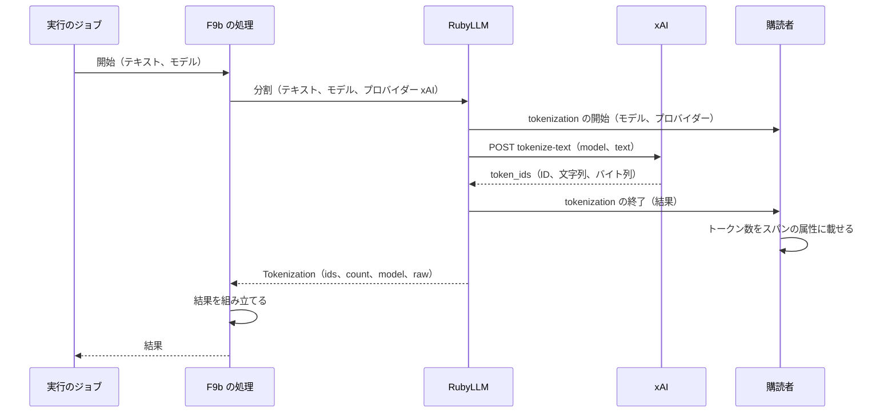

# ChangeSpec: F9b Tokenization の代表シナリオを追加する

## 変更の目的

要件 F9b の代表シナリオ「テキストのトークンへの分割を見る」をデモ基盤に載せ、テキストを xAI のトークナイザーで分割し、トークンの列とトークン数を確認できるようにする。あわせて、C2〜C5 が求める説明文、出典、コード断片、既定の入力での実行をそろえる。対応する要件は、要件定義書の F9b、C2〜C5 である。これで Tokenization and Token Counting のデモは、要件どおり 2 つの代表シナリオを持つ。

C7（観察情報）のうち、所要時間、送信先、トークン数は Sentry で確認できる。トークン数は、分割の計装イベントの結果から購読者がスパンの属性 `ruby_llm.tokenization.count` に載せる。`gen_ai.usage` の名前空間を使わないのは、使用量の属性を見た Sentry がコストを推定し、課金のない分割にコストが付くためである。Sentry に載らないものは 3 つある。プロンプトの本文（分割するテキスト）は計装イベントの payload に含まれない。応答の本文（トークンの列）は 18,000 件になりうる大きさで、スパンの属性に収まらない。コストは、分割が使用量を作らないため不明のままになる。この 3 つの逸脱は、この ChangeSpec で許容する（要件定義書は変えない）。

## 現状

デモ定義 `config/demos.yml` の `tokenization`（名前は Tokenization and Token Counting）は、F9a の実装により説明文の本文と出典 4 件（RubyLLM 2 件、OpenAI 2 件）を持つ。説明文は会話の計数（`count_tokens`）を扱い、テキストの分割については「会話の計数とテキストの分割は別のエンドポイントを使い、xAI、Cohere、GPUStack は分割にだけ対応する」と述べる 1 段落だけがある。代表シナリオ `count_tokens` は処理 `Tokenization::CountInputTokens`（OpenAI、`gpt-5-nano`、結果の種類 `token_count`、やり直し可）を持つ。代表シナリオ `tokenize_text`（テキストのトークンへの分割を見る）は名前だけを持ち、処理、プロバイダー、モデル、入力、結果の種類、やり直しの可否を持たないため、デモの画面で「準備中」と表示され、実行を指示しても拒まれる。デモの実行可否は、代表シナリオのうち最も実行しやすいものに合わせる（`Demos::Demo#availability`）ので、一覧の Tokenization and Token Counting は OpenAI の設定値があれば「実行できる」になる。設定値が足りない表示は「設定値が足りない（プロバイダーの表示名を読点でつないだもの）」で、`app/helpers/demos_helper.rb` が作る。

代表シナリオ定義 `Demos::Scenario` は、処理のクラスに入力とモデルをキーワードで渡して `perform` を呼ぶ。処理は `ApplicationAction` の下に機能ごとの名前空間で置き、結果のハッシュを返し、例外はそのまま投げる。実装済みの処理は、どれも `provider:` を渡さずにモデルの識別子だけで登録簿に解決させている。F6a の `VideoAndSpeech::SpeakAnswer` は、会話を作らずに `RubyLLM.speak` を 1 回呼ぶ処理の前例で、その単体テストは `RubyLLM.speak` をテストの内側の補助で差し替える。実行のジョブ `Demos::RunJob` は、会話 ID を渡した `RubyLLM.workflow` の内側で処理を呼び、返り値を結果として成功を記録し、例外は `FailureKinds` で失敗の種類と原因の候補に変換する。`FailureKinds` には `RubyLLM::BadRequestError`（不正なリクエスト。xAI は無効な認証情報もこの種類で返す）、`RubyLLM::ContextLengthExceededError`（入力がモデルの上限を超えた）、`RubyLLM::ModelNotFoundError`（モデルが見つからない）の行があり、表にない例外はクラス名が種類として表示される。実行の画面は、成功した実行で `result_kind` と同じ名前の結果の表示部品（`app/views/runs/results/`）を描画し、入力の本文は表示部品の外に入力欄の名前つきで表示する。表示部品は、F7a の `web_search_answer` のように、項目の一覧を `data-` 属性の目印つきで描画する前例を持つ。デモの画面の入力欄には「入力の本文は Sentry に送られる」という注記が代表シナリオによらず付く。履歴の一覧（20 件）とデモの画面の最近の実行（5 件）は、実行の `result` 列も読む。

購読者 `Observability::RubyLLMSpanSubscriber` は、`tokenization.ruby_llm` を GenAI の操作を持たない「他の操作」として扱い、`tokenization <モデル>` という名前のスパンにする。属性は `ruby_llm.operation`、`gen_ai.provider.name`、`gen_ai.request.model` と、`request.ruby_llm` 以外のすべてのイベントに付く `gen_ai.agent.name`、`gen_ai.conversation.id`（workflow の内側で値を持つ）で、`sentry.op` は付かない。`speech.ruby_llm` には、声、形式、バイト数、読み上げる本文を載せる専用の属性があり、その検証が購読者のテストにある。「他の操作」のスパンの検証はない。`request.ruby_llm` は `http.client` のスパン（`url.path` に POST した相対パス）になる。購読者は `capture_content: true` で登録されている。購読者は「payload は文書化された契約である」ことを前提に公開のイベントだけを購読する設計で、属性の組み立てで例外が起きるとそれを報告し、そのスパンの属性はすべて失われる。

RubyLLM 2.0.0 のテキストの分割の仕様は次のとおりである（gem のソース、公式ガイド、xAI の API リファレンス、2026-09-23 の実 API で確認した）。

- `RubyLLM.tokenize(text, model:, provider:)` は、`RubyLLM::Tokenization` を返す。`ids`（整数のトークン ID の配列。テキストの順）、`count`（`ids` の長さ）、`model`（要求したモデルの登録簿の識別子）、`raw`（プロバイダーの応答本体そのもの）を持つ。`model:` と `provider:` は省略でき、モデルの既定値は設定の既定モデルである。テキストが文字列でなければ `ArgumentError`、プロバイダーが分割に対応しなければ `RubyLLM::Error` になる。分割は渡した文字列だけを対象にし、会話の整形、指示文、ツール、添付を含まず、課金される使用量も示さない。トークン ID はモデルごとに違い、公式ガイドは比べるときに同じモデルを使うよう求めている
- xAI では `tokenize-text` に `{ model, text }` を POST する。応答本体は `token_ids` の配列を持つオブジェクトで、各要素が `token_id`（整数）、`string_token`（文字列）、`token_bytes`（バイト値の配列）を持つ。RubyLLM は `token_id` を `ids` にし、応答本体をそのまま `raw` にする。xAI の API リファレンスは要求の項目として `model`、`text`、`user`（任意の利用者の識別子）を挙げ、必須の指定はない。テキストの長さの上限、レート制限、課金には触れておらず、xAI の料金ページにも分割の記載はない
- 実 API（`grok-4.3`）では、返品の可否を尋ねる日本語の問い合わせ文（50 文字）は 29 トークン、英語の 4 語は 5 トークンになる。「週間」「前に」「いた」のように 2 文字が 1 トークンになる語と、「届」「ケ」のように 1 文字が 1 トークンになる語が混じる。空文字は `RubyLLM::BadRequestError`（Bad data: Text cannot be empty）で拒まれ、空白 3 文字は 1 トークンになる。4 バイトの文字（「𠮷」「🍣」「🙏」）は文字の途中で割れて 1〜3 バイトのトークンになり、文字の途中で割れたトークンの `string_token` は空文字列になる。そのため `string_token` を結合しても元のテキストに戻らないが、`token_bytes` を結合すると戻る。33,000 文字のテキストは 18,000 トークンになり 0.8 秒で返る。確認した範囲では、`string_token` はすべて UTF-8 として正しい文字列である。この ChangeSpec が既定の入力にする文（F9a の既定の問い合わせ文に「よろしくお願いします🙏」を足した 102 文字）は 58 トークンで、末尾の「🙏」が 3 バイトと 1 バイトの 2 つのトークンに割れ、その 2 つの `string_token` が空になる
- `tokenize-text` への POST は、タイムアウト、429、5xx のときに RubyLLM の HTTP 層が同じ内容で最大 `max_retries`（既定 3）回まで再送する。再送は 1 つの `request.ruby_llm` の内側で起きる。400 の応答は、メッセージが上限超過の文言に合えば `RubyLLM::ContextLengthExceededError`（`BadRequestError` の子クラスではない）、合わなければ `RubyLLM::BadRequestError` になる。413 など他の状態コードは `RubyLLM::Error` になる
- `RubyLLM.tokenize` は `tokenization.ruby_llm` の計装イベントを発行する。payload は `model` と `provider` で、テキストは含まれない。終了時に `result`（`Tokenization`）が加わる。イベントは workflow の内側なら workflow の ID、名前、metadata を引き継ぐ。HTTP 層が `request.ruby_llm` を発行する。chat と usage のイベントは発行されず、使用量の記録は作られない。`tokenization.ruby_llm` は公式の Instrumentation ガイドのイベント一覧にはなく、gem のソースだけが根拠である。モデルの解決とプロバイダーの設定の確認は計装ブロックの外で行われるため、`RubyLLM::ModelNotFoundError` と `RubyLLM::ConfigurationError` では分割のイベントもスパンも作られない
- 登録簿の解決には注意が要る。別名表には `grok-4.3` を Vertex AI 用の `xai/grok-4.3` に対応づける行があり、`provider:` を渡さない解決は、元の識別子と別名の両方で候補を集め（xAI と Azure の `grok-4.3`、Perplexity と Vertex AI の `xai/grok-4.3`）、`PROVIDER_PREFERENCE` の順位で選ぶ。Perplexity は xAI より上位にあり、識別子の完全一致は優先されないため、Perplexity の `xai/grok-4.3` に解決され、xAI の設定値があっても Perplexity の `RubyLLM::ConfigurationError` で失敗する。`provider: :xai` を渡すと xAI の `grok-4.3` に解決される。この挙動は gem 同梱の登録簿と、開発環境の `ruby_llm_models` テーブルから読んだ登録簿のどちらでも同じである。`provider: :xai` を渡したうえで登録簿にないモデルを指定すると、プロバイダーへ送る前に `RubyLLM::ModelNotFoundError` になる。公式ガイドの分割の例は `provider:` を渡さずに `grok-4.3` を指定しており、2.0.0 ではその呼び方は失敗する。gem の RDoc の例は `provider: :xai` を渡している
- xAI のプロバイダーの表示名は「XAI」である（`Demos.provider_name(:xai)`）。設定値の要件は `xai_api_key` だけで、`.env` の `XAI_API_KEY` から読まれる。疎通確認 `bin/check_keys` は xAI に `grok-4.3` を `provider: :xai` で使う

テストは、`test/actions/` に処理の単体テスト（F3、F6a、F7a、F9a）、`test/models/demos/catalog_test.rb` にデモ定義の検証、`test/controllers/demos_controller_test.rb` と `test/controllers/demos/runs_controller_test.rb` と `test/controllers/runs_controller_test.rb` に画面と実行の指示の検証、`test/jobs/demos/run_job_test.rb` にジョブの検証（処理の例外を失敗として記録すること、`retryable` が真の代表シナリオをやり直すこと、workflow が会話 ID を持つこと）、`test/lib/failure_kinds_test.rb` に失敗の種類の変換の検証がある。カタログのテストには、`tokenize_text` が準備中であることを確かめる検証と、実装済みの代表シナリオのモデルを `provider:` なしで解決してプロバイダーが `providers` に含まれることを確かめる検証がある。後者は、実装済みの処理がどれも `provider:` を渡さないことを前提に、処理が届くプロバイダーと `providers` の一致を確かめるもので、`grok-4.3` を `provider:` なしで解決すると Perplexity になるため、`tokenize_text` に処理を付けた時点で失敗する。

テスト環境の設定値は開発者の `.env` に依存する。`dotenv-rails` は test でも `.env` を読み、`test_helper.rb` が固定するのは OpenAI の偽の設定値だけなので、`.env` に `XAI_API_KEY` があれば test でも xAI の設定値がある状態になる。画面のテストの補助 `test/support/screen_helpers.rb` には OpenAI の設定値を固定する `with_openai_key` があり、xAI 用はない。デモの画面のテストは、`tokenize_text` が「準備中」で入力欄を持たないことを確かめている。既存のテスト「OpenAI の設定値がないとき、一覧の Tokenization and Token Counting は設定値が足りない（OpenAI）になる」は、`tokenize_text` に処理を付けると、xAI の設定値があれば「実行できる」、なければ「設定値が足りない（OpenAI、XAI）」になるため、どちらでも失敗する。

### 関連ファイル

| ファイル | 役割 |
|---------|------|
| `config/demos.yml` | 10 機能のデモ定義と代表シナリオ定義 |
| `app/models/demos/catalog.rb`、`app/models/demos/demo.rb`、`app/models/demos/scenario.rb` | デモ定義の読み込み、実行可否、処理の呼び出し |
| `app/models/demos.rb` | プロバイダーの表示名 |
| `app/models/demos/run.rb` | 実行の記録 |
| `app/jobs/demos/run_job.rb` | 実行のジョブ。workflow を開き、処理を呼び、成否を記録する |
| `lib/failure_kinds.rb` | 失敗の種類と原因の候補の表 |
| `app/actions/application_action.rb` | 代表シナリオの処理の基底と、返り値の契約 |
| `app/actions/video_and_speech/speak_answer.rb` | F6a の処理。会話を作らずに RubyLLM のモジュール関数を 1 回呼ぶ書き方の前例 |
| `app/actions/tokenization/count_input_tokens.rb` | F9a の処理。同じデモの 1 つ目の代表シナリオ |
| `app/views/demos/show.html.erb`、`app/views/demos/_scenario.html.erb` | デモの画面。説明文、出典、代表シナリオごとのコード断片と入力欄 |
| `app/helpers/demos_helper.rb` | 実行可否のバッジと、設定値が足りないプロバイダーの表示 |
| `app/views/runs/_details.html.erb` | 実行の画面のうち状態で変わる部分。結果の表示部品を描画する |
| `app/views/runs/results/_web_search_answer.html.erb`、`app/views/runs/results/_token_count.html.erb` | 一覧と数値を表示する結果の表示部品の前例 |
| `app/subscribers/observability/ruby_llm_span_subscriber.rb` | 計装イベントをスパンにする購読者。分割のスパンにトークン数を足す |
| `config/initializers/sentry.rb` | 購読者の登録（`capture_content: true`） |
| `bin/check_keys` | 疎通確認。xAI に `grok-4.3` を使う |
| `test/test_helper.rb` | テストの設定値の固定。xAI の偽の設定値を足す |
| `test/support/screen_helpers.rb` | 画面のテストの補助。設定値の固定 |
| `test/actions/video_and_speech/speak_answer_test.rb` | モジュール関数を差し替える処理のテストの前例 |
| `test/models/demos/catalog_test.rb` | デモ定義の検証。モデルの解決の検証から `tokenize_text` を除く |
| `test/jobs/demos/run_job_test.rb` | ジョブの検証。失敗の記録とやり直しの既存の検証 |
| `test/lib/failure_kinds_test.rb` | 失敗の種類の変換の検証 |
| `test/subscribers/observability/ruby_llm_span_subscriber_test.rb` | 購読者の検証 |
| `test/controllers/demos_controller_test.rb`、`test/controllers/demos/runs_controller_test.rb`、`test/controllers/runs_controller_test.rb` | 画面と実行の指示の検証 |
| `docs/api-keys.md` | xAI の設定値の取得手順。`RubyLLM.tokenize` に xAI が要ることを既に記している。変更しない |

## 変更内容

処理の流れは次のとおりである。正常に返る場合、プロバイダーへの送信は分割の 1 回だけで、会話は作らない。

- **追加**: F9b の代表シナリオの処理。テキストと使うモデルを受け取り、プロバイダーに xAI を指定して分割を 1 回呼ぶ
  - プロバイダーは処理が明示する。`provider:` を渡さないと `grok-4.3` が Perplexity のモデルに解決されて失敗するためで、コード断片にもその理由をコメントで示す（公式ガイドの例は `provider:` を省くが、2.0.0 ではその呼び方は失敗する）
  - 結果は、トークン数、トークナイザーのモデルの識別子、トークンの列からなる。トークンの列は、応答本体の各要素から ID、文字列、バイト列を取り出したもので、文字列とバイト列は応答のまま加工しない（文字列が空のトークンも空のまま残す）。トークン数は `Tokenization#count` の値をそのまま使う
  - 空のテキストと空白だけのテキストは、既存の入力の検証（必須の入力が空白なら実行を記録しない）で処理の手前で拒まれる。処理は入力の長さを検証しない。テキストの長さの上限は未確認で、超えた場合は既存の扱いで失敗として記録される（400 はメッセージにより「入力がモデルの上限を超えた」か「不正なリクエスト」、表にない応答はクラス名）
  - 分割の呼び出しの失敗は例外のまま投げる。ジョブが失敗として記録し、xAI が返す 400 は既存の種類「不正なリクエスト」（原因の候補に認証情報の確認を含む）、登録簿にないモデルは既存の種類「モデルが見つからない」で表示される。タイムアウトや 5xx では HTTP 層が再送するので、失敗した実行の所要時間には再送の待ちが含まれる
  - ジョブが再び動いたときは最初からやり直してよい（`retryable` は真）。分割は何も変えず、やり直しで増えるのは分割の呼び出し 1 回である
  - テストは `test/actions/` に置く。`RubyLLM.tokenize` を、渡された引数を控えて台本どおりの `Tokenization` を返す（または台本どおりの例外を投げる）差し替えに置き換える。差し替えの補助は F6a の `with_speak` と同じ形で、そのテストの内側に置く（使うのはこのテストだけである）。台本の `Tokenization` は、文字列が空のトークンを含むものも用意する
- **追加**: F9b の結果の表示部品（`result_kind` は `tokenization`）。トークン数を 3 桁区切りで、モデルの識別子を、トークンの列をテキストの順に表示する
  - 各トークンは、文字列を枠で囲んで隣のトークンとの境界が分かるように表示し、ID を小さく併記する。文字列の中の空白、タブ、改行は、潰さず保持して表示する。文字列はプロバイダーが返した値なので、HTML の特殊文字はエスケープして文字として表示する
  - 文字列が空のトークン（文字の途中で割れたトークン）は、文字列の代わりにバイト列を 2 桁の小文字の 16 進を空白で区切った形（例: `f0 9f 99`）で表示し、断片であることが読み取れる目印を付ける。空のまま表示すると、トークンがないように見えるためである
  - トークンが 1 つだけの結果も同じ形で表示する。トークンの列の件数は制限せず、長いテキストの結果はそのままの件数で描画する
- **変更**: 購読者 `Observability::RubyLLMSpanSubscriber`。`tokenization.ruby_llm` の終了時に payload の `result` があり、それが `count` に応答するときに限り、その値を属性 `ruby_llm.tokenization.count` としてスパンに載せる
  - `result` を読むのは、gem のソースだけを根拠にした結合である。`count` に応答しない値なら載せずに済ませ、他の属性を失わない
  - 既存の属性と、失敗時の `error.type`、`error.message`、status の扱いは変えない。`sentry.op` は付けない（GenAI の操作に分割はない）
  - テキストの本文は載せない。payload に含まれず、応答から組み立て直すのは本文の記録ではない
  - トークン数は本文ではないので、`capture_content` の真偽によらず載せる
  - 購読者のテストに、結果を持つ分割のイベント、結果を持たずに失敗した分割のイベント、`count` に応答しない結果を持つイベントの検証を加える
- **変更**: デモ定義 `config/demos.yml` の `tokenization`
  - 役立つケースの本文に、テキストの分割の段落を加える。テキストがどのトークンに割れるか（日本語の語の区切り、数字と記号の扱い）を、モデルのトークナイザーそのもので確かめたい場合に役立つこと。`RubyLLM.tokenize(text, model:, provider:)` は `Tokenization` を返し、`ids` と `count` に加えて `raw` に xAI が返した各トークンの文字列とバイト列があること。トークン ID はモデルごとに違い、比べるときは同じモデルを使うこと。分割は渡した文字列だけを対象にし、指示文、ツール、添付、会話の整形を含まず、課金される使用量も示さないこと。文字の途中で割れたトークンは文字列が空になり、バイト列で読むこと（xAI の文書にはなく、このアプリで実 API を呼んで確かめた事実だと明記する）。`provider: :xai` を渡す理由（`provider:` なしでは `grok-4.3` が Perplexity のモデルに解決される。公式ガイドの例は省いているが 2.0.0 では失敗する）。計数と分割が別のエンドポイントであることを述べる既存の段落は残す
  - 使わない場合に困ることの本文に、分割の段落を加える。モデルの語彙に合うトークナイザーを手元に用意して保守する必要があり、モデルを変えると分割が変わるので追随が要ること。文字数からの見積もりでは、日本語の 1 文字が 1 トークンにも 2 文字が 1 トークンにもなる（このアプリで確かめた）ため、どこで割れるかも、上限に近い入力をどこで切り詰めればよいかも分からないこと
  - 出典に、Tokenization（RubyLLM。Tokenizing Text の節）と、Tokenize text（xAI の API リファレンス）の 2 件を加える。xAI の 1 件は、応答の形がプロバイダーの仕様に基づくため加える
  - 代表シナリオ `tokenize_text` に、処理、プロバイダー（xAI）、モデル（`model: grok-4.3`。登録簿にあり、疎通確認 `bin/check_keys` と公式ガイドの例と同じモデル名）、入力（`text`: 分割を確認するテキスト。必須。既定値は、F9a の既定の問い合わせ文の末尾に「よろしくお願いします🙏」を足したもの。4 バイトの文字を 1 つ含めるのは、既定の実行のままで断片のトークンの表示を確かめるため）、結果の種類（`tokenization`）、やり直しの可否（真）を加える

### 新規に追加する責務の配置

| # | 責務 | コンテキスト | 配置先 | 所有するルール・閾値・派生値 |
|---|------|------------|--------|--------------------------|
| 1 | F9b の代表シナリオの処理（分割の呼び出し、結果の組み立て） | デモ（Tokenization） | 代表シナリオの処理（機能ごとの名前空間） | プロバイダーの指定（xAI）。結果の形（トークンごとの ID、文字列、バイト列） |
| 2 | F9b の結果の表示 | 実行の表示 | View | 文字列が空のトークンをバイト列で表示する規則と 16 進の書式。空白の保持 |
| 3 | F9b のデモ定義（説明文、出典、既定の入力） | デモ定義 | デモ定義（設定ファイル） | 既定の入力 |

分割のスパンへのトークン数の付与は、購読者が持つ既存の責務（計装イベントをスパンにする）の拡張で、新規の責務ではない。結合強度評価は省略する。処理、表示、デモ定義は既存の結合点に触れない追加で、処理は F6a と同じ形でデモ基盤に呼ばれる。購読者の変更は、`tokenization.ruby_llm` の終了時の `result` という、公式の計装ガイドにない gem のソースだけが根拠の値への依存を 1 つ増やす。この依存は、`count` に応答するときだけ読む形にして、gem の更新で値の形が変わっても既存の属性を失わないようにしたうえで許容する。使い勝手の点検は省略する（自習用のデモで、操作者は利用者本人である）。

## 採用した実装パターン

このリポジトリでは ADR を起票しない（利用者の決定）。採用案と理由だけを記す。

| # | 判断ポイント | 採用案 | 関連 ADR |
|---|------------|--------|---------|
| 1 | プロバイダーの指定（処理が `provider: :xai` を明示する、登録簿の解決に任せる） | 前者。`provider:` なしの `grok-4.3` は、別名の候補を含めた解決でプロバイダーの優先順位により Perplexity に解決され、xAI の設定値があっても失敗する | なし |
| 2 | 結果に残すもの（トークン ID だけ、ID と文字列とバイト列） | 後者。要件は「どう分割されるか」で、文字列がなければ分割は読めない。文字の途中で割れたトークンは文字列が空になるので、バイト列がなければその中身が読めない | なし |
| 3 | Sentry のトークン数（購読者に触れず F9a と同じ逸脱を許容する、購読者が分割のイベントの結果からトークン数を載せる） | 後者。C7 が求めるトークン数がイベントの結果にあり、F6a で speech の属性を足した前例がある。本文は payload にないので載せない | なし |

## 影響範囲

- `config/demos.yml`: `tokenization` の定義。デモの画面で `tokenize_text` が「準備中」から、xAI の設定値の有無に応じて「実行できる」または「設定値が足りない（XAI）」に変わり、コード断片と入力欄が出る。一覧の Tokenization and Token Counting は、OpenAI か xAI のどちらかの設定値があれば「実行できる」のままで、両方ないときは「設定値が足りない（OpenAI、XAI）」になる
- 新規: 代表シナリオの処理のファイル、結果の表示部品
- `app/subscribers/observability/ruby_llm_span_subscriber.rb`: 分割のスパンに属性を 1 つ足す。他のイベントのスパンは変わらない
- `test/test_helper.rb`: xAI の偽の設定値を、OpenAI と同じ理由（テストがプロバイダーを呼ばず、開発者の `.env` に依存しない）で固定する。`test/support/screen_helpers.rb`: xAI の設定値を固定する補助 `with_xai_key` を加える
- `app/models/`、`app/jobs/`、`app/controllers/`、`app/views/runs/_details.html.erb`、`app/views/demos/_scenario.html.erb`、`lib/failure_kinds.rb`、`config/initializers/`、`db/schema.rb`、`docs/api-keys.md`: 変更なし。表示部品は既存の仕組みで名前から描画され、入力欄は代表シナリオ定義から描画される。入力欄の注記「入力の本文は Sentry に送られる」は、F9b では本文が Sentry に載らないが xAI には送られるので、そのまま残す
- Sentry でのトレースの形: ジョブの `invoke_agent` の下に `tokenization grok-4.3`（`ruby_llm.tokenization.count` と、実行の会話 ID を持つ）があり、その下に `http.client`（`POST tokenize-text`）がある。`gen_ai.chat` のスパンと使用量のスパンはない。実装後に画面で確かめる。開発中のジョブのワーカーはコードを再読み込みしないので、確かめる前にサーバーをホット再起動する
- 実行の画面と履歴: 長いテキストの結果は、トークンの数だけ要素を描画し、`result` 列はトークン 1 つあたり約 50 バイトで大きくなる（33,000 文字で 18,000 個、約 1MB）。履歴の一覧とデモの画面の最近の実行は `result` 列も読むので、長い結果が並ぶと読み込みが重くなる。自習用で既定の入力は短いため、件数の制限も列の読み飛ばしも設けずに許容する
- テスト
  - 処理: 分割の呼び出し（テキスト、モデル、プロバイダー xAI が渡される）、結果の組み立て（トークン数、モデル、トークンの列。文字列が空のトークンを含む）、分割の失敗が例外のまま伝わることの検証を、`RubyLLM.tokenize` の差し替えで加える。ジョブが例外を失敗として記録し種類に変換することは、既存のジョブのテストと `test/lib/failure_kinds_test.rb` で足りるとし、F9b のジョブのテストは書かない。プロバイダーを呼ぶ実行は、実際の画面と Sentry で確かめる
  - カタログ: F9b の定義（プロバイダーが xAI、入力が `text`、`retryable` が真、`result_kind` が `tokenization`）と、定義したモデルが `provider: :xai` で xAI の登録簿に解決されることの検証を加え、`tokenize_text` が準備中であることの検証を外す。実装済みの代表シナリオのモデルの解決の検証は `provider:` なしの解決のまま残し、`tokenize_text` だけを理由のコメントつきで除く。プロバイダーを渡す形に変えると、`provider:` を渡さない既存の処理が届くプロバイダーを確かめられなくなるためである
  - 購読者: 結果を持つ分割のイベントがトークン数の属性を持つこと、失敗した分割のイベントが属性を持たず失敗として記録されること、`count` に応答しない結果では属性が載らず他の属性が保たれること、`capture_content` が偽でもトークン数が載ることの検証を加える
  - 画面: デモの画面のテストは、`tokenize_text` が準備中であることの検証を、説明文の分割の段落、出典 6 件、`tokenize` を含むコード断片、既定のテキストが入った入力欄、有効な実行ボタンの検証に変える。既存の「OpenAI の設定値がないとき」のテストは、`with_xai_key(nil)` も重ねて一覧の期待値を「設定値が足りない（OpenAI、XAI）」に変える。xAI の設定値がないときの表示、xAI の設定値だけがあるときの表示、空白のテキストの拒否、F9b の結果の表示（通常のトークン、空白と改行とタブを含むトークン、特殊文字を含むトークン、文字列が空のトークン、1 トークンの結果、1,000 以上のトークン数）の検証を加える
  - ジョブ: 変更なし。F9b の再実行の検証は新たに書かず、`retryable` が真の代表シナリオを最初からやり直す既存の検証と、カタログの `retryable` の検証で足りるとする

## 関連 ADR

- なし（このリポジトリでは ADR を起票しない）

## 受け入れ条件

「確認手段」の列は、その行をテストで検証するか、プロバイダーを呼ぶため実際の画面、コンソール、Sentry で検証するかを示す。

| ID | 変更内容の項目 | 種類 | 条件 | 確認手段 |
|----|--------------|------|------|---------|
| AC-1 | 処理 | 正常 | 既定の入力で実行すると、実行が成功になり、結果にトークン数 58、モデルの識別子 `grok-4.3`、トークンの列（各トークンに ID、文字列、バイト列。末尾の 2 つは文字列が空）が記録され、コンソールで読んだ結果のバイト列を結合すると入力のテキストに戻る。Sentry のトレースに `invoke_agent` の下の `tokenization grok-4.3`（`ruby_llm.tokenization.count` が 58、`gen_ai.conversation.id` が実行の会話 ID）と、その下の `http.client`（`POST tokenize-text`）があり、`gen_ai.chat` のスパンはない | 画面、コンソール、Sentry |
| AC-2 | 処理 | 正常 | `RubyLLM.tokenize` は 1 回だけ呼ばれ、入力のテキスト、モデル、プロバイダー `:xai` が渡される。返った `Tokenization` の `count` が結果のトークン数、`model` がモデルの識別子、`raw` の `token_ids` の各要素の `token_id`、`string_token`、`token_bytes` がトークンの列の ID、文字列、バイト列になる | テスト（分割を差し替える） |
| AC-3 | 処理 | 異常・拒否 | 分割の呼び出しが失敗すると、例外がそのまま伝わり、結果は返らない。ジョブが失敗として記録し、`RubyLLM::BadRequestError` なら「不正なリクエスト」、`RubyLLM::ModelNotFoundError` なら「モデルが見つからない」の種類になることは、既存のジョブと失敗の種類のテストで足りる | テスト（分割を差し替える。ジョブの記録は既存のテスト） |
| AC-4 | 処理 | 境界 | 文字列が空のトークンを含む `Tokenization` からは、そのトークンが空の文字列とバイト列のまま結果に残る。トークンが 1 つだけの `Tokenization` からは、トークン数 1 と 1 要素の列が結果になる | テスト（分割を差し替える） |
| AC-5 | 処理 | 状態・権限 | 開始済みの実行でジョブが再び動くと、もう一度分割して成功する（分割は何も変えない） | テスト（カタログの `retryable` が真であることと、既存のジョブの検証） |
| AC-6 | 表示 | 正常 | 成功した F9b の実行の画面に、トークン数が 3 桁区切りで（1,000 以上の値で確かめる）、モデルの識別子が、トークンの列がテキストの順に表示され、各トークンに文字列と ID が出る。先頭や末尾に空白を持つトークンは、空白を含めて表示される | テスト |
| AC-7 | 表示 | 異常・拒否 | 該当なし（表示は入力を受け取らず、失敗した実行では結果の表示部品は描画されない。既存の扱い） | |
| AC-8 | 表示 | 境界 | 文字列が空のトークンは、バイト列が 2 桁の小文字の 16 進を空白で区切った形で表示され、断片であることの目印が付く。トークンが 1 つだけの結果は、トークン数 1 とその 1 つが表示される | テスト |
| AC-9 | 表示 | 境界 | 改行とタブを含むトークンは、改行とタブが保持されて表示される。`<` などの HTML の特殊文字を含むトークンは、エスケープされて文字として表示される。20,000 個のトークンを持つ結果も、すべてのトークンが描画される | テスト |
| AC-10 | 表示 | 状態・権限 | 該当なし（表示部品は成功した実行でだけ描画される。既存の扱い） | |
| AC-11 | 購読者 | 正常 | 結果を持つ `tokenization.ruby_llm` のイベントから、`tokenization <モデル>` のスパンが作られ、`ruby_llm.tokenization.count` が結果の `count` と等しく、既存の属性（`ruby_llm.operation`、`gen_ai.provider.name`、`gen_ai.request.model` と、workflow の内側なら `gen_ai.agent.name`、`gen_ai.conversation.id`）が従来どおり載る | テスト |
| AC-12 | 購読者 | 異常・拒否 | 例外で終わった `tokenization.ruby_llm` のイベントからは、`ruby_llm.tokenization.count` のないスパンが作られ、`error.type`、`error.message` と失敗の status が載る（既存の扱い）。`count` に応答しない結果を持つイベントからは、`ruby_llm.tokenization.count` のないスパンが作られ、既存の属性は保たれる | テスト |
| AC-13 | 購読者 | 境界 | 該当なし（トークン数は結果の値をそのまま載せ、閾値や丸めを持たない） | |
| AC-14 | 購読者 | 状態・権限 | `capture_content` が偽の購読者でも、`ruby_llm.tokenization.count` が載る | テスト |
| AC-15 | デモ定義 | 正常 | OpenAI と xAI の設定値があるとき、デモの画面の `tokenize_text` が「実行できる」になり、説明文の本文に分割の段落、6 つの出典、`tokenize` を含むコード断片、既定のテキストが入った入力欄、有効な実行ボタンが出る。定義したモデルは `provider: :xai` で xAI の登録簿に解決される | テスト |
| AC-16 | デモ定義 | 異常・拒否 | xAI の設定値がなく OpenAI の設定値があるとき、デモの画面の `tokenize_text` は「設定値が足りない（XAI）」で実行ボタンが無効、`count_tokens` は「実行できる」のまま、一覧の Tokenization and Token Counting は「実行できる」のままになる | テスト |
| AC-17 | デモ定義 | 境界 | テキストが空白だけのとき、実行は記録されず、その入力欄の下に「入力してください」が出る | テスト |
| AC-18 | デモ定義 | 状態・権限 | OpenAI と xAI の設定値が両方ないとき、一覧の Tokenization and Token Counting は「設定値が足りない（OpenAI、XAI）」になり、デモの画面の 2 つの代表シナリオはどちらも実行ボタンが無効になる。xAI の設定値だけがあるとき、一覧は「実行できる」、`tokenize_text` は「実行できる」、`count_tokens` は「設定値が足りない（OpenAI）」になる | テスト |

### 未解決の疑問

- なし
